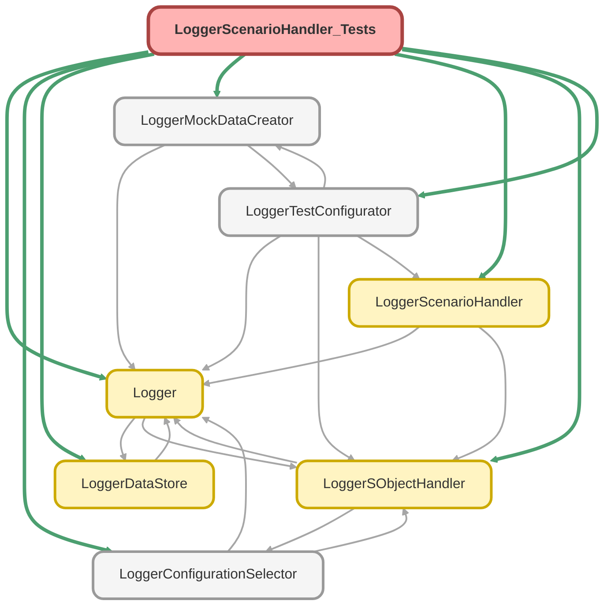

---
hide:
  - path
---

# LoggerScenarioHandler_Tests Class

`SUPPRESSWARNINGS`
`ISTEST`

## Class Diagram



<!-- Apex description -->

## Apex Code

```java
//------------------------------------------------------------------------------------------------//
// This file is part of the Nebula Logger project, released under the MIT License.                //
// See LICENSE file or go to https://github.com/jongpie/NebulaLogger for full license details.    //
//------------------------------------------------------------------------------------------------//

@SuppressWarnings('PMD.ApexDoc, PMD.CyclomaticComplexity, PMD.ExcessiveParameterList, PMD.MethodNamingConventions, PMD.NcssMethodCount')
@IsTest(IsParallel=true)
private class LoggerScenarioHandler_Tests {
  static {
    // Don't use the org's actual custom metadata records when running tests
    LoggerConfigurationSelector.useMocks();
  }

  @IsTest
  static void it_should_return_the_loggerScenario_sobjectType() {
    System.Assert.areEqual(Schema.LoggerScenario__c.SObjectType, new LoggerScenarioHandler().getSObjectType());
  }

  @IsTest
  static void it_should_not_run_when_disabled_via_configuration() {
    LoggerTestConfigurator.setupMockSObjectHandlerConfigurations();
    LoggerTestConfigurator.getSObjectHandlerConfiguration(Schema.LoggerScenario__c.SObjectType).IsEnabled__c = false;
    LoggerScenario__c loggerScenario = (LoggerScenario__c) LoggerMockDataCreator.createDataBuilder(Schema.LoggerScenario__c.SObjectType)
      .populateRequiredFields()
      .getRecord();

    LoggerDataStore.getDatabase().insertRecord(loggerScenario);

    System.Assert.areEqual(
      0,
      LoggerSObjectHandler.getExecutedHandlers().get(Schema.LoggerScenario__c.SObjectType).size(),
      'Handler class should not have executed'
    );
  }

  @IsTest
  static void it_should_run_when_enabled_via_configuration() {
    LoggerTestConfigurator.setupMockSObjectHandlerConfigurations();
    LoggerTestConfigurator.getSObjectHandlerConfiguration(Schema.LoggerScenario__c.SObjectType).IsEnabled__c = true;
    LoggerScenario__c loggerScenario = (LoggerScenario__c) LoggerMockDataCreator.createDataBuilder(Schema.LoggerScenario__c.SObjectType)
      .populateRequiredFields()
      .getRecord();

    LoggerDataStore.getDatabase().insertRecord(loggerScenario);

    System.Assert.areEqual(
      2,
      LoggerSObjectHandler.getExecutedHandlers().get(Schema.LoggerScenario__c.SObjectType).size(),
      'Handler class should have executed two times - once for BEFORE_INSERT and once for AFTER_INSERT'
    );
  }

  @IsTest
  static void it_should_not_allow_duplicate_scenario_to_be_inserted() {
    LoggerScenario__c loggerScenario = (LoggerScenario__c) LoggerMockDataCreator.createDataBuilder(Schema.LoggerScenario__c.SObjectType)
      .populateRequiredFields()
      .getRecord();
    loggerScenario.Name = 'Some log scenario name';
    LoggerDataStore.getDatabase().insertRecord(loggerScenario);
    LoggerScenario__c duplicateScenario = (LoggerScenario__c) LoggerMockDataCreator.createDataBuilder(new LoggerScenario__c(Name = loggerScenario.Name))
      .populateRequiredFields()
      .getRecord();
    System.Exception thrownException;

    try {
      insert duplicateScenario;
      System.Assert.fail('System.Exception expected on previous line');
    } catch (System.Exception ex) {
      thrownException = ex;
    }

    System.Assert.areEqual(
      3,
      LoggerSObjectHandler.getExecutedHandlers().get(Schema.LoggerScenario__c.SObjectType).size(),
      'Handler class should have executed three times - once for BEFORE_INSERT and once for AFTER_INSERT for the first record,' +
      ' and once for BEFORE_INSERT on the errored duplicate'
    );
    System.Assert.isNotNull(thrownException, 'An exception should have been thrown');
    String expectedDuplicateError = 'DUPLICATE_VALUE';
    System.Assert.isTrue(thrownException.getMessage().contains(expectedDuplicateError), thrownException.getMessage());
  }
}
```

## Methods
### `it_should_return_the_loggerScenario_sobjectType()`

`ISTEST`

#### Signature
```apex
private static void it_should_return_the_loggerScenario_sobjectType()
```

#### Return Type
**void**

---

### `it_should_not_run_when_disabled_via_configuration()`

`ISTEST`

#### Signature
```apex
private static void it_should_not_run_when_disabled_via_configuration()
```

#### Return Type
**void**

---

### `it_should_run_when_enabled_via_configuration()`

`ISTEST`

#### Signature
```apex
private static void it_should_run_when_enabled_via_configuration()
```

#### Return Type
**void**

---

### `it_should_not_allow_duplicate_scenario_to_be_inserted()`

`ISTEST`

#### Signature
```apex
private static void it_should_not_allow_duplicate_scenario_to_be_inserted()
```

#### Return Type
**void**