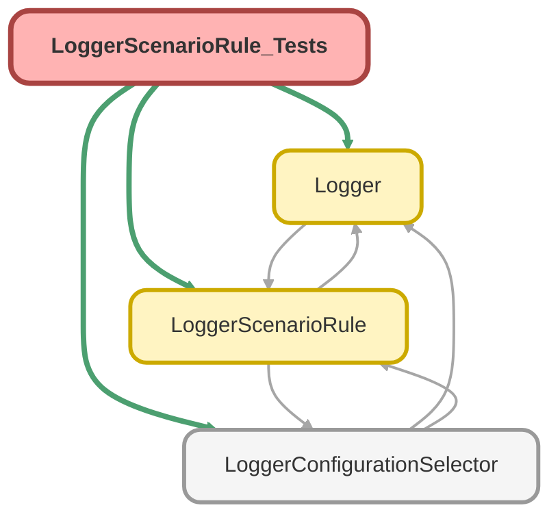

---
hide:
  - path
---

# LoggerScenarioRule_Tests Class

`SUPPRESSWARNINGS`
`ISTEST`

## Class Diagram



<!-- Apex description -->

## Apex Code

```java
//------------------------------------------------------------------------------------------------//
// This file is part of the Nebula Logger project, released under the MIT License.                //
// See LICENSE file or go to https://github.com/jongpie/NebulaLogger for full license details.    //
//------------------------------------------------------------------------------------------------//

@SuppressWarnings('PMD.ApexDoc, PMD.MethodNamingConventions')
@IsTest(IsParallel=true)
private class LoggerScenarioRule_Tests {
  static {
    // Don't use the org's actual custom metadata records when running tests
    LoggerConfigurationSelector.useMocks();
  }

  // DELETEME Deprecated method, remove in a future release
  @IsTest
  static void it_should_throw_exception_when_mock_record_scenario_is_null() {
    LoggerScenarioRule__mdt mockRule = new LoggerScenarioRule__mdt(Scenario__c = null);
    System.Exception thrownIllegalArgumentException;

    try {
      LoggerScenarioRule.setMock(mockRule);
    } catch (System.IllegalArgumentException ex) {
      thrownIllegalArgumentException = ex;
    }

    System.Assert.isNotNull(thrownIllegalArgumentException);
    System.Assert.isTrue(thrownIllegalArgumentException.getMessage().startsWith('Scenario__c is required on `LoggerScenarioRule__mdt'));
  }

  @IsTest
  static void it_should_load_all_mock_records() {
    List<LoggerScenarioRule__mdt> mockRules = new List<LoggerScenarioRule__mdt>();
    for (Integer i = 0; i < 5; i++) {
      LoggerScenarioRule__mdt mockRule = new LoggerScenarioRule__mdt(IsEnabled__c = true, Scenario__c = 'Some Scenario #' + i);
      LoggerConfigurationSelector.mockLoggerScenarioRules.add(mockRule);
      mockRules.add(mockRule);
    }

    Map<String, LoggerScenarioRule__mdt> returnedScenariosToRule = LoggerScenarioRule.getAll();

    System.Assert.areEqual(mockRules.size(), returnedScenariosToRule.size());
    for (LoggerScenarioRule__mdt mockRule : mockRules) {
      System.Assert.isTrue(returnedScenariosToRule.containsKey(mockRule.Scenario__c));
      System.Assert.areEqual(mockRule, returnedScenariosToRule.get(mockRule.Scenario__c));
    }
  }

  @IsTest
  static void it_should_load_configured_rule_when_start_and_end_time_are_both_null() {
    LoggerScenarioRule__mdt mockRule = new LoggerScenarioRule__mdt(EndTime__c = null, IsEnabled__c = true, Scenario__c = 'Some Scenario', StartTime__c = null);
    LoggerConfigurationSelector.mockLoggerScenarioRules.add(mockRule);

    LoggerScenarioRule__mdt returnedRule = LoggerScenarioRule.getInstance(mockRule.Scenario__c);

    System.Assert.areEqual(mockRule, returnedRule);
  }

  @IsTest
  static void it_should_load_configured_rule_when_start_time_is_valid_and_end_time_is_null() {
    LoggerScenarioRule__mdt mockRule = new LoggerScenarioRule__mdt(
      EndTime__c = null,
      IsEnabled__c = true,
      Scenario__c = 'Some Scenario',
      StartTime__c = System.now().addMinutes(-1)
    );
    LoggerConfigurationSelector.mockLoggerScenarioRules.add(mockRule);

    LoggerScenarioRule__mdt returnedRule = LoggerScenarioRule.getInstance(mockRule.Scenario__c);

    System.Assert.areEqual(mockRule, returnedRule);
  }

  @IsTest
  static void it_should_load_configured_rule_when_start_time_is_null_and_end_time_is_valid() {
    LoggerScenarioRule__mdt mockRule = new LoggerScenarioRule__mdt(EndTime__c = System.now().addMinutes(1), IsEnabled__c = true, Scenario__c = 'Some Scenario');
    LoggerConfigurationSelector.mockLoggerScenarioRules.add(mockRule);

    LoggerScenarioRule__mdt returnedRule = LoggerScenarioRule.getInstance(mockRule.Scenario__c);

    System.Assert.areEqual(mockRule, returnedRule);
  }

  @IsTest
  static void it_should_load_configured_rule_when_start_and_end_time_are_both_valid() {
    LoggerScenarioRule__mdt mockRule = new LoggerScenarioRule__mdt(
      EndTime__c = System.now().addMinutes(1),
      IsEnabled__c = true,
      Scenario__c = 'Some Scenario',
      StartTime__c = System.now().addMinutes(-1)
    );
    LoggerConfigurationSelector.mockLoggerScenarioRules.add(mockRule);

    LoggerScenarioRule__mdt returnedRule = LoggerScenarioRule.getInstance(mockRule.Scenario__c);

    System.Assert.areEqual(mockRule, returnedRule);
  }

  @IsTest
  static void it_should_not_load_configured_rule_when_start_time_is_in_the_future() {
    LoggerScenarioRule__mdt mockRule = new LoggerScenarioRule__mdt(
      EndTime__c = null,
      IsEnabled__c = true,
      Scenario__c = 'Some Scenario',
      StartTime__c = System.now().addMinutes(1)
    );
    LoggerConfigurationSelector.mockLoggerScenarioRules.add(mockRule);

    LoggerScenarioRule__mdt returnedRule = LoggerScenarioRule.getInstance(mockRule.Scenario__c);

    System.Assert.isNull(returnedRule);
  }

  @IsTest
  static void it_should_not_load_configured_rule_when_end_time_is_in_the_past() {
    LoggerScenarioRule__mdt mockRule = new LoggerScenarioRule__mdt(
      EndTime__c = System.now().addMinutes(-1),
      IsEnabled__c = true,
      Scenario__c = 'Some Scenario'
    );
    LoggerConfigurationSelector.mockLoggerScenarioRules.add(mockRule);

    LoggerScenarioRule__mdt returnedRule = LoggerScenarioRule.getInstance(mockRule.Scenario__c);

    System.Assert.isNull(returnedRule);
  }
}
```

## Methods
### `it_should_throw_exception_when_mock_record_scenario_is_null()`

`ISTEST`

#### Signature
```apex
private static void it_should_throw_exception_when_mock_record_scenario_is_null()
```

#### Return Type
**void**

---

### `it_should_load_all_mock_records()`

`ISTEST`

#### Signature
```apex
private static void it_should_load_all_mock_records()
```

#### Return Type
**void**

---

### `it_should_load_configured_rule_when_start_and_end_time_are_both_null()`

`ISTEST`

#### Signature
```apex
private static void it_should_load_configured_rule_when_start_and_end_time_are_both_null()
```

#### Return Type
**void**

---

### `it_should_load_configured_rule_when_start_time_is_valid_and_end_time_is_null()`

`ISTEST`

#### Signature
```apex
private static void it_should_load_configured_rule_when_start_time_is_valid_and_end_time_is_null()
```

#### Return Type
**void**

---

### `it_should_load_configured_rule_when_start_time_is_null_and_end_time_is_valid()`

`ISTEST`

#### Signature
```apex
private static void it_should_load_configured_rule_when_start_time_is_null_and_end_time_is_valid()
```

#### Return Type
**void**

---

### `it_should_load_configured_rule_when_start_and_end_time_are_both_valid()`

`ISTEST`

#### Signature
```apex
private static void it_should_load_configured_rule_when_start_and_end_time_are_both_valid()
```

#### Return Type
**void**

---

### `it_should_not_load_configured_rule_when_start_time_is_in_the_future()`

`ISTEST`

#### Signature
```apex
private static void it_should_not_load_configured_rule_when_start_time_is_in_the_future()
```

#### Return Type
**void**

---

### `it_should_not_load_configured_rule_when_end_time_is_in_the_past()`

`ISTEST`

#### Signature
```apex
private static void it_should_not_load_configured_rule_when_end_time_is_in_the_past()
```

#### Return Type
**void**