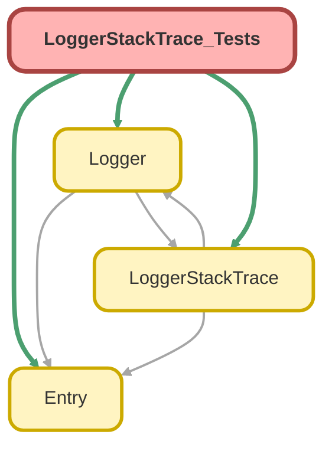

---
hide:
  - path
---

# LoggerStackTrace_Tests Class

`SUPPRESSWARNINGS`
`ISTEST`

## Class Diagram



<!-- Apex description -->

## Apex Code

```java
@SuppressWarnings('PMD.ApexDoc, PMD.MethodNamingConventions')
@IsTest
private class LoggerStackTrace_Tests {
  @IsTest
  static void it_should_gracefully_handle_parsing_null_stack_trace_string() {
    String nullStackTraceString = null;

    LoggerStackTrace parameterlessStackTrace = new LoggerStackTrace(nullStackTraceString);

    System.Assert.areEqual(LoggerStackTrace.SourceLanguage.Apex, parameterlessStackTrace.Language);
    System.Assert.isNull(parameterlessStackTrace.Location);
    System.Assert.isNull(parameterlessStackTrace.ParsedStackTraceString);
    System.Assert.isNull(parameterlessStackTrace.Source);
  }

  @IsTest
  static void it_should_set_details_for_parameterless_constructor_for_top_level_class() {
    String topLevelClassName = LoggerStackTrace_Tests.class.getName();
    String methodName = 'it_should_set_details_for_parameterless_constructor_for_top_level_class';
    String expectedOriginLocation = topLevelClassName + '.' + methodName;
    Integer expectedSourceLineNumber = new System.DmlException().getLineNumber() + 2; // Expected value is the line number below where parameterlessStackTrace is initialized

    LoggerStackTrace parameterlessStackTrace = new LoggerStackTrace();

    System.Assert.areEqual(LoggerStackTrace.SourceLanguage.Apex, parameterlessStackTrace.Language);
    System.Assert.areEqual(topLevelClassName, parameterlessStackTrace.Source.ApiName);
    System.Assert.areEqual(methodName, parameterlessStackTrace.Source.ActionName);
    System.Assert.areEqual(expectedSourceLineNumber, parameterlessStackTrace.Source.LineNumber);
    System.Assert.areEqual(expectedOriginLocation, parameterlessStackTrace.Location);
    System.Assert.isTrue(parameterlessStackTrace.ParsedStackTraceString.startsWith('Class.' + expectedOriginLocation));
    System.Assert.areEqual(LoggerStackTrace.SourceMetadataType.ApexClass, parameterlessStackTrace.Source.MetadataType);
  }

  @IsTest
  static void it_should_set_details_for_parameterless_constructor_for_inner_class() {
    String topLevelClassName = LoggerStackTrace_Tests.class.getName();
    String unqualifiedInnerClassName = DebugStringExample.class.getName().substringAfter(topLevelClassName + '.');
    String methodName = 'getStackTrace';
    String expectedOriginLocation = topLevelClassName + '.' + unqualifiedInnerClassName + '.' + methodName;

    LoggerStackTrace parameterlessStackTrace = new DebugStringExample().getStackTrace();

    System.Assert.areEqual(LoggerStackTrace.SourceLanguage.Apex, parameterlessStackTrace.Language);
    System.Assert.areEqual(topLevelClassName, parameterlessStackTrace.Source.ApiName);
    System.Assert.areEqual(unqualifiedInnerClassName + '.' + methodName, parameterlessStackTrace.Source.ActionName);
    // TODO need to revisit to see if there's a easy-to-maintain way to know the expected line number
    // System.Assert.areEqual(expectedSourceLineNumber, parameterlessStackTrace.Source.LineNumber);
    System.Assert.areEqual(expectedOriginLocation, parameterlessStackTrace.Location);
    System.Assert.isTrue(parameterlessStackTrace.ParsedStackTraceString.startsWith('Class.' + expectedOriginLocation));
    System.Assert.areEqual(LoggerStackTrace.SourceMetadataType.ApexClass, parameterlessStackTrace.Source.MetadataType);
  }

  @IsTest
  static void it_should_set_details_for_apex_exception_constructor() {
    System.Exception apexException = new System.DmlException('oops, some DML broke');
    LoggerStackTrace stringBasedStackTrace = new LoggerStackTrace(apexException.getStackTraceString());

    LoggerStackTrace exceptionBasedStackTrace = new LoggerStackTrace(apexException);

    System.Assert.areEqual(LoggerStackTrace.SourceLanguage.Apex, exceptionBasedStackTrace.Language);
    System.Assert.areEqual(stringBasedStackTrace.Source.ApiName, exceptionBasedStackTrace.Source.ApiName);
    System.Assert.areEqual(stringBasedStackTrace.Location, exceptionBasedStackTrace.Location);
    System.Assert.areEqual(stringBasedStackTrace.ParsedStackTraceString, exceptionBasedStackTrace.ParsedStackTraceString);
    System.Assert.areEqual(stringBasedStackTrace.Source.ApiName, exceptionBasedStackTrace.Source.ApiName);
    System.Assert.areEqual(stringBasedStackTrace.Source.ActionName, exceptionBasedStackTrace.Source.ActionName);
    System.Assert.areEqual(stringBasedStackTrace.Source.LineNumber, exceptionBasedStackTrace.Source.LineNumber);
    System.Assert.areEqual(LoggerStackTrace.SourceMetadataType.ApexClass, exceptionBasedStackTrace.Source.MetadataType);
  }

  @IsTest
  static void it_should_set_details_for_apex_inner_class_constructor_trace_string() {
    // Don't bother testing stack trace logic when using a namespace prefix - there are
    // some platform limitations that prevent these tests from behaving as expected
    if (LoggerStackTrace.class.getName().contains('.') == true) {
      return;
    }

    String topLevelClassName = LoggerStackTrace_Tests.class.getName();
    String innerClassName = DebugStringExample.class.getName().substringAfter(topLevelClassName + '.');
    String constructorMethodName = '<init>';
    String expectedOriginLocation = topLevelClassName + '.' + innerClassName + '.' + constructorMethodName;
    DebugStringExample constructedClass = new DebugStringExample();
    String expectedStackTraceString = constructedClass.getConstructorStackTraceString();

    LoggerStackTrace stackTrace = new LoggerStackTrace(constructedClass.getConstructorStackTraceString());

    System.Assert.areEqual(LoggerStackTrace.SourceLanguage.Apex, stackTrace.Language);
    System.Assert.areEqual(topLevelClassName, stackTrace.Source.ApiName);
    System.Assert.areEqual(expectedOriginLocation, stackTrace.Location);
    System.Assert.areEqual(expectedStackTraceString, stackTrace.ParsedStackTraceString);
    System.Assert.areEqual(topLevelClassName, stackTrace.Source.ApiName);
    System.Assert.areEqual(innerClassName + '.' + constructorMethodName, stackTrace.Source.ActionName);
    // Just a null check for the code line number because it's difficult to try to determine the specific line number in a test
    System.Assert.isNotNull(stackTrace.Source.LineNumber);
    System.Assert.areEqual(LoggerStackTrace.SourceMetadataType.ApexClass, stackTrace.Source.MetadataType);
  }

  @IsTest
  static void it_should_set_details_for_apex_inner_class_method_stack_trace_string() {
    // Don't bother testing stack trace logic when using a namespace prefix - there are
    // some platform limitations that prevent these tests from behaving as expected
    if (LoggerStackTrace.class.getName().contains('.') == true) {
      return;
    }

    String topLevelClassName = LoggerStackTrace_Tests.class.getName();
    String innerClassName = DebugStringExample.class.getName().substringAfter(topLevelClassName + '.');
    String constructorMethodName = 'getMethodStackTraceString';
    String expectedOriginLocation = topLevelClassName + '.' + innerClassName + '.' + constructorMethodName;
    DebugStringExample constructedClass = new DebugStringExample();
    String expectedStackTraceString = constructedClass.getMethodStackTraceString();

    LoggerStackTrace stackTrace = new LoggerStackTrace(constructedClass.getMethodStackTraceString());

    System.Assert.areEqual(LoggerStackTrace.SourceLanguage.Apex, stackTrace.Language);
    System.Assert.areEqual(topLevelClassName, stackTrace.Source.ApiName);
    System.Assert.areEqual(expectedOriginLocation, stackTrace.Location);
    System.Assert.areEqual(expectedStackTraceString, stackTrace.ParsedStackTraceString);
    System.Assert.areEqual(topLevelClassName, stackTrace.Source.ApiName);
    System.Assert.areEqual(innerClassName + '.' + constructorMethodName, stackTrace.Source.ActionName);
    // Just a null check for the code line number because it's difficult to try to determine the specific line number in a test
    System.Assert.isNotNull(stackTrace.Source.LineNumber);
    System.Assert.areEqual(LoggerStackTrace.SourceMetadataType.ApexClass, stackTrace.Source.MetadataType);
  }

  @IsTest
  static void it_should_ignore_stack_trace_line_when_matching_apex_class_type_has_been_ignored() {
    String ignoredTopLevelClassName = LoggerStackTrace_Tests.class.getName();
    String ignoredMethodName = 'it_should_ignore_stack_trace_line_when_matching_class_type_has_been_ignored';
    String ignoredStackTraceLine = 'Class.' + ignoredTopLevelClassName + '.' + ignoredMethodName + ': line 99999, column 1';
    String nonIgnoredTopLevelClassName = 'TheNextClassNameInTheStack';
    Integer nonIgnoredTopLevelClassLineNumber = 987;
    String nonIgnoredMethodName = 'doSomething';
    String expectedOriginLocation = nonIgnoredTopLevelClassName + '.' + nonIgnoredMethodName;
    String relevantStackTraceLines =
      'Class.' +
      expectedOriginLocation +
      ': line ' +
      nonIgnoredTopLevelClassLineNumber +
      ', column 1' +
      '\nAnonymousBlock: line 1, column 1';
    String mockStackTrace = ignoredStackTraceLine + '\n' + relevantStackTraceLines;

    LoggerStackTrace.ignoreOrigin(LoggerStackTrace_Tests.class);
    LoggerStackTrace stackTrace = new LoggerStackTrace(mockStackTrace);

    System.Assert.areEqual(LoggerStackTrace.SourceLanguage.Apex, stackTrace.Language);
    System.Assert.areEqual(expectedOriginLocation, stackTrace.Location);
    System.Assert.areEqual(relevantStackTraceLines, stackTrace.ParsedStackTraceString);
    System.Assert.areEqual(nonIgnoredTopLevelClassName, stackTrace.Source.ApiName);
    System.Assert.areEqual(nonIgnoredMethodName, stackTrace.Source.ActionName);
    System.Assert.areEqual(nonIgnoredTopLevelClassLineNumber, stackTrace.Source.LineNumber);
    System.Assert.areEqual(LoggerStackTrace.SourceMetadataType.ApexClass, stackTrace.Source.MetadataType);
  }

  @IsTest
  static void it_should_set_details_for_trigger_apex_stack_trace_string() {
    String expectedOriginLocation = 'SomeTrigger';
    String mockAnonymousApexStackTraceString = 'Trigger.SomeTrigger: line 9, column 1';

    LoggerStackTrace stackTrace = new LoggerStackTrace(mockAnonymousApexStackTraceString);

    System.Assert.areEqual(LoggerStackTrace.SourceLanguage.Apex, stackTrace.Language);
    System.Assert.areEqual(expectedOriginLocation, stackTrace.Location);
    System.Assert.areEqual(mockAnonymousApexStackTraceString, stackTrace.ParsedStackTraceString);
    System.Assert.areEqual(expectedOriginLocation, stackTrace.Source.ApiName);
    System.Assert.isNull(stackTrace.Source.ActionName);
    System.Assert.areEqual(9, stackTrace.Source.LineNumber);
    System.Assert.areEqual(LoggerStackTrace.SourceMetadataType.ApexTrigger, stackTrace.Source.MetadataType);
  }

  @IsTest
  static void it_should_set_details_for_anonymous_apex_stack_trace_string() {
    String expectedOriginLocation = 'AnonymousBlock';
    String mockAnonymousApexStackTraceString = 'AnonymousBlock: line 9, column 1';

    LoggerStackTrace stackTrace = new LoggerStackTrace(mockAnonymousApexStackTraceString);

    System.Assert.areEqual(LoggerStackTrace.SourceLanguage.Apex, stackTrace.Language);
    System.Assert.areEqual(expectedOriginLocation, stackTrace.Location);
    System.Assert.areEqual(mockAnonymousApexStackTraceString, stackTrace.ParsedStackTraceString);
    System.Assert.isNull(stackTrace.Source.ApiName);
    System.Assert.isNull(stackTrace.Source.ActionName);
    System.Assert.areEqual(9, stackTrace.Source.LineNumber);
    System.Assert.areEqual(LoggerStackTrace.SourceMetadataType.AnonymousBlock, stackTrace.Source.MetadataType);
  }

  @IsTest
  static void it_should_deduplicate_sequential_lines_in_apex_stack_trace_string() {
    String deduplicatedStackTraceString = 'AnonymousBlock: line 9, column 1';
    String duplicatedStackTraceString = deduplicatedStackTraceString + '\n' + deduplicatedStackTraceString + '\n' + deduplicatedStackTraceString;

    LoggerStackTrace stackTrace = new LoggerStackTrace(duplicatedStackTraceString);

    System.Assert.areEqual(LoggerStackTrace.SourceLanguage.Apex, stackTrace.Language);
    System.Assert.areEqual('AnonymousBlock', stackTrace.Location);
    System.Assert.areEqual(deduplicatedStackTraceString, stackTrace.ParsedStackTraceString);
    System.Assert.isNull(stackTrace.Source.ApiName);
    System.Assert.isNull(stackTrace.Source.ActionName);
    System.Assert.areEqual(9, stackTrace.Source.LineNumber);
    System.Assert.areEqual(LoggerStackTrace.SourceMetadataType.AnonymousBlock, stackTrace.Source.MetadataType);
  }

  @IsTest
  static void it_should_not_set_details_for_empty_parenthesis_trace_string() {
    String emptyParenthesisStackTrace = '()';

    LoggerStackTrace stackTrace = new LoggerStackTrace(emptyParenthesisStackTrace);

    System.Assert.areEqual(LoggerStackTrace.SourceLanguage.Apex, stackTrace.Language);
    System.Assert.isNull(stackTrace.Location);
    System.Assert.isNull(stackTrace.ParsedStackTraceString);
    System.Assert.isNull(stackTrace.Source);
  }

  @IsTest
  static void it_should_not_set_details_for_namespaced_parenthesis_stack_trace_string() {
    String namespacedPparenthesisStackTrace = '(Some_Namespace)';

    LoggerStackTrace stackTrace = new LoggerStackTrace(namespacedPparenthesisStackTrace);

    System.Assert.areEqual(LoggerStackTrace.SourceLanguage.Apex, stackTrace.Language);
    System.Assert.isNull(stackTrace.Location);
    System.Assert.isNull(stackTrace.ParsedStackTraceString);
    System.Assert.isNull(stackTrace.Source);
  }

  @IsTest
  static void it_should_not_set_details_for_system_code_stack_trace_string() {
    String namespacedPparenthesisStackTrace = '(System Code)';

    LoggerStackTrace stackTrace = new LoggerStackTrace(namespacedPparenthesisStackTrace);

    System.Assert.areEqual(LoggerStackTrace.SourceLanguage.Apex, stackTrace.Language);
    System.Assert.isNull(stackTrace.Location);
    System.Assert.isNull(stackTrace.ParsedStackTraceString);
    System.Assert.isNull(stackTrace.Source);
  }

  @IsTest
  static void it_should_ignore_external_entry_point_stack_trace_line() {
    String externalEntryPointStackTrace = 'External entry point';
    String mockStackTrace = externalEntryPointStackTrace + '\n' + 'Class.SomeClass.someMethod: line 1, column 1';

    LoggerStackTrace stackTrace = new LoggerStackTrace(mockStackTrace);

    System.Assert.areEqual(LoggerStackTrace.SourceLanguage.Apex, stackTrace.Language);
    System.Assert.areEqual('SomeClass.someMethod', stackTrace.Location);
    System.Assert.areEqual(mockStackTrace, stackTrace.ParsedStackTraceString);
  }

  @IsTest
  static void it_should_not_skip_external_entry_point_stack_trace_line_in_middle_of_stack_trace() {
    String externalEntryPointStackTrace = 'External entry point';
    String mockStackTrace =
      'Class.SomeClass.someMethod: line 1, column 1' +
      '\n' +
      externalEntryPointStackTrace +
      'Class.SomeOtherClass.someMethod: line 1, column 1';

    LoggerStackTrace stackTrace = new LoggerStackTrace(mockStackTrace);

    System.Assert.areEqual(LoggerStackTrace.SourceLanguage.Apex, stackTrace.Language);
    System.Assert.areEqual('SomeClass.someMethod', stackTrace.Location);
    System.Assert.isTrue(stackTrace.ParsedStackTraceString.contains(externalEntryPointStackTrace));
  }

  private class DebugStringExample {
    private System.Exception constructorStackTraceGenerator;
    private System.Exception methodStackTraceGenerator;
    private LoggerStackTrace stackTrace;

    public DebugStringExample() {
      this.constructorStackTraceGenerator = new System.DmlException();
    }

    public String getConstructorStackTraceString() {
      return this.constructorStackTraceGenerator.getStackTraceString();
    }

    public String getMethodStackTraceString() {
      if (this.methodStackTraceGenerator == null) {
        this.methodStackTraceGenerator = new System.DmlException();
      }
      return this.methodStackTraceGenerator.getStackTraceString();
    }

    public LoggerStackTrace getStackTrace() {
      if (this.stackTrace == null) {
        this.stackTrace = new LoggerStackTrace();
      }
      return this.stackTrace;
    }
  }
}
```

## Methods
### `it_should_gracefully_handle_parsing_null_stack_trace_string()`

`ISTEST`

#### Signature
```apex
private static void it_should_gracefully_handle_parsing_null_stack_trace_string()
```

#### Return Type
**void**

---

### `it_should_set_details_for_parameterless_constructor_for_top_level_class()`

`ISTEST`

#### Signature
```apex
private static void it_should_set_details_for_parameterless_constructor_for_top_level_class()
```

#### Return Type
**void**

---

### `it_should_set_details_for_parameterless_constructor_for_inner_class()`

`ISTEST`

#### Signature
```apex
private static void it_should_set_details_for_parameterless_constructor_for_inner_class()
```

#### Return Type
**void**

---

### `it_should_set_details_for_apex_exception_constructor()`

`ISTEST`

#### Signature
```apex
private static void it_should_set_details_for_apex_exception_constructor()
```

#### Return Type
**void**

---

### `it_should_set_details_for_apex_inner_class_constructor_trace_string()`

`ISTEST`

#### Signature
```apex
private static void it_should_set_details_for_apex_inner_class_constructor_trace_string()
```

#### Return Type
**void**

---

### `it_should_set_details_for_apex_inner_class_method_stack_trace_string()`

`ISTEST`

#### Signature
```apex
private static void it_should_set_details_for_apex_inner_class_method_stack_trace_string()
```

#### Return Type
**void**

---

### `it_should_ignore_stack_trace_line_when_matching_apex_class_type_has_been_ignored()`

`ISTEST`

#### Signature
```apex
private static void it_should_ignore_stack_trace_line_when_matching_apex_class_type_has_been_ignored()
```

#### Return Type
**void**

---

### `it_should_set_details_for_trigger_apex_stack_trace_string()`

`ISTEST`

#### Signature
```apex
private static void it_should_set_details_for_trigger_apex_stack_trace_string()
```

#### Return Type
**void**

---

### `it_should_set_details_for_anonymous_apex_stack_trace_string()`

`ISTEST`

#### Signature
```apex
private static void it_should_set_details_for_anonymous_apex_stack_trace_string()
```

#### Return Type
**void**

---

### `it_should_deduplicate_sequential_lines_in_apex_stack_trace_string()`

`ISTEST`

#### Signature
```apex
private static void it_should_deduplicate_sequential_lines_in_apex_stack_trace_string()
```

#### Return Type
**void**

---

### `it_should_not_set_details_for_empty_parenthesis_trace_string()`

`ISTEST`

#### Signature
```apex
private static void it_should_not_set_details_for_empty_parenthesis_trace_string()
```

#### Return Type
**void**

---

### `it_should_not_set_details_for_namespaced_parenthesis_stack_trace_string()`

`ISTEST`

#### Signature
```apex
private static void it_should_not_set_details_for_namespaced_parenthesis_stack_trace_string()
```

#### Return Type
**void**

---

### `it_should_not_set_details_for_system_code_stack_trace_string()`

`ISTEST`

#### Signature
```apex
private static void it_should_not_set_details_for_system_code_stack_trace_string()
```

#### Return Type
**void**

---

### `it_should_ignore_external_entry_point_stack_trace_line()`

`ISTEST`

#### Signature
```apex
private static void it_should_ignore_external_entry_point_stack_trace_line()
```

#### Return Type
**void**

---

### `it_should_not_skip_external_entry_point_stack_trace_line_in_middle_of_stack_trace()`

`ISTEST`

#### Signature
```apex
private static void it_should_not_skip_external_entry_point_stack_trace_line_in_middle_of_stack_trace()
```

#### Return Type
**void**

## Classes
### DebugStringExample Class

#### Fields
##### `constructorStackTraceGenerator`

###### Signature
```apex
private constructorStackTraceGenerator
```

###### Type
System.Exception

---

##### `methodStackTraceGenerator`

###### Signature
```apex
private methodStackTraceGenerator
```

###### Type
System.Exception

---

##### `stackTrace`

###### Signature
```apex
private stackTrace
```

###### Type
[LoggerStackTrace](../logger-engine/LoggerStackTrace.md)

#### Constructors
##### `DebugStringExample()`

###### Signature
```apex
public DebugStringExample()
```

#### Methods
##### `getConstructorStackTraceString()`

###### Signature
```apex
public String getConstructorStackTraceString()
```

###### Return Type
**String**

---

##### `getMethodStackTraceString()`

###### Signature
```apex
public String getMethodStackTraceString()
```

###### Return Type
**String**

---

##### `getStackTrace()`

###### Signature
```apex
public LoggerStackTrace getStackTrace()
```

###### Return Type
**[LoggerStackTrace](../logger-engine/LoggerStackTrace.md)**