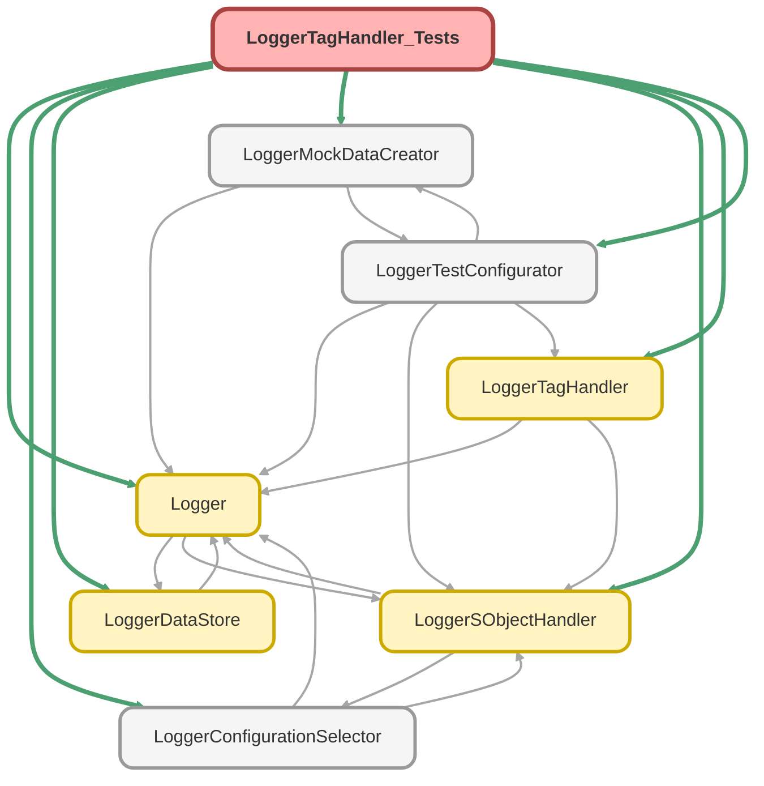

---
hide:
  - path
---

# LoggerTagHandler_Tests Class

`SUPPRESSWARNINGS`
`ISTEST`

## Class Diagram



<!-- Apex description -->

## Apex Code

```java
//------------------------------------------------------------------------------------------------//
// This file is part of the Nebula Logger project, released under the MIT License.                //
// See LICENSE file or go to https://github.com/jongpie/NebulaLogger for full license details.    //
//------------------------------------------------------------------------------------------------//

@SuppressWarnings('PMD.ApexDoc, PMD.CyclomaticComplexity, PMD.ExcessiveParameterList, PMD.MethodNamingConventions, PMD.NcssMethodCount')
@IsTest(IsParallel=true)
private class LoggerTagHandler_Tests {
  static {
    // Don't use the org's actual custom metadata records when running tests
    LoggerConfigurationSelector.useMocks();
  }

  @IsTest
  static void it_should_return_the_loggerTag_sobjectType() {
    System.Assert.areEqual(Schema.LoggerTag__c.SObjectType, new LoggerTagHandler().getSObjectType());
  }

  @IsTest
  static void it_should_not_run_when_disabled_via_configuration() {
    LoggerTestConfigurator.setupMockSObjectHandlerConfigurations();
    LoggerTestConfigurator.getSObjectHandlerConfiguration(Schema.LoggerTag__c.SObjectType).IsEnabled__c = false;
    LoggerTag__c tag = (LoggerTag__c) LoggerMockDataCreator.createDataBuilder(Schema.LoggerTag__c.SObjectType).populateRequiredFields().getRecord();

    LoggerDataStore.getDatabase().insertRecord(tag);

    System.Assert.areEqual(0, LoggerSObjectHandler.getExecutedHandlers().get(Schema.LoggerTag__c.SObjectType).size(), 'Handler class should not have executed');
  }

  @IsTest
  static void it_should_set_unique_id_on_insert() {
    LoggerTag__c tag = (LoggerTag__c) LoggerMockDataCreator.createDataBuilder(Schema.LoggerTag__c.SObjectType).populateRequiredFields().getRecord();
    tag.Name = 'Some tag name';
    LoggerDataStore.getDatabase().insertRecord(tag);

    System.Assert.areEqual(
      2,
      LoggerSObjectHandler.getExecutedHandlers().get(Schema.LoggerTag__c.SObjectType).size(),
      'Handler class should have executed two times - once for BEFORE_INSERT and once for AFTER_INSERT'
    );
    tag = [SELECT Id, Name, UniqueId__c FROM LoggerTag__c WHERE Id = :tag.Id];
    System.Assert.areEqual(tag.Name, tag.UniqueId__c);
  }

  @IsTest
  static void it_should_set_unique_id_on_update() {
    LoggerTag__c tag = (LoggerTag__c) LoggerMockDataCreator.createDataBuilder(Schema.LoggerTag__c.SObjectType).populateRequiredFields().getRecord();
    tag.Name = 'Some tag name';
    LoggerDataStore.getDatabase().insertRecord(tag);

    System.Assert.areEqual(
      2,
      LoggerSObjectHandler.getExecutedHandlers().get(Schema.LoggerTag__c.SObjectType).size(),
      'Handler class should have executed two times - once for BEFORE_INSERT and once for AFTER_INSERT'
    );
    tag = [SELECT Id, Name, UniqueId__c FROM LoggerTag__c WHERE Id = :tag.Id];
    System.Assert.areEqual(tag.Name, tag.UniqueId__c);
  }

  @IsTest
  static void it_should_not_insert_duplicate_tag() {
    LoggerTag__c tag = (LoggerTag__c) LoggerMockDataCreator.createDataBuilder(Schema.LoggerTag__c.SObjectType).populateRequiredFields().getRecord();
    tag.Name = 'Some tag name';
    LoggerDataStore.getDatabase().insertRecord(tag);
    LoggerTag__c duplicateTag = (LoggerTag__c) LoggerMockDataCreator.createDataBuilder(new LoggerTag__c(Name = tag.Name)).populateRequiredFields().getRecord();
    System.Exception thrownException;

    try {
      insert duplicateTag;
      System.Assert.fail('System.Exception expected on previous line');
    } catch (System.Exception ex) {
      thrownException = ex;
    }

    System.Assert.areEqual(
      3,
      LoggerSObjectHandler.getExecutedHandlers().get(Schema.LoggerTag__c.SObjectType).size(),
      'Handler class should have executed three times - once for BEFORE_INSERT and once for AFTER_INSERT for the first record,' +
      ' and once for BEFORE_INSERT on the errored duplicate'
    );
    System.Assert.isNotNull(thrownException, 'An exception should have been thrown');
    String expectedDuplicateError = 'DUPLICATE_VALUE';
    System.Assert.isTrue(thrownException.getMessage().contains(expectedDuplicateError), thrownException.getMessage());
  }
}
```

## Methods
### `it_should_return_the_loggerTag_sobjectType()`

`ISTEST`

#### Signature
```apex
private static void it_should_return_the_loggerTag_sobjectType()
```

#### Return Type
**void**

---

### `it_should_not_run_when_disabled_via_configuration()`

`ISTEST`

#### Signature
```apex
private static void it_should_not_run_when_disabled_via_configuration()
```

#### Return Type
**void**

---

### `it_should_set_unique_id_on_insert()`

`ISTEST`

#### Signature
```apex
private static void it_should_set_unique_id_on_insert()
```

#### Return Type
**void**

---

### `it_should_set_unique_id_on_update()`

`ISTEST`

#### Signature
```apex
private static void it_should_set_unique_id_on_update()
```

#### Return Type
**void**

---

### `it_should_not_insert_duplicate_tag()`

`ISTEST`

#### Signature
```apex
private static void it_should_not_insert_duplicate_tag()
```

#### Return Type
**void**