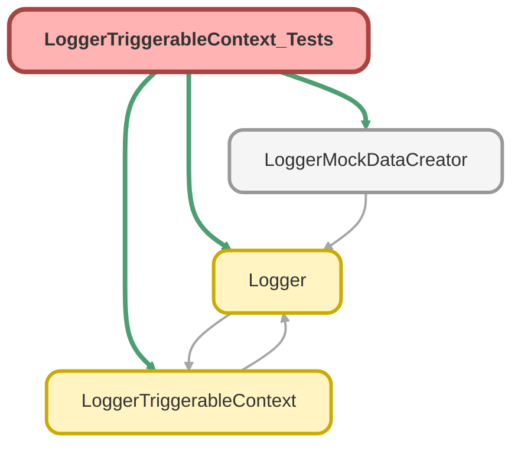

---
hide:
  - path
---

# LoggerTriggerableContext_Tests Class

`SUPPRESSWARNINGS`
`ISTEST`

Test class for LoggerTriggerableContext, part of the trigger-handler framework used by Nebula Logger. 
To demonstrate that the framework is standalone/would work with any SObject, these test methods 
all use mock records for the Schema.User SObject

## Class Diagram



<!-- Apex description -->

## Apex Code

```java
//------------------------------------------------------------------------------------------------//
// This file is part of the Nebula Logger project, released under the MIT License.                //
// See LICENSE file or go to https://github.com/jongpie/NebulaLogger for full license details.    //
//------------------------------------------------------------------------------------------------//

/**
 * @description Test class for LoggerTriggerableContext, part of the trigger-handler framework used by Nebula Logger.
 *              To demonstrate that the framework is standalone/would work with any SObject, these test methods
 *              all use mock records for the Schema.User SObject
 */
@SuppressWarnings('PMD.MethodNamingConventions')
@IsTest(IsParallel=true)
private class LoggerTriggerableContext_Tests {
  // Based on the trigger variables provided by the platform, currently only the TriggerOperations
  // BEFORE_INSERT, BEFORE_UPDATE and BEFORE_DELETE need to be tested - other operations & permutations
  // will have the same parameters as one of these three scenarios

  @IsTest
  static void it_constructs_instance_when_before_insert_operation() {
    Schema.SObjectType sobjectType = Schema.User.SObjectType;
    System.TriggerOperation triggerOperationType = System.TriggerOperation.BEFORE_INSERT;
    List<Schema.User> newUsers = new List<Schema.User>();
    for (Integer i = 0; i < 3; i++) {
      newUsers.add((Schema.User) LoggerMockDataCreator.createUser());
    }

    LoggerTriggerableContext context = new LoggerTriggerableContext(sobjectType, triggerOperationType, newUsers, null, null);

    System.Assert.areEqual(sobjectType, context.sobjectType);
    System.Assert.areEqual(sobjectType.toString(), context.sobjectTypeName);
    System.Assert.areEqual(triggerOperationType, context.triggerOperationType);
    System.Assert.areEqual(newUsers, context.triggerNew);
    System.Assert.isNull(context.triggerNewMap);
    System.Assert.isNull(context.triggerOldMap);
    System.Assert.areEqual(newUsers.size(), context.triggerRecords.size());
    for (Integer i = 0; i < newUsers.size(); i++) {
      System.Assert.areEqual(newUsers.get(i), context.triggerRecords.get(i).triggerRecordNew);
      System.Assert.isNull(context.triggerRecords.get(i).triggerRecordOld);
    }
  }

  @IsTest
  static void it_constructs_instance_when_before_update_operation() {
    Schema.SObjectType sobjectType = Schema.User.SObjectType;
    System.TriggerOperation triggerOperationType = System.TriggerOperation.BEFORE_UPDATE;
    List<Schema.User> updatedUsers = new List<Schema.User>();
    for (Integer i = 0; i < 3; i++) {
      Schema.User user = (Schema.User) LoggerMockDataCreator.createUser();
      user.Id = LoggerMockDataCreator.createId(Schema.User.SObjectType);
      updatedUsers.add(user);
    }
    Map<Id, Schema.User> newUsersMap = new Map<Id, Schema.User>(updatedUsers.clone());
    Map<Id, Schema.User> oldUsersMap = new Map<Id, Schema.User>(updatedUsers.clone());

    LoggerTriggerableContext context = new LoggerTriggerableContext(sobjectType, triggerOperationType, updatedUsers, newUsersMap, oldUsersMap);

    System.Assert.areEqual(sobjectType, context.sobjectType);
    System.Assert.areEqual(sobjectType.toString(), context.sobjectTypeName);
    System.Assert.areEqual(triggerOperationType, context.triggerOperationType);
    System.Assert.areEqual(updatedUsers, context.triggerNew);
    System.Assert.areEqual(newUsersMap, context.triggerNewMap);
    System.Assert.areEqual(oldUsersMap, context.triggerOldMap);
    System.Assert.areEqual(updatedUsers.size(), context.triggerRecords.size());
    for (Integer i = 0; i < updatedUsers.size(); i++) {
      Schema.User user = updatedUsers.get(i);
      System.Assert.areEqual(user, context.triggerRecords.get(i).triggerRecordNew);
      System.Assert.areEqual(oldUsersMap.get(user.Id), context.triggerRecords.get(i).triggerRecordOld);
    }
  }

  @IsTest
  static void it_constructs_instance_when_before_delete_operation() {
    Schema.SObjectType sobjectType = Schema.User.SObjectType;
    System.TriggerOperation triggerOperationType = System.TriggerOperation.BEFORE_DELETE;
    Map<Id, Schema.User> deletedLogsMap = new Map<Id, Schema.User>();
    for (Integer i = 0; i < 3; i++) {
      Schema.User user = (Schema.User) LoggerMockDataCreator.createDataBuilder(sobjectType).populateMockId().populateRequiredFields().getRecord();
      user.Id = LoggerMockDataCreator.createId(Schema.User.SObjectType);
      deletedLogsMap.put(user.Id, user);
    }

    LoggerTriggerableContext context = new LoggerTriggerableContext(sobjectType, triggerOperationType, null, null, deletedLogsMap);

    System.Assert.areEqual(sobjectType, context.sobjectType);
    System.Assert.areEqual(sobjectType.toString(), context.sobjectTypeName);
    System.Assert.areEqual(triggerOperationType, context.triggerOperationType);
    System.Assert.isNull(context.triggerNew);
    System.Assert.isNull(context.triggerNewMap);
    System.Assert.areEqual(deletedLogsMap, context.triggerOldMap);
    System.Assert.areEqual(deletedLogsMap.size(), context.triggerRecords.size());
    for (Integer i = 0; i < deletedLogsMap.size(); i++) {
      Schema.User deletedLog = deletedLogsMap.values().get(i);
      System.Assert.isNull(context.triggerRecords.get(i).triggerRecordNew);
      System.Assert.areEqual(deletedLog, context.triggerRecords.get(i).triggerRecordOld);
    }
  }
}
```

## Methods
### `it_constructs_instance_when_before_insert_operation()`

`ISTEST`

#### Signature
```apex
private static void it_constructs_instance_when_before_insert_operation()
```

#### Return Type
**void**

---

### `it_constructs_instance_when_before_update_operation()`

`ISTEST`

#### Signature
```apex
private static void it_constructs_instance_when_before_update_operation()
```

#### Return Type
**void**

---

### `it_constructs_instance_when_before_delete_operation()`

`ISTEST`

#### Signature
```apex
private static void it_constructs_instance_when_before_delete_operation()
```

#### Return Type
**void**