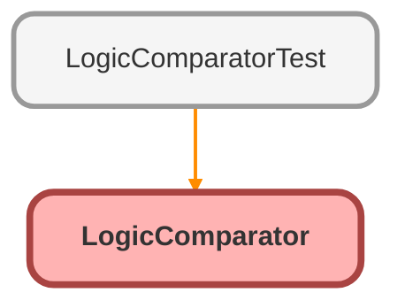

---
hide:
  - path
---

# LogicComparator Class

LogicComparator 
A utility to verify that two pieces of logic (e.g., Flow vs Apex) produce the same side effects. 
Uses Database.Savepoint to isolate executions.

## Class Diagram



<!-- Apex description -->

## Apex Code

```java
/**
 * LogicComparator
 * A utility to verify that two pieces of logic (e.g., Flow vs Apex) produce the same side effects.
 * Uses Database.Savepoint to isolate executions.
 */
public with sharing class LogicComparator {
    
    /**
     * Interface to define the logic to be executed.
     */
    public interface ILogic {
        void run();
    }
    
    /**
     * Interface to provide the results to be compared.
     */
    public interface IResultProvider {
        List<SObject> getResults();
    }
    
    /**
     * Compares the side effects of two logic blocks.
     * @param expectedLogic The baseline logic (e.g., Flow)
     * @param actualLogic The new logic (e.g., Apex)
     * @param resultProvider A provider that queries the records to compare
     */
    public static void compare(ILogic expectedLogic, ILogic actualLogic, IResultProvider resultProvider) {
        // 1. Run Expected Logic (Flow)
        Savepoint sp1 = Database.setSavepoint();
        expectedLogic.run();
        List<SObject> expectedResults = resultProvider.getResults();
        Database.rollback(sp1);
        
        // 2. Run Actual Logic (Apex)
        Savepoint sp2 = Database.setSavepoint();
        actualLogic.run();
        List<SObject> actualResults = resultProvider.getResults();
        Database.rollback(sp2);
        
        // 3. Compare
        // Sanitize results to remove IDs and system fields which will differ
        List<SObject> sanitizedExpected = sanitize(expectedResults);
        List<SObject> sanitizedActual = sanitize(actualResults);
        
        String expectedJson = JSON.serialize(sanitizedExpected);
        String actualJson = JSON.serialize(sanitizedActual);
        
        if (expectedJson != actualJson) {
            throw new LogicComparatorException('Logic mismatch: The side effects do not match. Expected: ' + expectedJson + ', Actual: ' + actualJson);
        }
    }
    
    public class LogicComparatorException extends Exception {}
    
    private static List<SObject> sanitize(List<SObject> records) {
        List<SObject> sanitized = new List<SObject>();
        if (records == null) return sanitized;
        
        for (SObject record : records) {
            // clone(preserveId, isDeepClone, preserveReadonlyTimestamps, preserveAutonumber)
            // We set preserveId=false, preserveReadonlyTimestamps=false
            sanitized.add(record.clone(false, true, false, false));
        }
        return sanitized;
    }
    
    /**
     * Helper to run a Flow.
     */
    public class FlowLogic implements ILogic {
        private String flowName;
        private Map<String, Object> inputs;
        
        public FlowLogic(String flowName, Map<String, Object> inputs) {
            this.flowName = flowName;
            this.inputs = inputs;
        }
        
        public void run() {
            Flow.Interview myFlow = Flow.Interview.createInterview(flowName, inputs);
            myFlow.start();
        }
    }
}
```

## Methods
### `compare(expectedLogic, actualLogic, resultProvider)`

Compares the side effects of two logic blocks.

#### Signature
```apex
public static void compare(ILogic expectedLogic, ILogic actualLogic, IResultProvider resultProvider)
```

#### Parameters
| Name | Type | Description |
|------|------|-------------|
| expectedLogic | ILogic | The baseline logic (e.g., Flow) |
| actualLogic | ILogic | The new logic (e.g., Apex) |
| resultProvider | IResultProvider | A provider that queries the records to compare |

#### Return Type
**void**

---

### `sanitize(records)`

#### Signature
```apex
private static List<SObject> sanitize(List<SObject> records)
```

#### Parameters
| Name | Type | Description |
|------|------|-------------|
| records | List<SObject> |  |

#### Return Type
**List<SObject>**

## Classes
### LogicComparatorException Class

### FlowLogic Class

Helper to run a Flow.

**Implements**

ILogic

#### Fields
##### `flowName`

###### Signature
```apex
private flowName
```

###### Type
String

---

##### `inputs`

###### Signature
```apex
private inputs
```

###### Type
Map<String,Object>

#### Constructors
##### `FlowLogic(flowName, inputs)`

###### Signature
```apex
public FlowLogic(String flowName, Map<String,Object> inputs)
```

###### Parameters
| Name | Type | Description |
|------|------|-------------|
| flowName | String |  |
| inputs | Map<String,Object> |  |

#### Methods
##### `run()`

###### Signature
```apex
public void run()
```

###### Return Type
**void**

## Interfaces
### ILogic Interface

Interface to define the logic to be executed.

#### Methods
##### `run()`

###### Signature
```apex
public void run()
```

###### Return Type
**void**

### IResultProvider Interface

Interface to provide the results to be compared.

#### Methods
##### `getResults()`

###### Signature
```apex
public List<SObject> getResults()
```

###### Return Type
**List<SObject>**