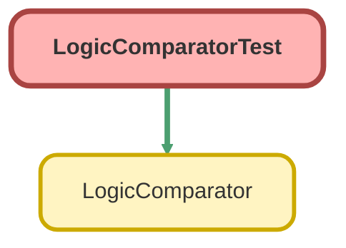

---
hide:
  - path
---

# LogicComparatorTest Class

`ISTEST`

## Class Diagram



<!-- Apex description -->

## Apex Code

```java
@IsTest
private class LogicComparatorTest {
    
    // Mock Logic implementation for testing
    class InsertAccountLogic implements LogicComparator.ILogic {
        private String name;
        public InsertAccountLogic(String name) {
            this.name = name;
        }
        public void run() {
            insert new Account(Name = this.name);
        }
    }
    
    // Mock Result Provider
    class AccountResultProvider implements LogicComparator.IResultProvider {
        public List<SObject> getResults() {
            return [SELECT Name FROM Account ORDER BY CreatedDate DESC LIMIT 1];
        }
    }
    
    @IsTest
    static void testCompareMatchingLogic() {
        LogicComparator.ILogic logic1 = new InsertAccountLogic('Test Account');
        LogicComparator.ILogic logic2 = new InsertAccountLogic('Test Account');
        LogicComparator.IResultProvider provider = new AccountResultProvider();
        
        Test.startTest();
        // Should not throw exception
        LogicComparator.compare(logic1, logic2, provider);
        Test.stopTest();
    }
    
    @IsTest
    static void testCompareMismatchingLogic() {
        LogicComparator.ILogic logic1 = new InsertAccountLogic('Test Account A');
        LogicComparator.ILogic logic2 = new InsertAccountLogic('Test Account B');
        LogicComparator.IResultProvider provider = new AccountResultProvider();
        
        Test.startTest();
        try {
            LogicComparator.compare(logic1, logic2, provider);
            Assert.fail('Should have thrown an exception due to mismatch');
        } catch (LogicComparator.LogicComparatorException e) {
            // Expected
        }
        Test.stopTest();
    }
}
```

## Methods
### `testCompareMatchingLogic()`

`ISTEST`

#### Signature
```apex
private static void testCompareMatchingLogic()
```

#### Return Type
**void**

---

### `testCompareMismatchingLogic()`

`ISTEST`

#### Signature
```apex
private static void testCompareMismatchingLogic()
```

#### Return Type
**void**

## Classes
### InsertAccountLogic Class

**Implements**

LogicComparator.ILogic

#### Fields
##### `name`

###### Signature
```apex
private name
```

###### Type
String

#### Constructors
##### `InsertAccountLogic(name)`

###### Signature
```apex
public InsertAccountLogic(String name)
```

###### Parameters
| Name | Type | Description |
|------|------|-------------|
| name | String |  |

#### Methods
##### `run()`

###### Signature
```apex
public void run()
```

###### Return Type
**void**

### AccountResultProvider Class

**Implements**

LogicComparator.IResultProvider

#### Methods
##### `getResults()`

###### Signature
```apex
public List<SObject> getResults()
```

###### Return Type
**List<SObject>**