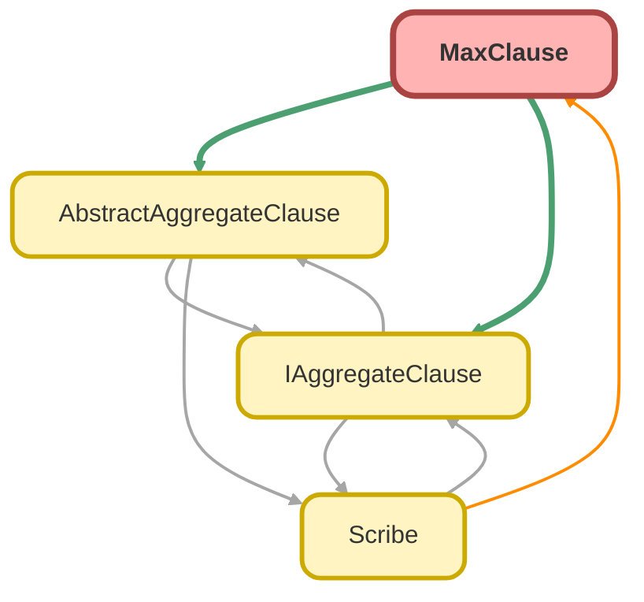

---
hide:
  - path
---

# MaxClause Class

A concrete implementation of `AbstractAggregateClause` that builds a 
SOQL `MAX()` aggregate function. 
 
This class validates that the specified field is of a data type that supports 
ordering (e.g., String, Number, Date), preventing runtime query errors for 
unsupported types like Boolean.

**See** [IAggregateClause](IAggregateClause.md)

**See** [AbstractAggregateClause](AbstractAggregateClause.md)

**Inheritance**

[AbstractAggregateClause](AbstractAggregateClause.md)

## Class Diagram



<!-- Apex description -->

## Apex Code

```java
/**
 * Copyright 2025 Hiroyuki Matsuoka
 *
 * Licensed under the Apache License, Version 2.0 (the "License");
 * you may not use this file except in compliance with the License.
 * You may obtain a copy of the License at
 *
 * http://www.apache.org/licenses/LICENSE-2.0
 *
 * Unless required by applicable law or agreed to in writing, software
 * distributed under the License is distributed on an "AS IS" BASIS,
 * WITHOUT WARRANTIES OR CONDITIONS OF ANY KIND, either express or implied.
 * See the License for the specific language governing permissions and
 * limitations under the License.
 */

/**
 * @description A concrete implementation of `AbstractAggregateClause` that builds a
 * SOQL `MAX()` aggregate function.
 *
 * This class validates that the specified field is of a data type that supports
 * ordering (e.g., String, Number, Date), preventing runtime query errors for
 * unsupported types like Boolean.
 * @see IAggregateClause
 * @see AbstractAggregateClause
 */
public with sharing class MaxClause extends AbstractAggregateClause {
  private List<DisplayType> supportedTypes = new List<DisplayType>{
    DisplayType.DATE,
    DisplayType.DATETIME,
    DisplayType.DOUBLE,
    DisplayType.INTEGER,
    DisplayType.STRING,
    DisplayType.COMBOBOX,
    DisplayType.CURRENCY,
    DisplayType.DATACATEGORYGROUPREFERENCE,
    DisplayType.EMAIL,
    DisplayType.ID,
    DisplayType.PERCENT,
    DisplayType.PHONE,
    DisplayType.PICKLIST,
    DisplayType.REFERENCE,
    DisplayType.TEXTAREA,
    DisplayType.URL
  };

  /**
   * Constructor for MaxClause.
   *
   * @param sObjectType The Schema.SObjectType of the object being queried.
   * @param fieldMap A map of field names to Schema.SObjectField objects for the sObjectType.
   * @param fieldName The name of the field to apply the AVERAGE function on.
   * @param alias An optional alias for the resulting average value.
   */
  public MaxClause(
    Schema.SObjectType sObjectType,
    Map<String, Schema.SObjectField> fieldMap,
    String fieldName,
    String alias
  ) {
    super(sObjectType, fieldMap, fieldName, alias);
  }

  /**
   * @inheritdoc
   */
  public override IAggregateClause overrideMetaData(
    Schema.SObjectType sObjectType,
    Map<String, Schema.SObjectField> fieldMap
  ) {
    return new MaxClause(sObjectType, fieldMap, fieldName, alias);
  }

  /**
   * @inheritdoc
   */
  public override String build() {
    this.validateFieldName(fieldName);
    Schema.SObjectField field = fieldMap.get(fieldName);
    Schema.DisplayType type = field.getDescribe().getType();
    if (!supportedTypes.contains(type)) {
      String error = String.format(
        'The specified field type is not supported for MAX. object name: {0}, field name: {1}, field type: {2}',
        new List<String>{ sObjectType.getDescribe().getName(), fieldName, type.name() }
      );
      throw new QueryException(error);
    }
    return String.format('MAX({0}) {1}', new List<String>{ this.fieldName, this.alias });
  }
}
```

## Fields
### `supportedTypes`

#### Signature
```apex
private supportedTypes
```

#### Type
List<DisplayType>

## Constructors
### `MaxClause(sObjectType, fieldMap, fieldName, alias)`

Constructor for MaxClause.

#### Signature
```apex
public MaxClause(Schema.SObjectType sObjectType, Map<String,Schema.SObjectField> fieldMap, String fieldName, String alias)
```

#### Parameters
| Name | Type | Description |
|------|------|-------------|
| sObjectType | Schema.SObjectType | The Schema.SObjectType of the object being queried. |
| fieldMap | Map<String,Schema.SObjectField> | A map of field names to Schema.SObjectField objects for the sObjectType. |
| fieldName | String | The name of the field to apply the AVERAGE function on. |
| alias | String | An optional alias for the resulting average value. |

## Methods
### `overrideMetaData(sObjectType, fieldMap)`

**Inheritdoc**

#### Signature
```apex
public override IAggregateClause overrideMetaData(Schema.SObjectType sObjectType, Map<String,Schema.SObjectField> fieldMap)
```

#### Parameters
| Name | Type | Description |
|------|------|-------------|
| sObjectType | Schema.SObjectType |  |
| fieldMap | Map<String,Schema.SObjectField> |  |

#### Return Type
**[IAggregateClause](IAggregateClause.md)**

---

### `build()`

**Inheritdoc**

#### Signature
```apex
public override String build()
```

#### Return Type
**String**

---

### `getAlias()`

*Inherited*

**InheritDoc**

#### Signature
```apex
public String getAlias()
```

#### Return Type
**String**

---

### `getFieldName()`

*Inherited*

**InheritDoc**

#### Signature
```apex
public String getFieldName()
```

#### Return Type
**String**

---

### `buildWithChild(childRelationName)`

*Inherited*

**InheritDoc**

#### Signature
```apex
public String buildWithChild(String childRelationName)
```

#### Parameters
| Name | Type | Description |
|------|------|-------------|
| childRelationName | String |  |

#### Return Type
**String**