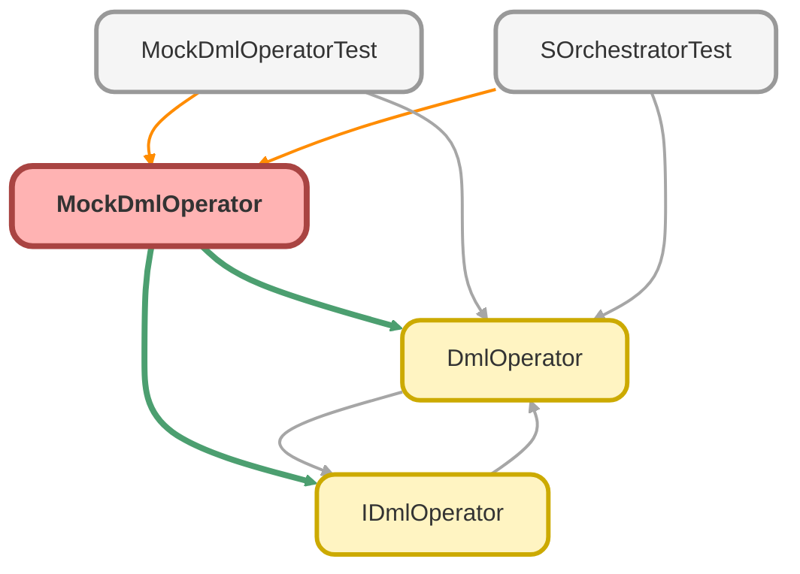

---
hide:
  - path
---

# MockDmlOperator Class

**Implements**

[IDmlOperator](IDmlOperator.md)

## Class Diagram



<!-- Apex description -->

## Apex Code

```java
public with sharing class MockDmlOperator implements IDmlOperator {
  private Integer insertCount;

  public MockDmlOperator() {
    this.insertCount = 0;
  }

  public void doInsert(List<SObject> records){
    System.debug('Mock inserting ' + records.size() + ' records.');
    for(SObject record : records){
      record.Id = genereteId(record);
    }
  }
  public void doUpdate(List<SObject> records){
    // do nothing
  }
  public void doDelete(List<SObject> records) {
    // do nothing
  }

  /**
   * generate a mock Id for the record
   *
   * @param record SObject to be inserted
   * @return generated Id
   */
  private String genereteId(SObject record) {
    String prefix = record.getSObjectType().getDescribe().getKeyPrefix();
    String generatedId = prefix + String.valueOf(this.insertCount).leftPad(12, '0');
    this.insertCount++;
    return generatedId;
  }
}
```

## Fields
### `insertCount`

#### Signature
```apex
private insertCount
```

#### Type
Integer

## Constructors
### `MockDmlOperator()`

#### Signature
```apex
public MockDmlOperator()
```

## Methods
### `doInsert(records)`

#### Signature
```apex
public void doInsert(List<SObject> records)
```

#### Parameters
| Name | Type | Description |
|------|------|-------------|
| records | List<SObject> |  |

#### Return Type
**void**

---

### `doUpdate(records)`

#### Signature
```apex
public void doUpdate(List<SObject> records)
```

#### Parameters
| Name | Type | Description |
|------|------|-------------|
| records | List<SObject> |  |

#### Return Type
**void**

---

### `doDelete(records)`

#### Signature
```apex
public void doDelete(List<SObject> records)
```

#### Parameters
| Name | Type | Description |
|------|------|-------------|
| records | List<SObject> |  |

#### Return Type
**void**

---

### `genereteId(record)`

generate a mock Id for the record

#### Signature
```apex
private String genereteId(SObject record)
```

#### Parameters
| Name | Type | Description |
|------|------|-------------|
| record | SObject | SObject to be inserted |

#### Return Type
**String**

generated Id