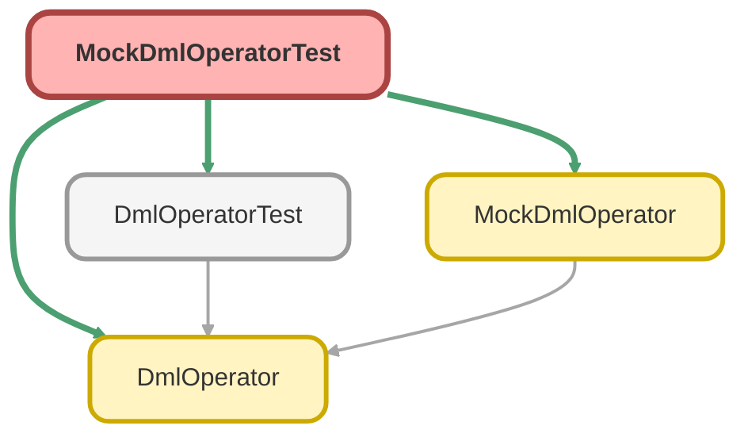

---
hide:
  - path
---

# MockDmlOperatorTest Class

`ISTEST`

## Class Diagram



<!-- Apex description -->

## Apex Code

```java
@isTest
public with sharing class MockDmlOperatorTest {
  @isTest
  static void testDoInsert_WhenExecute_ThenSuccess() {
    // Arrange
    List<Account> accList = new List<Account>{new Account(Name = 'Test Account')};

    // Act
    try {
      (new MockDmlOperator()).doInsert(accList);
    } catch (Exception e) {
      // Assert
      Assert.fail('例外が発生しました。' + e.getMessage());
    }

    // Assert
    Assert.isTrue(accList[0].Id != null, 'IDが設定されていることを確認');
  }
}
```

## Methods
### `testDoInsert_WhenExecute_ThenSuccess()`

`ISTEST`

#### Signature
```apex
private static void testDoInsert_WhenExecute_ThenSuccess()
```

#### Return Type
**void**