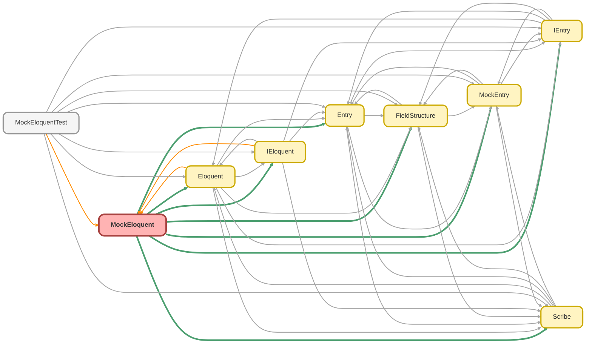

---
hide:
  - path
---

# MockEloquent Class

The mock implementation of the `IEloquent` interface, designed to enable fast, 
reliable, and database-independent unit testing of service classes. 
 
Instead of interacting with the Salesforce database, `MockEloquent` operates on an 
in-memory list of `IEntry` objects (typically `MockEntry` instances) that are 
provided during its construction. This allows a developer to precisely control the 
data that a query will &quot;return&quot; in a test scenario. 
 
DML operations like `doInsert` are simulated (e.g., by assigning a mock Id) without 
performing any actual DML. The class also includes a constructor to force exceptions, 
enabling robust testing of error-handling logic.

**See** [IEloquent](IEloquent.md)

**See** [Eloquent](Eloquent.md)

**See** [MockEntry](MockEntry.md)

**Implements**

[IEloquent](IEloquent.md)

## Class Diagram



<!-- Apex description -->

## Apex Code

```java
/**
 * Copyright 2025 Hiroyuki Matsuoka
 *
 * Licensed under the Apache License, Version 2.0 (the "License");
 * you may not use this file except in compliance with the License.
 * You may obtain a copy of the License at
 *
 * http://www.apache.org/licenses/LICENSE-2.0
 *
 * Unless required by applicable law or agreed to in writing, software
 * distributed under the License is distributed on an "AS IS" BASIS,
 * WITHOUT WARRANTIES OR CONDITIONS OF ANY KIND, either express or implied.
 * See the License for the specific language governing permissions and
 * limitations under the License.
 */

/**
 * @description The mock implementation of the `IEloquent` interface, designed to enable fast,
 * reliable, and database-independent unit testing of service classes.
 *
 * Instead of interacting with the Salesforce database, `MockEloquent` operates on an
 * in-memory list of `IEntry` objects (typically `MockEntry` instances) that are
 * provided during its construction. This allows a developer to precisely control the
 * data that a query will "return" in a test scenario.
 *
 * DML operations like `doInsert` are simulated (e.g., by assigning a mock Id) without
 * performing any actual DML. The class also includes a constructor to force exceptions,
 * enabling robust testing of error-handling logic.
 * @see IEloquent
 * @see Eloquent
 * @see MockEntry
 */
public with sharing class MockEloquent implements IEloquent {
  private final List<IEntry> entries;
  private Integer insertCount;
  private Boolean shouldThrowException = false;

  @TestVisible
  private Scribe scribe;

  @TestVisible
  private List<SObject> upsertedRecords = new List<SObject>();

  /**
   * constructor
   */
  public MockEloquent() {
    this.entries = new List<IEntry>();
    this.insertCount = 0;
    this.scribe = null;
    this.shouldThrowException = false;
  }

  /**
   * constructor with a single Entry
   *
   * @param entry IEntry to be added
   */
  public MockEloquent(IEntry entry) {
    if (entry == null) {
      this.entries = new List<IEntry>();
    } else {
      this.entries = new List<IEntry>{ entry };
    }
    this.insertCount = 0;
    this.scribe = null;
    this.shouldThrowException = false;
  }

  /**
   * constructor with a list of SObjects
   *
   * @param records List<SObject> to be added
   */
  public MockEloquent(List<IEntry> entries) {
    this.entries = entries;
    this.insertCount = 0;
    this.scribe = null;
    this.shouldThrowException = false;
  }

  /**
   * Constructor for forcing an exception
   *
   * @param shouldThrow Set to true to make methods throw an exception
   */
  public MockEloquent(Boolean shouldThrow) {
    this.entries = new List<IEntry>();
    this.insertCount = 0;
    this.scribe = null;
    this.shouldThrowException = shouldThrow;
  }

  /**
   * @inheritDoc
   */
  public List<IEntry> get(Scribe scribe) {
    if (this.shouldThrowException) {
      throw new QueryException('Test Exception from MockEloquent.get()');
    }
    this.scribe = scribe;
    String soql = scribe.toSoql(); // for showing and validate SOQL
    FieldStructure fieldStructure = scribe.buildFieldStructure();
    List<IEntry> result = new List<IEntry>();
    for (IEntry entry : this.entries) {
      result.add(entry.setFieldStructure(fieldStructure));
    }
    return result;
  }

  /**
   * @inheritDoc
   */
  public List<IEntry> getAggregate(Scribe scribe) {
    if (this.shouldThrowException) {
      throw new QueryException('Test Exception from MockEloquent.getAggregate()');
    }

    if (!scribe.isAggregate()) {
      throw new QueryException(
        'The provided Scribe instance does not represent an aggregate query: ' + scribe.toSoql()
      );
    }

    this.scribe = scribe;
    String soql = scribe.toSoql(); // for showing and validate SOQL
    FieldStructure fieldStructure = scribe.buildAggregateFieldStructure();
    List<IEntry> result = new List<IEntry>();
    for (IEntry entry : this.entries) {
      result.add(entry.setFieldStructure(fieldStructure));
    }
    return result;
  }

  /**
   * @inheritDoc
   */
  public List<SObject> getAsSObject(Scribe scribe) {
    if (this.shouldThrowException) {
      throw new QueryException('Test Exception from MockEloquent.getAsSObject()');
    }
    this.scribe = scribe;
    String soql = scribe.toSoql(); // for showing and validate SOQL
    List<SObject> result = new List<SObject>();
    for (IEntry entry : this.entries) {
      result.add(entry.getRecord());
    }
    return result;
  }

  /**
   * @inheritDoc
   */
  public IEntry first(Scribe scribe) {
    if (this.shouldThrowException) {
      throw new QueryException('Test Exception from MockEloquent.first()');
    }
    this.scribe = scribe;
    String soql = scribe.toSoql(); // for showing and validate SOQL
    FieldStructure fieldStructure = scribe.buildFieldStructure();
    if (this.entries.isEmpty()) {
      return null;
    }
    return this.entries[0].setFieldStructure(fieldStructure);
  }

  /**
   * @inheritDoc
   */
  public SObject firstAsSObject(Scribe scribe) {
    if (this.shouldThrowException) {
      throw new QueryException('Test Exception from MockEloquent.firstAsSObject()');
    }
    this.scribe = scribe;
    String soql = scribe.toSoql(); // for showing and validate SOQL
    if (this.entries.isEmpty()) {
      return null;
    }
    return this.entries[0].getRecord();
  }

  /**
   * @inheritDoc
   */
  public IEntry firstOrFail(Scribe scribe) {
    if (this.shouldThrowException) {
      throw new QueryException('Test Exception from MockEloquent.firstOrFail()');
    }
    this.scribe = scribe;
    String soql = scribe.toSoql(); // for showing and validate SOQL
    FieldStructure fieldStructure = scribe.buildFieldStructure();
    if (this.entries.isEmpty()) {
      throw new QueryException('No records found for query: ' + scribe.toSoql());
    }
    return this.entries[0].setFieldStructure(fieldStructure);
  }

  /**
   * @inheritDoc
   */
  public SObject firstOrFailAsSObject(Scribe scribe) {
    if (this.shouldThrowException) {
      throw new QueryException('Test Exception from MockEloquent.firstOrFailAsSObject()');
    }
    this.scribe = scribe;
    String soql = scribe.toSoql(); // for showing and validate SOQL
    if (this.entries.isEmpty()) {
      throw new QueryException('No records found for query: ' + scribe.toSoql());
    }
    return this.entries[0].getRecord();
  }

  /**
   * @inheritDoc
   */
  public SObject doInsert(SObject record) {
    if (this.shouldThrowException) {
      throw new DmlException('Test Exception from MockEloquent.doInsert()');
    }
    if (record == null) {
      throw new DmlException('Cannot insert null record');
    }
    record.Id = this.generateId(record);
    this.upsertedRecords.add(record);
    return record;
  }

  /**
   * @inheritDoc
   */
  public List<SObject> doInsert(List<SObject> records) {
    if (this.shouldThrowException) {
      throw new DmlException('Test Exception from MockEloquent.doInsert()');
    }
    if (records == null || records.isEmpty()) {
      throw new DmlException('Cannot insert null or empty records');
    }
    for (SObject record : records) {
      record.Id = this.generateId(record);
    }
    this.upsertedRecords.addAll(records); 
    return records;
  }

  /**
   * @inheritDoc
   */
  public SObject doUpdate(SObject record) {
    if (this.shouldThrowException) {
      throw new DmlException('Test Exception from MockEloquent.doUpdate()');
    }
    if (record == null) {
      throw new DmlException('Cannot update null record');
    }
    this.upsertedRecords.add(record);
    return record;
  }

  /**
   * @inheritDoc
   */
  public IEntry doUpdate(IEntry entry) {
    if (this.shouldThrowException) {
      throw new DmlException('Test Exception from MockEloquent.doUpdate()');
    }
    if (entry == null) {
      throw new DmlException('Cannot update null entry');
    }
    this.upsertedRecords.add(entry.getRecord());
    return entry;
  }

  /**
   * @inheritDoc
   */
  public List<SObject> doUpdate(List<SObject> records) {
    if (this.shouldThrowException) {
      throw new DmlException('Test Exception from MockEloquent.doUpdate()');
    }
    if (records == null || records.isEmpty()) {
      throw new DmlException('Cannot update null or empty records');
    }
    this.upsertedRecords.addAll(records);
    return records;
  }

  /**
   * @inheritDoc
   */
  public List<IEntry> doUpdate(List<IEntry> entries) {
    if (this.shouldThrowException) {
      throw new DmlException('Test Exception from MockEloquent.doUpdate()');
    }
    if (entries == null || entries.isEmpty()) {
      return new List<IEntry>();
    }
    
    for (IEntry entry : entries) {
      this.upsertedRecords.add(entry.getRecord());
    }

    return entries;
  }

  /**
   * @inheritDoc
   */
  public SObject doUpsert(SObject record) {
    if (this.shouldThrowException) {
      throw new DmlException('Test Exception from MockEloquent.doUpsert()');
    }
    if (record == null) {
      throw new DmlException('Cannot upsert null record');
    }
    if (record.Id == null) {
      record.Id = this.generateId(record);
    }
    this.upsertedRecords.add(record);
    return record;
  }

  /**
   * @inheritDoc
   */
  public IEntry doUpsert(IEntry entry) {
    if (this.shouldThrowException) {
      throw new DmlException('Test Exception from MockEloquent.doUpsert()');
    }
    if (entry == null || entry.getRecord() == null) {
      throw new DmlException('Cannot upsert null entry');
    }
    SObject record = entry.getRecord();
    if (record.Id == null) {
      entry.put('Id', this.generateId(record));
    }
    this.upsertedRecords.add(record);
    return entry;
  }

  /**
   * @inheritDoc
   */
  public List<SObject> doUpsert(List<SObject> records) {
    if (this.shouldThrowException) {
      throw new DmlException('Test Exception from MockEloquent.doUpsert()');
    }
    if (records == null || records.isEmpty()) {
      throw new DmlException('Cannot upsert null or empty records');
    }
    for (SObject record : records) {
      if (record.Id == null) {
        record.Id = this.generateId(record);
      }
      this.upsertedRecords.add(record);
    }
    return records;
  }

  /**
   * @inheritDoc
   */
  public List<IEntry> doUpsert(List<IEntry> entries) {
    if (this.shouldThrowException) {
      throw new DmlException('Test Exception from MockEloquent.doUpsert()');
    }
    if (entries == null || entries.isEmpty()) {
      throw new DmlException('Cannot upsert null or empty entries');
    }
    for (IEntry entry : entries) {
      if (entry == null || entry.getRecord() == null) {
        throw new DmlException('Cannot upsert null entry or record');
      }
      SObject record = entry.getRecord();
      if (record.Id == null) {
        entry.put('Id', this.generateId(record));
      }
      this.upsertedRecords.add(record);
    }
    return entries;
  }

  /**
   * @inheritDoc
   */
  public void doDelete(SObject record) {
    if (this.shouldThrowException) {
      throw new DmlException('Test Exception from MockEloquent.doDelete()');
    }
    if (record == null) {
      throw new DmlException('Cannot delete null record');
    }
    return;
  }

  /**
   * @inheritDoc
   */
  public void doDelete(IEntry entry) {
    if (this.shouldThrowException) {
      throw new DmlException('Test Exception from MockEloquent.doDelete()');
    }
    return;
  }

  /**
   * @inheritDoc
   */
  public void doDelete(List<SObject> records) {
    if (this.shouldThrowException) {
      throw new DmlException('Test Exception from MockEloquent.doDelete()');
    }
    if (records == null || records.isEmpty()) {
      throw new DmlException('Cannot delete null or empty records');
    }
    return;
  }

  /**
   * @inheritDoc
   */
  public void doDelete(List<IEntry> entries) {
    if (this.shouldThrowException) {
      throw new DmlException('Test Exception from MockEloquent.doDelete()');
    }
    return;
  }

  /**
   * generate a mock Id for the record
   *
   * @param record SObject to be inserted
   * @return generated Id
   */
  private String generateId(SObject record) {
    String prefix = record.getSObjectType().getDescribe().getKeyPrefix();
    String generatedId = prefix + String.valueOf(this.insertCount).leftPad(12, '0');
    this.insertCount++;
    return generatedId;
  }
}
```

## Fields
### `entries`

#### Signature
```apex
private final entries
```

#### Type
List<IEntry>

---

### `insertCount`

#### Signature
```apex
private insertCount
```

#### Type
Integer

---

### `shouldThrowException`

#### Signature
```apex
private shouldThrowException
```

#### Type
Boolean

---

### `scribe`

`TESTVISIBLE`

#### Signature
```apex
private scribe
```

#### Type
[Scribe](Scribe.md)

---

### `upsertedRecords`

`TESTVISIBLE`

#### Signature
```apex
private upsertedRecords
```

#### Type
List<SObject>

## Constructors
### `MockEloquent()`

constructor

#### Signature
```apex
public MockEloquent()
```

---

### `MockEloquent(entry)`

constructor with a single Entry

#### Signature
```apex
public MockEloquent(IEntry entry)
```

#### Parameters
| Name | Type | Description |
|------|------|-------------|
| entry | [IEntry](IEntry.md) | IEntry to be added |

---

### `MockEloquent(entries)`

constructor with a list of SObjects

#### Signature
```apex
public MockEloquent(List<IEntry> entries)
```

#### Parameters
| Name | Type | Description |
|------|------|-------------|
| entries | List<IEntry> |  |

---

### `MockEloquent(shouldThrow)`

Constructor for forcing an exception

#### Signature
```apex
public MockEloquent(Boolean shouldThrow)
```

#### Parameters
| Name | Type | Description |
|------|------|-------------|
| shouldThrow | Boolean | Set to true to make methods throw an exception |

## Methods
### `get(scribe)`

**InheritDoc**

#### Signature
```apex
public List<IEntry> get(Scribe scribe)
```

#### Parameters
| Name | Type | Description |
|------|------|-------------|
| scribe | [Scribe](Scribe.md) |  |

#### Return Type
**List<IEntry>**

---

### `getAggregate(scribe)`

**InheritDoc**

#### Signature
```apex
public List<IEntry> getAggregate(Scribe scribe)
```

#### Parameters
| Name | Type | Description |
|------|------|-------------|
| scribe | [Scribe](Scribe.md) |  |

#### Return Type
**List<IEntry>**

---

### `getAsSObject(scribe)`

**InheritDoc**

#### Signature
```apex
public List<SObject> getAsSObject(Scribe scribe)
```

#### Parameters
| Name | Type | Description |
|------|------|-------------|
| scribe | [Scribe](Scribe.md) |  |

#### Return Type
**List<SObject>**

---

### `first(scribe)`

**InheritDoc**

#### Signature
```apex
public IEntry first(Scribe scribe)
```

#### Parameters
| Name | Type | Description |
|------|------|-------------|
| scribe | [Scribe](Scribe.md) |  |

#### Return Type
**[IEntry](IEntry.md)**

---

### `firstAsSObject(scribe)`

**InheritDoc**

#### Signature
```apex
public SObject firstAsSObject(Scribe scribe)
```

#### Parameters
| Name | Type | Description |
|------|------|-------------|
| scribe | [Scribe](Scribe.md) |  |

#### Return Type
**SObject**

---

### `firstOrFail(scribe)`

**InheritDoc**

#### Signature
```apex
public IEntry firstOrFail(Scribe scribe)
```

#### Parameters
| Name | Type | Description |
|------|------|-------------|
| scribe | [Scribe](Scribe.md) |  |

#### Return Type
**[IEntry](IEntry.md)**

---

### `firstOrFailAsSObject(scribe)`

**InheritDoc**

#### Signature
```apex
public SObject firstOrFailAsSObject(Scribe scribe)
```

#### Parameters
| Name | Type | Description |
|------|------|-------------|
| scribe | [Scribe](Scribe.md) |  |

#### Return Type
**SObject**

---

### `doInsert(record)`

**InheritDoc**

#### Signature
```apex
public SObject doInsert(SObject record)
```

#### Parameters
| Name | Type | Description |
|------|------|-------------|
| record | SObject |  |

#### Return Type
**SObject**

---

### `doInsert(records)`

**InheritDoc**

#### Signature
```apex
public List<SObject> doInsert(List<SObject> records)
```

#### Parameters
| Name | Type | Description |
|------|------|-------------|
| records | List<SObject> |  |

#### Return Type
**List<SObject>**

---

### `doUpdate(record)`

**InheritDoc**

#### Signature
```apex
public SObject doUpdate(SObject record)
```

#### Parameters
| Name | Type | Description |
|------|------|-------------|
| record | SObject |  |

#### Return Type
**SObject**

---

### `doUpdate(entry)`

**InheritDoc**

#### Signature
```apex
public IEntry doUpdate(IEntry entry)
```

#### Parameters
| Name | Type | Description |
|------|------|-------------|
| entry | [IEntry](IEntry.md) |  |

#### Return Type
**[IEntry](IEntry.md)**

---

### `doUpdate(records)`

**InheritDoc**

#### Signature
```apex
public List<SObject> doUpdate(List<SObject> records)
```

#### Parameters
| Name | Type | Description |
|------|------|-------------|
| records | List<SObject> |  |

#### Return Type
**List<SObject>**

---

### `doUpdate(entries)`

**InheritDoc**

#### Signature
```apex
public List<IEntry> doUpdate(List<IEntry> entries)
```

#### Parameters
| Name | Type | Description |
|------|------|-------------|
| entries | List<IEntry> |  |

#### Return Type
**List<IEntry>**

---

### `doUpsert(record)`

**InheritDoc**

#### Signature
```apex
public SObject doUpsert(SObject record)
```

#### Parameters
| Name | Type | Description |
|------|------|-------------|
| record | SObject |  |

#### Return Type
**SObject**

---

### `doUpsert(entry)`

**InheritDoc**

#### Signature
```apex
public IEntry doUpsert(IEntry entry)
```

#### Parameters
| Name | Type | Description |
|------|------|-------------|
| entry | [IEntry](IEntry.md) |  |

#### Return Type
**[IEntry](IEntry.md)**

---

### `doUpsert(records)`

**InheritDoc**

#### Signature
```apex
public List<SObject> doUpsert(List<SObject> records)
```

#### Parameters
| Name | Type | Description |
|------|------|-------------|
| records | List<SObject> |  |

#### Return Type
**List<SObject>**

---

### `doUpsert(entries)`

**InheritDoc**

#### Signature
```apex
public List<IEntry> doUpsert(List<IEntry> entries)
```

#### Parameters
| Name | Type | Description |
|------|------|-------------|
| entries | List<IEntry> |  |

#### Return Type
**List<IEntry>**

---

### `doDelete(record)`

**InheritDoc**

#### Signature
```apex
public void doDelete(SObject record)
```

#### Parameters
| Name | Type | Description |
|------|------|-------------|
| record | SObject |  |

#### Return Type
**void**

---

### `doDelete(entry)`

**InheritDoc**

#### Signature
```apex
public void doDelete(IEntry entry)
```

#### Parameters
| Name | Type | Description |
|------|------|-------------|
| entry | [IEntry](IEntry.md) |  |

#### Return Type
**void**

---

### `doDelete(records)`

**InheritDoc**

#### Signature
```apex
public void doDelete(List<SObject> records)
```

#### Parameters
| Name | Type | Description |
|------|------|-------------|
| records | List<SObject> |  |

#### Return Type
**void**

---

### `doDelete(entries)`

**InheritDoc**

#### Signature
```apex
public void doDelete(List<IEntry> entries)
```

#### Parameters
| Name | Type | Description |
|------|------|-------------|
| entries | List<IEntry> |  |

#### Return Type
**void**

---

### `generateId(record)`

generate a mock Id for the record

#### Signature
```apex
private String generateId(SObject record)
```

#### Parameters
| Name | Type | Description |
|------|------|-------------|
| record | SObject | SObject to be inserted |

#### Return Type
**String**

generated Id