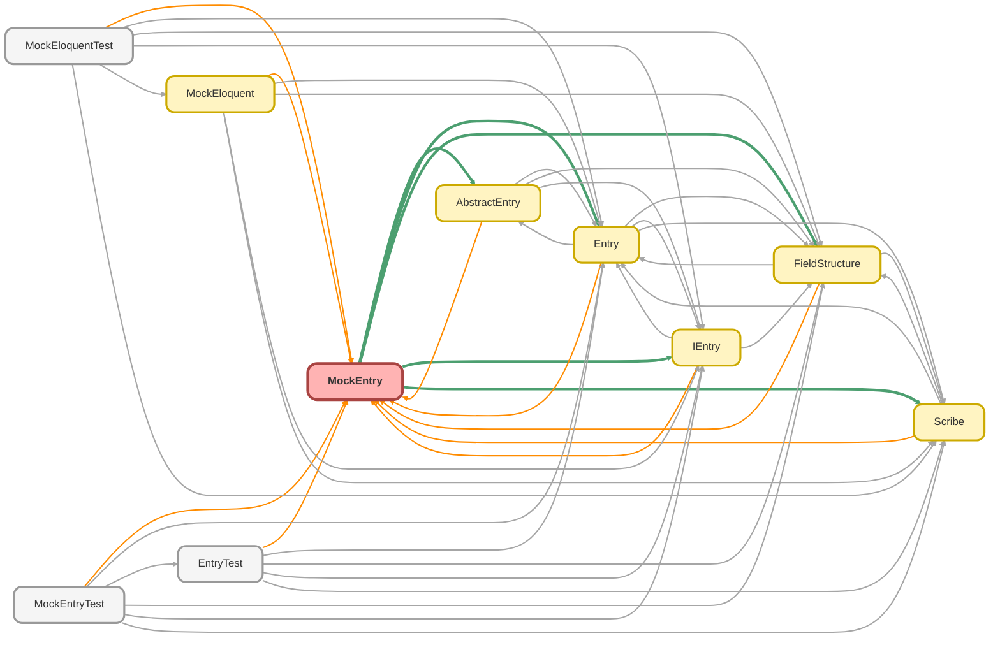

---
hide:
  - path
---

# MockEntry Class

The mock implementation of the `IEntry` interface, designed to facilitate 
fast, reliable, and database-independent unit tests. 
 
A `MockEntry` wraps a base `SObject` instance but allows any field or relationship value 
to be overridden via a `Map<String, Object>` . This enables the simulation of complex 
data scenarios, including non-writable fields and relationships, without DML. 
 
It can also represent a virtual `AggregateResult` by being instantiated directly 
with a map of values. 
 
Crucially, `MockEntry` is a high-fidelity mock. When provided with a `FieldStructure` , 
it simulates the framework&#x27;s &quot;select-forgotten&quot; validation, throwing an exception 
if a test attempts to access data that was not part of the original query definition.

**See** [IEntry](IEntry.md)

**See** [AbstractEntry](AbstractEntry.md)

**See** [Entry](Entry.md)

**Inheritance**

[AbstractEntry](AbstractEntry.md)

## Class Diagram



<!-- Apex description -->

## Apex Code

```java
/**
 * Copyright 2025 Hiroyuki Matsuoka
 *
 * Licensed under the Apache License, Version 2.0 (the "License");
 * you may not use this file except in compliance with the License.
 * You may obtain a copy of the License at
 *
 * http://www.apache.org/licenses/LICENSE-2.0
 *
 * Unless required by applicable law or agreed to in writing, software
 * distributed under the License is distributed on an "AS IS" BASIS,
 * WITHOUT WARRANTIES OR CONDITIONS OF ANY KIND, either express or implied.
 * See the License for the specific language governing permissions and
 * limitations under the License.
 */

/**
 * @description The mock implementation of the `IEntry` interface, designed to facilitate
 * fast, reliable, and database-independent unit tests.
 *
 * A `MockEntry` wraps a base `SObject` instance but allows any field or relationship value
 * to be overridden via a `Map<String, Object>`. This enables the simulation of complex
 * data scenarios, including non-writable fields and relationships, without DML.
 *
 * It can also represent a virtual `AggregateResult` by being instantiated directly
 * with a map of values.
 *
 * Crucially, `MockEntry` is a high-fidelity mock. When provided with a `FieldStructure`,
 * it simulates the framework's "select-forgotten" validation, throwing an exception
 * if a test attempts to access data that was not part of the original query definition.
 * @see IEntry
 * @see AbstractEntry
 * @see Entry
 */
public with sharing class MockEntry extends AbstractEntry {
  private final Map<String, Object> fieldToValue;

  /**
   * Creates a new instance of MockEntry for a given SObjectType.
   *
   * @param sObjectType The SObject type of the record to create (e.g., Account.getSObjectType()).
   * @return A new MockEntry instance.
   */
  public static MockEntry of(Schema.SObjectType sObjectType) {
    SObject record = sObjectType.newSObject();
    return new MockEntry(record);
  }

  /**
   * Sets a value for a specified field.
   * This method is immutable and returns a new MockEntry instance.
   *
   * @param fieldName The API name of the field to set.
   * @param value The value to set for the field.
   * @return A new MockEntry instance with the updated field value.
   */
  public MockEntry add(String fieldName, Object value) {
    Map<String, Object> newFieldToValue = new Map<String, Object>(this.fieldToValue);
    newFieldToValue.put(fieldName, value);
    return new MockEntry(this.record, this.fieldStructure, newFieldToValue);
  }

  /**
   * Sets a list of child relationship records.
   *
   * @param childObjectNameOrRelationName The child object name or the relationship name (e.g., 'Contacts').
   * @param children A list of MockEntry instances for the child records.
   * @return A new MockEntry instance with the child records added.
   */
  public MockEntry addChildren(String childObjectNameOrRelationName, List<MockEntry> children) {
    Map<String, Object> newFieldToValue = new Map<String, Object>(this.fieldToValue);
    newFieldToValue.put(childObjectNameOrRelationName, children);
    return new MockEntry(this.record, this.fieldStructure, newFieldToValue);
  }

  /**
   * Sets a parent relationship record.
   *
   * @param parentIdFieldName The name of the parent ID field (e.g., 'AccountId').
   * @param parent The MockEntry for the parent record.
   * @return A new MockEntry instance with the parent record added.
   */
  public MockEntry addParent(String parentIdFieldName, MockEntry parent) {
    Map<String, Object> newFieldToValue = new Map<String, Object>(this.fieldToValue);
    newFieldToValue.put(parentIdFieldName, parent);
    return new MockEntry(this.record, this.fieldStructure, newFieldToValue);
  }

  /**
   * Automatically generates an 18-character ID from the SObject's prefix and a specified suffix,
   * and sets it on the Id field.
   *
   * @param suffix The string to be used at the end of the ID.
   * @return A new MockEntry instance with the Id field set.
   */
  public MockEntry autoId(String suffix) {
    if (suffix == '{#}' || suffix == '{A}' || suffix == '{a}') {
      return this.add('Id', suffix);
    }
    String id = this.generate18CharId(suffix);
    FieldStructure clonedfieldStructure = this.fieldStructure.clone();
    clonedfieldStructure.addField('id');
    return new MockEntry(this.record, clonedfieldStructure, this.fieldToValue).add('Id', id);
  }

  /**
   * Automatically generates an 18-character ID from the SObject's prefix and a specified suffix,
   * and sets it on the Id field.
   *
   * @param suffix The number (non-negative) to be used at the end of the ID.
   * @return A new MockEntry instance with the Id field set.
   * @throws IllegalArgumentException if the suffix is a negative number.
   */
  public MockEntry autoId(Integer suffix) {
    if (suffix < 0) {
      throw new IllegalArgumentException('suffix must be greater than or equal to 0');
    }
    return this.autoId(String.valueOf(suffix));
  }

  /**
   * Generates a list of records using the current MockEntry as a template.
   * The sequence starts at 1 and increments by 1.
   *
   * @param count The number of records to generate.
   * @return A list of generated MockEntry instances.
   */
  public List<MockENtry> times(Integer count) {
    return this.times(count, 1, 1);
  }

  /**
   * Generates a list of records using the current MockEntry as a template.
   * The sequence starts at the specified number and increments by 1.
   *
   * @param count The number of records to generate.
   * @param startAt The starting number for the sequence.
   * @return A list of generated MockEntry instances.
   */
  public List<MockEntry> times(Integer count, Integer startAt) {
    return this.times(count, startAt, 1);
  }

  /**
   * Generates a list of records using the current MockEntry as a template.
   * Field values can contain '{#}', '{A}', and '{a}' placeholders to embed sequential values.
   *
   * @param count The number of records to generate.
   * @param startAt The starting number for the sequence.
   * @param interval The step or interval between each number in the sequence.
   * @return A list of generated MockEntry instances.
   * @throws IllegalArgumentException if count is 0 or less, or if an alphabetic sequence is used and startAt is less than 1.
   * @example
   * // Generates 3 records with Names 'Test Account 10', 'Test Account 20', 'Test Account 30'
   * .add('Name', 'Test Account {#}').times(3, 10, 10);
   */
  public List<MockEntry> times(Integer count, Integer startAt, Integer interval) {
    if (count <= 0) {
      throw new IllegalArgumentException('count must be greater than 0');
    }

    Boolean hasAlphabeticPlaceholder = false;
    for (Object value : this.fieldToValue.values()) {
      if (value instanceof String) {
        String strValue = (String) value;
        if (strValue.contains('{A}') || strValue.contains('{a}')) {
          hasAlphabeticPlaceholder = true;
          break;
        }
      }
    }

    if (hasAlphabeticPlaceholder && startAt < 1) {
      throw new IllegalArgumentException(
        'Alphabetic sequences {A} or {a} require \'startAt\' to be 1 or greater.'
      );
    }

    List<MockEntry> entries = new List<MockEntry>();
    for (Integer i = 0; i < count; i++) {
      Integer currentSequence = startAt + (i * interval);
      Map<String, Object> newFieldToValue = new Map<String, Object>();

      for (String key : this.fieldToValue.keySet()) {
        Object templateValue = this.fieldToValue.get(key);
        Object resolvedValue = this.resolveValue(templateValue, currentSequence);

        // ID項目であれば、解決後の値をsuffixとして18桁IDを生成
        if (key.startsWith('id') || key.startsWith('Id') || key.endsWith('Id')) {
          newFieldToValue.put(key, this.generate18CharId(String.valueOf(resolvedValue)));
        } else {
          newFieldToValue.put(key, resolvedValue);
        }
      }
      entries.add(new MockEntry(this.record, this.fieldStructure, newFieldToValue));
    }

    return entries;
  }

  /**
   * Resolves a template value by replacing placeholders with the current sequence number.
   * Supported placeholders:
   * - '{#}': Replaced with the current sequence number.
   * - '{A}': Replaced with the current sequence number converted to an uppercase alphabetic representation.
   * - '{a}': Replaced with the current sequence number converted to a lowercase alphabetic representation.
   * If the template value is not a string, it is returned as-is.
   *
   * @param templateValue The template value containing placeholders.
   * @param sequence The current sequence number to replace placeholders.
   * @return The resolved value with placeholders replaced.
   */
  private Object resolveValue(Object templateValue, Integer sequence) {
    if (!(templateValue instanceof String)) {
      return templateValue;
    }

    String value = (String) templateValue;

    if (value == '{#}') {
      return sequence;
    }

    String resolvedString = value.replace('{#}', String.valueOf(sequence))
      .replace('{A}', this.convertNumberToAlphabet(sequence, true))
      .replace('{a}', this.convertNumberToAlphabet(sequence, false));

    return resolvedString;
  }

  /**
   * Generates an 18-character Salesforce ID using the SObject's key prefix and a specified suffix.
   * The suffix is left-padded with zeros to ensure the total length is 18 characters.
   *
   * @param suffix The string to be used at the end of the ID.
   * @return An 18-character Salesforce ID.
   */
  private String generate18CharId(String suffix) {
    String prefix = this.record.getSObjectType().getDescribe().getKeyPrefix();
    return this.convert15To18(prefix + String.valueOf(suffix).leftPad(15 - prefix.length(), '0'));
  }

  /**
   * Converts a 15-character Salesforce ID to its 18-character equivalent by calculating the checksum.
   *
   * @param id15 The 15-character Salesforce ID.
   * @return The corresponding 18-character Salesforce ID, or null if the input is invalid.
   */
  private String convert15To18(String id15) {
    if (id15 == null || id15.length() != 15) {
      return null;
    }

    final String CHARS = 'ABCDEFGHIJKLMNOPQRSTUVWXYZ012345';
    String checksum = '';

    for (Integer i = 0; i < 3; i++) {
      Integer flags = 0;
      for (Integer j = 0; j < 5; j++) {
        String c = id15.substring(i * 5 + j, i * 5 + j + 1);

        Integer charCode = c.charAt(0);
        if (charCode >= 65 && charCode <= 90) {
          flags += 1 << j;
        }
      }
      checksum += CHARS.substring(flags, flags + 1);
    }
    return id15 + checksum;
  }

  /**
   * Converts a positive integer to its corresponding alphabetic representation.
   * For example, 1 -> 'A', 26 -> 'Z', 27 -> 'AA', 52 -> 'AZ', 53 -> 'BA', etc.
   *
   * @param num The positive integer to convert.
   * @param isUpperCase If true, returns uppercase letters; if false, returns lowercase letters.
   * @return The alphabetic representation of the number.
   */
  private String convertNumberToAlphabet(Integer num, Boolean isUpperCase) {
    if (num == null || num <= 0) {
      return '';
    }

    final Integer BASE_CHAR_CODE = isUpperCase ? 65 : 97;
    final Integer BASE = 26;
    String result = '';

    Integer current = num;
    while (current > 0) {
      Integer remainder = Math.mod(current - 1, BASE);

      Integer charCode = BASE_CHAR_CODE + remainder;
      result = String.fromCharArray(new List<Integer>{ charCode }) + result;

      current = (current - remainder) / BASE;
    }
    return result;
  }

  /**
   * constructor
   *
   * @param record SObject
   */
  public MockEntry(SObject record) {
    super(record);
    this.fieldToValue = new Map<String, Object>();
  }

  /**
   * constructor
   *
   * @param record SObject
   * @param fieldToValue field to value map
   */
  public MockEntry(SObject record, Map<String, Object> fieldToValue) {
    super(record);
    this.fieldToValue = fieldToValue;
  }

  /**
   * constructor
   *
   * @param record SObject
   * @param fieldStructure FieldStructure
   */
  public MockEntry(SObject record, FieldStructure fieldStructure) {
    super(record, fieldStructure);
    this.fieldToValue = new Map<String, Object>();
  }

  /**
   * constructor for AggregateResult
   *
   * @param fieldToValue field to value map
   */
  public MockEntry(Map<String, Object> fieldToValue) {
    super(null);
    this.fieldToValue = fieldToValue;
    this.hasAggregateResult = true;
  }

  /**
   * constructor for testing
   *
   * @param record SObject
   * @param fieldStructure FieldStructure
   * @param fieldToValue field to value map
   */
  @TestVisible
  private MockEntry(SObject record, FieldStructure fieldStructure, Map<String, Object> fieldToValue) {
    super(record, fieldStructure);
    this.fieldToValue = fieldToValue;
  }

  /**
   * @inheritDoc
   */
  public override Object get(String fieldName) {
    if (this.hasAggregateResult) {
      if (!this.fieldStructure.hasField(fieldName.toLowerCase())) {
        String error = String.format(
          'The specified field or alias is not exist in Scribe. field or alias name: {0}',
          new List<String>{ fieldName }
        );
        throw new QueryException(error);
      }

      for (String key : this.fieldToValue.keySet()) {
        if (key.equalsIgnoreCase(fieldName)) {
          Object value = this.fieldToValue.get(key);
          if (value instanceof IEntry) {
            IEntry entry = (IEntry) value;
            FieldStructure relationFieldStructure = this.fieldStructure == null
              ? new FieldStructure(new List<String>())
              : this.fieldStructure.getRelationFieldStructure(fieldname.toLowerCase());
            return entry.setFieldStructure(relationFieldStructure).getId();
          }
          return this.fieldToValue.get(key);
        }
      }

      // Since an AggregateResult cannot be instantiated like an SObject, we must throw an error if the requested field/alias is not found in the fieldToValue map.
      String error = String.format(
        'The specified field or alias is not found in the mock data. field or alias name: {0}',
        new List<String>{ fieldName }
      );
      throw new QueryException(error);
    }

    this.validateFieldName(fieldName);
    this.ensureDescribeResultIfNeeded();

    for (String key : this.fieldToValue.keySet()) {
      if (key.equalsIgnoreCase(fieldName)) {
        Object value = this.fieldToValue.get(key);
        if (value instanceof IEntry) {
          IEntry entry = (IEntry) value;
          FieldStructure relationFieldStructure = this.fieldStructure == null
            ? new FieldStructure(new List<String>())
            : this.fieldStructure.getRelationFieldStructure(fieldname.toLowerCase());
          return entry.setFieldStructure(relationFieldStructure).getId();
        }
        return this.fieldToValue.get(key);
      }
    }

    System.debug('MockEntry.get: Falling back to base record for field: ' + fieldName);
    Entry entry = new Entry(this.record);
    return entry.get(fieldName);
  }

  /**
   * @inheritDoc
   */
  public override void put(String fieldName, Object value) {
    if (this.hasAggregateResult) {
      String error = 'Cannot call put() on an AggregateResult record.';
      throw new QueryException(error);
    }

    try {
      this.record.put(fieldName, value);
      this.fieldToValue.put(fieldName, value);
      this.fieldStructure.addField(fieldName.toLowerCase());
    } catch (Exception e) {
      System.debug(e.getStackTraceString());
      String error = String.format(
        'Failed to put value to the SObject. field name: {0}, value: {1}, Error: {2}',
        new List<String>{ fieldName, (String) value, e.getMessage() }
      );
      throw new QueryException(error);
    }
  }

  /**
   * @inheritDoc
   */
  public override IEntry getParent(String parentIdFieldName) {
    this.ensureDescribeResultIfNeeded();
    String lowerCaseFieldName = parentIdFieldName.toLowerCase();

    if (!this.fieldStructure.hasRelation(lowerCaseFieldName)) {
      String error = String.format(
        'The specified parentIdFieldName is not set in Scribe. object name: {0}, parent Id field name: {1}',
        new List<String>{ this.describeResult.getName(), parentIdFieldName }
      );
      throw new QueryException(error);
    }

    if (this.fieldToValue.containsKey(parentIdFieldName)) {
      IEntry resultEntry = (IEntry) this.fieldToValue.get(parentIdFieldName);
      FieldStructure parentFieldStructure = this.fieldStructure == null
        ? new FieldStructure(new List<String>())
        : this.fieldStructure.getRelationFieldStructure(lowerCaseFieldName);
      return resultEntry.setFieldStructure(parentFieldStructure);
    }

    Entry entry = new Entry(this.record);
    return entry.getParent(parentIdFieldName);
  }

  /**
   * @inheritDoc
   */
  public override List<IEntry> getChildren(String childObjectName) {
    this.ensureDescribeResultIfNeeded();
    // for validate the childObjectName
    String childRelationName = this.getChildrenRelationNameFromChildObjectName(childObjectName);

    String errorTemplate = 'The specified childObjectName is not set in Scribe. object name: {0}, child object name: {1}';
    this.validateChildRelationInFieldStructure(childObjectname, errorTemplate);

    for (String key : this.fieldToValue.keySet()) {
      if (key.equalsIgnoreCase(childObjectName)) {
        errorTemplate = 'The child object needs to be a List<IEntry> or IEntry. object name: {0}, child object name: {1}';
        return this.getchildEntriesFromFieldToValue(key, errorTemplate);
      }
    }

    Entry entry = new Entry(this.record);
    return entry.getChildren(childObjectName);
  }

  /**
   * @inheritDoc
   */
  public override List<IEntry> getChildrenByRelationName(String childRelationName) {
    this.ensureDescribeResultIfNeeded();
    String errorTemplate = 'The specified childRelationName is not set in Scribe. object name: {0}, child relation name: {1}';
    this.validateChildRelationInFieldStructure(childRelationname, errorTemplate);

    this.validateChildRelationName(childRelationName);

    for (String key : this.fieldToValue.keySet()) {
      if (key.equalsIgnoreCase(childRelationName)) {
        errorTemplate = 'The child object needs to be a List<IEntry> or IEntry. object name: {0}, child object relation name: {1}';
        return this.getchildEntriesFromFieldToValue(key, errorTemplate);
      }
    }

    Entry entry = new Entry(this.record);
    return entry.getChildrenByRelationName(childRelationName);
  }

  /**
   * @inheritDoc
   */
  public override Id getId() {
    this.validateFieldName('Id');

    if (this.fieldToValue.containsKey('Id')) {
      return (Id) this.fieldToValue.get('Id');
    }

    return (Id) this.record.get('Id');
  }

  /**
   * @inheritDoc
   */
  public override String getName() {
    this.validateFieldName('Name');

    if (this.fieldToValue.containsKey('Name')) {
      return (String) this.fieldToValue.get('Name');
    }

    return (String) this.record.get('Name');
  }

  /**
   * @inheritDoc
   */
  public override SObject getRecord() {
    SObject returnRecord = this.record;
    for (String fieldName : this.fieldToValue.keySet()) {
      try{
        returnRecord.put(fieldName, this.get(fieldName));
      } catch (Exception e) {
        System.debug('MockEntry.getRecord: Skipped putting value into a field due to a constraint. Field: ' + fieldName);
      }
    }
    return returnRecord;
  }

  /**
   * @inheritDoc
   */
  public override IEntry setRecord(SObject record) {
    return new MockEntry(record, this.fieldStructure, this.fieldToValue);
  }

  /**
   * @inheritDoc
   */
  public override IEntry setFieldStructure(FieldStructure fieldStructure) {
    return new MockEntry(this.record, fieldStructure, this.fieldToValue);
  }

  /**
   * validate the field name.
   *
   * @param fieldName field name to be validated
   * @throws QueryException if the field is not picked in Scribe
   */
  private void validateFieldName(String fieldName) {
    String lowerCaseFieldName = fieldName.toLowerCase();
    if (this.fieldStructure.hasField(lowerCaseFieldName)) {
      return;
    }

    String error = String.format(
      'The specified field is not selected in Scribe. object name: {0}, field name: {1}',
      new List<String>{ this.record.getSObjectType().getDescribe().getName(), fieldName }
    );
    throw new QueryException(error);
  }

  /**
   * validate the child relation name.
   *
   * @param childRelationName child relation name to be validated
   * @throws QueryException if the child relation name is not valid
   */
  private void validateChildRelationInFieldStructure(String relation, String errorTemplate) {
    if (!this.fieldStructure.hasRelation(relation.toLowerCase())) {
      this.ensureDescribeResultIfNeeded();
      String error = String.format(errorTemplate, new List<String>{ this.describeResult.getName(), relation });
      throw new QueryException(error);
    }
  }

  /**
   * validate the child relation name.
   *
   * @param childRelationName child relation name to be validated
   * @throws QueryException if the child relation name is not valid
   */
  private List<IEntry> getChildEntriesFromFieldToValue(String key, String errorTemplate) {
    List<IEntry> entries = new List<IEntry>();
    Object childObjects = this.fieldToValue.get(key);
    if (childObjects instanceof List<IEntry>) {
      entries = (List<IEntry>) childObjects;
    } else if (childObjects instanceof IEntry) {
      entries = new List<IEntry>{ (IEntry) childObjects };
    } else {
      this.ensureDescribeResultIfNeeded();
      String error = String.format(errorTemplate, new List<String>{ this.describeResult.getName(), key });
      throw new QueryException(error);
    }

    List<IEntry> resultEntries = new List<IEntry>();
    FieldStructure childFieldStructure = this.fieldStructure == null
      ? new FieldStructure()
      : this.fieldStructure.getRelationFieldStructure(key.toLowerCase());
    for (IEntry entry : entries) {
      resultEntries.add(entry.setFieldStructure(childFieldStructure));
    }
    return resultEntries;
  }
}
```

## Fields
### `fieldToValue`

#### Signature
```apex
private final fieldToValue
```

#### Type
Map<String,Object>

## Constructors
### `MockEntry(record)`

constructor

#### Signature
```apex
public MockEntry(SObject record)
```

#### Parameters
| Name | Type | Description |
|------|------|-------------|
| record | SObject | SObject |

---

### `MockEntry(record, fieldToValue)`

constructor

#### Signature
```apex
public MockEntry(SObject record, Map<String,Object> fieldToValue)
```

#### Parameters
| Name | Type | Description |
|------|------|-------------|
| record | SObject | SObject |
| fieldToValue | Map<String,Object> | field to value map |

---

### `MockEntry(record, fieldStructure)`

constructor

#### Signature
```apex
public MockEntry(SObject record, FieldStructure fieldStructure)
```

#### Parameters
| Name | Type | Description |
|------|------|-------------|
| record | SObject | SObject |
| fieldStructure | [FieldStructure](FieldStructure.md) | FieldStructure |

---

### `MockEntry(fieldToValue)`

constructor for AggregateResult

#### Signature
```apex
public MockEntry(Map<String,Object> fieldToValue)
```

#### Parameters
| Name | Type | Description |
|------|------|-------------|
| fieldToValue | Map<String,Object> | field to value map |

---

### `MockEntry(record, fieldStructure, fieldToValue)`

`TESTVISIBLE`

constructor for testing

#### Signature
```apex
private MockEntry(SObject record, FieldStructure fieldStructure, Map<String,Object> fieldToValue)
```

#### Parameters
| Name | Type | Description |
|------|------|-------------|
| record | SObject | SObject |
| fieldStructure | [FieldStructure](FieldStructure.md) | FieldStructure |
| fieldToValue | Map<String,Object> | field to value map |

## Methods
### `of(sObjectType)`

Creates a new instance of MockEntry for a given SObjectType.

#### Signature
```apex
public static MockEntry of(Schema.SObjectType sObjectType)
```

#### Parameters
| Name | Type | Description |
|------|------|-------------|
| sObjectType | Schema.SObjectType | The SObject type of the record to create (e.g., Account.getSObjectType()). |

#### Return Type
**[MockEntry](MockEntry.md)**

A new MockEntry instance.

---

### `add(fieldName, value)`

Sets a value for a specified field. 
This method is immutable and returns a new MockEntry instance.

#### Signature
```apex
public MockEntry add(String fieldName, Object value)
```

#### Parameters
| Name | Type | Description |
|------|------|-------------|
| fieldName | String | The API name of the field to set. |
| value | Object | The value to set for the field. |

#### Return Type
**[MockEntry](MockEntry.md)**

A new MockEntry instance with the updated field value.

---

### `addChildren(childObjectNameOrRelationName, children)`

Sets a list of child relationship records.

#### Signature
```apex
public MockEntry addChildren(String childObjectNameOrRelationName, List<MockEntry> children)
```

#### Parameters
| Name | Type | Description |
|------|------|-------------|
| childObjectNameOrRelationName | String | The child object name or the relationship name (e.g., &#x27;Contacts&#x27;). |
| children | List<MockEntry> | A list of MockEntry instances for the child records. |

#### Return Type
**[MockEntry](MockEntry.md)**

A new MockEntry instance with the child records added.

---

### `addParent(parentIdFieldName, parent)`

Sets a parent relationship record.

#### Signature
```apex
public MockEntry addParent(String parentIdFieldName, MockEntry parent)
```

#### Parameters
| Name | Type | Description |
|------|------|-------------|
| parentIdFieldName | String | The name of the parent ID field (e.g., &#x27;AccountId&#x27;). |
| parent | [MockEntry](MockEntry.md) | The MockEntry for the parent record. |

#### Return Type
**[MockEntry](MockEntry.md)**

A new MockEntry instance with the parent record added.

---

### `autoId(suffix)`

Automatically generates an 18-character ID from the SObject&#x27;s prefix and a specified suffix, 
and sets it on the Id field.

#### Signature
```apex
public MockEntry autoId(String suffix)
```

#### Parameters
| Name | Type | Description |
|------|------|-------------|
| suffix | String | The string to be used at the end of the ID. |

#### Return Type
**[MockEntry](MockEntry.md)**

A new MockEntry instance with the Id field set.

---

### `autoId(suffix)`

Automatically generates an 18-character ID from the SObject&#x27;s prefix and a specified suffix, 
and sets it on the Id field.

#### Signature
```apex
public MockEntry autoId(Integer suffix)
```

#### Parameters
| Name | Type | Description |
|------|------|-------------|
| suffix | Integer | The number (non-negative) to be used at the end of the ID. |

#### Return Type
**[MockEntry](MockEntry.md)**

A new MockEntry instance with the Id field set.

#### Throws
IllegalArgumentException: if the suffix is a negative number.

---

### `times(count)`

Generates a list of records using the current MockEntry as a template. 
The sequence starts at 1 and increments by 1.

#### Signature
```apex
public List<MockENtry> times(Integer count)
```

#### Parameters
| Name | Type | Description |
|------|------|-------------|
| count | Integer | The number of records to generate. |

#### Return Type
**List<MockENtry>**

A list of generated MockEntry instances.

---

### `times(count, startAt)`

Generates a list of records using the current MockEntry as a template. 
The sequence starts at the specified number and increments by 1.

#### Signature
```apex
public List<MockEntry> times(Integer count, Integer startAt)
```

#### Parameters
| Name | Type | Description |
|------|------|-------------|
| count | Integer | The number of records to generate. |
| startAt | Integer | The starting number for the sequence. |

#### Return Type
**List<MockEntry>**

A list of generated MockEntry instances.

---

### `times(count, startAt, interval)`

Generates a list of records using the current MockEntry as a template. 
Field values can contain &#x27;{#}&#x27;, &#x27;{A}&#x27;, and &#x27;{a}&#x27; placeholders to embed sequential values.

#### Signature
```apex
public List<MockEntry> times(Integer count, Integer startAt, Integer interval)
```

#### Parameters
| Name | Type | Description |
|------|------|-------------|
| count | Integer | The number of records to generate. |
| startAt | Integer | The starting number for the sequence. |
| interval | Integer | The step or interval between each number in the sequence. |

#### Return Type
**List<MockEntry>**

A list of generated MockEntry instances.

#### Throws
IllegalArgumentException: if count is 0 or less, or if an alphabetic sequence is used and startAt is less than 1.

#### Example
// Generates 3 records with Names &#x27;Test Account 10&#x27;, &#x27;Test Account 20&#x27;, &#x27;Test Account 30&#x27; 
.add(&#x27;Name&#x27;, &#x27;Test Account {#}&#x27;).times(3, 10, 10);

---

### `resolveValue(templateValue, sequence)`

Resolves a template value by replacing placeholders with the current sequence number. 
Supported placeholders: 
- &#x27;{#}&#x27;: Replaced with the current sequence number. 
- &#x27;{A}&#x27;: Replaced with the current sequence number converted to an uppercase alphabetic representation. 
- &#x27;{a}&#x27;: Replaced with the current sequence number converted to a lowercase alphabetic representation. 
If the template value is not a string, it is returned as-is.

#### Signature
```apex
private Object resolveValue(Object templateValue, Integer sequence)
```

#### Parameters
| Name | Type | Description |
|------|------|-------------|
| templateValue | Object | The template value containing placeholders. |
| sequence | Integer | The current sequence number to replace placeholders. |

#### Return Type
**Object**

The resolved value with placeholders replaced.

---

### `generate18CharId(suffix)`

Generates an 18-character Salesforce ID using the SObject&#x27;s key prefix and a specified suffix. 
The suffix is left-padded with zeros to ensure the total length is 18 characters.

#### Signature
```apex
private String generate18CharId(String suffix)
```

#### Parameters
| Name | Type | Description |
|------|------|-------------|
| suffix | String | The string to be used at the end of the ID. |

#### Return Type
**String**

An 18-character Salesforce ID.

---

### `convert15To18(id15)`

Converts a 15-character Salesforce ID to its 18-character equivalent by calculating the checksum.

#### Signature
```apex
private String convert15To18(String id15)
```

#### Parameters
| Name | Type | Description |
|------|------|-------------|
| id15 | String | The 15-character Salesforce ID. |

#### Return Type
**String**

The corresponding 18-character Salesforce ID, or null if the input is invalid.

---

### `convertNumberToAlphabet(num, isUpperCase)`

Converts a positive integer to its corresponding alphabetic representation. 
For example, 1 -&gt; &#x27;A&#x27;, 26 -&gt; &#x27;Z&#x27;, 27 -&gt; &#x27;AA&#x27;, 52 -&gt; &#x27;AZ&#x27;, 53 -&gt; &#x27;BA&#x27;, etc.

#### Signature
```apex
private String convertNumberToAlphabet(Integer num, Boolean isUpperCase)
```

#### Parameters
| Name | Type | Description |
|------|------|-------------|
| num | Integer | The positive integer to convert. |
| isUpperCase | Boolean | If true, returns uppercase letters; if false, returns lowercase letters. |

#### Return Type
**String**

The alphabetic representation of the number.

---

### `get(fieldName)`

**InheritDoc**

#### Signature
```apex
public override Object get(String fieldName)
```

#### Parameters
| Name | Type | Description |
|------|------|-------------|
| fieldName | String |  |

#### Return Type
**Object**

---

### `put(fieldName, value)`

**InheritDoc**

#### Signature
```apex
public override void put(String fieldName, Object value)
```

#### Parameters
| Name | Type | Description |
|------|------|-------------|
| fieldName | String |  |
| value | Object |  |

#### Return Type
**void**

---

### `getParent(parentIdFieldName)`

**InheritDoc**

#### Signature
```apex
public override IEntry getParent(String parentIdFieldName)
```

#### Parameters
| Name | Type | Description |
|------|------|-------------|
| parentIdFieldName | String |  |

#### Return Type
**[IEntry](IEntry.md)**

---

### `getChildren(childObjectName)`

**InheritDoc**

#### Signature
```apex
public override List<IEntry> getChildren(String childObjectName)
```

#### Parameters
| Name | Type | Description |
|------|------|-------------|
| childObjectName | String |  |

#### Return Type
**List<IEntry>**

---

### `getChildrenByRelationName(childRelationName)`

**InheritDoc**

#### Signature
```apex
public override List<IEntry> getChildrenByRelationName(String childRelationName)
```

#### Parameters
| Name | Type | Description |
|------|------|-------------|
| childRelationName | String |  |

#### Return Type
**List<IEntry>**

---

### `getId()`

**InheritDoc**

#### Signature
```apex
public override Id getId()
```

#### Return Type
**Id**

---

### `getName()`

**InheritDoc**

#### Signature
```apex
public override String getName()
```

#### Return Type
**String**

---

### `getRecord()`

**InheritDoc**

#### Signature
```apex
public override SObject getRecord()
```

#### Return Type
**SObject**

---

### `setRecord(record)`

**InheritDoc**

#### Signature
```apex
public override IEntry setRecord(SObject record)
```

#### Parameters
| Name | Type | Description |
|------|------|-------------|
| record | SObject |  |

#### Return Type
**[IEntry](IEntry.md)**

---

### `setFieldStructure(fieldStructure)`

**InheritDoc**

#### Signature
```apex
public override IEntry setFieldStructure(FieldStructure fieldStructure)
```

#### Parameters
| Name | Type | Description |
|------|------|-------------|
| fieldStructure | [FieldStructure](FieldStructure.md) |  |

#### Return Type
**[IEntry](IEntry.md)**

---

### `validateFieldName(fieldName)`

validate the field name.

#### Signature
```apex
private void validateFieldName(String fieldName)
```

#### Parameters
| Name | Type | Description |
|------|------|-------------|
| fieldName | String | field name to be validated |

#### Return Type
**void**

#### Throws
QueryException: if the field is not picked in Scribe

---

### `validateChildRelationInFieldStructure(relation, errorTemplate)`

validate the child relation name.

#### Signature
```apex
private void validateChildRelationInFieldStructure(String relation, String errorTemplate)
```

#### Parameters
| Name | Type | Description |
|------|------|-------------|
| relation | String |  |
| errorTemplate | String |  |

#### Return Type
**void**

#### Throws
QueryException: if the child relation name is not valid

---

### `getChildEntriesFromFieldToValue(key, errorTemplate)`

validate the child relation name.

#### Signature
```apex
private List<IEntry> getChildEntriesFromFieldToValue(String key, String errorTemplate)
```

#### Parameters
| Name | Type | Description |
|------|------|-------------|
| key | String |  |
| errorTemplate | String |  |

#### Return Type
**List<IEntry>**

#### Throws
QueryException: if the child relation name is not valid

---

### `getThrough(junctionObjectName, relatedKey)`

*Inherited*

**InheritDoc**

#### Signature
```apex
public List<IEntry> getThrough(String junctionObjectName, String relatedKey)
```

#### Parameters
| Name | Type | Description |
|------|------|-------------|
| junctionObjectName | String |  |
| relatedKey | String |  |

#### Return Type
**List<IEntry>**

---

### `getThroughByRelationName(junctionRelationName, relatedKey)`

*Inherited*

#### Signature
```apex
public List<IEntry> getThroughByRelationName(String junctionRelationName, String relatedKey)
```

#### Parameters
| Name | Type | Description |
|------|------|-------------|
| junctionRelationName | String |  |
| relatedKey | String |  |

#### Return Type
**List<IEntry>**

---

### `setDescribeResult(describeResult)`

*Inherited*

**InheritDoc**

#### Signature
```apex
public void setDescribeResult(Schema.DescribeSObjectResult describeResult)
```

#### Parameters
| Name | Type | Description |
|------|------|-------------|
| describeResult | Schema.DescribeSObjectResult |  |

#### Return Type
**void**