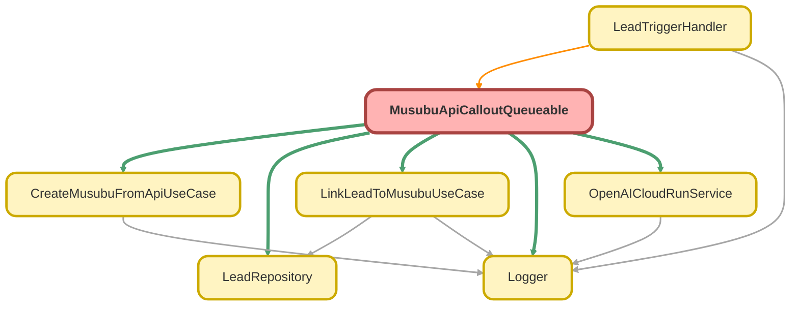

---
hide:
  - path
---

# MusubuApiCalloutQueueable Class

結ぶ法人情報 API コールアウト Queueable

**Implements**

Queueable, 
Database.AllowsCallouts

## Class Diagram



<!-- Apex description -->

## Apex Code

```java
/**
 * 結ぶ法人情報 API コールアウト Queueable
 *
 * @description リードの法人情報を外部 API から取得し、結ぶ法人情報を作成・紐付けする。
 *              トリガーからの非同期コールアウトに使用。
 */
public with sharing class MusubuApiCalloutQueueable implements Queueable, Database.AllowsCallouts {

    private static final Integer MAX_RETRY_COUNT = 3;

    private final Set<Id> leadIds;
    private final Integer retryCount;
    private final LeadRepository leadRepo;

    /**
     * コンストラクタ
     *
     * @param leadIds 処理対象のリード ID
     */
    public MusubuApiCalloutQueueable(Set<Id> leadIds) {
        this(leadIds, 0, new LeadRepository());
    }

    /**
     * リトライ用コンストラクタ
     *
     * @param leadIds 処理対象のリード ID
     * @param retryCount 現在のリトライ回数
     */
    @TestVisible
    private MusubuApiCalloutQueueable(Set<Id> leadIds, Integer retryCount) {
        this(leadIds, retryCount, new LeadRepository());
    }

    /**
     * テスト用コンストラクタ（DI）
     *
     * @param leadIds 処理対象のリード ID
     * @param retryCount 現在のリトライ回数
     * @param leadRepo Lead リポジトリ
     */
    @TestVisible
    private MusubuApiCalloutQueueable(Set<Id> leadIds, Integer retryCount, LeadRepository leadRepo) {
        this.leadIds = leadIds;
        this.retryCount = retryCount;
        this.leadRepo = leadRepo;
    }

    /**
     * Queueable 実行メソッド
     *
     * @param context Queueable コンテキスト
     */
    public void execute(QueueableContext context) {
        Logger.info('MusubuApiCalloutQueueable を開始します - jobId: ' + context.getJobId() + ', leadCount: ' + this.leadIds.size() + ', retryCount: ' + this.retryCount);

        OpenAICloudRunService apiService = new OpenAICloudRunService();
        CreateMusubuFromApiUseCase createUseCase = new CreateMusubuFromApiUseCase();
        LinkLeadToMusubuUseCase linkUseCase = new LinkLeadToMusubuUseCase();

        Set<Id> failedLeadIds = new Set<Id>();

        try {
            // 1. リードを取得（Repository 経由）
            List<Lead> leads = this.leadRepo.findForApiCallout(this.leadIds);

            if (leads.isEmpty()) {
                Logger.info('処理対象のリードがありません');
                return;
            }

            // 2. 各リードに対して API 呼び出しと紐付けを実行
            for (Lead lead : leads) {
                try {
                    processLead(lead, apiService, createUseCase, linkUseCase);
                } catch (Exception e) {
                    Logger.error('リードの処理に失敗しました - leadId: ' + lead.Id, e);
                    failedLeadIds.add(lead.Id);
                }
            }

            // 3. 失敗したリードがあればリトライ
            if (!failedLeadIds.isEmpty() && this.retryCount < MAX_RETRY_COUNT) {
                Logger.info('失敗したリードをリトライします - failedCount: ' + failedLeadIds.size() + ', nextRetryCount: ' + (this.retryCount + 1));

                if (!Test.isRunningTest()) {
                    System.enqueueJob(new MusubuApiCalloutQueueable(failedLeadIds, this.retryCount + 1));
                }
            }

            Logger.info('MusubuApiCalloutQueueable が完了しました - processedCount: ' + leads.size() + ', failedCount: ' + failedLeadIds.size());

        } catch (Exception e) {
            Logger.error('MusubuApiCalloutQueueable でエラーが発生しました', e);

        } finally {
            Logger.saveLog();
        }
    }

    /**
     * 個別のリードを処理する
     *
     * @param lead 処理対象のリード
     * @param apiService API サービス
     * @param createUseCase 作成ユースケース
     * @param linkUseCase 紐付けユースケース
     */
    private void processLead(
        Lead lead,
        OpenAICloudRunService apiService,
        CreateMusubuFromApiUseCase createUseCase,
        LinkLeadToMusubuUseCase linkUseCase
    ) {
        Logger.debug('リードを処理します - leadId: ' + lead.Id);

        // 1. API リクエストを作成
        OpenAICloudRunService.CompanySearchRequest searchRequest = new OpenAICloudRunService.CompanySearchRequest();
        searchRequest.companyName = lead.Company;
        searchRequest.corporateNumber = lead.CorporateNumber__c;
        searchRequest.phone = lead.Phone;
        searchRequest.website = lead.Website;
        searchRequest.address = buildAddress(lead);

        // 2. API を呼び出し
        OpenAICloudRunService.CompanySearchResponse searchResponse = apiService.searchCompany(searchRequest);

        if (searchResponse == null || !searchResponse.found) {
            Logger.info('法人情報が見つかりませんでした - leadId: ' + lead.Id);
            return;
        }

        // 3. 結ぶ法人情報を作成
        CreateMusubuFromApiUseCase.CompanyApiResponse apiResponse = convertToApiResponse(searchResponse);
        CreateMusubuFromApiUseCase.CreateResult createResult = createUseCase.invoke(apiResponse);

        // 4. リードに紐付け
        LinkLeadToMusubuUseCase.LinkRequest linkRequest = new LinkLeadToMusubuUseCase.LinkRequest();
        linkRequest.leadId = lead.Id;
        linkRequest.musubuCompanyId = createResult.company.Id;
        linkUseCase.invoke(linkRequest);

        Logger.info('リードの処理が完了しました - leadId: ' + lead.Id + ', musubuCompanyId: ' + createResult.company.Id);
    }

    /**
     * 住所を結合する
     *
     * @param lead リード
     * @return 結合された住所
     */
    private String buildAddress(Lead lead) {
        List<String> parts = new List<String>();
        if (String.isNotBlank(lead.State)) {
            parts.add(lead.State);
        }
        if (String.isNotBlank(lead.City)) {
            parts.add(lead.City);
        }
        if (String.isNotBlank(lead.Street)) {
            parts.add(lead.Street);
        }
        return String.join(parts, '');
    }

    /**
     * API レスポンスを UseCase 用の形式に変換する
     *
     * @param searchResponse API レスポンス
     * @return UseCase 用 API レスポンス
     */
    private CreateMusubuFromApiUseCase.CompanyApiResponse convertToApiResponse(
        OpenAICloudRunService.CompanySearchResponse searchResponse
    ) {
        CreateMusubuFromApiUseCase.CompanyApiResponse apiResponse = new CreateMusubuFromApiUseCase.CompanyApiResponse();
        apiResponse.corporateNumber = searchResponse.corporateNumber;
        apiResponse.companyName = searchResponse.companyName;
        apiResponse.address = searchResponse.address;
        apiResponse.postalCode = searchResponse.postalCode;
        apiResponse.prefecture = searchResponse.prefecture;
        apiResponse.city = searchResponse.city;
        apiResponse.industry = searchResponse.industry;
        apiResponse.employeeCount = searchResponse.employeeCount;
        apiResponse.capital = searchResponse.capital;
        apiResponse.establishedDate = searchResponse.establishedDate;
        apiResponse.website = searchResponse.website;
        apiResponse.phone = searchResponse.phone;
        apiResponse.dataSource = 'OpenAI Cloud Run API';
        return apiResponse;
    }
}
```

## Fields
### `MAX_RETRY_COUNT`

#### Signature
```apex
private static final MAX_RETRY_COUNT
```

#### Type
Integer

---

### `leadIds`

#### Signature
```apex
private final leadIds
```

#### Type
Set<Id>

---

### `retryCount`

#### Signature
```apex
private final retryCount
```

#### Type
Integer

---

### `leadRepo`

#### Signature
```apex
private final leadRepo
```

#### Type
[LeadRepository](LeadRepository.md)

## Constructors
### `MusubuApiCalloutQueueable(leadIds)`

コンストラクタ

#### Signature
```apex
public MusubuApiCalloutQueueable(Set<Id> leadIds)
```

#### Parameters
| Name | Type | Description |
|------|------|-------------|
| leadIds | Set<Id> | 処理対象のリード ID |

---

### `MusubuApiCalloutQueueable(leadIds, retryCount)`

`TESTVISIBLE`

リトライ用コンストラクタ

#### Signature
```apex
private MusubuApiCalloutQueueable(Set<Id> leadIds, Integer retryCount)
```

#### Parameters
| Name | Type | Description |
|------|------|-------------|
| leadIds | Set<Id> | 処理対象のリード ID |
| retryCount | Integer | 現在のリトライ回数 |

---

### `MusubuApiCalloutQueueable(leadIds, retryCount, leadRepo)`

`TESTVISIBLE`

テスト用コンストラクタ（DI）

#### Signature
```apex
private MusubuApiCalloutQueueable(Set<Id> leadIds, Integer retryCount, LeadRepository leadRepo)
```

#### Parameters
| Name | Type | Description |
|------|------|-------------|
| leadIds | Set<Id> | 処理対象のリード ID |
| retryCount | Integer | 現在のリトライ回数 |
| leadRepo | [LeadRepository](LeadRepository.md) | Lead リポジトリ |

## Methods
### `execute(context)`

Queueable 実行メソッド

#### Signature
```apex
public void execute(QueueableContext context)
```

#### Parameters
| Name | Type | Description |
|------|------|-------------|
| context | QueueableContext | Queueable コンテキスト |

#### Return Type
**void**

---

### `processLead(lead, apiService, createUseCase, linkUseCase)`

個別のリードを処理する

#### Signature
```apex
private void processLead(Lead lead, OpenAICloudRunService apiService, CreateMusubuFromApiUseCase createUseCase, LinkLeadToMusubuUseCase linkUseCase)
```

#### Parameters
| Name | Type | Description |
|------|------|-------------|
| lead | [Lead](../objects/Lead.md) | 処理対象のリード |
| apiService | [OpenAICloudRunService](OpenAICloudRunService.md) | API サービス |
| createUseCase | [CreateMusubuFromApiUseCase](CreateMusubuFromApiUseCase.md) | 作成ユースケース |
| linkUseCase | [LinkLeadToMusubuUseCase](LinkLeadToMusubuUseCase.md) | 紐付けユースケース |

#### Return Type
**void**

---

### `buildAddress(lead)`

住所を結合する

#### Signature
```apex
private String buildAddress(Lead lead)
```

#### Parameters
| Name | Type | Description |
|------|------|-------------|
| lead | [Lead](../objects/Lead.md) | リード |

#### Return Type
**String**

結合された住所

---

### `convertToApiResponse(searchResponse)`

API レスポンスを UseCase 用の形式に変換する

#### Signature
```apex
private CreateMusubuFromApiUseCase.CompanyApiResponse convertToApiResponse(OpenAICloudRunService.CompanySearchResponse searchResponse)
```

#### Parameters
| Name | Type | Description |
|------|------|-------------|
| searchResponse | OpenAICloudRunService.CompanySearchResponse | API レスポンス |

#### Return Type
**CreateMusubuFromApiUseCase.CompanyApiResponse**

UseCase 用 API レスポンス