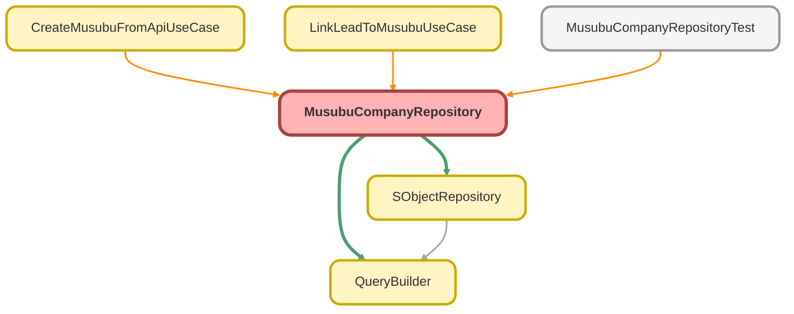

---
hide:
  - path
---

# MusubuCompanyRepository Class

MusubuCompany__c リポジトリクラス

**Inheritance**

[SObjectRepository](SObjectRepository.md)

## Class Diagram



<!-- Apex description -->

## Apex Code

```java
/**
 * MusubuCompany__c リポジトリクラス
 *
 * @description 結ぶ法人情報オブジェクト用のリポジトリ。
 *              QueryBuilder を使用した型安全なクエリを提供します。
 */
public with sharing class MusubuCompanyRepository extends SObjectRepository {

    /**
     * コンストラクタ
     */
    public MusubuCompanyRepository() {
        super(MusubuCompany__c.SObjectType);
    }

    /**
     * デフォルトで取得するフィールドを返す
     *
     * @return フィールド名のリスト
     */
    protected override List<String> getDefaultFields() {
        return new List<String>{
            'Id',
            'Name',
            'CorporateNumber__c',
            'Address__c',
            'Industry__c'
        };
    }

    /**
     * ID で結ぶ法人情報を検索
     *
     * @param recordId レコード ID
     * @return MusubuCompany__c レコード（なければ null）
     */
    public override SObject findById(Id recordId) {
        return super.findById(recordId);
    }

    /**
     * 複数の ID で結ぶ法人情報を検索
     *
     * @param recordIds レコード ID のセット
     * @return MusubuCompany__c のリスト
     */
    public override List<SObject> findByIds(Set<Id> recordIds) {
        return super.findByIds(recordIds);
    }

    /**
     * ID で結ぶ法人情報を検索（型付き）
     *
     * @param recordId レコード ID
     * @return MusubuCompany__c レコード（なければ null）
     */
    public MusubuCompany__c findCompanyById(Id recordId) {
        return (MusubuCompany__c) super.findById(recordId);
    }

    /**
     * 複数の ID で結ぶ法人情報を検索（型付き）
     *
     * @param recordIds レコード ID のセット
     * @return MusubuCompany__c のリスト
     */
    public List<MusubuCompany__c> findCompaniesByIds(Set<Id> recordIds) {
        List<SObject> results = super.findByIds(recordIds);
        List<MusubuCompany__c> companies = new List<MusubuCompany__c>();
        for (SObject record : results) {
            companies.add((MusubuCompany__c) record);
        }
        return companies;
    }

    /**
     * 法人番号で結ぶ法人情報を検索
     *
     * @param corporateNumber 法人番号
     * @return MusubuCompany__c レコード（なければ null）
     */
    public MusubuCompany__c findByCorporateNumber(String corporateNumber) {
        return (MusubuCompany__c) query()
            .selectFields(getDefaultFields())
            .whereEqual('CorporateNumber__c', corporateNumber)
            .first();
    }

    /**
     * 複数の法人番号で結ぶ法人情報を検索
     *
     * @param corporateNumbers 法人番号のセット
     * @return MusubuCompany__c のリスト
     */
    public List<MusubuCompany__c> findByCorporateNumbers(Set<String> corporateNumbers) {
        return (List<MusubuCompany__c>) query()
            .selectFields(getDefaultFields())
            .whereInStrings('CorporateNumber__c', corporateNumbers)
            .get();
    }

    /**
     * 法人番号で結ぶ法人情報を Map で取得
     *
     * @param corporateNumbers 法人番号のセット
     * @return 法人番号 → MusubuCompany__c の Map
     */
    public Map<String, MusubuCompany__c> findByCorporateNumbersAsMap(Set<String> corporateNumbers) {
        Map<String, MusubuCompany__c> resultMap = new Map<String, MusubuCompany__c>();
        for (MusubuCompany__c company : findByCorporateNumbers(corporateNumbers)) {
            resultMap.put(company.CorporateNumber__c, company);
        }
        return resultMap;
    }

    /**
     * 全フィールドを取得する詳細検索
     *
     * @param recordId レコード ID
     * @return MusubuCompany__c レコード（なければ null）
     */
    public MusubuCompany__c findCompanyByIdWithAllFields(Id recordId) {
        return (MusubuCompany__c) query()
            .selectFields(getAllFields())
            .whereEqual('Id', recordId)
            .first();
    }

    /**
     * 全フィールドのリストを取得
     *
     * @return 全フィールド名のリスト
     */
    private List<String> getAllFields() {
        return new List<String>{
            'Id',
            'Name',
            'CorporateNumber__c',
            'Address__c',
            'PostalCode__c',
            'Prefecture__c',
            'City__c',
            'Industry__c',
            'EmployeeCount__c',
            'Capital__c',
            'EstablishedDate__c',
            'Website__c',
            'Phone__c',
            'DataSource__c',
            'LastApiSyncDate__c'
        };
    }
}
```

## Constructors
### `MusubuCompanyRepository()`

コンストラクタ

#### Signature
```apex
public MusubuCompanyRepository()
```

## Methods
### `findById(recordId)`

ID で結ぶ法人情報を検索

#### Signature
```apex
public override SObject findById(Id recordId)
```

#### Parameters
| Name | Type | Description |
|------|------|-------------|
| recordId | Id | レコード ID |

#### Return Type
**SObject**

MusubuCompany__c レコード（なければ null）

---

### `findByIds(recordIds)`

複数の ID で結ぶ法人情報を検索

#### Signature
```apex
public override List<SObject> findByIds(Set<Id> recordIds)
```

#### Parameters
| Name | Type | Description |
|------|------|-------------|
| recordIds | Set<Id> | レコード ID のセット |

#### Return Type
**List<SObject>**

MusubuCompany__c のリスト

---

### `findCompanyById(recordId)`

ID で結ぶ法人情報を検索（型付き）

#### Signature
```apex
public MusubuCompany__c findCompanyById(Id recordId)
```

#### Parameters
| Name | Type | Description |
|------|------|-------------|
| recordId | Id | レコード ID |

#### Return Type
**[MusubuCompany__c](../objects/MusubuCompany__c.md)**

MusubuCompany__c レコード（なければ null）

---

### `findCompaniesByIds(recordIds)`

複数の ID で結ぶ法人情報を検索（型付き）

#### Signature
```apex
public List<MusubuCompany__c> findCompaniesByIds(Set<Id> recordIds)
```

#### Parameters
| Name | Type | Description |
|------|------|-------------|
| recordIds | Set<Id> | レコード ID のセット |

#### Return Type
**List<MusubuCompany__c>**

MusubuCompany__c のリスト

---

### `findByCorporateNumber(corporateNumber)`

法人番号で結ぶ法人情報を検索

#### Signature
```apex
public MusubuCompany__c findByCorporateNumber(String corporateNumber)
```

#### Parameters
| Name | Type | Description |
|------|------|-------------|
| corporateNumber | String | 法人番号 |

#### Return Type
**[MusubuCompany__c](../objects/MusubuCompany__c.md)**

MusubuCompany__c レコード（なければ null）

---

### `findByCorporateNumbers(corporateNumbers)`

複数の法人番号で結ぶ法人情報を検索

#### Signature
```apex
public List<MusubuCompany__c> findByCorporateNumbers(Set<String> corporateNumbers)
```

#### Parameters
| Name | Type | Description |
|------|------|-------------|
| corporateNumbers | Set<String> | 法人番号のセット |

#### Return Type
**List<MusubuCompany__c>**

MusubuCompany__c のリスト

---

### `findByCorporateNumbersAsMap(corporateNumbers)`

法人番号で結ぶ法人情報を Map で取得

#### Signature
```apex
public Map<String,MusubuCompany__c> findByCorporateNumbersAsMap(Set<String> corporateNumbers)
```

#### Parameters
| Name | Type | Description |
|------|------|-------------|
| corporateNumbers | Set<String> | 法人番号のセット |

#### Return Type
**Map<String,MusubuCompany__c>**

法人番号 → MusubuCompany__c の Map

---

### `findCompanyByIdWithAllFields(recordId)`

全フィールドを取得する詳細検索

#### Signature
```apex
public MusubuCompany__c findCompanyByIdWithAllFields(Id recordId)
```

#### Parameters
| Name | Type | Description |
|------|------|-------------|
| recordId | Id | レコード ID |

#### Return Type
**[MusubuCompany__c](../objects/MusubuCompany__c.md)**

MusubuCompany__c レコード（なければ null）

---

### `getAllFields()`

全フィールドのリストを取得

#### Signature
```apex
private List<String> getAllFields()
```

#### Return Type
**List<String>**

全フィールド名のリスト