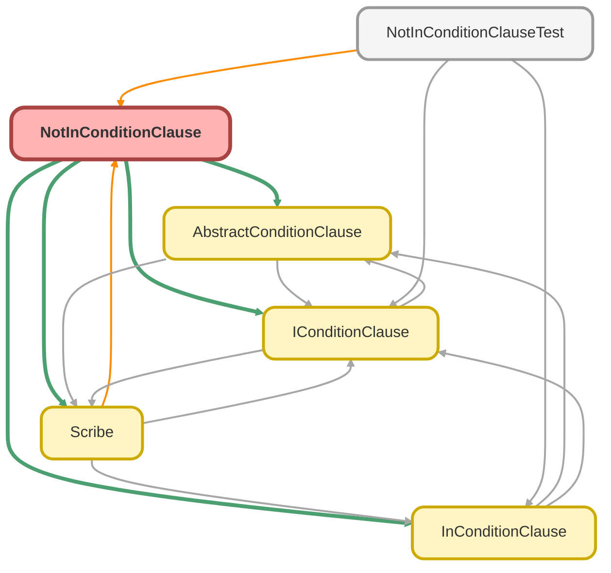

---
hide:
  - path
---

# NotInConditionClause Class

A concrete implementation of `AbstractConditionClause` that builds a 
SOQL `NOT IN` condition. 
 
This class handles both `List` and `Set<Id>` collections, formatting each value 
into a comma-separated list suitable for the `NOT IN` clause. It correctly handles 
null values within the collection by converting them to the `NULL` literal. 
 
A key feature is its graceful handling of empty lists: instead of causing a SOQL 
error, it returns an empty string, which causes the Scribe builder to ignore the 
condition entirely.

**See** [IConditionClause](IConditionClause.md)

**See** [AbstractConditionClause](AbstractConditionClause.md)

**Inheritance**

[AbstractConditionClause](AbstractConditionClause.md)

## Class Diagram



<!-- Apex description -->

## Apex Code

```java
/**
 * Copyright 2025 Hiroyuki Matsuoka
 *
 * Licensed under the Apache License, Version 2.0 (the "License");
 * you may not use this file except in compliance with the License.
 * You may obtain a copy of the License at
 *
 * http://www.apache.org/licenses/LICENSE-2.0
 *
 * Unless required by applicable law or agreed to in writing, software
 * distributed under the License is distributed on an "AS IS" BASIS,
 * WITHOUT WARRANTIES OR CONDITIONS OF ANY KIND, either express or implied.
 * See the License for the specific language governing permissions and
 * limitations under the License.
 */

/**
 * @description A concrete implementation of `AbstractConditionClause` that builds a
 * SOQL `NOT IN` condition.
 *
 * This class handles both `List` and `Set<Id>` collections, formatting each value
 * into a comma-separated list suitable for the `NOT IN` clause. It correctly handles
 * null values within the collection by converting them to the `NULL` literal.
 *
 * A key feature is its graceful handling of empty lists: instead of causing a SOQL
 * error, it returns an empty string, which causes the Scribe builder to ignore the
 * condition entirely.
 * @see IConditionClause
 * @see AbstractConditionClause
 */
public with sharing class NotInConditionClause extends AbstractConditionClause {
  private final List<Object> values;

  /**
   * Constructor for NotInConditionClause.
   *
   * @param sObjectType The SObject type for the condition.
   * @param fieldMap A map of field names to SObjectField tokens.
   * @param field The field name to apply the NotIN condition on.
   * @param values A list or set of values for the NotIN condition.
   */
  public NotInConditionClause(
    Schema.SObjectType sObjectType,
    Map<String, Schema.SObjectField> fieldMap,
    String field,
    Object values
  ) {
    super(sObjectType, fieldMap, field);
    if (values instanceof Set<Id>) {
      this.values = new List<Id>((Set<Id>) values);
    } else {
      this.values = (List<Object>) values;
    }
  }

  /**
   * @inheritdoc
   */
  public override String build() {
    if (this.values.isEmpty()) {
      return '';
    }
    return String.format('{0} NOT IN ({1})', new List<String>{ this.field, this.checkAndCast() });
  }

  /**
   * @inheritdoc
   */
  public override IConditionClause overrideMetaData(
    Schema.SObjectType sObjectType,
    Map<String, Schema.SObjectField> fieldMap
  ) {
    return new NotInConditionClause(sObjectType, fieldMap, this.field, this.values);
  }

  /**
   * @inheritdoc
   */
  public override IConditionClause overrideField(String field) {
    return new NotInConditionClause(this.sObjectType, this.fieldMap, field, this.values);
  }

  /**
   * check the value type and cast it to string for SOQL
   *
   * @return The value formatted as a SOQL-compatible string.
   */
  private String checkAndCast() {
    Schema.DisplayType fieldType = this.getFieldType(field);
    List<String> castedValues = new List<String>();
    for (Object value : this.values) {
      if (value == null) {
        castedValues.add('NULL');
        continue;
      }
      String valueString = this.formatAndCastToString(value);
      if (this.TYPES_REQUIRING_SINGLE_QUOTES.contains(fieldType)) {
        castedValues.add('\'' + valueString + '\'');
      } else {
        castedValues.add(valueString);
      }
    }

    return String.join(castedValues, ', ');
  }
}
```

## Fields
### `values`

#### Signature
```apex
private final values
```

#### Type
List<Object>

## Constructors
### `NotInConditionClause(sObjectType, fieldMap, field, values)`

Constructor for NotInConditionClause.

#### Signature
```apex
public NotInConditionClause(Schema.SObjectType sObjectType, Map<String,Schema.SObjectField> fieldMap, String field, Object values)
```

#### Parameters
| Name | Type | Description |
|------|------|-------------|
| sObjectType | Schema.SObjectType | The SObject type for the condition. |
| fieldMap | Map<String,Schema.SObjectField> | A map of field names to SObjectField tokens. |
| field | String | The field name to apply the NotIN condition on. |
| values | Object | A list or set of values for the NotIN condition. |

## Methods
### `build()`

**Inheritdoc**

#### Signature
```apex
public override String build()
```

#### Return Type
**String**

---

### `overrideMetaData(sObjectType, fieldMap)`

**Inheritdoc**

#### Signature
```apex
public override IConditionClause overrideMetaData(Schema.SObjectType sObjectType, Map<String,Schema.SObjectField> fieldMap)
```

#### Parameters
| Name | Type | Description |
|------|------|-------------|
| sObjectType | Schema.SObjectType |  |
| fieldMap | Map<String,Schema.SObjectField> |  |

#### Return Type
**[IConditionClause](IConditionClause.md)**

---

### `overrideField(field)`

**Inheritdoc**

#### Signature
```apex
public override IConditionClause overrideField(String field)
```

#### Parameters
| Name | Type | Description |
|------|------|-------------|
| field | String |  |

#### Return Type
**[IConditionClause](IConditionClause.md)**

---

### `checkAndCast()`

check the value type and cast it to string for SOQL

#### Signature
```apex
private String checkAndCast()
```

#### Return Type
**String**

The value formatted as a SOQL-compatible string.

---

### `getFieldName()`

*Inherited*

**InheritDoc**

#### Signature
```apex
public String getFieldName()
```

#### Return Type
**String**