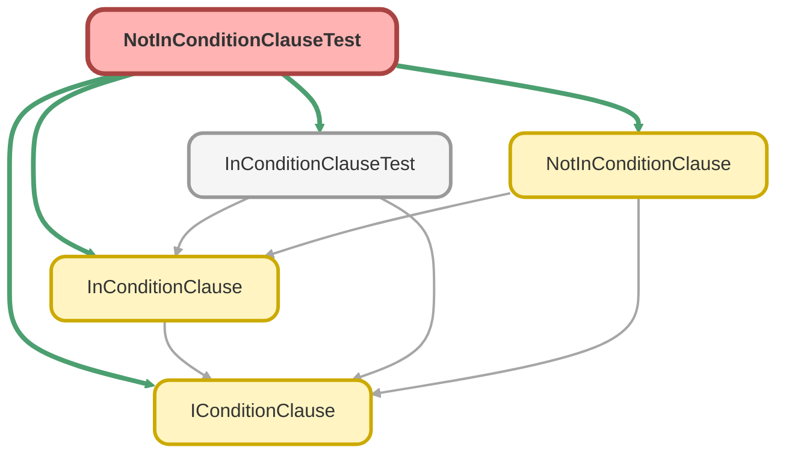

---
hide:
  - path
---

# NotInConditionClauseTest Class

`ISTEST`

Copyright 2025 Hiroyuki Matsuoka 
 
Licensed under the Apache License, Version 2.0 (the &quot;License&quot;); 
you may not use this file except in compliance with the License. 
You may obtain a copy of the License at 
 
http://www.apache.org/licenses/LICENSE-2.0 
 
Unless required by applicable law or agreed to in writing, software 
distributed under the License is distributed on an &quot;AS IS&quot; BASIS, 
WITHOUT WARRANTIES OR CONDITIONS OF ANY KIND, either express or implied. 
See the License for the specific language governing permissions and 
limitations under the License.

## Class Diagram



<!-- Apex description -->

## Apex Code

```java
/**
 * Copyright 2025 Hiroyuki Matsuoka
 *
 * Licensed under the Apache License, Version 2.0 (the "License");
 * you may not use this file except in compliance with the License.
 * You may obtain a copy of the License at
 *
 * http://www.apache.org/licenses/LICENSE-2.0
 *
 * Unless required by applicable law or agreed to in writing, software
 * distributed under the License is distributed on an "AS IS" BASIS,
 * WITHOUT WARRANTIES OR CONDITIONS OF ANY KIND, either express or implied.
 * See the License for the specific language governing permissions and
 * limitations under the License.
 */
@isTest
public class NotInConditionClauseTest {
  @isTest
  static void testBuild_WhenValueIsStringList_ThenReturnsNotInClauseWithQuotes() {
    // Arrange
    Schema.SObjectType sObjectType = Account.getSObjectType();
    Map<String, Schema.SObjectField> fieldMap = sObjectType.getDescribe().fields.getMap();
    List<String> names = new List<String>{ 'Corp A', 'Corp B' };
    IConditionClause clause = new NotInConditionClause(sObjectType, fieldMap, 'Name', names);

    // Act
    String result = clause.build();

    // Assert
    String expected = 'Name NOT IN (\'Corp A\', \'Corp B\')';
    Assert.areEqual(expected, result, 'String values should be quoted and comma-separated.');
  }

  @isTest
  static void testBuild_WhenValueIsIdSet_ThenReturnsNotInClauseWithQuotes() {
    // Arrange
    Schema.SObjectType sObjectType = Account.getSObjectType();
    Map<String, Schema.SObjectField> fieldMap = sObjectType.getDescribe().fields.getMap();
    Set<Id> accountIds = new Set<Id>{ '001xx0000000001AAA', '001xx0000000002AAA' };
    IConditionClause clause = new NotInConditionClause(sObjectType, fieldMap, 'Id', accountIds);

    // Act
    String result = clause.build();

    // Assert
    // The order might vary with a Set, so we check for presence instead of exact match.
    Assert.isTrue(result.startsWith('Id NOT IN ('), 'Clause should start with NOT IN operator.');
    Assert.isTrue(result.contains('\'001xx0000000001AAA\''), 'Clause should contain the first Id.');
    Assert.isTrue(result.contains('\'001xx0000000002AAA\''), 'Clause should contain the second Id.');
  }

  @isTest
  static void testBuild_WhenValueIsIntegerList_ThenReturnsNotInClauseWithoutQuotes() {
    // Arrange
    Schema.SObjectType sObjectType = Account.getSObjectType();
    Map<String, Schema.SObjectField> fieldMap = sObjectType.getDescribe().fields.getMap();
    List<Integer> employees = new List<Integer>{ 100, 200 };
    IConditionClause clause = new NotInConditionClause(sObjectType, fieldMap, 'NumberOfEmployees', employees);

    // Act
    String result = clause.build();

    // Assert
    String expected = 'NumberOfEmployees NOT IN (100, 200)';
    Assert.areEqual(expected, result, 'Integer values should not be quoted.');
  }

  @isTest
  static void testBuild_WhenListContainsNull_ThenReturnsNotInClauseWithNullLiteral() {
    // Arrange
    Schema.SObjectType sObjectType = Account.getSObjectType();
    Map<String, Schema.SObjectField> fieldMap = sObjectType.getDescribe().fields.getMap();
    List<String> names = new List<String>{ 'Corp A', null };
    IConditionClause clause = new NotInConditionClause(sObjectType, fieldMap, 'Name', names);

    // Act
    String result = clause.build();

    // Assert
    String expected = 'Name NOT IN (\'Corp A\', NULL)';
    Assert.areEqual(expected, result, 'Null values in the list should be converted to NULL literals.');
  }

  @isTest
  static void testBuild_WhenListIsEmpty_ThenReturnsEmptyString() {
    // Arrange
    Schema.SObjectType sObjectType = Account.getSObjectType();
    Map<String, Schema.SObjectField> fieldMap = sObjectType.getDescribe().fields.getMap();
    List<String> names = new List<String>();
    IConditionClause clause = new NotInConditionClause(sObjectType, fieldMap, 'Name', names);

    // Act
    String result = clause.build();

    // Assert
    Assert.areEqual(
      '',
      result,
      'An empty NOT IN list should result in an empty string to be ignored by the builder.'
    );
  }

  @isTest
  static void testImmutability_WhenOverrideMetaData_ThenReturnsNewInstance() {
    // Arrange
    Schema.SObjectType accountSObjectType = Account.getSObjectType();
    Map<String, Schema.SObjectField> accountFieldMap = accountSObjectType.getDescribe().fields.getMap();
    List<String> values = new List<String>{ 'Value1' };
    IConditionClause originalClause = new NotInConditionClause(
      accountSObjectType,
      accountFieldMap,
      'Name',
      values
    );

    // Act
    Schema.SObjectType oppSObjectType = Opportunity.getSObjectType();
    Map<String, Schema.SObjectField> oppFieldMap = oppSObjectType.getDescribe().fields.getMap();
    IConditionClause newClause = originalClause.overrideMetaData(oppSObjectType, oppFieldMap);

    // Assert
    Assert.areNotEqual(originalClause, newClause, 'A new instance should be returned.');
    Assert.areEqual(
      'Name NOT IN (\'Value1\')',
      originalClause.build(),
      'Original instance should not be modified.'
    );
  }

  @isTest
  static void testImmutability_WhenOverrideField_ThenReturnsNewInstanceWithNewField() {
    // Arrange
    Schema.SObjectType sObjectType = Account.getSObjectType();
    Map<String, Schema.SObjectField> fieldMap = sObjectType.getDescribe().fields.getMap();
    List<String> values = new List<String>{ 'Tech', 'Finance' };
    IConditionClause originalClause = new NotInConditionClause(sObjectType, fieldMap, 'Type', values);

    // Act
    IConditionClause newClause = originalClause.overrideField('Industry');

    // Assert
    Assert.areNotEqual(originalClause, newClause, 'A new instance should be returned.');
    Assert.areEqual(
      'Type NOT IN (\'Tech\', \'Finance\')',
      originalClause.build(),
      'Original instance should not be modified.'
    );
    Assert.areEqual(
      'Industry NOT IN (\'Tech\', \'Finance\')',
      newClause.build(),
      'New instance should reflect the overridden field name.'
    );
  }
}
```

## Methods
### `testBuild_WhenValueIsStringList_ThenReturnsNotInClauseWithQuotes()`

`ISTEST`

#### Signature
```apex
private static void testBuild_WhenValueIsStringList_ThenReturnsNotInClauseWithQuotes()
```

#### Return Type
**void**

---

### `testBuild_WhenValueIsIdSet_ThenReturnsNotInClauseWithQuotes()`

`ISTEST`

#### Signature
```apex
private static void testBuild_WhenValueIsIdSet_ThenReturnsNotInClauseWithQuotes()
```

#### Return Type
**void**

---

### `testBuild_WhenValueIsIntegerList_ThenReturnsNotInClauseWithoutQuotes()`

`ISTEST`

#### Signature
```apex
private static void testBuild_WhenValueIsIntegerList_ThenReturnsNotInClauseWithoutQuotes()
```

#### Return Type
**void**

---

### `testBuild_WhenListContainsNull_ThenReturnsNotInClauseWithNullLiteral()`

`ISTEST`

#### Signature
```apex
private static void testBuild_WhenListContainsNull_ThenReturnsNotInClauseWithNullLiteral()
```

#### Return Type
**void**

---

### `testBuild_WhenListIsEmpty_ThenReturnsEmptyString()`

`ISTEST`

#### Signature
```apex
private static void testBuild_WhenListIsEmpty_ThenReturnsEmptyString()
```

#### Return Type
**void**

---

### `testImmutability_WhenOverrideMetaData_ThenReturnsNewInstance()`

`ISTEST`

#### Signature
```apex
private static void testImmutability_WhenOverrideMetaData_ThenReturnsNewInstance()
```

#### Return Type
**void**

---

### `testImmutability_WhenOverrideField_ThenReturnsNewInstanceWithNewField()`

`ISTEST`

#### Signature
```apex
private static void testImmutability_WhenOverrideField_ThenReturnsNewInstanceWithNewField()
```

#### Return Type
**void**