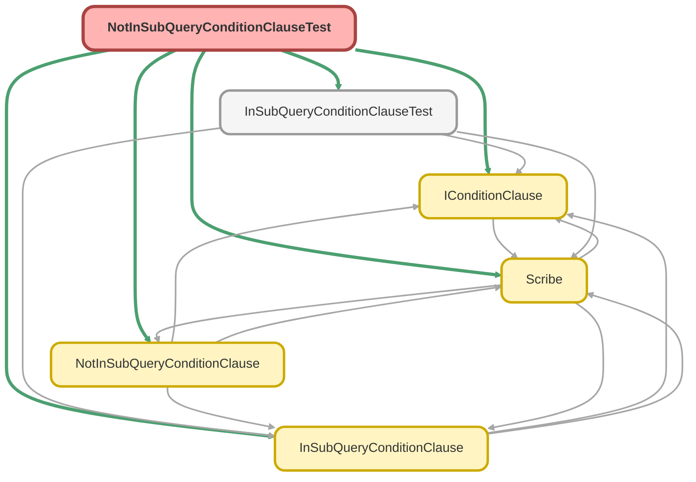

---
hide:
  - path
---

# NotInSubQueryConditionClauseTest Class

`ISTEST`

Copyright 2025 Hiroyuki Matsuoka 
 
Licensed under the Apache License, Version 2.0 (the &quot;License&quot;); 
you may not use this file except in compliance with the License. 
You may obtain a copy of the License at 
 
http://www.apache.org/licenses/LICENSE-2.0 
 
Unless required by applicable law or agreed to in writing, software 
distributed under the License is distributed on an &quot;AS IS&quot; BASIS, 
WITHOUT WARRANTIES OR CONDITIONS OF ANY KIND, either express or implied. 
See the License for the specific language governing permissions and 
limitations under the License.

## Class Diagram



<!-- Apex description -->

## Apex Code

```java
/**
 * Copyright 2025 Hiroyuki Matsuoka
 *
 * Licensed under the Apache License, Version 2.0 (the "License");
 * you may not use this file except in compliance with the License.
 * You may obtain a copy of the License at
 *
 * http://www.apache.org/licenses/LICENSE-2.0
 *
 * Unless required by applicable law or agreed to in writing, software
 * distributed under the License is distributed on an "AS IS" BASIS,
 * WITHOUT WARRANTIES OR CONDITIONS OF ANY KIND, either express or implied.
 * See the License for the specific language governing permissions and
 * limitations under the License.
 */
@isTest
public class NotInSubQueryConditionClauseTest {
  @isTest
  static void testBuild_WhenSubQueryIsValid_ThenReturnsNotInSubQueryClause() {
    // Arrange
    Schema.SObjectType mainSObjectType = Opportunity.getSObjectType();
    Map<String, Schema.SObjectField> mainFieldMap = mainSObjectType.getDescribe().fields.getMap();

    // Create the Scribe instance for the subquery
    Scribe subQueryScribe = Scribe.source(Account.getSObjectType())
      .field('Id')
      .whereEqual('Industry', 'Technology');

    IConditionClause clause = new NotInSubQueryConditionClause(
      mainSObjectType,
      mainFieldMap,
      'AccountId',
      subQueryScribe
    );

    // Act
    String result = clause.build();

    // Assert
    String expected = 'AccountId NOT IN (SELECT id FROM Account WHERE Industry = \'Technology\')';
    Assert.areEqual(expected, result, 'The clause should correctly format the NOT IN subquery condition.');
  }

  @isTest
  static void testImmutability_WhenOverrideMetaData_ThenReturnsNewInstance() {
    // Arrange
    Scribe subQueryScribe = Scribe.source(Account.getSObjectType()).field('Id');
    Schema.SObjectType originalSObjectType = Opportunity.getSObjectType();
    Map<String, Schema.SObjectField> originalFieldMap = originalSObjectType.getDescribe().fields.getMap();

    IConditionClause originalClause = new NotInSubQueryConditionClause(
      originalSObjectType,
      originalFieldMap,
      'AccountId',
      subQueryScribe
    );

    // Act
    Schema.SObjectType newSObjectType = Contact.getSObjectType();
    Map<String, Schema.SObjectField> newFieldMap = newSObjectType.getDescribe().fields.getMap();
    IConditionClause newClause = originalClause.overrideMetaData(newSObjectType, newFieldMap);

    // Assert
    Assert.areNotEqual(originalClause, newClause, 'A new instance should be returned.');
    Assert.isTrue(
      originalClause.build().startsWith('AccountId NOT IN'),
      'Original instance should not be modified.'
    );
  }

  @isTest
  static void testImmutability_WhenOverrideField_ThenReturnsNewInstanceWithNewField() {
    // Arrange
    Scribe subQueryScribe = Scribe.source(Account.getSObjectType()).field('Id');
    Schema.SObjectType sObjectType = Opportunity.getSObjectType();
    Map<String, Schema.SObjectField> fieldMap = sObjectType.getDescribe().fields.getMap();

    IConditionClause originalClause = new NotInSubQueryConditionClause(
      sObjectType,
      fieldMap,
      'AccountId',
      subQueryScribe
    );

    // Act
    IConditionClause newClause = originalClause.overrideField('PrimaryPartnerAccountId');

    // Assert
    Assert.areNotEqual(originalClause, newClause, 'A new instance should be returned.');
    Assert.isTrue(
      originalClause.build().startsWith('AccountId NOT IN'),
      'Original instance should not be modified.'
    );
    Assert.isTrue(
      newClause.build().startsWith('PrimaryPartnerAccountId NOT IN'),
      'New instance should reflect the overridden field name.'
    );
  }
}
```

## Methods
### `testBuild_WhenSubQueryIsValid_ThenReturnsNotInSubQueryClause()`

`ISTEST`

#### Signature
```apex
private static void testBuild_WhenSubQueryIsValid_ThenReturnsNotInSubQueryClause()
```

#### Return Type
**void**

---

### `testImmutability_WhenOverrideMetaData_ThenReturnsNewInstance()`

`ISTEST`

#### Signature
```apex
private static void testImmutability_WhenOverrideMetaData_ThenReturnsNewInstance()
```

#### Return Type
**void**

---

### `testImmutability_WhenOverrideField_ThenReturnsNewInstanceWithNewField()`

`ISTEST`

#### Signature
```apex
private static void testImmutability_WhenOverrideField_ThenReturnsNewInstanceWithNewField()
```

#### Return Type
**void**