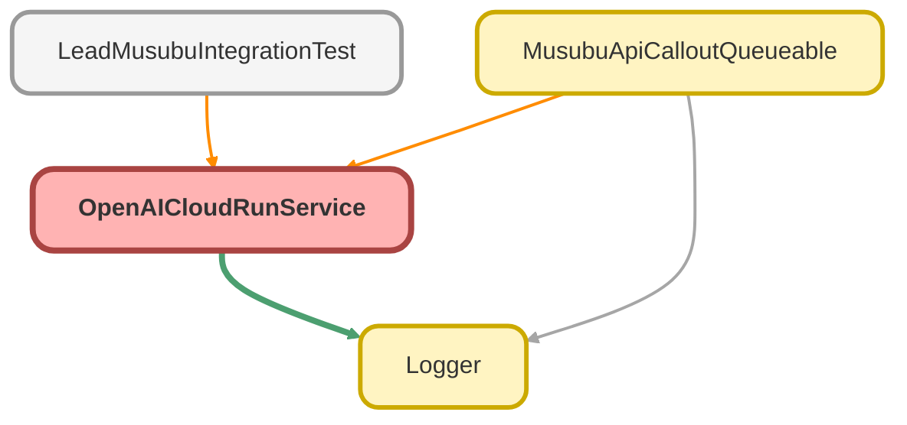

---
hide:
  - path
---

# OpenAICloudRunService Class

OpenAI Cloud Run API サービス

## Class Diagram



<!-- Apex description -->

## Apex Code

```java
/**
 * OpenAI Cloud Run API サービス
 *
 * @description 法人情報検索 API を呼び出すサービスクラス。
 *              Named Credential を使用して認証を行う。
 */
public with sharing class OpenAICloudRunService {

    private static final String NAMED_CREDENTIAL = 'callout:OpenAICloudRunLogin';
    private static final String SEARCH_ENDPOINT = '/api/v1/company/search';
    private static final Integer TIMEOUT_MS = 30000;

    /**
     * 法人情報を検索する
     *
     * @param request 検索リクエスト
     * @return 検索結果
     */
    public CompanySearchResponse searchCompany(CompanySearchRequest request) {
        Logger.info('OpenAICloudRunService.searchCompany を開始します - companyName: ' + request.companyName + ', corporateNumber: ' + request.corporateNumber);

        try {
            // 1. リクエストを作成
            HttpRequest httpRequest = buildSearchRequest(request);

            // 2. HTTP コールアウト
            Http http = new Http();
            HttpResponse httpResponse = http.send(httpRequest);

            // 3. レスポンスを処理
            return handleSearchResponse(httpResponse);

        } catch (CalloutException e) {
            Logger.error('API コールアウトに失敗しました', e);
            throw new OpenAICloudRunException('API 呼び出しに失敗しました', e);

        } finally {
            Logger.saveLog();
        }
    }

    /**
     * 検索リクエストを構築する
     *
     * @param request 検索リクエスト
     * @return HTTP リクエスト
     */
    private HttpRequest buildSearchRequest(CompanySearchRequest request) {
        HttpRequest httpRequest = new HttpRequest();
        httpRequest.setEndpoint(NAMED_CREDENTIAL + SEARCH_ENDPOINT);
        httpRequest.setMethod('POST');
        httpRequest.setHeader('Content-Type', 'application/json');
        httpRequest.setTimeout(TIMEOUT_MS);

        Map<String, Object> requestBody = new Map<String, Object>();

        if (String.isNotBlank(request.companyName)) {
            requestBody.put('company_name', request.companyName);
        }
        if (String.isNotBlank(request.corporateNumber)) {
            requestBody.put('corporate_number', request.corporateNumber);
        }
        if (String.isNotBlank(request.phone)) {
            requestBody.put('phone', request.phone);
        }
        if (String.isNotBlank(request.website)) {
            requestBody.put('website', request.website);
        }
        if (String.isNotBlank(request.address)) {
            requestBody.put('address', request.address);
        }

        httpRequest.setBody(JSON.serialize(requestBody));

        Logger.debug('API リクエストを構築しました - endpoint: ' + NAMED_CREDENTIAL + SEARCH_ENDPOINT);

        return httpRequest;
    }

    /**
     * 検索レスポンスを処理する
     *
     * @param httpResponse HTTP レスポンス
     * @return 検索結果
     */
    private CompanySearchResponse handleSearchResponse(HttpResponse httpResponse) {
        Integer statusCode = httpResponse.getStatusCode();
        String responseBody = httpResponse.getBody();

        Logger.debug('API レスポンスを受信しました - statusCode: ' + statusCode);

        // エラーレスポンスの処理
        if (statusCode != 200) {
            Logger.warn('API がエラーを返しました - statusCode: ' + statusCode);

            if (statusCode == 404) {
                // 見つからない場合は空のレスポンスを返す
                CompanySearchResponse notFoundResponse = new CompanySearchResponse();
                notFoundResponse.found = false;
                return notFoundResponse;
            }

            throw new OpenAICloudRunException('API エラー: ' + statusCode);
        }

        // レスポンスをパース
        try {
            Map<String, Object> responseMap = (Map<String, Object>) JSON.deserializeUntyped(responseBody);

            CompanySearchResponse response = new CompanySearchResponse();
            response.found = true;
            response.corporateNumber = (String) responseMap.get('corporate_number');
            response.companyName = (String) responseMap.get('company_name');
            response.address = (String) responseMap.get('address');
            response.postalCode = (String) responseMap.get('postal_code');
            response.prefecture = (String) responseMap.get('prefecture');
            response.city = (String) responseMap.get('city');
            response.industry = (String) responseMap.get('industry');
            response.website = (String) responseMap.get('website');
            response.phone = (String) responseMap.get('phone');

            Object employeeCountObj = responseMap.get('employee_count');
            if (employeeCountObj != null) {
                response.employeeCount = Integer.valueOf(employeeCountObj);
            }

            Object capitalObj = responseMap.get('capital');
            if (capitalObj != null) {
                response.capital = Decimal.valueOf(String.valueOf(capitalObj));
            }

            String establishedDateStr = (String) responseMap.get('established_date');
            if (String.isNotBlank(establishedDateStr)) {
                response.establishedDate = Date.valueOf(establishedDateStr);
            }

            Logger.info('法人情報を取得しました - corporateNumber: ' + response.corporateNumber + ', companyName: ' + response.companyName);

            return response;

        } catch (Exception e) {
            Logger.error('レスポンスのパースに失敗しました', e);
            throw new OpenAICloudRunException('レスポンスのパースに失敗しました', e);
        }
    }

    /**
     * 検索リクエスト
     */
    public class CompanySearchRequest {
        public String companyName;
        public String corporateNumber;
        public String phone;
        public String website;
        public String address;
    }

    /**
     * 検索レスポンス
     */
    public class CompanySearchResponse {
        public Boolean found;
        public String corporateNumber;
        public String companyName;
        public String address;
        public String postalCode;
        public String prefecture;
        public String city;
        public String industry;
        public Integer employeeCount;
        public Decimal capital;
        public Date establishedDate;
        public String website;
        public String phone;
    }

    /**
     * API エラー例外
     */
    public class OpenAICloudRunException extends Exception {}
}
```

## Fields
### `NAMED_CREDENTIAL`

#### Signature
```apex
private static final NAMED_CREDENTIAL
```

#### Type
String

---

### `SEARCH_ENDPOINT`

#### Signature
```apex
private static final SEARCH_ENDPOINT
```

#### Type
String

---

### `TIMEOUT_MS`

#### Signature
```apex
private static final TIMEOUT_MS
```

#### Type
Integer

## Methods
### `searchCompany(request)`

法人情報を検索する

#### Signature
```apex
public CompanySearchResponse searchCompany(CompanySearchRequest request)
```

#### Parameters
| Name | Type | Description |
|------|------|-------------|
| request | CompanySearchRequest | 検索リクエスト |

#### Return Type
**CompanySearchResponse**

検索結果

---

### `buildSearchRequest(request)`

検索リクエストを構築する

#### Signature
```apex
private HttpRequest buildSearchRequest(CompanySearchRequest request)
```

#### Parameters
| Name | Type | Description |
|------|------|-------------|
| request | CompanySearchRequest | 検索リクエスト |

#### Return Type
**HttpRequest**

HTTP リクエスト

---

### `handleSearchResponse(httpResponse)`

検索レスポンスを処理する

#### Signature
```apex
private CompanySearchResponse handleSearchResponse(HttpResponse httpResponse)
```

#### Parameters
| Name | Type | Description |
|------|------|-------------|
| httpResponse | HttpResponse | HTTP レスポンス |

#### Return Type
**CompanySearchResponse**

検索結果

## Classes
### CompanySearchRequest Class

検索リクエスト

#### Fields
##### `companyName`

###### Signature
```apex
public companyName
```

###### Type
String

---

##### `corporateNumber`

###### Signature
```apex
public corporateNumber
```

###### Type
String

---

##### `phone`

###### Signature
```apex
public phone
```

###### Type
String

---

##### `website`

###### Signature
```apex
public website
```

###### Type
String

---

##### `address`

###### Signature
```apex
public address
```

###### Type
String

### CompanySearchResponse Class

検索レスポンス

#### Fields
##### `found`

###### Signature
```apex
public found
```

###### Type
Boolean

---

##### `corporateNumber`

###### Signature
```apex
public corporateNumber
```

###### Type
String

---

##### `companyName`

###### Signature
```apex
public companyName
```

###### Type
String

---

##### `address`

###### Signature
```apex
public address
```

###### Type
String

---

##### `postalCode`

###### Signature
```apex
public postalCode
```

###### Type
String

---

##### `prefecture`

###### Signature
```apex
public prefecture
```

###### Type
String

---

##### `city`

###### Signature
```apex
public city
```

###### Type
String

---

##### `industry`

###### Signature
```apex
public industry
```

###### Type
String

---

##### `employeeCount`

###### Signature
```apex
public employeeCount
```

###### Type
Integer

---

##### `capital`

###### Signature
```apex
public capital
```

###### Type
Decimal

---

##### `establishedDate`

###### Signature
```apex
public establishedDate
```

###### Type
Date

---

##### `website`

###### Signature
```apex
public website
```

###### Type
String

---

##### `phone`

###### Signature
```apex
public phone
```

###### Type
String

### OpenAICloudRunException Class

API エラー例外