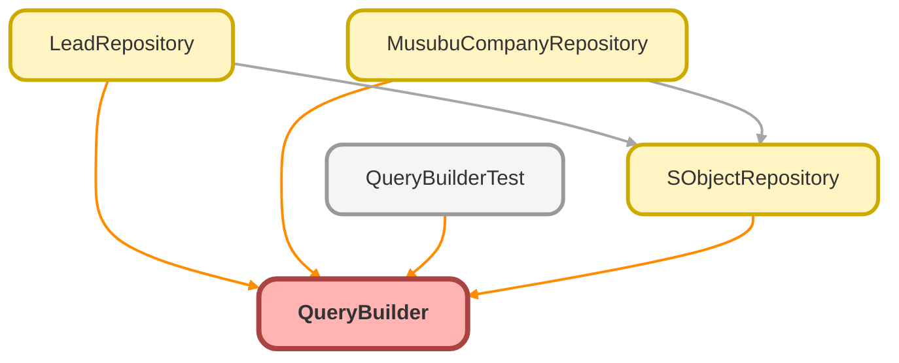

---
hide:
  - path
---

# QueryBuilder Class

SOQL クエリを構築するビルダークラス

## Class Diagram



<!-- Apex description -->

## Apex Code

```java
/**
 * SOQL クエリを構築するビルダークラス
 *
 * @description 型安全で流暢なインターフェースで SOQL クエリを構築します。
 *              AccessLevel.USER_MODE を使用して FLS/CRUD チェックを行います。
 */
public with sharing class QueryBuilder {

    private Schema.SObjectType sObjectType;
    private List<String> selectFieldsList;
    private List<String> whereClauses;
    private Map<String, Object> bindVariables;
    private List<String> orderByClauses;
    private Integer limitCount;
    private Integer offsetCount;

    /**
     * コンストラクタ
     *
     * @param sObjectType クエリ対象の SObjectType
     */
    public QueryBuilder(Schema.SObjectType sObjectType) {
        this.sObjectType = sObjectType;
        this.selectFieldsList = new List<String>();
        this.whereClauses = new List<String>();
        this.bindVariables = new Map<String, Object>();
        this.orderByClauses = new List<String>();
    }

    /**
     * 取得するフィールドを指定
     *
     * @param fields フィールド名のリスト
     * @return このインスタンス
     */
    public QueryBuilder selectFields(List<String> fields) {
        this.selectFieldsList.addAll(fields);
        return this;
    }

    /**
     * 等価条件を追加
     *
     * @param fieldName フィールド名
     * @param value 値
     * @return このインスタンス
     */
    public QueryBuilder whereEqual(String fieldName, Object value) {
        String bindKey = generateBindKey(fieldName);
        this.whereClauses.add(fieldName + ' = :' + bindKey);
        this.bindVariables.put(bindKey, value);
        return this;
    }

    /**
     * 不等価条件を追加
     *
     * @param fieldName フィールド名
     * @param value 値
     * @return このインスタンス
     */
    public QueryBuilder whereNotEqual(String fieldName, Object value) {
        String bindKey = generateBindKey(fieldName);
        this.whereClauses.add(fieldName + ' != :' + bindKey);
        this.bindVariables.put(bindKey, value);
        return this;
    }

    /**
     * IN 条件を追加
     *
     * @param fieldName フィールド名
     * @param values 値のセット
     * @return このインスタンス
     */
    public QueryBuilder whereIn(String fieldName, Set<Object> values) {
        String bindKey = generateBindKey(fieldName);
        this.whereClauses.add(fieldName + ' IN :' + bindKey);
        this.bindVariables.put(bindKey, values);
        return this;
    }

    /**
     * IN 条件を追加（Id セット用）
     *
     * @param fieldName フィールド名
     * @param values Id のセット
     * @return このインスタンス
     */
    public QueryBuilder whereInIds(String fieldName, Set<Id> values) {
        String bindKey = generateBindKey(fieldName);
        this.whereClauses.add(fieldName + ' IN :' + bindKey);
        this.bindVariables.put(bindKey, values);
        return this;
    }

    /**
     * IN 条件を追加（String セット用）
     *
     * @param fieldName フィールド名
     * @param values String のセット
     * @return このインスタンス
     */
    public QueryBuilder whereInStrings(String fieldName, Set<String> values) {
        String bindKey = generateBindKey(fieldName);
        this.whereClauses.add(fieldName + ' IN :' + bindKey);
        this.bindVariables.put(bindKey, values);
        return this;
    }

    /**
     * NOT IN 条件を追加
     *
     * @param fieldName フィールド名
     * @param values 値のセット
     * @return このインスタンス
     */
    public QueryBuilder whereNotIn(String fieldName, Set<Object> values) {
        String bindKey = generateBindKey(fieldName);
        this.whereClauses.add(fieldName + ' NOT IN :' + bindKey);
        this.bindVariables.put(bindKey, values);
        return this;
    }

    /**
     * LIKE 条件を追加
     *
     * @param fieldName フィールド名
     * @param pattern パターン（% を含む）
     * @return このインスタンス
     */
    public QueryBuilder whereLike(String fieldName, String pattern) {
        String bindKey = generateBindKey(fieldName);
        this.whereClauses.add(fieldName + ' LIKE :' + bindKey);
        this.bindVariables.put(bindKey, pattern);
        return this;
    }

    /**
     * NULL 条件を追加
     *
     * @param fieldName フィールド名
     * @return このインスタンス
     */
    public QueryBuilder whereNull(String fieldName) {
        this.whereClauses.add(fieldName + ' = null');
        return this;
    }

    /**
     * NOT NULL 条件を追加
     *
     * @param fieldName フィールド名
     * @return このインスタンス
     */
    public QueryBuilder whereNotNull(String fieldName) {
        this.whereClauses.add(fieldName + ' != null');
        return this;
    }

    /**
     * カスタム WHERE 句を追加
     *
     * @param clause WHERE 句（例: 'AnnualRevenue >= :minRevenue'）
     * @return このインスタンス
     */
    public QueryBuilder addWhereClause(String clause) {
        this.whereClauses.add(clause);
        return this;
    }

    /**
     * バインド変数を設定
     *
     * @param variableName 変数名
     * @param value 値
     * @return このインスタンス
     */
    public QueryBuilder bindVariable(String variableName, Object value) {
        this.bindVariables.put(variableName, value);
        return this;
    }

    /**
     * 昇順ソートを追加
     *
     * @param fieldName フィールド名
     * @return このインスタンス
     */
    public QueryBuilder orderBy(String fieldName) {
        this.orderByClauses.add(fieldName + ' ASC');
        return this;
    }

    /**
     * 降順ソートを追加
     *
     * @param fieldName フィールド名
     * @return このインスタンス
     */
    public QueryBuilder orderByDesc(String fieldName) {
        this.orderByClauses.add(fieldName + ' DESC');
        return this;
    }

    /**
     * LIMIT を設定
     *
     * @param count 件数
     * @return このインスタンス
     */
    public QueryBuilder limitTo(Integer count) {
        this.limitCount = count;
        return this;
    }

    /**
     * OFFSET を設定
     *
     * @param count オフセット
     * @return このインスタンス
     */
    public QueryBuilder offsetBy(Integer count) {
        this.offsetCount = count;
        return this;
    }

    /**
     * クエリを実行して結果を取得
     *
     * @return SObject のリスト
     */
    public List<SObject> get() {
        String soql = toSoql();
        return Database.queryWithBinds(soql, this.bindVariables, AccessLevel.USER_MODE);
    }

    /**
     * クエリを実行して最初の1件を取得
     *
     * @return 最初の SObject（なければ null）
     */
    public SObject first() {
        this.limitCount = 1;
        List<SObject> results = get();
        return results.isEmpty() ? null : results[0];
    }

    /**
     * 件数を取得
     *
     * @return レコード件数
     */
    public Integer count() {
        String countSoql = buildCountSoql();
        return Database.countQueryWithBinds(countSoql, this.bindVariables, AccessLevel.USER_MODE);
    }

    /**
     * 生成される SOQL 文字列を取得
     *
     * @return SOQL クエリ文字列
     */
    public String toSoql() {
        List<String> queryParts = new List<String>();

        // SELECT
        String fieldsClause = this.selectFieldsList.isEmpty()
            ? 'Id'
            : String.join(this.selectFieldsList, ', ');
        queryParts.add('SELECT ' + fieldsClause);

        // FROM
        queryParts.add('FROM ' + this.sObjectType.getDescribe().getName());

        // WHERE
        if (!this.whereClauses.isEmpty()) {
            queryParts.add('WHERE ' + String.join(this.whereClauses, ' AND '));
        }

        // ORDER BY
        if (!this.orderByClauses.isEmpty()) {
            queryParts.add('ORDER BY ' + String.join(this.orderByClauses, ', '));
        }

        // LIMIT
        if (this.limitCount != null) {
            queryParts.add('LIMIT ' + this.limitCount);
        }

        // OFFSET
        if (this.offsetCount != null) {
            queryParts.add('OFFSET ' + this.offsetCount);
        }

        return String.join(queryParts, ' ');
    }

    /**
     * COUNT クエリ用の SOQL を構築
     *
     * @return COUNT SOQL クエリ文字列
     */
    private String buildCountSoql() {
        List<String> queryParts = new List<String>();

        // SELECT COUNT()
        queryParts.add('SELECT COUNT()');

        // FROM
        queryParts.add('FROM ' + this.sObjectType.getDescribe().getName());

        // WHERE
        if (!this.whereClauses.isEmpty()) {
            queryParts.add('WHERE ' + String.join(this.whereClauses, ' AND '));
        }

        return String.join(queryParts, ' ');
    }

    /**
     * バインド変数キーを生成
     *
     * @param fieldName フィールド名
     * @return ユニークなバインドキー
     */
    private String generateBindKey(String fieldName) {
        String baseKey = fieldName.replace('.', '_').replace('__c', '').replace('__r', '');
        Integer counter = 0;
        String key = baseKey;
        while (this.bindVariables.containsKey(key)) {
            counter++;
            key = baseKey + counter;
        }
        return key;
    }
}
```

## Fields
### `sObjectType`

#### Signature
```apex
private sObjectType
```

#### Type
Schema.SObjectType

---

### `selectFieldsList`

#### Signature
```apex
private selectFieldsList
```

#### Type
List<String>

---

### `whereClauses`

#### Signature
```apex
private whereClauses
```

#### Type
List<String>

---

### `bindVariables`

#### Signature
```apex
private bindVariables
```

#### Type
Map<String,Object>

---

### `orderByClauses`

#### Signature
```apex
private orderByClauses
```

#### Type
List<String>

---

### `limitCount`

#### Signature
```apex
private limitCount
```

#### Type
Integer

---

### `offsetCount`

#### Signature
```apex
private offsetCount
```

#### Type
Integer

## Constructors
### `QueryBuilder(sObjectType)`

コンストラクタ

#### Signature
```apex
public QueryBuilder(Schema.SObjectType sObjectType)
```

#### Parameters
| Name | Type | Description |
|------|------|-------------|
| sObjectType | Schema.SObjectType | クエリ対象の SObjectType |

## Methods
### `selectFields(fields)`

取得するフィールドを指定

#### Signature
```apex
public QueryBuilder selectFields(List<String> fields)
```

#### Parameters
| Name | Type | Description |
|------|------|-------------|
| fields | List<String> | フィールド名のリスト |

#### Return Type
**[QueryBuilder](QueryBuilder.md)**

このインスタンス

---

### `whereEqual(fieldName, value)`

等価条件を追加

#### Signature
```apex
public QueryBuilder whereEqual(String fieldName, Object value)
```

#### Parameters
| Name | Type | Description |
|------|------|-------------|
| fieldName | String | フィールド名 |
| value | Object | 値 |

#### Return Type
**[QueryBuilder](QueryBuilder.md)**

このインスタンス

---

### `whereNotEqual(fieldName, value)`

不等価条件を追加

#### Signature
```apex
public QueryBuilder whereNotEqual(String fieldName, Object value)
```

#### Parameters
| Name | Type | Description |
|------|------|-------------|
| fieldName | String | フィールド名 |
| value | Object | 値 |

#### Return Type
**[QueryBuilder](QueryBuilder.md)**

このインスタンス

---

### `whereIn(fieldName, values)`

IN 条件を追加

#### Signature
```apex
public QueryBuilder whereIn(String fieldName, Set<Object> values)
```

#### Parameters
| Name | Type | Description |
|------|------|-------------|
| fieldName | String | フィールド名 |
| values | Set<Object> | 値のセット |

#### Return Type
**[QueryBuilder](QueryBuilder.md)**

このインスタンス

---

### `whereInIds(fieldName, values)`

IN 条件を追加（Id セット用）

#### Signature
```apex
public QueryBuilder whereInIds(String fieldName, Set<Id> values)
```

#### Parameters
| Name | Type | Description |
|------|------|-------------|
| fieldName | String | フィールド名 |
| values | Set<Id> | Id のセット |

#### Return Type
**[QueryBuilder](QueryBuilder.md)**

このインスタンス

---

### `whereInStrings(fieldName, values)`

IN 条件を追加（String セット用）

#### Signature
```apex
public QueryBuilder whereInStrings(String fieldName, Set<String> values)
```

#### Parameters
| Name | Type | Description |
|------|------|-------------|
| fieldName | String | フィールド名 |
| values | Set<String> | String のセット |

#### Return Type
**[QueryBuilder](QueryBuilder.md)**

このインスタンス

---

### `whereNotIn(fieldName, values)`

NOT IN 条件を追加

#### Signature
```apex
public QueryBuilder whereNotIn(String fieldName, Set<Object> values)
```

#### Parameters
| Name | Type | Description |
|------|------|-------------|
| fieldName | String | フィールド名 |
| values | Set<Object> | 値のセット |

#### Return Type
**[QueryBuilder](QueryBuilder.md)**

このインスタンス

---

### `whereLike(fieldName, pattern)`

LIKE 条件を追加

#### Signature
```apex
public QueryBuilder whereLike(String fieldName, String pattern)
```

#### Parameters
| Name | Type | Description |
|------|------|-------------|
| fieldName | String | フィールド名 |
| pattern | String | パターン（% を含む） |

#### Return Type
**[QueryBuilder](QueryBuilder.md)**

このインスタンス

---

### `whereNull(fieldName)`

NULL 条件を追加

#### Signature
```apex
public QueryBuilder whereNull(String fieldName)
```

#### Parameters
| Name | Type | Description |
|------|------|-------------|
| fieldName | String | フィールド名 |

#### Return Type
**[QueryBuilder](QueryBuilder.md)**

このインスタンス

---

### `whereNotNull(fieldName)`

NOT NULL 条件を追加

#### Signature
```apex
public QueryBuilder whereNotNull(String fieldName)
```

#### Parameters
| Name | Type | Description |
|------|------|-------------|
| fieldName | String | フィールド名 |

#### Return Type
**[QueryBuilder](QueryBuilder.md)**

このインスタンス

---

### `addWhereClause(clause)`

カスタム WHERE 句を追加

#### Signature
```apex
public QueryBuilder addWhereClause(String clause)
```

#### Parameters
| Name | Type | Description |
|------|------|-------------|
| clause | String | WHERE 句（例: &#x27;AnnualRevenue &gt;&#x3D; :minRevenue&#x27;） |

#### Return Type
**[QueryBuilder](QueryBuilder.md)**

このインスタンス

---

### `bindVariable(variableName, value)`

バインド変数を設定

#### Signature
```apex
public QueryBuilder bindVariable(String variableName, Object value)
```

#### Parameters
| Name | Type | Description |
|------|------|-------------|
| variableName | String | 変数名 |
| value | Object | 値 |

#### Return Type
**[QueryBuilder](QueryBuilder.md)**

このインスタンス

---

### `orderBy(fieldName)`

昇順ソートを追加

#### Signature
```apex
public QueryBuilder orderBy(String fieldName)
```

#### Parameters
| Name | Type | Description |
|------|------|-------------|
| fieldName | String | フィールド名 |

#### Return Type
**[QueryBuilder](QueryBuilder.md)**

このインスタンス

---

### `orderByDesc(fieldName)`

降順ソートを追加

#### Signature
```apex
public QueryBuilder orderByDesc(String fieldName)
```

#### Parameters
| Name | Type | Description |
|------|------|-------------|
| fieldName | String | フィールド名 |

#### Return Type
**[QueryBuilder](QueryBuilder.md)**

このインスタンス

---

### `limitTo(count)`

LIMIT を設定

#### Signature
```apex
public QueryBuilder limitTo(Integer count)
```

#### Parameters
| Name | Type | Description |
|------|------|-------------|
| count | Integer | 件数 |

#### Return Type
**[QueryBuilder](QueryBuilder.md)**

このインスタンス

---

### `offsetBy(count)`

OFFSET を設定

#### Signature
```apex
public QueryBuilder offsetBy(Integer count)
```

#### Parameters
| Name | Type | Description |
|------|------|-------------|
| count | Integer | オフセット |

#### Return Type
**[QueryBuilder](QueryBuilder.md)**

このインスタンス

---

### `get()`

クエリを実行して結果を取得

#### Signature
```apex
public List<SObject> get()
```

#### Return Type
**List<SObject>**

SObject のリスト

---

### `first()`

クエリを実行して最初の1件を取得

#### Signature
```apex
public SObject first()
```

#### Return Type
**SObject**

最初の SObject（なければ null）

---

### `count()`

件数を取得

#### Signature
```apex
public Integer count()
```

#### Return Type
**Integer**

レコード件数

---

### `toSoql()`

生成される SOQL 文字列を取得

#### Signature
```apex
public String toSoql()
```

#### Return Type
**String**

SOQL クエリ文字列

---

### `buildCountSoql()`

COUNT クエリ用の SOQL を構築

#### Signature
```apex
private String buildCountSoql()
```

#### Return Type
**String**

COUNT SOQL クエリ文字列

---

### `generateBindKey(fieldName)`

バインド変数キーを生成

#### Signature
```apex
private String generateBindKey(String fieldName)
```

#### Parameters
| Name | Type | Description |
|------|------|-------------|
| fieldName | String | フィールド名 |

#### Return Type
**String**

ユニークなバインドキー