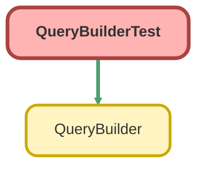

---
hide:
  - path
---

# QueryBuilderTest Class

`ISTEST`

QueryBuilder のテストクラス

## Class Diagram



<!-- Apex description -->

## Apex Code

```java
/**
 * QueryBuilder のテストクラス
 */
@IsTest
private class QueryBuilderTest {

    @TestSetup
    static void setup() {
        // テストデータの作成
        List<Account> accounts = new List<Account>();
        accounts.add(new Account(Name = 'Test Account 1', Industry = 'Technology', Phone = '03-1234-5678'));
        accounts.add(new Account(Name = 'Test Account 2', Industry = 'Technology', Phone = '03-2345-6789'));
        accounts.add(new Account(Name = 'Test Account 3', Industry = 'Finance', Phone = '03-3456-7890'));
        insert accounts;
    }

    @IsTest
    static void testSelectFields() {
        // Given
        QueryBuilder builder = new QueryBuilder(Account.SObjectType);

        // When
        String soql = builder
            .selectFields(new List<String>{ 'Id', 'Name', 'Industry' })
            .toSoql();

        // Then
        System.assert(soql.contains('SELECT Id, Name, Industry'), 'SELECT句にフィールドが含まれていません');
        System.assert(soql.contains('FROM Account'), 'FROM句が正しくありません');
    }

    @IsTest
    static void testWhereEqual() {
        // Given
        QueryBuilder builder = new QueryBuilder(Account.SObjectType);

        // When
        List<SObject> results = builder
            .selectFields(new List<String>{ 'Id', 'Name' })
            .whereEqual('Industry', 'Technology')
            .get();

        // Then
        System.assertEquals(2, results.size(), '該当件数が一致しません');
    }

    @IsTest
    static void testWhereNotEqual() {
        // Given
        QueryBuilder builder = new QueryBuilder(Account.SObjectType);

        // When
        List<SObject> results = builder
            .selectFields(new List<String>{ 'Id', 'Name' })
            .whereNotEqual('Industry', 'Technology')
            .get();

        // Then
        System.assertEquals(1, results.size(), '該当件数が一致しません');
    }

    @IsTest
    static void testWhereInIds() {
        // Given
        List<Account> allAccounts = [SELECT Id FROM Account];
        Set<Id> accountIds = new Set<Id>();
        for (Account acc : allAccounts) {
            accountIds.add(acc.Id);
        }

        QueryBuilder builder = new QueryBuilder(Account.SObjectType);

        // When
        List<SObject> results = builder
            .selectFields(new List<String>{ 'Id', 'Name' })
            .whereInIds('Id', accountIds)
            .get();

        // Then
        System.assertEquals(3, results.size(), '該当件数が一致しません');
    }

    @IsTest
    static void testWhereLike() {
        // Given
        QueryBuilder builder = new QueryBuilder(Account.SObjectType);

        // When
        List<SObject> results = builder
            .selectFields(new List<String>{ 'Id', 'Name' })
            .whereLike('Name', 'Test%')
            .get();

        // Then
        System.assertEquals(3, results.size(), '該当件数が一致しません');
    }

    @IsTest
    static void testWhereNull() {
        // Given
        QueryBuilder builder = new QueryBuilder(Account.SObjectType);

        // When
        List<SObject> results = builder
            .selectFields(new List<String>{ 'Id', 'Name' })
            .whereNull('Website')
            .get();

        // Then
        System.assertEquals(3, results.size(), '該当件数が一致しません（全てのアカウントにWebsiteがnull）');
    }

    @IsTest
    static void testWhereNotNull() {
        // Given
        QueryBuilder builder = new QueryBuilder(Account.SObjectType);

        // When
        List<SObject> results = builder
            .selectFields(new List<String>{ 'Id', 'Name' })
            .whereNotNull('Phone')
            .get();

        // Then
        System.assertEquals(3, results.size(), '該当件数が一致しません');
    }

    @IsTest
    static void testOrderBy() {
        // Given
        QueryBuilder builder = new QueryBuilder(Account.SObjectType);

        // When
        List<SObject> results = builder
            .selectFields(new List<String>{ 'Id', 'Name' })
            .orderBy('Name')
            .get();

        // Then
        System.assertEquals(3, results.size(), '該当件数が一致しません');
        System.assertEquals('Test Account 1', ((Account)results[0]).Name, 'ソート順が正しくありません');
    }

    @IsTest
    static void testOrderByDesc() {
        // Given
        QueryBuilder builder = new QueryBuilder(Account.SObjectType);

        // When
        List<SObject> results = builder
            .selectFields(new List<String>{ 'Id', 'Name' })
            .orderByDesc('Name')
            .get();

        // Then
        System.assertEquals(3, results.size(), '該当件数が一致しません');
        System.assertEquals('Test Account 3', ((Account)results[0]).Name, 'ソート順が正しくありません');
    }

    @IsTest
    static void testLimitTo() {
        // Given
        QueryBuilder builder = new QueryBuilder(Account.SObjectType);

        // When
        List<SObject> results = builder
            .selectFields(new List<String>{ 'Id', 'Name' })
            .limitTo(2)
            .get();

        // Then
        System.assertEquals(2, results.size(), 'LIMIT句が機能していません');
    }

    @IsTest
    static void testFirst() {
        // Given
        QueryBuilder builder = new QueryBuilder(Account.SObjectType);

        // When
        SObject result = builder
            .selectFields(new List<String>{ 'Id', 'Name' })
            .orderBy('Name')
            .first();

        // Then
        System.assertNotEquals(null, result, '結果がnullです');
        System.assertEquals('Test Account 1', ((Account)result).Name, '最初のレコードが正しくありません');
    }

    @IsTest
    static void testFirstReturnsNull() {
        // Given
        QueryBuilder builder = new QueryBuilder(Account.SObjectType);

        // When
        SObject result = builder
            .selectFields(new List<String>{ 'Id', 'Name' })
            .whereEqual('Name', 'NonExistent Account')
            .first();

        // Then
        System.assertEquals(null, result, '存在しないレコードでnullが返されていません');
    }

    @IsTest
    static void testCount() {
        // Given
        QueryBuilder builder = new QueryBuilder(Account.SObjectType);

        // When
        Integer count = builder
            .whereEqual('Industry', 'Technology')
            .count();

        // Then
        System.assertEquals(2, count, 'カウント結果が一致しません');
    }

    @IsTest
    static void testCombinedConditions() {
        // Given
        QueryBuilder builder = new QueryBuilder(Account.SObjectType);

        // When
        List<SObject> results = builder
            .selectFields(new List<String>{ 'Id', 'Name', 'Industry' })
            .whereEqual('Industry', 'Technology')
            .whereLike('Name', '%1')
            .get();

        // Then
        System.assertEquals(1, results.size(), '複合条件の結果が一致しません');
        System.assertEquals('Test Account 1', ((Account)results[0]).Name, 'レコード名が一致しません');
    }

    @IsTest
    static void testToSoqlUsesUserMode() {
        // Given
        QueryBuilder builder = new QueryBuilder(Account.SObjectType);

        // When
        String soql = builder
            .selectFields(new List<String>{ 'Id', 'Name' })
            .toSoql();

        // Then
        // USER_MODE is used for security enforcement instead of WITH SECURITY_ENFORCED
        System.assert(!soql.contains('WITH SECURITY_ENFORCED'), 'WITH SECURITY_ENFORCEDは使用されていません（USER_MODEを使用）');
    }
}
```

## Methods
### `setup()`

`TESTSETUP`

#### Signature
```apex
private static void setup()
```

#### Return Type
**void**

---

### `testSelectFields()`

`ISTEST`

#### Signature
```apex
private static void testSelectFields()
```

#### Return Type
**void**

---

### `testWhereEqual()`

`ISTEST`

#### Signature
```apex
private static void testWhereEqual()
```

#### Return Type
**void**

---

### `testWhereNotEqual()`

`ISTEST`

#### Signature
```apex
private static void testWhereNotEqual()
```

#### Return Type
**void**

---

### `testWhereInIds()`

`ISTEST`

#### Signature
```apex
private static void testWhereInIds()
```

#### Return Type
**void**

---

### `testWhereLike()`

`ISTEST`

#### Signature
```apex
private static void testWhereLike()
```

#### Return Type
**void**

---

### `testWhereNull()`

`ISTEST`

#### Signature
```apex
private static void testWhereNull()
```

#### Return Type
**void**

---

### `testWhereNotNull()`

`ISTEST`

#### Signature
```apex
private static void testWhereNotNull()
```

#### Return Type
**void**

---

### `testOrderBy()`

`ISTEST`

#### Signature
```apex
private static void testOrderBy()
```

#### Return Type
**void**

---

### `testOrderByDesc()`

`ISTEST`

#### Signature
```apex
private static void testOrderByDesc()
```

#### Return Type
**void**

---

### `testLimitTo()`

`ISTEST`

#### Signature
```apex
private static void testLimitTo()
```

#### Return Type
**void**

---

### `testFirst()`

`ISTEST`

#### Signature
```apex
private static void testFirst()
```

#### Return Type
**void**

---

### `testFirstReturnsNull()`

`ISTEST`

#### Signature
```apex
private static void testFirstReturnsNull()
```

#### Return Type
**void**

---

### `testCount()`

`ISTEST`

#### Signature
```apex
private static void testCount()
```

#### Return Type
**void**

---

### `testCombinedConditions()`

`ISTEST`

#### Signature
```apex
private static void testCombinedConditions()
```

#### Return Type
**void**

---

### `testToSoqlUsesUserMode()`

`ISTEST`

#### Signature
```apex
private static void testToSoqlUsesUserMode()
```

#### Return Type
**void**