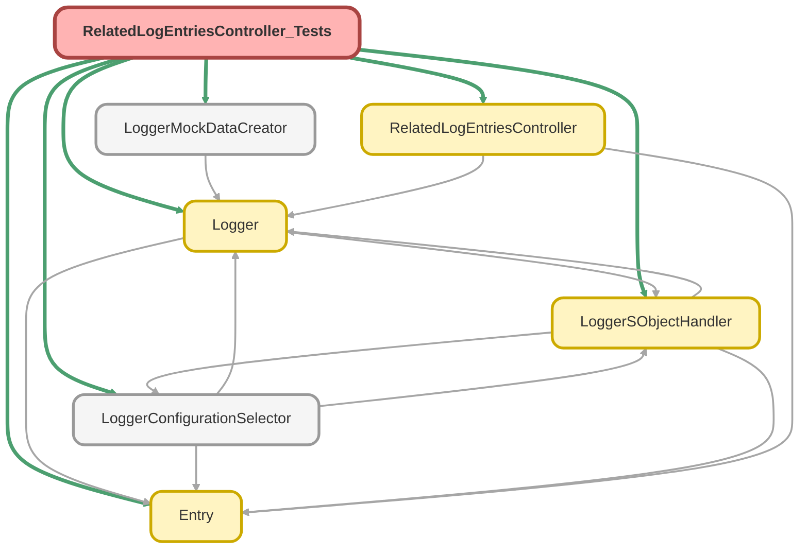

---
hide:
  - path
---

# RelatedLogEntriesController_Tests Class

`SUPPRESSWARNINGS`
`ISTEST`

## Class Diagram



<!-- Apex description -->

## Apex Code

```java
//------------------------------------------------------------------------------------------------//
// This file is part of the Nebula Logger project, released under the MIT License.                //
// See LICENSE file or go to https://github.com/jongpie/NebulaLogger for full license details.    //
//------------------------------------------------------------------------------------------------//

@SuppressWarnings('PMD.ApexDoc, PMD.CyclomaticComplexity, PMD.ExcessiveParameterList, PMD.MethodNamingConventions, PMD.NcssMethodCount')
@IsTest(IsParallel=true)
private class RelatedLogEntriesController_Tests {
  private static final Integer TOTAL_LOG_ENTRIES = 10;
  private static final Integer TOTAL_RELATED_LOG_ENTRIES = 7;

  static {
    // Don't use the org's actual custom metadata records when running tests
    LoggerConfigurationSelector.useMocks();
  }

  static String getFieldSetName() {
    Schema.FieldSet fieldSet = Schema.SObjectType.LogEntry__c.fieldSets.getMap().values().get(0);
    String fieldSetNamespacePrefix = String.isBlank(fieldSet.getNameSpace()) ? '' : fieldSet.getNameSpace() + '__';
    String fieldSetName = fieldSetNamespacePrefix + fieldSet.getName();

    return fieldSetName;
  }

  @TestSetup
  static void setupData() {
    LoggerSObjectHandler.shouldExecute(false);

    Log__c log = (Log__c) LoggerMockDataCreator.createDataBuilder(Schema.Log__c.SObjectType).populateRequiredFields().getRecord();
    insert log;

    List<LogEntry__c> logEntries = new List<LogEntry__c>();
    for (Integer i = 0; i < TOTAL_LOG_ENTRIES; i++) {
      LogEntry__c logEntry = new LogEntry__c(Log__c = log.Id, Message__c = 'test ' + i);
      if (i <= TOTAL_RELATED_LOG_ENTRIES) {
        logEntry.RecordId__c = System.UserInfo.getUserId();
      }
      LoggerMockDataCreator.createDataBuilder(logEntry).populateRequiredFields().getRecord();

      logEntries.add(logEntry);
    }
    insert logEntries;
  }

  @IsTest
  static void it_should_return_matching_logEntryQueryResult() {
    Id recordId = System.UserInfo.getUserId();
    String fieldSetName = getFieldSetName();
    Integer rowLimit = 10;
    Integer rowOffset = 0;
    String sortByFieldName = 'Name';
    String sortDirection = 'ASC';
    String search = null;

    System.Test.startTest();

    RelatedLogEntriesController.LogEntryQueryResult result = RelatedLogEntriesController.getQueryResult(
      recordId,
      fieldSetName,
      rowLimit,
      rowOffset,
      sortByFieldName,
      sortDirection,
      search
    );
    System.Test.stopTest();

    System.Assert.areEqual(fieldSetName, result.fieldSet.name);

    // Requery the log entries so we can check additional fields that may not be in the field set
    List<LogEntry__c> logEntries = [SELECT Id, RecordId__c FROM LogEntry__c WHERE Id IN :result.records];
    for (LogEntry__c logEntry : logEntries) {
      System.Assert.areEqual(recordId, logEntry.RecordId__c);
    }
  }

  // FIXME In January & February 2024, Salesforce seems to be having a lot of issues with running SOSL queries
  // in a test context, resulting in an UnexpectedException being thrown, which fails the pipeline (sooooo many times).
  // It's a platform issue, not an issue with Nebula Logger - and since it's an UnexpectedException, it can't be caught,
  // so there's not a way to handle the issue within Nebula Logger. Since the RelatedLogEntriesController has not changed
  // since v4.9.4, this test method is being commented out in v4.13.0 until Salesforce fixes the issue (or something else changes).
  // @IsTest
  // static void it_should_return_matching_logEntryQueryResult_when_search_provided() {
  //     Id recordId = System.UserInfo.getUserId();
  //     String fieldSetName = getFieldSetName();
  //     Integer rowLimit = 10;
  //     Integer rowOffset = 0;
  //     String sortByFieldName = 'Name';
  //     String sortDirection = 'ASC';
  //     String search = 'my search term';

  //     Log__c log = [SELECT Id FROM Log__c];
  //     LogEntry__c logEntryWithSearchTerm = new LogEntry__c(Log__c = log.Id, Message__c = search);
  //     insert logEntryWithSearchTerm;
  //     System.Assert.isTrue(logEntryWithSearchTerm.Message__c.contains(search));

  //     // Quick sanity check on test data setup to make sure that only 1 log entry matches the search term
  //     List<LogEntry__c> logEntries = [SELECT Id, Message__c, RecordId__c FROM LogEntry__c];
  //     System.Assert.areEqual(TOTAL_LOG_ENTRIES + 1, logEntries.size());
  //     Integer countOfMatches = 0;
  //     for (LogEntry__c logEntry : logEntries) {
  //         if (logEntry.Message__c.contains(search)) {
  //             countOfMatches = countOfMatches + 1;
  //         }
  //     }
  //     System.Assert.areEqual(1, countOfMatches, System.JSON.serializePretty(logEntries));

  //     System.Test.startTest();

  //     RelatedLogEntriesController.LogEntryQueryResult result = RelatedLogEntriesController.getQueryResult(
  //         recordId,
  //         fieldSetName,
  //         rowLimit,
  //         rowOffset,
  //         sortByFieldName,
  //         sortDirection,
  //         search
  //     );
  //     System.Test.stopTest();

  //     System.Assert.areEqual(fieldSetName, result.fieldSet.name);
  //     // FIXME
  //     // System.Assert.areEqual(1, result.records.size());
  //     // for(LogEntry__c logEntry : result.records) {
  //     //     System.Assert.areEqual(recordId, logEntry.RecordId__c);
  //     // }
  // }
}
```

## Fields
### `TOTAL_LOG_ENTRIES`

#### Signature
```apex
private static final TOTAL_LOG_ENTRIES
```

#### Type
Integer

---

### `TOTAL_RELATED_LOG_ENTRIES`

#### Signature
```apex
private static final TOTAL_RELATED_LOG_ENTRIES
```

#### Type
Integer

## Methods
### `getFieldSetName()`

#### Signature
```apex
private static String getFieldSetName()
```

#### Return Type
**String**

---

### `setupData()`

`TESTSETUP`

#### Signature
```apex
private static void setupData()
```

#### Return Type
**void**

---

### `it_should_return_matching_logEntryQueryResult()`

`ISTEST`

#### Signature
```apex
private static void it_should_return_matching_logEntryQueryResult()
```

#### Return Type
**void**