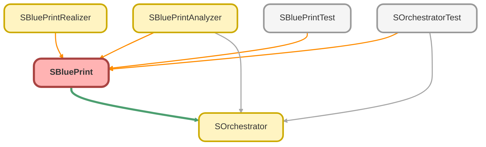

---
hide:
  - path
---

# SBluePrint Class

Represents the blueprint for creating SObject records. 
This class uses a fluent interface to define the properties of records to be created, 
including field values, aliases, dependencies, and hierarchical relationships. 
It is designed to be immutable; each configuration method returns a new SBlueprint instance.

## Class Diagram



<!-- Apex description -->

## Apex Code

```java
/**
 * Copyright 2025 Hiroyuki Matsuoka
 *
 * Licensed under the Apache License, Version 2.0 (the "License");
 * you may not use this file except in compliance with the License.
 * You may obtain a copy of the License at
 *
 * http://www.apache.org/licenses/LICENSE-2.0
 *
 * Unless required by applicable law or agreed to in writing, software
 * distributed under the License is distributed on an "AS IS" BASIS,
 * WITHOUT WARRANTIES OR CONDITIONS OF ANY KIND, either express or implied.
 * See the License for the specific language governing permissions and
 * limitations under the License.
 */

/**
 * Represents the blueprint for creating SObject records.
 * This class uses a fluent interface to define the properties of records to be created,
 * including field values, aliases, dependencies, and hierarchical relationships.
 * It is designed to be immutable; each configuration method returns a new SBlueprint instance.
 */
public with sharing class SBluePrint {
  @TestVisible
  private System.Type recordType;
  @TestVisible
  private AliasDefinition aliasDefinition;
  @TestVisible
  private String parentIdField;
  @TestVisible
  private Integer insertNumber = 1;
  @TestVisible
  private Map<String, ValueDefinition> fieldValues = new Map<String, ValueDefinition>();
  @TestVisible
  private List<Dependency> dependencies = new List<Dependency>();
  @TestVisible
  private List<SBlueprint> children = new List<SBlueprint>();
  private List<ParentBuildPlan> parentBuildPlans = new List<ParentBuildPlan>();

  // =================================================================================
  // Constructor and Factory Methods
  // =================================================================================

  /**
   * Private constructor to enforce creation via the `of` factory method.
   *
   * @param recordType The type of SObject this blueprint represents.
   */
  private SBluePrint(System.Type recordType) {
    this.recordType = recordType;
  }

  /**
   * Creates a new SBlueprint for a given SObject type. This is the entry point for defining a blueprint.
   *
   * @param recordType The System.Type of the SObject (e.g., Account.class).
   * @return A new SBlueprint instance.
   */
  public static SBluePrint of(System.Type recordType) {
    guard(recordType);
    return new SBlueprint(recordType);
  }

  /**
   * Validates that the provided record type is a valid SObject type.
   *
   * @param recordType The System.Type to validate.
   * @throws DmlException if recordType is null or not an SObject.
   */
  private static void guard(System.Type recordType) {
    if (recordType == null) {
      throw new DmlException('RecordType must not be null');
    }
    if (!(recordType.newInstance() instanceof SObject)) {
      throw new DmlException('RecordType must be SObject type');
    }
  }

  // =================================================================================
  // Configuration Methods (Fluent Interface)
  // =================================================================================

  /**
   * Sets a field value for the records to be created.
   *
   * @param fieldName The API name of the field.
   * @param value The value to set.
   * @return A new SBlueprint instance with the updated configuration.
   */
  public SBlueprint set(String fieldName, Object value) {
    return this.set(fieldName, value, 1, 1);
  }

  /**
   * Sets a field value with a sequence starting number.
   *
   * @param fieldName The API name of the field.
   * @param value The value, which can contain sequence placeholders like '{#}'.
   * @param startAt The starting number for the sequence.
   * @return A new SBlueprint instance with the updated configuration.
   */
  public SBlueprint set(String fieldName, Object value, Integer startAt) {
    if (startAt <= 0) {
      throw new DmlException('startAt must be greater than 0');
    }
    return this.set(fieldName, value, startAt, 1);
  }

  /**
   * Sets a field value with sequence starting number and interval.
   *
   * @param fieldName The API name of the field.
   * @param value The value, which can contain sequence placeholders like '{#}'.
   * @param startAt The starting number for the sequence.
   * @param interval The interval between sequence numbers.
   * @return A new SBlueprint instance with the updated configuration.
   */
  public SBlueprint set(String fieldName, Object value, Integer startAt, Integer interval) {
    if (interval <= 0) {
      throw new DmlException('interval must be greater than 0');
    }
    if (startAt <= 0) {
      throw new DmlException('startAt must be greater than 0');
    }
    SBlueprint newSBlueprint = this.deepCopy();
    ValueDefinition valueDefinition = new ValueDefinition(value, startAt, interval);
    newSBlueprint.fieldValues.put(fieldName, valueDefinition);
    return newSBlueprint;
  }

  /**
   * Applies a template of field values to the blueprint.
   * Existing field values will be overridden by the template.
   *
   * @param template A map of field names to values.
   * @return A new SBlueprint instance with the template applied.
   */
  public SBlueprint template(Map<String, Object> template) {
    SBlueprint newSBlueprint = this.deepCopy();
    for (String key : template.keySet()) {
      ValueDefinition valueDefinition = new ValueDefinition(template.get(key), 1, 1);
      newSBlueprint.fieldValues.put(key, valueDefinition);
    }
    return newSBlueprint;
  }

  /**
   * Defines a dependency on another aliased blueprint.
   *
   * @param alias The alias of the blueprint to depend on.
   * @param fromField The field to get the value from on the source record.
   * @param toField The field to set the value on the target record.
   * @return A new SBlueprint instance with the added dependency.
   */
  public SBlueprint use(String alias, String fromField, String toField) {
    return this.use(alias, fromField, toField, 1, 1);
  }

  /**
   * Defines a dependency with a sequence starting number.
   *
   * @param alias The alias of the blueprint to depend on, which can contain sequence placeholders.
   * @param fromField The field to get the value from.
   * @param toField The field to set the value to.
   * @param startAt The starting number for the sequence in the alias.
   * @return A new SBlueprint instance with the added dependency.
   */
  public SBlueprint use(String alias, String fromField, String toField, Integer startAt) {
    return this.use(alias, fromField, toField, startAt, 1);
  }

  /**
   * Defines a dependency with sequence starting number and interval.
   *
   * @param alias The alias of the blueprint to depend on.
   * @param fromField The field to get the value from.
   * @param toField The field to set the value to.
   * @param startAt The starting number for the sequence.
   * @param interval The interval for the sequence.
   * @return A new SBlueprint instance with the added dependency.
   */
  public SBlueprint use(String alias, String fromField, String toField, Integer startAt, Integer interval) {
    if (alias == null) {
      throw new DmlException('alias must not be null');
    }
    if (fromField == null) {
      throw new DmlException('fromField must not be null');
    }
    if (toField == null) {
      throw new DmlException('toField must not be null');
    }
    if (startAt == null || startAt <= 0) {
      throw new DmlException('startAt must be greater than 0');
    }
    if (interval == null || interval <= 0) {
      throw new DmlException('interval must be greater than 0');
    }
    SBlueprint newSBlueprint = this.deepCopy();
    Dependency dependency = new Dependency(alias, fromField, toField, startAt, interval);
    newSBlueprint.dependencies.add(dependency);
    return newSBlueprint;
  }

  /**
   * Assigns an alias to this blueprint.
   *
   * @param alias The alias name, which can contain sequence placeholders.
   * @return A new SBlueprint instance with the alias defined.
   */
  public SBlueprint alias(String alias) {
    return this.alias(alias, 1, 1);
  }

  /**
   * Assigns an alias with a sequence starting number.
   *
   * @param alias The alias name.
   * @param startAt The starting number for the sequence.
   * @return A new SBlueprint instance with the alias defined.
   */
  public SBlueprint alias(String alias, Integer startAt) {
    return this.alias(alias, startAt, 1);
  }

  /**
   * Assigns an alias with sequence starting number and interval.
   *
   * @param alias The alias name.
   * @param startAt The starting number for the sequence.
   * @param interval The interval for the sequence.
   * @return A new SBlueprint instance with the alias defined.
   */
  public SBlueprint alias(String alias, Integer startAt, Integer interval) {
    if (alias == null) {
      throw new DmlException('alias must not be null');
    }
    if (interval <= 0) {
      throw new DmlException('interval must be greater than 0');
    }
    if (startAt <= 0) {
      throw new DmlException('startAt must be greater than 0');
    }
    SBlueprint newSBlueprint = this.deepCopy();
    newSBlueprint.aliasDefinition = new AliasDefinition(alias, startAt, interval);
    return newSBlueprint;
  }

  /**
   * Specifies the number of records to create from this blueprint.
   *
   * @param times The number of records to create.
   * @return A new SBlueprint instance with the specified number.
   */
  public SBlueprint times(Integer times) {
    if (times <= 0) {
      throw new DmlException('Times must be greater than 0');
    }
    SBlueprint newSBlueprint = this.deepCopy();
    newSBlueprint.insertNumber = times;
    return newSBlueprint;
  }

  /**
   * Adds a child blueprint, defining a parent-child relationship.
   *
   * @param child The child SBlueprint.
   * @return A new SBlueprint instance with the child added.
   */
  public SBlueprint withChildren(SBlueprint child) {
    if (child == null) {
      throw new DmlException('Child sBlueprint must not be null');
    }
    SBlueprint newSBlueprint = this.deepCopy();
    newSBlueprint.children.add(child);
    return newSBlueprint;
  }

  /**
   * Explicitly sets the parent relationship field for a child blueprint.
   * Use this when automatic inference fails or is ambiguous.
   *
   * @param field The API name of the lookup/master-detail field on the child object.
   * @return A new SBlueprint instance with the parent ID field set.
   */
  public SBlueprint parentIdField(String field) {
    SBlueprint newSBlueprint = this.deepCopy();
    newSBlueprint.parentIdField = field;
    return newSBlueprint;
  }

  // =================================================================================
  // Internal Methods (Used by SOrchestrator and Analyzer)
  // =================================================================================

  /**
   * Sets the build plans from a parent blueprint. This is used internally during the analysis phase.
   *
   * @param parentBluePrint The parent SBlueprint.
   */
  public void setParentBuildPlans(SBlueprint parentBluePrint) {
    this.parentBuildPlans = parentBluePrint.parentBuildPlans.clone();
    this.parentBuildPlans.add(parentBluePrint.generateParentBuildPlan());
  }

  /**
   * Generates a ParentBuildPlan from the current blueprint's state.
   *
   * @return A new ParentBuildPlan instance.
   */
  private ParentBuildPlan generateParentBuildPlan() {
    return new ParentBuildPlan(this.aliasDefinition, this.insertNumber);
  }

  /**
   * Returns a new SBlueprint instance with children removed. Used internally.
   *
   * @return A new SBlueprint instance without children.
   */
  public SBlueprint removeChildren() {
    SBlueprint copy = this.deepCopy();
    copy.children = null;
    return copy;
  }

  /**
   * Generates all possible resolved aliases based on the `times` configuration.
   *
   * @return A list of resolved alias strings.
   */
  public List<String> generateAllAliases() {
    List<String> aliases = new List<String>();
    String alias = this.aliasDefinition.alias;
    if (alias != null && (alias.contains('{#}') || alias.contains('{A}') || alias.contains('{a}'))) {
      for (Integer i = 0; i < this.insertNumber; i++) {
        Integer aliasSequence = this.aliasDefinition.startAt + (this.aliasDefinition.interval * i);
        String currentAlias = this.resolveValue(alias, aliasSequence, null).toString();
        aliases.add(currentAlias);
      }
    }
    return aliases;
  }

  /**
   * Creates a deep copy of the SBlueprint instance.
   *
   * @return A new SBlueprint instance with the same configuration.
   */
  public SBlueprint deepCopy() {
    SBlueprint copy = SBlueprint.of(this.recordType);
    copy.aliasDefinition = this.aliasDefinition;
    copy.parentIdField = this.parentIdField;
    copy.insertNumber = this.insertNumber;
    copy.fieldValues = this.fieldValues == null ? new Map<String, ValueDefinition>() : this.fieldValues.clone();
    copy.dependencies = this.dependencies == null ? new List<Dependency>() : this.dependencies.clone();
    copy.children = this.children == null ? new List<SBlueprint>() : this.children.clone();
    copy.parentBuildPlans = this.parentBuildPlans == null
      ? new List<ParentBuildPlan>()
      : this.parentBuildPlans.clone();
    return copy;
  }

  // =================================================================================
  // Getters and Checkers
  // =================================================================================

  public String getAlias() {
    if (this.aliasDefinition == null) {
      throw new DmlException('Alias is not set');
    }
    return this.aliasDefinition.alias;
  }

  public AliasDefinition getAliasDefinition() {
    return this.aliasDefinition;
  }

  public Boolean hasAlias() {
    return this.aliasDefinition != null;
  }

  public Integer getInsertNumber() {
    return this.insertNumber;
  }

  public System.Type getRecordType() {
    return this.recordType;
  }

  public String getRecordTypeName() {
    return this.recordType.getName();
  }

  public Map<String, ValueDefinition> getFieldValues() {
    return this.fieldValues;
  }

  public List<SBlueprint> getChildren() {
    return this.children;
  }

  public Boolean hasParentIdField() {
    return String.isNotBlank(this.parentIdField);
  }

  public String getParentIdField() {
    return this.parentIdField;
  }

  public Boolean hasDependencies() {
    return !this.dependencies.isEmpty();
  }

  public List<Dependency> getDependencies() {
    return this.dependencies;
  }

  public Set<String> getDependencyAliases() {
    Set<String> aliases = new Set<String>();
    for (Dependency dependency : this.dependencies) {
      aliases.add(dependency.alias);
    }
    return aliases;
  }

  public Boolean hasParentBuildPlans() {
    return !this.parentBuildPlans.isEmpty();
  }

  public List<ParentBuildPlan> getParentBuildPlans() {
    return this.parentBuildPlans;
  }

  // =================================================================================
  // Private Helper Methods
  // =================================================================================

  /**
   * Resolves a template value by replacing placeholders with the current sequence number.
   *
   * @param templateValue The template value containing placeholders.
   * @param sequence The current sequence number to replace placeholders.
   * @param parentPositionToAlias A map of parent position placeholders (e.g., 'P0') to their resolved aliases.
   * @return The resolved value.
   */
  private Object resolveValue(Object templateValue, Integer sequence, Map<String, String> parentPositionToAlias) {
    if (!(templateValue instanceof String)) {
      return templateValue;
    }
    parentPositionToAlias = parentPositionToAlias == null ? new Map<String, String>() : parentPositionToAlias;
    String value = (String) templateValue;
    if (value == '{#}') {
      return sequence;
    }
    String resolvedString = value.replace('{#}', String.valueOf(sequence))
      .replace('{A}', this.convertNumberToAlphabet(sequence, true))
      .replace('{a}', this.convertNumberToAlphabet(sequence, false));
    for (String key : parentPositionToAlias.keySet()) {
      String placeholder = '{' + key + '}';
      if (resolvedString.contains(placeholder)) {
        resolvedString = resolvedString.replace(placeholder, parentPositionToAlias.get(key));
      }
    }
    return resolvedString;
  }

  /**
   * Converts a positive integer to its corresponding alphabetic representation.
   *
   * @param num The positive integer to convert.
   * @param isUpperCase If true, returns uppercase letters; if false, returns lowercase letters.
   * @return The alphabetic representation of the number.
   */
  private String convertNumberToAlphabet(Integer num, Boolean isUpperCase) {
    if (num == null || num <= 0) {
      return '';
    }
    final Integer BASE_CHAR_CODE = isUpperCase ? 65 : 97;
    final Integer BASE = 26;
    String result = '';
    Integer current = num;
    while (current > 0) {
      Integer remainder = Math.mod(current - 1, BASE);
      Integer charCode = BASE_CHAR_CODE + remainder;
      result = String.fromCharArray(new List<Integer>{ charCode }) + result;
      current = (current - remainder) / BASE;
    }
    return result;
  }

  // =================================================================================
  // Inner Data Holder Classes
  // =================================================================================

  /**
   * Holds the definition for a field value, including sequencing.
   */
  @TestVisible
  public class ValueDefinition {
    public Object value;
    public Integer startAt;
    public Integer interval;

    public ValueDefinition(Object value, Integer startAt, Integer interval) {
      this.value = value;
      this.startAt = startAt;
      this.interval = interval;
    }
  }

  /**
   * Holds the definition for an alias, including sequencing.
   */
  @TestVisible
  public class AliasDefinition {
    public String alias;
    public Integer startAt;
    public Integer interval;

    public AliasDefinition(String alias, Integer startAt, Integer interval) {
      this.alias = alias;
      this.startAt = startAt;
      this.interval = interval;
    }

    public void overrideAlias(String alias) {
      this.alias = alias;
    }
  }

  /**
   * Holds the definition for a dependency on another blueprint.
   */
  @TestVisible
  public class Dependency {
    public String alias;
    public String fromField;
    public String toField;
    public Integer startAt;
    public Integer interval;

    public Dependency(String alias, String fromField, String toField, Integer startAt, Integer interval) {
      this.alias = alias;
      this.fromField = fromField;
      this.toField = toField;
      this.startAt = startAt;
      this.interval = interval;
    }
  }

  /**
   * Holds the build plan inherited from a parent blueprint.
   */
  @TestVisible
  public class ParentBuildPlan {
    public AliasDefinition parentAlias;
    public Integer insertNumber;

    public ParentBuildPlan(AliasDefinition parentAlias, Integer insertNumber) {
      this.parentAlias = parentAlias;
      this.insertNumber = insertNumber;
    }
  }
}
```

## Fields
### `recordType`

`TESTVISIBLE`

#### Signature
```apex
private recordType
```

#### Type
System.Type

---

### `aliasDefinition`

`TESTVISIBLE`

#### Signature
```apex
private aliasDefinition
```

#### Type
AliasDefinition

---

### `parentIdField`

`TESTVISIBLE`

#### Signature
```apex
private parentIdField
```

#### Type
String

---

### `insertNumber`

`TESTVISIBLE`

#### Signature
```apex
private insertNumber
```

#### Type
Integer

---

### `fieldValues`

`TESTVISIBLE`

#### Signature
```apex
private fieldValues
```

#### Type
Map<String,ValueDefinition>

---

### `dependencies`

`TESTVISIBLE`

#### Signature
```apex
private dependencies
```

#### Type
List<Dependency>

---

### `children`

`TESTVISIBLE`

#### Signature
```apex
private children
```

#### Type
List<SBlueprint>

---

### `parentBuildPlans`

#### Signature
```apex
private parentBuildPlans
```

#### Type
List<ParentBuildPlan>

## Constructors
### `SBluePrint(recordType)`

Private constructor to enforce creation via the `of` factory method.

#### Signature
```apex
private SBluePrint(System.Type recordType)
```

#### Parameters
| Name | Type | Description |
|------|------|-------------|
| recordType | System.Type | The type of SObject this blueprint represents. |

## Methods
### `of(recordType)`

Creates a new SBlueprint for a given SObject type. This is the entry point for defining a blueprint.

#### Signature
```apex
public static SBluePrint of(System.Type recordType)
```

#### Parameters
| Name | Type | Description |
|------|------|-------------|
| recordType | System.Type | The System.Type of the SObject (e.g., Account.class). |

#### Return Type
**[SBluePrint](SBluePrint.md)**

A new SBlueprint instance.

---

### `guard(recordType)`

Validates that the provided record type is a valid SObject type.

#### Signature
```apex
private static void guard(System.Type recordType)
```

#### Parameters
| Name | Type | Description |
|------|------|-------------|
| recordType | System.Type | The System.Type to validate. |

#### Return Type
**void**

#### Throws
DmlException: if recordType is null or not an SObject.

---

### `set(fieldName, value)`

Sets a field value for the records to be created.

#### Signature
```apex
public SBlueprint set(String fieldName, Object value)
```

#### Parameters
| Name | Type | Description |
|------|------|-------------|
| fieldName | String | The API name of the field. |
| value | Object | The value to set. |

#### Return Type
**SBlueprint**

A new SBlueprint instance with the updated configuration.

---

### `set(fieldName, value, startAt)`

Sets a field value with a sequence starting number.

#### Signature
```apex
public SBlueprint set(String fieldName, Object value, Integer startAt)
```

#### Parameters
| Name | Type | Description |
|------|------|-------------|
| fieldName | String | The API name of the field. |
| value | Object | The value, which can contain sequence placeholders like &#x27;{#}&#x27;. |
| startAt | Integer | The starting number for the sequence. |

#### Return Type
**SBlueprint**

A new SBlueprint instance with the updated configuration.

---

### `set(fieldName, value, startAt, interval)`

Sets a field value with sequence starting number and interval.

#### Signature
```apex
public SBlueprint set(String fieldName, Object value, Integer startAt, Integer interval)
```

#### Parameters
| Name | Type | Description |
|------|------|-------------|
| fieldName | String | The API name of the field. |
| value | Object | The value, which can contain sequence placeholders like &#x27;{#}&#x27;. |
| startAt | Integer | The starting number for the sequence. |
| interval | Integer | The interval between sequence numbers. |

#### Return Type
**SBlueprint**

A new SBlueprint instance with the updated configuration.

---

### `template(template)`

Applies a template of field values to the blueprint. 
Existing field values will be overridden by the template.

#### Signature
```apex
public SBlueprint template(Map<String,Object> template)
```

#### Parameters
| Name | Type | Description |
|------|------|-------------|
| template | Map<String,Object> | A map of field names to values. |

#### Return Type
**SBlueprint**

A new SBlueprint instance with the template applied.

---

### `use(alias, fromField, toField)`

Defines a dependency on another aliased blueprint.

#### Signature
```apex
public SBlueprint use(String alias, String fromField, String toField)
```

#### Parameters
| Name | Type | Description |
|------|------|-------------|
| alias | String | The alias of the blueprint to depend on. |
| fromField | String | The field to get the value from on the source record. |
| toField | String | The field to set the value on the target record. |

#### Return Type
**SBlueprint**

A new SBlueprint instance with the added dependency.

---

### `use(alias, fromField, toField, startAt)`

Defines a dependency with a sequence starting number.

#### Signature
```apex
public SBlueprint use(String alias, String fromField, String toField, Integer startAt)
```

#### Parameters
| Name | Type | Description |
|------|------|-------------|
| alias | String | The alias of the blueprint to depend on, which can contain sequence placeholders. |
| fromField | String | The field to get the value from. |
| toField | String | The field to set the value to. |
| startAt | Integer | The starting number for the sequence in the alias. |

#### Return Type
**SBlueprint**

A new SBlueprint instance with the added dependency.

---

### `use(alias, fromField, toField, startAt, interval)`

Defines a dependency with sequence starting number and interval.

#### Signature
```apex
public SBlueprint use(String alias, String fromField, String toField, Integer startAt, Integer interval)
```

#### Parameters
| Name | Type | Description |
|------|------|-------------|
| alias | String | The alias of the blueprint to depend on. |
| fromField | String | The field to get the value from. |
| toField | String | The field to set the value to. |
| startAt | Integer | The starting number for the sequence. |
| interval | Integer | The interval for the sequence. |

#### Return Type
**SBlueprint**

A new SBlueprint instance with the added dependency.

---

### `alias(alias)`

Assigns an alias to this blueprint.

#### Signature
```apex
public SBlueprint alias(String alias)
```

#### Parameters
| Name | Type | Description |
|------|------|-------------|
| alias | String | The alias name, which can contain sequence placeholders. |

#### Return Type
**SBlueprint**

A new SBlueprint instance with the alias defined.

---

### `alias(alias, startAt)`

Assigns an alias with a sequence starting number.

#### Signature
```apex
public SBlueprint alias(String alias, Integer startAt)
```

#### Parameters
| Name | Type | Description |
|------|------|-------------|
| alias | String | The alias name. |
| startAt | Integer | The starting number for the sequence. |

#### Return Type
**SBlueprint**

A new SBlueprint instance with the alias defined.

---

### `alias(alias, startAt, interval)`

Assigns an alias with sequence starting number and interval.

#### Signature
```apex
public SBlueprint alias(String alias, Integer startAt, Integer interval)
```

#### Parameters
| Name | Type | Description |
|------|------|-------------|
| alias | String | The alias name. |
| startAt | Integer | The starting number for the sequence. |
| interval | Integer | The interval for the sequence. |

#### Return Type
**SBlueprint**

A new SBlueprint instance with the alias defined.

---

### `times(times)`

Specifies the number of records to create from this blueprint.

#### Signature
```apex
public SBlueprint times(Integer times)
```

#### Parameters
| Name | Type | Description |
|------|------|-------------|
| times | Integer | The number of records to create. |

#### Return Type
**SBlueprint**

A new SBlueprint instance with the specified number.

---

### `withChildren(child)`

Adds a child blueprint, defining a parent-child relationship.

#### Signature
```apex
public SBlueprint withChildren(SBlueprint child)
```

#### Parameters
| Name | Type | Description |
|------|------|-------------|
| child | SBlueprint | The child SBlueprint. |

#### Return Type
**SBlueprint**

A new SBlueprint instance with the child added.

---

### `parentIdField(field)`

Explicitly sets the parent relationship field for a child blueprint. 
Use this when automatic inference fails or is ambiguous.

#### Signature
```apex
public SBlueprint parentIdField(String field)
```

#### Parameters
| Name | Type | Description |
|------|------|-------------|
| field | String | The API name of the lookup/master-detail field on the child object. |

#### Return Type
**SBlueprint**

A new SBlueprint instance with the parent ID field set.

---

### `setParentBuildPlans(parentBluePrint)`

Sets the build plans from a parent blueprint. This is used internally during the analysis phase.

#### Signature
```apex
public void setParentBuildPlans(SBlueprint parentBluePrint)
```

#### Parameters
| Name | Type | Description |
|------|------|-------------|
| parentBluePrint | SBlueprint | The parent SBlueprint. |

#### Return Type
**void**

---

### `generateParentBuildPlan()`

Generates a ParentBuildPlan from the current blueprint&#x27;s state.

#### Signature
```apex
private ParentBuildPlan generateParentBuildPlan()
```

#### Return Type
**ParentBuildPlan**

A new ParentBuildPlan instance.

---

### `removeChildren()`

Returns a new SBlueprint instance with children removed. Used internally.

#### Signature
```apex
public SBlueprint removeChildren()
```

#### Return Type
**SBlueprint**

A new SBlueprint instance without children.

---

### `generateAllAliases()`

Generates all possible resolved aliases based on the `times` configuration.

#### Signature
```apex
public List<String> generateAllAliases()
```

#### Return Type
**List<String>**

A list of resolved alias strings.

---

### `deepCopy()`

Creates a deep copy of the SBlueprint instance.

#### Signature
```apex
public SBlueprint deepCopy()
```

#### Return Type
**SBlueprint**

A new SBlueprint instance with the same configuration.

---

### `getAlias()`

#### Signature
```apex
public String getAlias()
```

#### Return Type
**String**

---

### `getAliasDefinition()`

#### Signature
```apex
public AliasDefinition getAliasDefinition()
```

#### Return Type
**AliasDefinition**

---

### `hasAlias()`

#### Signature
```apex
public Boolean hasAlias()
```

#### Return Type
**Boolean**

---

### `getInsertNumber()`

#### Signature
```apex
public Integer getInsertNumber()
```

#### Return Type
**Integer**

---

### `getRecordType()`

#### Signature
```apex
public System.Type getRecordType()
```

#### Return Type
**System.Type**

---

### `getRecordTypeName()`

#### Signature
```apex
public String getRecordTypeName()
```

#### Return Type
**String**

---

### `getFieldValues()`

#### Signature
```apex
public Map<String,ValueDefinition> getFieldValues()
```

#### Return Type
**Map<String,ValueDefinition>**

---

### `getChildren()`

#### Signature
```apex
public List<SBlueprint> getChildren()
```

#### Return Type
**List<SBlueprint>**

---

### `hasParentIdField()`

#### Signature
```apex
public Boolean hasParentIdField()
```

#### Return Type
**Boolean**

---

### `getParentIdField()`

#### Signature
```apex
public String getParentIdField()
```

#### Return Type
**String**

---

### `hasDependencies()`

#### Signature
```apex
public Boolean hasDependencies()
```

#### Return Type
**Boolean**

---

### `getDependencies()`

#### Signature
```apex
public List<Dependency> getDependencies()
```

#### Return Type
**List<Dependency>**

---

### `getDependencyAliases()`

#### Signature
```apex
public Set<String> getDependencyAliases()
```

#### Return Type
**Set<String>**

---

### `hasParentBuildPlans()`

#### Signature
```apex
public Boolean hasParentBuildPlans()
```

#### Return Type
**Boolean**

---

### `getParentBuildPlans()`

#### Signature
```apex
public List<ParentBuildPlan> getParentBuildPlans()
```

#### Return Type
**List<ParentBuildPlan>**

---

### `resolveValue(templateValue, sequence, parentPositionToAlias)`

Resolves a template value by replacing placeholders with the current sequence number.

#### Signature
```apex
private Object resolveValue(Object templateValue, Integer sequence, Map<String,String> parentPositionToAlias)
```

#### Parameters
| Name | Type | Description |
|------|------|-------------|
| templateValue | Object | The template value containing placeholders. |
| sequence | Integer | The current sequence number to replace placeholders. |
| parentPositionToAlias | Map<String,String> | A map of parent position placeholders (e.g., &#x27;P0&#x27;) to their resolved aliases. |

#### Return Type
**Object**

The resolved value.

---

### `convertNumberToAlphabet(num, isUpperCase)`

Converts a positive integer to its corresponding alphabetic representation.

#### Signature
```apex
private String convertNumberToAlphabet(Integer num, Boolean isUpperCase)
```

#### Parameters
| Name | Type | Description |
|------|------|-------------|
| num | Integer | The positive integer to convert. |
| isUpperCase | Boolean | If true, returns uppercase letters; if false, returns lowercase letters. |

#### Return Type
**String**

The alphabetic representation of the number.

## Classes
### ValueDefinition Class

`TESTVISIBLE`

Holds the definition for a field value, including sequencing.

#### Fields
##### `value`

###### Signature
```apex
public value
```

###### Type
Object

---

##### `startAt`

###### Signature
```apex
public startAt
```

###### Type
Integer

---

##### `interval`

###### Signature
```apex
public interval
```

###### Type
Integer

#### Constructors
##### `ValueDefinition(value, startAt, interval)`

###### Signature
```apex
public ValueDefinition(Object value, Integer startAt, Integer interval)
```

###### Parameters
| Name | Type | Description |
|------|------|-------------|
| value | Object |  |
| startAt | Integer |  |
| interval | Integer |  |

### AliasDefinition Class

`TESTVISIBLE`

Holds the definition for an alias, including sequencing.

#### Fields
##### `alias`

###### Signature
```apex
public alias
```

###### Type
String

---

##### `startAt`

###### Signature
```apex
public startAt
```

###### Type
Integer

---

##### `interval`

###### Signature
```apex
public interval
```

###### Type
Integer

#### Constructors
##### `AliasDefinition(alias, startAt, interval)`

###### Signature
```apex
public AliasDefinition(String alias, Integer startAt, Integer interval)
```

###### Parameters
| Name | Type | Description |
|------|------|-------------|
| alias | String |  |
| startAt | Integer |  |
| interval | Integer |  |

#### Methods
##### `overrideAlias(alias)`

###### Signature
```apex
public void overrideAlias(String alias)
```

###### Parameters
| Name | Type | Description |
|------|------|-------------|
| alias | String |  |

###### Return Type
**void**

### Dependency Class

`TESTVISIBLE`

Holds the definition for a dependency on another blueprint.

#### Fields
##### `alias`

###### Signature
```apex
public alias
```

###### Type
String

---

##### `fromField`

###### Signature
```apex
public fromField
```

###### Type
String

---

##### `toField`

###### Signature
```apex
public toField
```

###### Type
String

---

##### `startAt`

###### Signature
```apex
public startAt
```

###### Type
Integer

---

##### `interval`

###### Signature
```apex
public interval
```

###### Type
Integer

#### Constructors
##### `Dependency(alias, fromField, toField, startAt, interval)`

###### Signature
```apex
public Dependency(String alias, String fromField, String toField, Integer startAt, Integer interval)
```

###### Parameters
| Name | Type | Description |
|------|------|-------------|
| alias | String |  |
| fromField | String |  |
| toField | String |  |
| startAt | Integer |  |
| interval | Integer |  |

### ParentBuildPlan Class

`TESTVISIBLE`

Holds the build plan inherited from a parent blueprint.

#### Fields
##### `parentAlias`

###### Signature
```apex
public parentAlias
```

###### Type
AliasDefinition

---

##### `insertNumber`

###### Signature
```apex
public insertNumber
```

###### Type
Integer

#### Constructors
##### `ParentBuildPlan(parentAlias, insertNumber)`

###### Signature
```apex
public ParentBuildPlan(AliasDefinition parentAlias, Integer insertNumber)
```

###### Parameters
| Name | Type | Description |
|------|------|-------------|
| parentAlias | AliasDefinition |  |
| insertNumber | Integer |  |