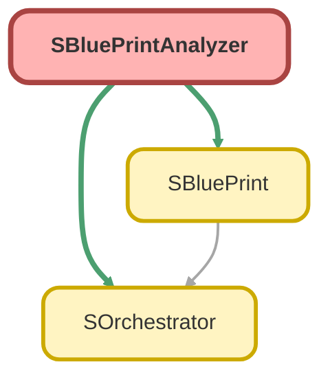

---
hide:
  - path
---

# SBluePrintAnalyzer Class

Analyzes a list of SBlueprints to resolve dependencies and determine the build order. 
This class is responsible for executing the topological sort algorithm.

## Class Diagram



<!-- Apex description -->

## Apex Code

```java
/**
 * Copyright 2025 Hiroyuki Matsuoka
 *
 * Licensed under the Apache License, Version 2.0 (the "License");
 * you may not use this file except in compliance with the License.
 * You may obtain a copy of the License at
 *
 * http://www.apache.org/licenses/LICENSE-2.0
 *
 * Unless required by applicable law or agreed to in writing, software
 * distributed under the License is distributed on an "AS IS" BASIS,
 * WITHOUT WARRANTIES OR CONDITIONS OF ANY KIND, either express or implied.
 * See the License for the specific language governing permissions and
 * limitations under the License.
 */

/**
 * Analyzes a list of SBlueprints to resolve dependencies and determine the build order.
 * This class is responsible for executing the topological sort algorithm.
 */
public with sharing class SBluePrintAnalyzer {
  // =================================================================================
  // Properties
  // =================================================================================

  private List<SBluePrint> sBluePrints;
  private AutoAliasCounter autoAliasCounter;

  // =================================================================================
  // Constructor
  // =================================================================================

  /**
   * Constructs an analyzer for a given list of SBlueprints.
   *
   * @param sBluePrints The root list of SBlueprints to be analyzed.
   */
  public SBluePrintAnalyzer(List<SBluePrint> sBluePrints) {
    this.sBluePrints = sBluePrints;
    this.autoAliasCounter = new AutoAliasCounter();
  }

  // =================================================================================
  // Public Methods
  // =================================================================================

  /**
   * Analyzes the SBlueprints, resolves all dependencies, and returns the build layers.
   * This is the main entry point for the analysis process.
   *
   * @return SOrchestrator.BuildLayers The ordered layers for record creation.
   */
  public SOrchestrator.BuildLayers analyze() {
    AnalysisContext context = this.categorizeBluePrints();
    return this.resolveDependencies(context);
  }

  // =================================================================================
  // Private Analysis Methods
  // =================================================================================

  /**
   * Performs the initial categorization of blueprints into roots and pending dependencies.
   * It recursively traverses the `withChildren` hierarchy.
   *
   * @return AnalysisContext An object containing the initial root blueprints and the list of pending blueprints.
   */
  private AnalysisContext categorizeBluePrints() {
    AnalysisContext context = new AnalysisContext();
    for (SBluePrint sBluePrint : this.sBluePrints) {
      // Ensure every root blueprint has an alias for dependency resolution.
      if (!sBluePrint.hasAlias()) {
        String newAlias = this.generateNewAlias(sBluePrint);
        sBluePrint = sBluePrint.alias(newAlias);
      }

      // Recursively categorize children.
      for (SBluePrint child : sBluePrint.getChildren()) {
        child.setParentBuildPlans(sBluePrint);
        this.categorizeChildBluePrints(context, sBluePrint, child);
      }

      // Add the root blueprint (without its children, which are processed separately) to the context.
      SBluePrint sBluePrintWithoutChildren = sBluePrint.removeChildren();
      if (sBluePrintWithoutChildren.hasDependencies()) {
        PendingBluePrint pendingBluePrint = new PendingBluePrint(sBluePrintWithoutChildren);
        context.addPendingSBluePrint(pendingBluePrint);
      } else {
        context.addRootSBluePrint(sBluePrintWithoutChildren);
      }
    }
    return context;
  }

  /**
   * Recursively categorizes child blueprints, inheriting parent build plans and resolving parent relationships.
   *
   * @param context The shared AnalysisContext to add results to.
   * @param parentBluePrint The parent SBlueprint.
   * @param childBluePrint The child SBlueprint to categorize.
   */
  private void categorizeChildBluePrints(
    AnalysisContext context,
    SBluePrint parentBluePrint,
    SBluePrint childBluePrint
  ) {
    // Automatically add a `use` dependency on the parent.
    String toParentField;
    if (childBluePrint.hasParentIdField()) {
      toParentField = childBluePrint.getParentIdField();
    } else {
      toParentField = this.inferParentField(parentBluePrint, childBluePrint);
    }
    childBluePrint = childBluePrint.use(parentBluePrint.getAlias(), 'Id', toParentField);

    // Generate an automatic alias if one doesn't exist.
    if (!childBluePrint.hasAlias()) {
      String newAlias = this.generateNewAlias(childBluePrint);
      newAlias = parentBluePrint.getAlias() + '_' + newAlias;
      childBluePrint = childBluePrint.alias(newAlias);
    }

    // Continue the recursion for grandchildren.
    for (SBluePrint grandChild : childBluePrint.getChildren()) {
      grandChild.setParentBuildPlans(childBluePrint);
      this.categorizeChildBluePrints(context, childBluePrint, grandChild);
    }

    // Add the processed child blueprint (without its own children) to the context.
    SBluePrint sBluePrintWithoutGrandChildren = childBluePrint.removeChildren();
    if (sBluePrintWithoutGrandChildren.hasDependencies()) {
      PendingBluePrint pendingBluePrint = new PendingBluePrint(sBluePrintWithoutGrandChildren);
      context.addPendingSBluePrint(pendingBluePrint);
    } else {
      // This case is unlikely for a child but included for completeness.
      context.addRootSBluePrint(sBluePrintWithoutGrandChildren);
    }
  }

  /**
   * Resolves the dependency graph using a topological sort algorithm.
   *
   * @param context The context containing initial roots and the pending list.
   * @return SOrchestrator.BuildLayers The fully resolved and ordered build layers.
   * @throws DmlException if a circular reference is detected.
   */
  private SOrchestrator.BuildLayers resolveDependencies(AnalysisContext context) {
    SOrchestrator.BuildLayers buildLayers = new SOrchestrator.BuildLayers();
    Map<String, Integer> aliasDepthMap = new Map<String, Integer>();

    // Initialize with root blueprints (layer 0).
    for (SBluePrint root : context.getRoots()) {
      buildLayers.addSBluePrint(0, root);
      aliasDepthMap.put(root.getAlias(), 0);
      for (String alias : root.generateAllAliases()) {
        aliasDepthMap.put(alias, 0);
      }
    }

    List<PendingBluePrint> pendingBluePrints = context.pendingList;
    Integer maxLayer = 0;
    while (!pendingBluePrints.isEmpty()) {
      Integer startSize = pendingBluePrints.size();

      // Iterate backwards to safely remove items while looping.
      for (Integer i = pendingBluePrints.size() - 1; i >= 0; i--) {
        PendingBluePrint pending = pendingBluePrints[i];
        Integer needResolveCount = pending.getDependencyCount();
        Integer resolvedCount = 0;
        Integer maxDepth = -1;

        // Check if all dependencies for this pending blueprint are now resolved.
        for (String alias : aliasDepthMap.keySet()) {
          if (pending.hasAlias(alias)) {
            resolvedCount++;
            Integer depth = aliasDepthMap.get(alias);
            if (depth > maxDepth) {
              maxDepth = depth;
            }
          }
        }

        if (resolvedCount == needResolveCount) {
          // All dependencies are resolved, so this blueprint can be placed in the next layer.
          SBluePrint resolvedSBluePrint = pending.getSBluePrint();
          Integer currentDepth = maxDepth + 1;
          buildLayers.addSBluePrint(currentDepth, resolvedSBluePrint);

          // Add the newly resolved alias and its potential sequence aliases to the depth map.
          aliasDepthMap.put(resolvedSBluePrint.getAlias(), currentDepth);
          if (currentDepth > maxLayer) {
            maxLayer = currentDepth;
          }
          for (String alias : resolvedSBluePrint.generateAllAliases()) {
            aliasDepthMap.put(alias, currentDepth);
          }

          pendingBluePrints.remove(i);
        }
      }

      // If no progress was made in a full pass, there must be a circular dependency.
      Integer endSize = pendingBluePrints.size();
      if (startSize == endSize) {
        String errorMessage = 'Circular or invalid reference detected below aliases\n';
        errorMessage += 'Resolved aliases: ' + String.join(new List<String>(aliasDepthMap.keySet()), ', ') + '\n';
        for (PendingBluePrint pending : pendingBluePrints) {
          Set<String> dependencies = pending.dependencyAliases;
          errorMessage += String.format(
            ' - {0} (depends on: {1})\n',
            new List<String>{ pending.getSBluePrint().getAlias(), String.join(dependencies, ', ') }
          );
        }
        throw new DmlException(errorMessage);
      }
    }
    return buildLayers;
  }

  // =================================================================================
  // Private Helper Methods
  // =================================================================================

  /**
   * Infers the parent relationship field name by inspecting the parent object's schema.
   *
   * @param parentBluePrint The parent SBlueprint.
   * @param childBluePrint The child SBlueprint.
   * @return The API name of the relationship field on the child object.
   * @throws DmlException if no unique relationship field can be found.
   */
  private String inferParentField(SBluePrint parentBluePrint, SBluePrint childBluePrint) {
    String toParentField;
    SObject parentObject = (SObject) parentBluePrint.getRecordType().newInstance();
    List<Schema.ChildRelationship> childRelationships = parentObject.getSObjectType()
      .getDescribe()
      .getChildRelationships();
    String childSObjectName = childBluePrint.getRecordTypeName();

    for (Schema.ChildRelationship childRelationship : childRelationships) {
      if (childRelationship.getChildSObject().getDescribe().getName() == childSObjectName) {
        if (toParentField != null) {
          String parentObjectName = parentObject.getSObjectType().getDescribe().getName();
          String errorMessage = String.format(
            'The child object has multiple parent relationships with the same parent object. object name: {0}, parent object name: {1}\nPlease specify the relationship name explicitly using the parentIdField() method.',
            new List<String>{ childSObjectName, parentObjectName }
          );
          throw new DmlException(errorMessage);
        }
        toParentField = childRelationship.getField().getDescribe().getName();
      }
    }
    if (toParentField == null) {
      throw new DmlException('No parent relationship field found. Please specify parentIdField.');
    }
    return toParentField;
  }

  /**
   * Generates a new, unique alias for a blueprint that doesn't have one.
   *
   * @param sBluePrint The SBlueprint to generate an alias for.
   * @return The generated alias string.
   */
  private String generateNewAlias(SBluePrint sBluePrint) {
    String newAlias = String.format(
      '__{0}_{1}',
      new List<String>{ sBluePrint.getRecordTypeName(), autoAliasCounter.getValue().toString() }
    );
    newAlias += '_{#}__';
    autoAliasCounter.increment();
    return newAlias;
  }

  // =================================================================================
  // Inner Classes
  // =================================================================================

  /**
   * A simple counter passed by reference to track unique numbers for auto-generated aliases.
   */
  private class AutoAliasCounter {
    private Integer value = 0;
    public Integer getValue() {
      return this.value;
    }
    public void increment() {
      this.value++;
    }
  }

  /**
   * An intermediate container to hold the results of the initial categorization phase.
   */
  private class AnalysisContext {
    private SOrchestrator.BuildLayers buildLayers;
    private List<PendingBluePrint> pendingList;

    public AnalysisContext() {
      this.buildLayers = new SOrchestrator.BuildLayers();
      this.pendingList = new List<PendingBluePrint>();
    }

    public void addRootSBluePrint(SBluePrint sBluePrint) {
      this.buildLayers.addSBluePrint(0, sBluePrint);
    }

    public void addPendingSBluePrint(PendingBluePrint pendingBluePrint) {
      this.pendingList.add(pendingBluePrint);
    }

    public List<SBluePrint> getRoots() {
      return this.buildLayers.getSBluePrintsByLayer(0);
    }
  }

  /**
   * A wrapper for SBlueprints that are waiting for their dependencies to be resolved.
   */
  private class PendingBluePrint {
    private SBluePrint sBluePrint;
    private Set<String> dependencyAliases;

    public PendingBluePrint(SBluePrint sBluePrint) {
      this.sBluePrint = sBluePrint;
      this.dependencyAliases = sBluePrint.getDependencyAliases();
    }

    /**
     * Checks if this pending blueprint depends on the given alias.
     *
     * If it does, the alias is removed from the dependency set for the current resolution pass.
     * @param alias The resolved alias to check against.
     * @return True if the dependency exists.
     */
    public Boolean hasAlias(String alias) {
      if (this.dependencyAliases.contains(alias)) {
        this.dependencyAliases.remove(alias);
        return true;
      }
      // Check for {P0}, {P1}, etc. placeholders
      for (Integer i = 0; i < this.sBluePrint.getParentBuildPlans().size(); i++) {
        String parentShorthandAlias = '{P' + i + '}';
        if (this.dependencyAliases.contains(parentShorthandAlias)) {
          this.dependencyAliases.remove(parentShorthandAlias);
          return true;
        }
      }
      return false;
    }

    public Integer getDependencyCount() {
      return this.sBluePrint.getDependencyAliases().size();
    }

    public SBluePrint getSBluePrint() {
      return this.sBluePrint;
    }
  }
}
```

## Fields
### `sBluePrints`

#### Signature
```apex
private sBluePrints
```

#### Type
List<SBluePrint>

---

### `autoAliasCounter`

#### Signature
```apex
private autoAliasCounter
```

#### Type
AutoAliasCounter

## Constructors
### `SBluePrintAnalyzer(sBluePrints)`

Constructs an analyzer for a given list of SBlueprints.

#### Signature
```apex
public SBluePrintAnalyzer(List<SBluePrint> sBluePrints)
```

#### Parameters
| Name | Type | Description |
|------|------|-------------|
| sBluePrints | List<SBluePrint> | The root list of SBlueprints to be analyzed. |

## Methods
### `analyze()`

Analyzes the SBlueprints, resolves all dependencies, and returns the build layers. 
This is the main entry point for the analysis process.

#### Signature
```apex
public SOrchestrator.BuildLayers analyze()
```

#### Return Type
**SOrchestrator.BuildLayers**

SOrchestrator.BuildLayers The ordered layers for record creation.

---

### `categorizeBluePrints()`

Performs the initial categorization of blueprints into roots and pending dependencies. 
It recursively traverses the `withChildren` hierarchy.

#### Signature
```apex
private AnalysisContext categorizeBluePrints()
```

#### Return Type
**AnalysisContext**

AnalysisContext An object containing the initial root blueprints and the list of pending blueprints.

---

### `categorizeChildBluePrints(context, parentBluePrint, childBluePrint)`

Recursively categorizes child blueprints, inheriting parent build plans and resolving parent relationships.

#### Signature
```apex
private void categorizeChildBluePrints(AnalysisContext context, SBluePrint parentBluePrint, SBluePrint childBluePrint)
```

#### Parameters
| Name | Type | Description |
|------|------|-------------|
| context | AnalysisContext | The shared AnalysisContext to add results to. |
| parentBluePrint | [SBluePrint](SBluePrint.md) | The parent SBlueprint. |
| childBluePrint | [SBluePrint](SBluePrint.md) | The child SBlueprint to categorize. |

#### Return Type
**void**

---

### `resolveDependencies(context)`

Resolves the dependency graph using a topological sort algorithm.

#### Signature
```apex
private SOrchestrator.BuildLayers resolveDependencies(AnalysisContext context)
```

#### Parameters
| Name | Type | Description |
|------|------|-------------|
| context | AnalysisContext | The context containing initial roots and the pending list. |

#### Return Type
**SOrchestrator.BuildLayers**

SOrchestrator.BuildLayers The fully resolved and ordered build layers.

#### Throws
DmlException: if a circular reference is detected.

---

### `inferParentField(parentBluePrint, childBluePrint)`

Infers the parent relationship field name by inspecting the parent object&#x27;s schema.

#### Signature
```apex
private String inferParentField(SBluePrint parentBluePrint, SBluePrint childBluePrint)
```

#### Parameters
| Name | Type | Description |
|------|------|-------------|
| parentBluePrint | [SBluePrint](SBluePrint.md) | The parent SBlueprint. |
| childBluePrint | [SBluePrint](SBluePrint.md) | The child SBlueprint. |

#### Return Type
**String**

The API name of the relationship field on the child object.

#### Throws
DmlException: if no unique relationship field can be found.

---

### `generateNewAlias(sBluePrint)`

Generates a new, unique alias for a blueprint that doesn&#x27;t have one.

#### Signature
```apex
private String generateNewAlias(SBluePrint sBluePrint)
```

#### Parameters
| Name | Type | Description |
|------|------|-------------|
| sBluePrint | [SBluePrint](SBluePrint.md) | The SBlueprint to generate an alias for. |

#### Return Type
**String**

The generated alias string.

## Classes
### AutoAliasCounter Class

A simple counter passed by reference to track unique numbers for auto-generated aliases.

#### Fields
##### `value`

###### Signature
```apex
private value
```

###### Type
Integer

#### Methods
##### `getValue()`

###### Signature
```apex
public Integer getValue()
```

###### Return Type
**Integer**

---

##### `increment()`

###### Signature
```apex
public void increment()
```

###### Return Type
**void**

### AnalysisContext Class

An intermediate container to hold the results of the initial categorization phase.

#### Fields
##### `buildLayers`

###### Signature
```apex
private buildLayers
```

###### Type
SOrchestrator.BuildLayers

---

##### `pendingList`

###### Signature
```apex
private pendingList
```

###### Type
List<PendingBluePrint>

#### Constructors
##### `AnalysisContext()`

###### Signature
```apex
public AnalysisContext()
```

#### Methods
##### `addRootSBluePrint(sBluePrint)`

###### Signature
```apex
public void addRootSBluePrint(SBluePrint sBluePrint)
```

###### Parameters
| Name | Type | Description |
|------|------|-------------|
| sBluePrint | [SBluePrint](SBluePrint.md) |  |

###### Return Type
**void**

---

##### `addPendingSBluePrint(pendingBluePrint)`

###### Signature
```apex
public void addPendingSBluePrint(PendingBluePrint pendingBluePrint)
```

###### Parameters
| Name | Type | Description |
|------|------|-------------|
| pendingBluePrint | PendingBluePrint |  |

###### Return Type
**void**

---

##### `getRoots()`

###### Signature
```apex
public List<SBluePrint> getRoots()
```

###### Return Type
**List<SBluePrint>**

### PendingBluePrint Class

A wrapper for SBlueprints that are waiting for their dependencies to be resolved.

#### Fields
##### `sBluePrint`

###### Signature
```apex
private sBluePrint
```

###### Type
[SBluePrint](SBluePrint.md)

---

##### `dependencyAliases`

###### Signature
```apex
private dependencyAliases
```

###### Type
Set<String>

#### Constructors
##### `PendingBluePrint(sBluePrint)`

###### Signature
```apex
public PendingBluePrint(SBluePrint sBluePrint)
```

###### Parameters
| Name | Type | Description |
|------|------|-------------|
| sBluePrint | [SBluePrint](SBluePrint.md) |  |

#### Methods
##### `hasAlias(alias)`

Checks if this pending blueprint depends on the given alias. 
 
If it does, the alias is removed from the dependency set for the current resolution pass.

###### Signature
```apex
public Boolean hasAlias(String alias)
```

###### Parameters
| Name | Type | Description |
|------|------|-------------|
| alias | String | The resolved alias to check against. |

###### Return Type
**Boolean**

True if the dependency exists.

---

##### `getDependencyCount()`

###### Signature
```apex
public Integer getDependencyCount()
```

###### Return Type
**Integer**

---

##### `getSBluePrint()`

###### Signature
```apex
public SBluePrint getSBluePrint()
```

###### Return Type
**[SBluePrint](SBluePrint.md)**