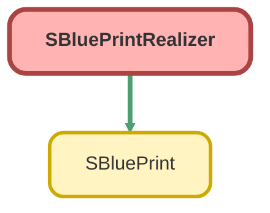

---
hide:
  - path
---

# SBluePrintRealizer Class

Realizes SBlueprint definitions into SObject instances. 
This class is responsible for the recursive creation of records based on parent-child relationships 
defined in SBlueprints, resolving aliases and dependencies along the way.

## Class Diagram



<!-- Apex description -->

## Apex Code

```java
/**
 * Copyright 2025 Hiroyuki Matsuoka
 *
 * Licensed under the Apache License, Version 2.0 (the "License");
 * you may not use this file except in compliance with the License.
 * You may obtain a copy of the License at
 *
 * http://www.apache.org/licenses/LICENSE-2.0
 *
 * Unless required by applicable law or agreed to in writing, software
 * distributed under the License is distributed on an "AS IS" BASIS,
 * WITHOUT WARRANTIES OR CONDITIONS OF ANY KIND, either express or implied.
 * See the License for the specific language governing permissions and
 * limitations under the License.
 */

/**
 * Realizes SBlueprint definitions into SObject instances.
 * This class is responsible for the recursive creation of records based on parent-child relationships
 * defined in SBlueprints, resolving aliases and dependencies along the way.
 */
public with sharing class SBluePrintRealizer {
  // =================================================================================
  // Properties
  // =================================================================================

  private SBluePrint sBluePrint;
  private Map<String, SObject> aliasToSObject;
  private Map<String, String> parentPositionToAlias;
  private Integer parentPosition;

  // =================================================================================
  // Constructor
  // =================================================================================

  /**
   * Constructs a realizer for a specific SBlueprint within a given context.
   *
   * @param sBlueprint The SBlueprint to realize.
   * @param aliasToSObject A map of already realized aliases to their SObjects.
   * @param parentPositionToAlias A map of parent placeholders (e.g., 'P0') to their resolved aliases.
   * @param parentPosition The current depth in the parent-child hierarchy.
   */
  public SBluePrintRealizer(
    SBlueprint sBluePrint,
    Map<String, SObject> aliasToSObject,
    Map<String, String> parentPositionToAlias,
    Integer parentPosition
  ) {
    this.sBluePrint = sBluePrint;
    this.aliasToSObject = aliasToSObject;
    this.parentPositionToAlias = parentPositionToAlias;
    this.parentPosition = parentPosition;
  }

  // =================================================================================
  // Public Methods
  // =================================================================================

  /**
   * Executes the realization process.
   *
   * This is the main entry point that dispatches to the appropriate realization logic.
   * @return A map of newly created aliases to their SObject instances for the current scope.
   */
  public Map<String, SObject> realize() {
    if (this.sBluePrint.hasParentBuildPlans()) {
      return this.realizeWithParentPlans();
    }

    return this.realizeBase();
  }

  // =================================================================================
  // Private Realization Logic
  // =================================================================================

  /**
   * Handles the recursive part of the realization. It processes one layer of parent build plans
   * and calls `realize()` again for the next layer.
   *
   * @return A map of all SObjects created within this recursive branch.
   */
  private Map<String, SObject> realizeWithParentPlans() {
    Map<String, SObject> newAliasToSObject = new Map<String, SObject>();
    String nextParentPosition = 'P' + parentPosition;

    // Process only the first (current) parent build plan. The rest are handled by recursion.
    SBlueprint.ParentBuildPlan parentBuildPlan = this.sBluePrint.getParentBuildPlans()[0];

    for (Integer j = 0; j < parentBuildPlan.insertNumber; j++) {
      SBlueprint copiedSBlueprint = this.sBluePrint.deepCopy();

      Integer parentSequence = parentBuildPlan.parentAlias.startAt + (parentBuildPlan.parentAlias.interval * j);
      String resolvedParentAlias = this.resolveValue(
          parentBuildPlan.parentAlias.alias,
          parentSequence,
          this.parentPositionToAlias
        )
        .toString();

      Map<String, String> newParentPositionToAlias = this.parentPositionToAlias.clone();
      newParentPositionToAlias.put(nextParentPosition, resolvedParentAlias);

      // Replace parent placeholders in dependencies and alias definitions on the copy
      this.replaceParentPlaceholders(copiedSBlueprint, parentBuildPlan, nextParentPosition);

      // Remove the processed parent plan and recurse
      copiedSBlueprint.getParentBuildPlans().remove(0);

      SBlueprintRealizer childRealizer = new SBlueprintRealizer(
        copiedSBlueprint,
        this.aliasToSObject,
        newParentPositionToAlias,
        parentPosition + 1
      );
      Map<String, SObject> childAliasToSObject = childRealizer.realize();

      // Merge the results from the recursive call
      for (String childAlias : childAliasToSObject.keySet()) {
        if (newAliasToSObject.containsKey(childAlias)) {
          String errorMessage = String.format(
            'Duplicate alias detected: {0}\nAliases must be unique across all SBlueprint definitions to ensure records can be correctly identified. Please provide a unique alias.',
            new List<String>{ childAlias }
          );
          throw new DmlException(errorMessage);
        }
        newAliasToSObject.put(childAlias, childAliasToSObject.get(childAlias));
      }
    }
    return newAliasToSObject;
  }

  /**
   * Handles the base case of the recursion. It creates the actual SObject instances
   *
   * when no more parent build plans are left to process.
   * @return A map of newly created aliases to their SObject instances.
   */
  private Map<String, SObject> realizeBase() {
    Map<String, SObject> newAliasToSObject = new Map<String, SObject>();
    for (Integer i = 0; i < this.sBluePrint.getInsertNumber(); i++) {
      SObject sobj = (SObject) this.sBluePrint.getRecordType().newInstance();

      // Set field values
      for (String field : this.sBluePrint.getFieldValues().keySet()) {
        SBlueprint.ValueDefinition valueDefinition = this.sBluePrint.getFieldValues().get(field);
        Integer currentSequence = valueDefinition.startAt + (valueDefinition.interval * i);
        Object resolvedValue = this.resolveValue(
          valueDefinition.value,
          currentSequence,
          this.parentPositionToAlias
        );
        sobj.put(field, resolvedValue);
      }

      // Resolve dependencies
      for (SBlueprint.Dependency dependency : this.sBluePrint.getDependencies()) {
        Integer dependencySequence = dependency.startAt + (dependency.interval * i);
        String resolvedDependencyAlias = this.resolveValue(
            dependency.alias,
            dependencySequence,
            this.parentPositionToAlias
          )
          .toString();

        if (!this.aliasToSObject.containsKey(resolvedDependencyAlias)) {
          throw new DmlException(
            'Alias \'' +
              resolvedDependencyAlias +
              '\' not found. Available aliases: ' +
              String.join(aliasToSObject.keySet(), ', ')
          );
        }

        SObject fromRecord = this.aliasToSObject.get(resolvedDependencyAlias);
        Object value = fromRecord.get(dependency.fromField);
        sobj.put(dependency.toField, value);
      }

      // Generate and assign the final alias for the new SObject
      SBlueprint.AliasDefinition currentAliasDefinition = this.sBluePrint.getAliasDefinition();
      Integer currentAliasSequence = currentAliasDefinition.startAt + (currentAliasDefinition.interval * i);
      String resolvedCurrentAlias = this.resolveValue(
          currentAliasDefinition.alias,
          currentAliasSequence,
          this.parentPositionToAlias
        )
        .toString();

      if (newAliasToSObject.containsKey(resolvedCurrentAlias)) {
        String errorMessage = String.format(
          'Duplicate alias detected: {0}\nAliases must be unique across all SBlueprint definitions to ensure records can be correctly identified. Please provide a unique alias.',
          new List<String>{ resolvedCurrentAlias }
        );
        throw new DmlException(errorMessage);
      }
      newAliasToSObject.put(resolvedCurrentAlias, sobj);
    }
    return newAliasToSObject;
  }

  // =================================================================================
  // Private Helper Methods
  // =================================================================================

  /**
   * Replaces parent placeholders (like {P0}) in a blueprint's dependencies and alias definition.
   * This method modifies the passed-in SBlueprint instance.
   *
   * @param blueprint The SBlueprint to modify.
   * @param parentBuildPlan The parent build plan containing the original alias pattern.
   * @param nextParentPosition The placeholder string (e.g., 'P0') to replace with.
   */
  private void replaceParentPlaceholders(
    SBlueprint blueprint,
    SBlueprint.ParentBuildPlan parentBuildPlan,
    String nextParentPosition
  ) {
    for (SBlueprint.Dependency dependency : blueprint.getDependencies()) {
      if (dependency.alias.contains(parentBuildPlan.parentAlias.alias)) {
        dependency.alias = dependency.alias.replace(
          parentBuildPlan.parentAlias.alias,
          '{' + nextParentPosition + '}'
        );
      }
    }
    String currentAlias = blueprint.getAliasDefinition().alias;
    if (currentAlias.contains(parentBuildPlan.parentAlias.alias)) {
      currentAlias = currentAlias.replace(parentBuildPlan.parentAlias.alias, '{' + nextParentPosition + '}');
      blueprint.getAliasDefinition().alias = currentAlias;
    }
  }

  /**
   * Resolves a template value by replacing sequence and parent placeholders.
   *
   * @param templateValue The template value containing placeholders.
   * @param sequence The current sequence number.
   * @param parentPositionToAlias A map of parent placeholders to their resolved aliases.
   * @return The resolved value.
   */
  private Object resolveValue(Object templateValue, Integer sequence, Map<String, String> parentPositionToAlias) {
    if (!(templateValue instanceof String)) {
      return templateValue;
    }
    parentPositionToAlias = parentPositionToAlias == null ? new Map<String, String>() : parentPositionToAlias;

    String value = (String) templateValue;

    if (value == '{#}') {
      return sequence;
    }

    String resolvedString = value.replace('{#}', String.valueOf(sequence))
      .replace('{A}', this.convertNumberToAlphabet(sequence, true))
      .replace('{a}', this.convertNumberToAlphabet(sequence, false));

    for (String key : parentPositionToAlias.keySet()) {
      String placeholder = '{' + key + '}';
      if (resolvedString.contains(placeholder)) {
        resolvedString = resolvedString.replace(placeholder, parentPositionToAlias.get(key));
      }
    }

    return resolvedString;
  }

  /**
   * Converts a positive integer to its corresponding alphabetic representation.
   *
   * @param num The positive integer to convert.
   * @param isUpperCase If true, returns uppercase letters; otherwise, lowercase.
   * @return The alphabetic representation of the number.
   */
  private String convertNumberToAlphabet(Integer num, Boolean isUpperCase) {
    if (num == null || num <= 0) {
      return '';
    }
    final Integer BASE_CHAR_CODE = isUpperCase ? 65 : 97;
    final Integer BASE = 26;
    String result = '';
    Integer current = num;
    while (current > 0) {
      Integer remainder = Math.mod(current - 1, BASE);
      Integer charCode = BASE_CHAR_CODE + remainder;
      result = String.fromCharArray(new List<Integer>{ charCode }) + result;
      current = (current - remainder) / BASE;
    }
    return result;
  }
}
```

## Fields
### `sBluePrint`

#### Signature
```apex
private sBluePrint
```

#### Type
[SBluePrint](SBluePrint.md)

---

### `aliasToSObject`

#### Signature
```apex
private aliasToSObject
```

#### Type
Map<String,SObject>

---

### `parentPositionToAlias`

#### Signature
```apex
private parentPositionToAlias
```

#### Type
Map<String,String>

---

### `parentPosition`

#### Signature
```apex
private parentPosition
```

#### Type
Integer

## Constructors
### `SBluePrintRealizer(sBluePrint, aliasToSObject, parentPositionToAlias, parentPosition)`

Constructs a realizer for a specific SBlueprint within a given context.

#### Signature
```apex
public SBluePrintRealizer(SBlueprint sBluePrint, Map<String,SObject> aliasToSObject, Map<String,String> parentPositionToAlias, Integer parentPosition)
```

#### Parameters
| Name | Type | Description |
|------|------|-------------|
| sBluePrint | SBlueprint | The SBlueprint to realize. |
| aliasToSObject | Map<String,SObject> | A map of already realized aliases to their SObjects. |
| parentPositionToAlias | Map<String,String> | A map of parent placeholders (e.g., &#x27;P0&#x27;) to their resolved aliases. |
| parentPosition | Integer | The current depth in the parent-child hierarchy. |

## Methods
### `realize()`

Executes the realization process. 
 
This is the main entry point that dispatches to the appropriate realization logic.

#### Signature
```apex
public Map<String,SObject> realize()
```

#### Return Type
**Map<String,SObject>**

A map of newly created aliases to their SObject instances for the current scope.

---

### `realizeWithParentPlans()`

Handles the recursive part of the realization. It processes one layer of parent build plans 
and calls `realize()` again for the next layer.

#### Signature
```apex
private Map<String,SObject> realizeWithParentPlans()
```

#### Return Type
**Map<String,SObject>**

A map of all SObjects created within this recursive branch.

---

### `realizeBase()`

Handles the base case of the recursion. It creates the actual SObject instances 
 
when no more parent build plans are left to process.

#### Signature
```apex
private Map<String,SObject> realizeBase()
```

#### Return Type
**Map<String,SObject>**

A map of newly created aliases to their SObject instances.

---

### `replaceParentPlaceholders(blueprint, parentBuildPlan, nextParentPosition)`

Replaces parent placeholders (like {P0}) in a blueprint&#x27;s dependencies and alias definition. 
This method modifies the passed-in SBlueprint instance.

#### Signature
```apex
private void replaceParentPlaceholders(SBlueprint blueprint, SBlueprint.ParentBuildPlan parentBuildPlan, String nextParentPosition)
```

#### Parameters
| Name | Type | Description |
|------|------|-------------|
| blueprint | SBlueprint | The SBlueprint to modify. |
| parentBuildPlan | SBlueprint.ParentBuildPlan | The parent build plan containing the original alias pattern. |
| nextParentPosition | String | The placeholder string (e.g., &#x27;P0&#x27;) to replace with. |

#### Return Type
**void**

---

### `resolveValue(templateValue, sequence, parentPositionToAlias)`

Resolves a template value by replacing sequence and parent placeholders.

#### Signature
```apex
private Object resolveValue(Object templateValue, Integer sequence, Map<String,String> parentPositionToAlias)
```

#### Parameters
| Name | Type | Description |
|------|------|-------------|
| templateValue | Object | The template value containing placeholders. |
| sequence | Integer | The current sequence number. |
| parentPositionToAlias | Map<String,String> | A map of parent placeholders to their resolved aliases. |

#### Return Type
**Object**

The resolved value.

---

### `convertNumberToAlphabet(num, isUpperCase)`

Converts a positive integer to its corresponding alphabetic representation.

#### Signature
```apex
private String convertNumberToAlphabet(Integer num, Boolean isUpperCase)
```

#### Parameters
| Name | Type | Description |
|------|------|-------------|
| num | Integer | The positive integer to convert. |
| isUpperCase | Boolean | If true, returns uppercase letters; otherwise, lowercase. |

#### Return Type
**String**

The alphabetic representation of the number.