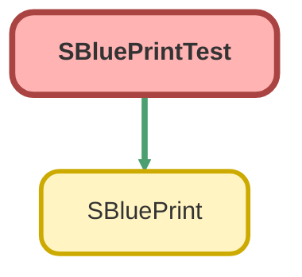

---
hide:
  - path
---

# SBluePrintTest Class

`ISTEST`

## Class Diagram



<!-- Apex description -->

## Apex Code

```java
@isTest
public with sharing class SBluePrintTest {
  @isTest
  static void testOf_WhenAddRecordType_ThenCreateSBluePrint() {
    // Arrange
    System.Type recordType = Account.class;

    // Act
    SBluePrint sBluePrint = SBluePrint.of(recordType);
    // Assert
    Assert.areEqual(recordType, sBluePrint.recordType, 'RecordType should be set');
  }

  @isTest
  static void testOf_WhenRecordTypeIsNull_ThenThrowException() {
    // Arrange
    System.Type recordType = null;

    // Act & Assert
    try {
      SBluePrint sBluePrint = SBluePrint.of(recordType);
      Assert.fail('Exception should be thrown');
    } catch (DmlException e) {
      String actual = e.getMessage();
      System.debug(actual);
      String expected = 'RecordType must not be null';
      Assert.areEqual(expected, actual);
    }
  }

  @isTest
  static void testOf_WhenRecordTypeIsNotSObject_ThenThrowException() {
    // Arrange
    System.Type recordType = String.class;

    // Act & Assert
    try {
      SBluePrint sBluePrint = SBluePrint.of(recordType);
      Assert.fail('Exception should be thrown');
    } catch (DmlException e) {
      String actual = e.getMessage();
      System.debug(actual);
      String expected = 'RecordType must be SObject type';
      Assert.areEqual(expected, actual);
    }
  }

  @isTest
  static void testSet_WhenAddFieldValue_ThenReturnNewSBluePrintWithFieldValue() {
    // Arrange
    SBluePrint sBluePrint = SBluePrint.of(Account.class);
    String fieldName = 'Name';
    String fieldValue = 'Test Account';

    // Act
    SBluePrint newSBluePrint = sBluePrint.set(fieldName, fieldValue);

    // Assert
    Assert.areEqual('Test Account', newSBluePrint.fieldValues.get(fieldName).value, 'Field value should be set');
  }

  @isTest
  static void testSet_WhenAddWithStartAt_ThenReturnNewSBluePrintWithFieldValue() {
    // Arrange
    SBluePrint sBluePrint = SBluePrint.of(Account.class);
    String fieldName = 'Name';
    String fieldValue = 'Test Account {#}';
    Integer startAt = 1;
    Integer times = 3;

    // Act
    SBluePrint newSBluePrint = sBluePrint.set(fieldName, fieldValue, startAt).times(times);
    
    // Assert
    SBluePrint.ValueDefinition valueDef = newSBluePrint.fieldValues.get(fieldName);
    Assert.areEqual(fieldValue, valueDef.value, 'Field value should be set');
    Assert.areEqual(startAt, valueDef.startAt, 'StartAt should be set');
    Assert.areEqual(1, valueDef.interval, 'Interval should be default 1');
  }

  @isTest
  static void testSet_WhendAddWithMinusStartAtValue_ThenThrowException() {
    // Arrange
    SBluePrint sBluePrint = SBluePrint.of(Account.class);
    String fieldName = 'Name';
    String fieldValue = 'Test Account {#}';
    Integer startAt = -1;
    Integer times = 3;

    // Act & Assert
    try {
      SBluePrint newSBluePrint = sBluePrint.set(fieldName, fieldValue, startAt).times(times);
      Assert.fail('Exception should be thrown');
    } catch (DmlException e) {
      String actual = e.getMessage();
      System.debug(actual);
      String expected = 'startAt must be greater than 0';
      Assert.areEqual(expected, actual);
    }
  }

  @isTest
  static void testSet_WhenAddWithStartAtAndInterval_ThenReturnNewSBluePrintWithFieldValue() {
    // Arrange
    SBluePrint sBluePrint = SBluePrint.of(Account.class);
    String fieldName = 'Name';
    String fieldValue = 'Test Account {#}';
    Integer startAt = 10;
    Integer interval = 2;
    Integer times = 3;

    // Act
    SBluePrint newSBluePrint = sBluePrint.set(fieldName, fieldValue, startAt, interval).times(times);
    
    // Assert
    SBluePrint.ValueDefinition valueDef = newSBluePrint.fieldValues.get(fieldName);
    Assert.areEqual(fieldValue, valueDef.value, 'Field value should be set');
    Assert.areEqual(startAt, valueDef.startAt, 'StartAt should be set');
    Assert.areEqual(interval, valueDef.interval, 'Interval should be set');
  }

  @isTest
  static void testSet_WhendAddWithMinusIntervalValue_ThenThrowException() {
    // Arrange
    SBluePrint sBluePrint = SBluePrint.of(Account.class);
    String fieldName = 'Name';
    String fieldValue = 'Test Account {#}';
    Integer startAt = 1;
    Integer interval = -1;
    Integer times = 3;

    // Act & Assert
    try {
      SBluePrint newSBluePrint = sBluePrint.set(fieldName, fieldValue, startAt, interval).times(times);
      Assert.fail('Exception should be thrown');
    } catch (DmlException e) {
      String actual = e.getMessage();
      System.debug(actual);
      String expected = 'interval must be greater than 0';
      Assert.areEqual(expected, actual);
    }
  }

  @isTest
  static void testTemplate_WhenAddTemplate_ThenReturnNewSBluePrint() {
    // Arrange
    SBluePrint sBluePrint = SBluePrint.of(Account.class);
    Map<String, Object> template = new Map<String, Object>{ 'Name' => 'Test Account', 'Industry' => 'Technology' };

    // Act
    SBluePrint newSBluePrint = sBluePrint.template(template);

    // Assert
    Assert.areEqual(
      'Test Account',
      newSBluePrint.fieldValues.get('Name').value,
      'Name should be set from template'
    );
    Assert.areEqual(
      'Technology',
      newSBluePrint.fieldValues.get('Industry').value,
      'Industry should be set from template'
    );
  }

  @isTest
  static void testTemplate_WhenAddTemplateAfterSet_ThenReturnNewInstanceWithTemplateValue() {
    // Arrange
    SBluePrint sBluePrint = SBluePrint.of(Account.class);
    sBluePrint = sBluePrint.set('Name', 'Test Account');
    Map<String, Object> template = new Map<String, Object>{ 'Name' => 'Template Account'};

    // Act
    SBluePrint newSBluePrint = sBluePrint.template(template);

    // Assert
    Assert.areEqual('Template Account', newSBluePrint.fieldValues.get('Name').value, 'Name should be set from template');
  }

  @isTest
  static void testUse_WhenAddUseAlias_ThenReturnNewSBluePrintWithUseAlias() {
    // Arrange
    SBluePrint sBluePrint = SBluePrint.of(Opportunity.class);
    String alias = 'parentAccount';
    String fromField = 'Id';
    String toField = 'AccountId';

    // Act
    SBluePrint newSBluePrint = sBluePrint.use(alias, fromField, toField);

    // Assert
    Assert.areEqual(1, newSBluePrint.getDependencies().size(), 'UseAlias should be added');
    List<SbluePrint.Dependency> dependencies = newSBluePrint.getDependencies(); 
    SBluePrint.Dependency dependency = dependencies[0];
    Assert.areEqual(alias, dependency.alias, 'Alias should be set');
    Assert.areEqual(fromField, dependency.fromField, 'FromField should be set');
    Assert.areEqual(toField, dependency.toField, 'ToField should be set');
  }

  @isTest
  static void testUse_WhenAddUseAliasWithStartAt_ThenReturnNewSBluePrintWithUseAlias() {
    // Arrange
    SBluePrint sBluePrint = SBluePrint.of(Opportunity.class);
    String alias = 'parentAccount';
    String fromField = 'Id';
    String toField = 'AccountId';
    Integer startAt = 1;
    Integer times = 3;

    // Act
    SBluePrint newSBluePrint = sBluePrint.use(alias, fromField, toField, startAt).times(times);

    // Assert
    Assert.areEqual(1, newSBluePrint.getDependencies().size(), 'UseAlias should be added');
    List<SbluePrint.Dependency> dependencies = newSBluePrint.getDependencies(); 
    SBluePrint.Dependency dependency = dependencies[0];
    Assert.areEqual(alias, dependency.alias, 'Alias should be set');
    Assert.areEqual(fromField, dependency.fromField, 'FromField should be set');
    Assert.areEqual(toField, dependency.toField, 'ToField should be set');
    Assert.areEqual(startAt, dependency.startAt, 'StartAt should be set');
    Assert.areEqual(1, dependency.interval, 'Interval should be default 1');
  }

  @isTest
  static void testUse_WhenAddUseAliasWIthStartAtAndInterval_ThenReturnNewSBluePrintWithUseAlias() {
    // Arrange
    SBluePrint sBluePrint = SBluePrint.of(Opportunity.class);
    String alias = 'parentAccount';
    String fromField = 'Id';
    String toField = 'AccountId';
    Integer startAt = 10;
    Integer interval = 2;
    Integer times = 3;

    // Act
    SBluePrint newSBluePrint = sBluePrint.use(alias, fromField, toField, startAt, interval).times(times);

    // Assert
    Assert.areEqual(1, newSBluePrint.getDependencies().size(), 'UseAlias should be added');
    List<SbluePrint.Dependency> dependencies = newSBluePrint.getDependencies(); 
    SBluePrint.Dependency dependency = dependencies[0];
    Assert.areEqual(alias, dependency.alias, 'Alias should be set');
    Assert.areEqual(fromField, dependency.fromField, 'FromField should be set');
    Assert.areEqual(toField, dependency.toField, 'ToField should be set');
    Assert.areEqual(startAt, dependency.startAt, 'StartAt should be set');
    Assert.areEqual(interval, dependency.interval, 'Interval should be set');
  }

  @isTest
  static void testUse_WhenAliasIsNull_ThenThrowException() {
    // Arrange
    SBluePrint sBluePrint = SBluePrint.of(Opportunity.class);
    String alias = null;
    String fromField = 'Id';
    String toField = 'AccountId';

    // Act & Assert
    try {
      SBluePrint newSBluePrint = sBluePrint.use(alias, fromField, toField);
      Assert.fail('Exception should be thrown');
    } catch (DmlException e) {
      String actual = e.getMessage();
      System.debug(actual);
      String expected = 'alias must not be null';
      Assert.areEqual(expected, actual);
    }
  }

  @isTest
  static void testUse_WhenFromFieldIsNull_ThenThrowException() {
    // Arrange
    SBluePrint sBluePrint = SBluePrint.of(Opportunity.class);
    String alias = 'parentAccount';
    String fromField = null;
    String toField = 'AccountId';

    // Act & Assert
    try {
      SBluePrint newSBluePrint = sBluePrint.use(alias, fromField, toField);
      Assert.fail('Exception should be thrown');
    } catch (DmlException e) {
      String actual = e.getMessage();
      System.debug(actual);
      String expected = 'fromField must not be null';
      Assert.areEqual(expected, actual);
    }
  }

  @isTest
  static void testUse_WhenToFieldIsNull_ThenThrowException() {
    // Arrange
    SBluePrint sBluePrint = SBluePrint.of(Opportunity.class);
    String alias = 'parentAccount';
    String fromField = 'Id';
    String toField = null;

    // Act & Assert
    try {
      SBluePrint newSBluePrint = sBluePrint.use(alias, fromField, toField);
      Assert.fail('Exception should be thrown');
    } catch (DmlException e) {
      String actual = e.getMessage();
      System.debug(actual);
      String expected = 'toField must not be null';
      Assert.areEqual(expected, actual);
    }
  }

  @isTest
  static void testUse_WhenAddUseAliasWithMinusStartAtValue_ThenThrowException() {
    // Arrange
    SBluePrint sBluePrint = SBluePrint.of(Opportunity.class);
    String alias = 'parentAccount';
    String fromField = 'Id';
    String toField = 'AccountId';
    Integer startAt = -1;
    Integer times = 3;
    // Act & Assert
    try {
      SBluePrint newSBluePrint = sBluePrint.use(alias, fromField, toField, startAt).times(times);
      Assert.fail('Exception should be thrown');
    } catch (DmlException e) {
      String actual = e.getMessage();
      System.debug(actual);
      String expected = 'startAt must be greater than 0';
      Assert.areEqual(expected, actual);
    }
  }

  @isTest
  static void testUse_WhenAddUseAliasWithMinusIntervalValue_ThenThrowException() {
    // Arrange
    SBluePrint sBluePrint = SBluePrint.of(Opportunity.class);
    String alias = 'parentAccount';
    String fromField = 'Id';
    String toField = 'AccountId';
    Integer startAt = 1;
    Integer interval = -1;
    Integer times = 3;

    // Act & Assert
    try {
      SBluePrint newSBluePrint = sBluePrint.use(alias, fromField, toField, startAt, interval).times(times);
      Assert.fail('Exception should be thrown');
    } catch (DmlException e) {
      String actual = e.getMessage();
      System.debug(actual);
      String expected = 'interval must be greater than 0';
      Assert.areEqual(expected, actual);
    }
  }

  @isTest
  static void testAlias_WhenAddAlias_ThenReturnNewSBluePrintWithAlias() {
    // Arrange
    SBluePrint sBluePrint = SBluePrint.of(Account.class);
    String alias = 'acc';

    // Act
    SBluePrint newSBluePrint = sBluePrint.alias(alias);

    // Assert

    Assert.areEqual(alias, newSBluePrint.getAlias(), 'Alias should be set');
  }

  @isTest
  static void testAlias_WhenAddAliasWithStartAt_ThenReturnNewSBluePrintWithAlias() {
    // Arrange
    SBluePrint sBluePrint = SBluePrint.of(Account.class);
    String alias = 'acc';
    Integer startAt = 1;
    Integer times = 3;

    // Act
    SBluePrint newSBluePrint = sBluePrint.alias(alias, startAt).times(times);

    // Assert
    SBluePrint.AliasDefinition aliasDef = newSBluePrint.getAliasDefinition();
    Assert.areEqual(alias, aliasDef.alias, 'Alias should be set');
    Assert.areEqual(startAt, aliasDef.startAt, 'AliasStartAt should be set');
    Assert.areEqual(1, aliasDef.interval, 'AliasInterval should be default 1');
  }

  @isTest
  static void testAlias_WhenAddAliasWithStartAtAndInterval_ThenReturnNewSBluePrintWithAlias() {
    // Arrange
    SBluePrint sBluePrint = SBluePrint.of(Account.class);
    String alias = 'acc';
    Integer startAt = 10;
    Integer interval = 2;
    Integer times = 3;

    // Act
    SBluePrint newSBluePrint = sBluePrint.alias(alias, startAt, interval).times(times);

    // Assert
    SBluePrint.AliasDefinition aliasDef = newSBluePrint.getAliasDefinition();
    Assert.areEqual(alias, aliasDef.alias, 'Alias should be set');
    Assert.areEqual(startAt, aliasDef.startAt, 'AliasStartAt should be set');
    Assert.areEqual(interval, aliasDef.interval, 'AliasInterval should be set');
  }

  @isTest
  static void testAlias_WhenAliasIsNull_ThenThrowException() {
    // Arrange
    SBluePrint sBluePrint = SBluePrint.of(Account.class);
    String alias = null;
    // Act & Assert
    try {
      SBluePrint newSBluePrint = sBluePrint.alias(alias);
      Assert.fail('Exception should be thrown');
    } catch (DmlException e) {
      String actual = e.getMessage();
      System.debug(actual);
      String expected = 'alias must not be null';
      Assert.areEqual(expected, actual);
    }
  }

  @isTest
  static void testAlias_WhenAddAliasWithMinusStartAtValue_ThenThrowException() {
    // Arrange
    SBluePrint sBluePrint = SBluePrint.of(Account.class);
    String alias = 'acc';
    Integer startAt = -1;
    Integer times = 3;
    // Act & Assert
    try {
      SBluePrint newSBluePrint = sBluePrint.alias(alias, startAt).times(times);
      Assert.fail('Exception should be thrown');
    } catch (DmlException e) {
      String actual = e.getMessage();
      System.debug(actual);
      String expected = 'startAt must be greater than 0';
      Assert.areEqual(expected, actual);
    }
  }

  @isTest
  static void testAlias_WhenAddAliasWithMinusIntervalValue_ThenThrowException() {
    // Arrange
    SBluePrint sBluePrint = SBluePrint.of(Account.class);
    String alias = 'acc';
    Integer startAt = 1;
    Integer interval = -1;
    Integer times = 3;

    // Act & Assert
    try {
      SBluePrint newSBluePrint = sBluePrint.alias(alias, startAt, interval).times(times);
      Assert.fail('Exception should be thrown');
    } catch (DmlException e) {
      String actual = e.getMessage();
      System.debug(actual);
      String expected = 'interval must be greater than 0';
      Assert.areEqual(expected, actual);
    }
  }

  @isTest
  static void testTimes_WhenAddTimes_ThenReturnNewSBluePrintWithInsertNumber() {
    // Arrange
    SBluePrint sBluePrint = SBluePrint.of(Account.class);
    Integer times = 5;

    // Act
    SBluePrint newSBluePrint = sBluePrint.times(times);

    // Assert
    Assert.areEqual(times, newSBluePrint.insertNumber, 'InsertNumber should be set');
  }

  @isTest
  static void testParentIdField_WhenAddParentIdField_ThenReturnNewSBluePrintWithParentIdField() {
    // Arrange
    SBluePrint sBluePrint = SBluePrint.of(Contact.class);
    String parentIdField = 'AccountId';

    // Act
    SBluePrint newSBluePrint = sBluePrint.parentIdField(parentIdField);

    // Assert
    Assert.areEqual(parentIdField, newSBluePrint.parentIdField, 'ParentIdField should be set');
  }

  @isTest
  static void testAddChildren_WhenAddChild_ThenReturnNewSBluePrintWithChild() {
    // Arrange
    SBluePrint parent = SBluePrint.of(Account.class);
    SBluePrint child = SBluePrint.of(Contact.class);

    // Act
    SBluePrint newSBluePrint = parent.withChildren(child);

    // Assert
    Assert.areEqual(1, newSBluePrint.children.size(), 'Child should be added');
    Assert.areEqual(Contact.class, newSBluePrint.children[0].recordType, 'Child recordType should be Contact');
  }
}
```

## Methods
### `testOf_WhenAddRecordType_ThenCreateSBluePrint()`

`ISTEST`

#### Signature
```apex
private static void testOf_WhenAddRecordType_ThenCreateSBluePrint()
```

#### Return Type
**void**

---

### `testOf_WhenRecordTypeIsNull_ThenThrowException()`

`ISTEST`

#### Signature
```apex
private static void testOf_WhenRecordTypeIsNull_ThenThrowException()
```

#### Return Type
**void**

---

### `testOf_WhenRecordTypeIsNotSObject_ThenThrowException()`

`ISTEST`

#### Signature
```apex
private static void testOf_WhenRecordTypeIsNotSObject_ThenThrowException()
```

#### Return Type
**void**

---

### `testSet_WhenAddFieldValue_ThenReturnNewSBluePrintWithFieldValue()`

`ISTEST`

#### Signature
```apex
private static void testSet_WhenAddFieldValue_ThenReturnNewSBluePrintWithFieldValue()
```

#### Return Type
**void**

---

### `testSet_WhenAddWithStartAt_ThenReturnNewSBluePrintWithFieldValue()`

`ISTEST`

#### Signature
```apex
private static void testSet_WhenAddWithStartAt_ThenReturnNewSBluePrintWithFieldValue()
```

#### Return Type
**void**

---

### `testSet_WhendAddWithMinusStartAtValue_ThenThrowException()`

`ISTEST`

#### Signature
```apex
private static void testSet_WhendAddWithMinusStartAtValue_ThenThrowException()
```

#### Return Type
**void**

---

### `testSet_WhenAddWithStartAtAndInterval_ThenReturnNewSBluePrintWithFieldValue()`

`ISTEST`

#### Signature
```apex
private static void testSet_WhenAddWithStartAtAndInterval_ThenReturnNewSBluePrintWithFieldValue()
```

#### Return Type
**void**

---

### `testSet_WhendAddWithMinusIntervalValue_ThenThrowException()`

`ISTEST`

#### Signature
```apex
private static void testSet_WhendAddWithMinusIntervalValue_ThenThrowException()
```

#### Return Type
**void**

---

### `testTemplate_WhenAddTemplate_ThenReturnNewSBluePrint()`

`ISTEST`

#### Signature
```apex
private static void testTemplate_WhenAddTemplate_ThenReturnNewSBluePrint()
```

#### Return Type
**void**

---

### `testTemplate_WhenAddTemplateAfterSet_ThenReturnNewInstanceWithTemplateValue()`

`ISTEST`

#### Signature
```apex
private static void testTemplate_WhenAddTemplateAfterSet_ThenReturnNewInstanceWithTemplateValue()
```

#### Return Type
**void**

---

### `testUse_WhenAddUseAlias_ThenReturnNewSBluePrintWithUseAlias()`

`ISTEST`

#### Signature
```apex
private static void testUse_WhenAddUseAlias_ThenReturnNewSBluePrintWithUseAlias()
```

#### Return Type
**void**

---

### `testUse_WhenAddUseAliasWithStartAt_ThenReturnNewSBluePrintWithUseAlias()`

`ISTEST`

#### Signature
```apex
private static void testUse_WhenAddUseAliasWithStartAt_ThenReturnNewSBluePrintWithUseAlias()
```

#### Return Type
**void**

---

### `testUse_WhenAddUseAliasWIthStartAtAndInterval_ThenReturnNewSBluePrintWithUseAlias()`

`ISTEST`

#### Signature
```apex
private static void testUse_WhenAddUseAliasWIthStartAtAndInterval_ThenReturnNewSBluePrintWithUseAlias()
```

#### Return Type
**void**

---

### `testUse_WhenAliasIsNull_ThenThrowException()`

`ISTEST`

#### Signature
```apex
private static void testUse_WhenAliasIsNull_ThenThrowException()
```

#### Return Type
**void**

---

### `testUse_WhenFromFieldIsNull_ThenThrowException()`

`ISTEST`

#### Signature
```apex
private static void testUse_WhenFromFieldIsNull_ThenThrowException()
```

#### Return Type
**void**

---

### `testUse_WhenToFieldIsNull_ThenThrowException()`

`ISTEST`

#### Signature
```apex
private static void testUse_WhenToFieldIsNull_ThenThrowException()
```

#### Return Type
**void**

---

### `testUse_WhenAddUseAliasWithMinusStartAtValue_ThenThrowException()`

`ISTEST`

#### Signature
```apex
private static void testUse_WhenAddUseAliasWithMinusStartAtValue_ThenThrowException()
```

#### Return Type
**void**

---

### `testUse_WhenAddUseAliasWithMinusIntervalValue_ThenThrowException()`

`ISTEST`

#### Signature
```apex
private static void testUse_WhenAddUseAliasWithMinusIntervalValue_ThenThrowException()
```

#### Return Type
**void**

---

### `testAlias_WhenAddAlias_ThenReturnNewSBluePrintWithAlias()`

`ISTEST`

#### Signature
```apex
private static void testAlias_WhenAddAlias_ThenReturnNewSBluePrintWithAlias()
```

#### Return Type
**void**

---

### `testAlias_WhenAddAliasWithStartAt_ThenReturnNewSBluePrintWithAlias()`

`ISTEST`

#### Signature
```apex
private static void testAlias_WhenAddAliasWithStartAt_ThenReturnNewSBluePrintWithAlias()
```

#### Return Type
**void**

---

### `testAlias_WhenAddAliasWithStartAtAndInterval_ThenReturnNewSBluePrintWithAlias()`

`ISTEST`

#### Signature
```apex
private static void testAlias_WhenAddAliasWithStartAtAndInterval_ThenReturnNewSBluePrintWithAlias()
```

#### Return Type
**void**

---

### `testAlias_WhenAliasIsNull_ThenThrowException()`

`ISTEST`

#### Signature
```apex
private static void testAlias_WhenAliasIsNull_ThenThrowException()
```

#### Return Type
**void**

---

### `testAlias_WhenAddAliasWithMinusStartAtValue_ThenThrowException()`

`ISTEST`

#### Signature
```apex
private static void testAlias_WhenAddAliasWithMinusStartAtValue_ThenThrowException()
```

#### Return Type
**void**

---

### `testAlias_WhenAddAliasWithMinusIntervalValue_ThenThrowException()`

`ISTEST`

#### Signature
```apex
private static void testAlias_WhenAddAliasWithMinusIntervalValue_ThenThrowException()
```

#### Return Type
**void**

---

### `testTimes_WhenAddTimes_ThenReturnNewSBluePrintWithInsertNumber()`

`ISTEST`

#### Signature
```apex
private static void testTimes_WhenAddTimes_ThenReturnNewSBluePrintWithInsertNumber()
```

#### Return Type
**void**

---

### `testParentIdField_WhenAddParentIdField_ThenReturnNewSBluePrintWithParentIdField()`

`ISTEST`

#### Signature
```apex
private static void testParentIdField_WhenAddParentIdField_ThenReturnNewSBluePrintWithParentIdField()
```

#### Return Type
**void**

---

### `testAddChildren_WhenAddChild_ThenReturnNewSBluePrintWithChild()`

`ISTEST`

#### Signature
```apex
private static void testAddChildren_WhenAddChild_ThenReturnNewSBluePrintWithChild()
```

#### Return Type
**void**