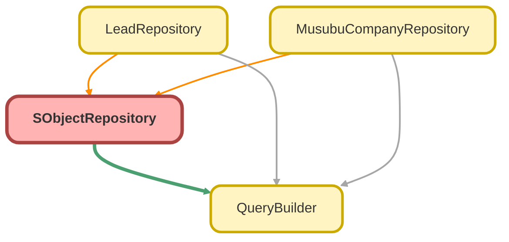

---
hide:
  - path
---

# SObjectRepository Class
`virtual`

SObject リポジトリ基底クラス

## Class Diagram



<!-- Apex description -->

## Apex Code

```java
/**
 * SObject リポジトリ基底クラス
 *
 * @description 各オブジェクト固有のリポジトリクラスの基底クラス。
 *              QueryBuilder を使用して型安全なクエリを提供します。
 */
public virtual with sharing class SObjectRepository {

    protected Schema.SObjectType sObjectType;

    /**
     * コンストラクタ
     *
     * @param sObjectType 対象の SObjectType
     */
    protected SObjectRepository(Schema.SObjectType sObjectType) {
        this.sObjectType = sObjectType;
    }

    /**
     * QueryBuilder のインスタンスを取得
     *
     * @return 新しい QueryBuilder インスタンス
     */
    protected QueryBuilder query() {
        return new QueryBuilder(this.sObjectType);
    }

    /**
     * ID でレコードを検索
     *
     * @param recordId レコード ID
     * @return 見つかった SObject（なければ null）
     */
    public virtual SObject findById(Id recordId) {
        return query()
            .selectFields(getDefaultFields())
            .whereEqual('Id', recordId)
            .first();
    }

    /**
     * 複数の ID でレコードを検索
     *
     * @param recordIds レコード ID のセット
     * @return SObject のリスト
     */
    public virtual List<SObject> findByIds(Set<Id> recordIds) {
        return query()
            .selectFields(getDefaultFields())
            .whereInIds('Id', recordIds)
            .get();
    }

    /**
     * デフォルトで取得するフィールドを返す（サブクラスでオーバーライド）
     *
     * @return フィールド名のリスト
     */
    protected virtual List<String> getDefaultFields() {
        return new List<String>{ 'Id' };
    }
}
```

## Methods
### `findById(recordId)`

ID でレコードを検索

#### Signature
```apex
public virtual SObject findById(Id recordId)
```

#### Parameters
| Name | Type | Description |
|------|------|-------------|
| recordId | Id | レコード ID |

#### Return Type
**SObject**

見つかった SObject（なければ null）

---

### `findByIds(recordIds)`

複数の ID でレコードを検索

#### Signature
```apex
public virtual List<SObject> findByIds(Set<Id> recordIds)
```

#### Parameters
| Name | Type | Description |
|------|------|-------------|
| recordIds | Set<Id> | レコード ID のセット |

#### Return Type
**List<SObject>**

SObject のリスト