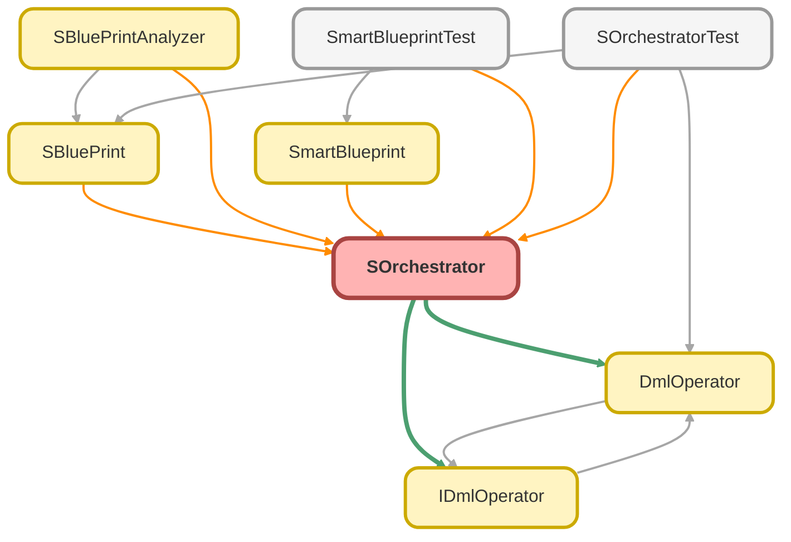

---
hide:
  - path
---

# SOrchestrator Class

The main orchestrator for building and creating test data from a collection of SBlueprints. 
It manages the analysis of dependencies, the ordering of creation, and the final DML operations.

## Class Diagram



<!-- Apex description -->

## Apex Code

```java
/**
 * Copyright 2025 Hiroyuki Matsuoka
 *
 * Licensed under the Apache License, Version 2.0 (the "License");
 * you may not use this file except in compliance with the License.
 * You may obtain a copy of the License at
 *
 * http://www.apache.org/licenses/LICENSE-2.0
 *
 * Unless required by applicable law or agreed to in writing, software
 * distributed under the License is distributed on an "AS IS" BASIS,
 * WITHOUT WARRANTIES OR CONDITIONS OF ANY KIND, either express or implied.
 * See the License for the specific language governing permissions and
 * limitations under the License.
 */

/**
 * The main orchestrator for building and creating test data from a collection of SBlueprints.
 * It manages the analysis of dependencies, the ordering of creation, and the final DML operations.
 */
public with sharing class SOrchestrator {
  // =================================================================================
  // Properties
  // =================================================================================

  @TestVisible
  private List<SBlueprint> sBlueprints;
  private Map<String, SObject> aliasToSObject = new Map<String, SObject>();
  private IDmlOperator dmlOperator;

  // =================================================================================
  // Constructors & Factory Methods
  // =================================================================================

  /**
   * Private constructor. Use `start()` factory methods for instantiation.
   * Initializes with the default DML operator.
   */
  private SOrchestrator() {
    this.sBlueprints = new List<SBlueprint>();
    this.dmlOperator = new DmlOperator();
  }

  /**
   * Private constructor for dependency injection.
   *
   * @param dmlOperator The DML operator strategy to use (e.g., a mock for testing).
   */
  private SOrchestrator(IDmlOperator dmlOperator) {
    this.sBlueprints = new List<SBlueprint>();
    this.dmlOperator = dmlOperator;
  }

  /**
   * Starts the orchestrator build chain.
   *
   * @return A new SOrchestrator instance.
   */
  public static SOrchestrator start() {
    return new SOrchestrator();
  }

  /**
   * Starts the orchestrator build chain with a custom DML operator.
   *
   * @param dmlOperator The DML operator strategy to use.
   * @return A new SOrchestrator instance configured with the custom operator.
   */
  public static SOrchestrator start(IDmlOperator dmlOperator) {
    return new SOrchestrator(dmlOperator);
  }

  // =================================================================================
  // Public API (Fluent Interface)
  // =================================================================================

  /**
   * Adds an SBlueprint to the orchestration queue.
   *
   * @param sBlueprint The blueprint to add.
   * @return A new SOrchestrator instance with the blueprint added.
   * @throws DmlException if the provided sBlueprint is null.
   */
  public SOrchestrator add(SBlueprint sBlueprint) {
    if (sBlueprint == null) {
      throw new DmlException('sBlueprint must not be null');
    }
    SOrchestrator newSOrchestrator = this.deepCopy();
    newSOrchestrator.sBlueprints.add(sBlueprint);
    return newSOrchestrator;
  }

  // =================================================================================
  // Public API (Execution & Access)
  // =================================================================================

  /**
   * Analyzes dependencies, realizes all SBlueprints into SObjects, and inserts them in the correct order.
   * This is the final execution method.
   */
  public void create() {
    BuildLayers buildLayers = (new SBlueprintAnalyzer(this.sBlueprints)).analyze();
    buildLayers.realizeAll(this.aliasToSObject, buildLayers.getMaxDepth(), this.dmlOperator);
  }

  /**
   * Retrieves a created SObject record by its alias.
   * This should be called after `create()` has been executed.
   *
   * @param alias The alias of the record to retrieve.
   * @return The SObject record, or null if the alias is not found.
   */
  public SObject getByAlias(String alias) {
    return this.aliasToSObject.get(alias);
  }

  // =================================================================================
  // Private Helper Methods
  // =================================================================================

  /**
   * Creates a deep copy of the orchestrator to maintain immutability.
   *
   * @return A new SOrchestrator instance.
   */
  private SOrchestrator deepCopy() {
    SOrchestrator newSOrchestrator = new SOrchestrator(this.dmlOperator);
    newSOrchestrator.sBlueprints = this.sBlueprints.clone();
    newSOrchestrator.aliasToSObject = this.aliasToSObject.clone();
    return newSOrchestrator;
  }

  // =================================================================================
  // Inner Classes for Data Structure
  // =================================================================================

  /**
   * Represents a single layer in the build process, containing blueprints with the same dependency depth.
   */
  public class BuildLayer {
    private List<SBlueprint> sBlueprints = new List<SBlueprint>();

    /**
     * Adds a blueprint to this layer.
     *
     * @param sBlueprint The blueprint to add.
     */
    public void addSBlueprint(SBlueprint sBlueprint) {
      this.sBlueprints.add(sBlueprint);
    }

    /**
     * Gets all blueprints in this layer.
     *
     * @return A list of SBlueprints.
     */
    public List<SBlueprint> getSBlueprints() {
      return this.sBlueprints;
    }

    /**
     * Realizes all blueprints in this layer and inserts the resulting SObjects.
     *
     * @param aliasToSObject The master map of all created records, which gets updated.
     * @param dmlOperator The strategy for performing the DML operation.
     */
    public void realizeLayer(Map<String, SObject> aliasToSObject, IDmlOperator dmlOperator) {
      Map<String, SObject> layerAliasToSObject = new Map<String, SObject>();
      for (SBlueprint sBlueprint : this.sBlueprints) {
        SBlueprintRealizer realizer = new SBlueprintRealizer(
          sBlueprint,
          aliasToSObject,
          new Map<String, String>(),
          0
        );
        Map<String, SObject> newAliasToSObject = realizer.realize();

        for (String alias : newAliasToSObject.keySet()) {
          if (layerAliasToSObject.containsKey(alias)) {
            String errorMessage = String.format(
              'Duplicate alias detected: {0}\nAliases must be unique across all SBlueprint definitions to ensure records can be correctly identified. Please provide a unique alias.',
              new List<String>{ alias }
            );
            throw new DmlException(errorMessage);
          }
          layerAliasToSObject.put(alias, newAliasToSObject.get(alias));
        }
      }

      dmlOperator.doInsert(layerAliasToSObject.values());

      for (String alias : layerAliasToSObject.keySet()) {
        if (aliasToSObject.containsKey(alias)) {
          String errorMessage = String.format(
            'Duplicate alias detected: {0}\nAliases must be unique across all SBlueprint definitions to ensure records can be correctly identified. Please provide a unique alias.',
            new List<String>{ alias }
          );
          throw new DmlException(errorMessage);
        }
        aliasToSObject.put(alias, layerAliasToSObject.get(alias));
      }
    }
  }

  /**
   * Represents all ordered layers of the build process.
   */
  public class BuildLayers {
    private Map<String, BuildLayer> layers = new Map<String, BuildLayer>();

    /**
     * Gets the maximum depth of the build layers.
     * @return The highest layer number.
     */
    public Integer getMaxDepth() {
      Integer maxDepth = 0;
      for (String layerKey : this.layers.keySet()) {
        Integer layerNum = Integer.valueOf(layerKey);
        if (layerNum > maxDepth) {
          maxDepth = layerNum;
        }
      }
      return maxDepth;
    }

    /**
     * Adds a blueprint to a specific layer.
     *
     * @param layerNumber The layer to add the blueprint to.
     * @param sBlueprint The blueprint to add.
     */
    public void addSBlueprint(Integer layerNumber, SBlueprint sBlueprint) {
      String layerKey = String.valueOf(layerNumber);
      if (!this.layers.containsKey(layerKey)) {
        this.layers.put(layerKey, new BuildLayer());
      }
      this.layers.get(layerKey).addSBlueprint(sBlueprint);
    }

    /**
     * A convenience method to add a blueprint to the root layer (layer 0).
     *
     * @param sBlueprint The blueprint to add.
     */
    public void addRoot(SBlueprint sBlueprint) {
      this.addSBlueprint(0, sBlueprint);
    }

    /**
     * Gets all blueprints for a specific layer.
     *
     * @param layerNumber The layer number to retrieve.
     * @return A list of SBlueprints.
     */
    public List<SBlueprint> getSBlueprintsByLayer(Integer layerNumber) {
      String layerKey = String.valueOf(layerNumber);
      return this.layers.containsKey(layerKey)
        ? this.layers.get(layerKey).getSBlueprints()
        : new List<SBlueprint>();
    }

    /**
     * Gets all blueprints in the root layer (layer 0).
     *
     * @return A list of root SBlueprints.
     */
    public List<SBlueprint> getRoots() {
      return this.getSBlueprintsByLayer(0);
    }

    /**
     * Realizes all layers in order, from layer 0 to the max layer.
     *
     * @param aliasToSObject The master map of aliases to SObjects.
     * @param maxLayer The maximum layer depth to process.
     * @param dmlOperator The strategy for performing DML operations.
     */
    public void realizeAll(Map<String, SObject> aliasToSObject, Integer maxLayer, IDmlOperator dmlOperator) {
      for (Integer i = 0; i <= maxLayer; i++) {
        String layerKey = String.valueOf(i);
        if (this.layers.containsKey(layerKey)) {
          this.layers.get(layerKey).realizeLayer(aliasToSObject, dmlOperator);
        }
      }
    }
  }
}
```

## Fields
### `sBlueprints`

`TESTVISIBLE`

#### Signature
```apex
private sBlueprints
```

#### Type
List<SBlueprint>

---

### `aliasToSObject`

#### Signature
```apex
private aliasToSObject
```

#### Type
Map<String,SObject>

---

### `dmlOperator`

#### Signature
```apex
private dmlOperator
```

#### Type
[IDmlOperator](IDmlOperator.md)

## Constructors
### `SOrchestrator()`

Private constructor. Use `start()` factory methods for instantiation. 
Initializes with the default DML operator.

#### Signature
```apex
private SOrchestrator()
```

---

### `SOrchestrator(dmlOperator)`

Private constructor for dependency injection.

#### Signature
```apex
private SOrchestrator(IDmlOperator dmlOperator)
```

#### Parameters
| Name | Type | Description |
|------|------|-------------|
| dmlOperator | [IDmlOperator](IDmlOperator.md) | The DML operator strategy to use (e.g., a mock for testing). |

## Methods
### `start()`

Starts the orchestrator build chain.

#### Signature
```apex
public static SOrchestrator start()
```

#### Return Type
**[SOrchestrator](SOrchestrator.md)**

A new SOrchestrator instance.

---

### `start(dmlOperator)`

Starts the orchestrator build chain with a custom DML operator.

#### Signature
```apex
public static SOrchestrator start(IDmlOperator dmlOperator)
```

#### Parameters
| Name | Type | Description |
|------|------|-------------|
| dmlOperator | [IDmlOperator](IDmlOperator.md) | The DML operator strategy to use. |

#### Return Type
**[SOrchestrator](SOrchestrator.md)**

A new SOrchestrator instance configured with the custom operator.

---

### `add(sBlueprint)`

Adds an SBlueprint to the orchestration queue.

#### Signature
```apex
public SOrchestrator add(SBlueprint sBlueprint)
```

#### Parameters
| Name | Type | Description |
|------|------|-------------|
| sBlueprint | SBlueprint | The blueprint to add. |

#### Return Type
**[SOrchestrator](SOrchestrator.md)**

A new SOrchestrator instance with the blueprint added.

#### Throws
DmlException: if the provided sBlueprint is null.

---

### `create()`

Analyzes dependencies, realizes all SBlueprints into SObjects, and inserts them in the correct order. 
This is the final execution method.

#### Signature
```apex
public void create()
```

#### Return Type
**void**

---

### `getByAlias(alias)`

Retrieves a created SObject record by its alias. 
This should be called after `create()` has been executed.

#### Signature
```apex
public SObject getByAlias(String alias)
```

#### Parameters
| Name | Type | Description |
|------|------|-------------|
| alias | String | The alias of the record to retrieve. |

#### Return Type
**SObject**

The SObject record, or null if the alias is not found.

---

### `deepCopy()`

Creates a deep copy of the orchestrator to maintain immutability.

#### Signature
```apex
private SOrchestrator deepCopy()
```

#### Return Type
**[SOrchestrator](SOrchestrator.md)**

A new SOrchestrator instance.

## Classes
### BuildLayer Class

Represents a single layer in the build process, containing blueprints with the same dependency depth.

#### Fields
##### `sBlueprints`

###### Signature
```apex
private sBlueprints
```

###### Type
List<SBlueprint>

#### Methods
##### `addSBlueprint(sBlueprint)`

Adds a blueprint to this layer.

###### Signature
```apex
public void addSBlueprint(SBlueprint sBlueprint)
```

###### Parameters
| Name | Type | Description |
|------|------|-------------|
| sBlueprint | SBlueprint | The blueprint to add. |

###### Return Type
**void**

---

##### `getSBlueprints()`

Gets all blueprints in this layer.

###### Signature
```apex
public List<SBlueprint> getSBlueprints()
```

###### Return Type
**List<SBlueprint>**

A list of SBlueprints.

---

##### `realizeLayer(aliasToSObject, dmlOperator)`

Realizes all blueprints in this layer and inserts the resulting SObjects.

###### Signature
```apex
public void realizeLayer(Map<String,SObject> aliasToSObject, IDmlOperator dmlOperator)
```

###### Parameters
| Name | Type | Description |
|------|------|-------------|
| aliasToSObject | Map<String,SObject> | The master map of all created records, which gets updated. |
| dmlOperator | [IDmlOperator](IDmlOperator.md) | The strategy for performing the DML operation. |

###### Return Type
**void**

### BuildLayers Class

Represents all ordered layers of the build process.

#### Fields
##### `layers`

###### Signature
```apex
private layers
```

###### Type
Map<String,BuildLayer>

#### Methods
##### `getMaxDepth()`

Gets the maximum depth of the build layers.

###### Signature
```apex
public Integer getMaxDepth()
```

###### Return Type
**Integer**

The highest layer number.

---

##### `addSBlueprint(layerNumber, sBlueprint)`

Adds a blueprint to a specific layer.

###### Signature
```apex
public void addSBlueprint(Integer layerNumber, SBlueprint sBlueprint)
```

###### Parameters
| Name | Type | Description |
|------|------|-------------|
| layerNumber | Integer | The layer to add the blueprint to. |
| sBlueprint | SBlueprint | The blueprint to add. |

###### Return Type
**void**

---

##### `addRoot(sBlueprint)`

A convenience method to add a blueprint to the root layer (layer 0).

###### Signature
```apex
public void addRoot(SBlueprint sBlueprint)
```

###### Parameters
| Name | Type | Description |
|------|------|-------------|
| sBlueprint | SBlueprint | The blueprint to add. |

###### Return Type
**void**

---

##### `getSBlueprintsByLayer(layerNumber)`

Gets all blueprints for a specific layer.

###### Signature
```apex
public List<SBlueprint> getSBlueprintsByLayer(Integer layerNumber)
```

###### Parameters
| Name | Type | Description |
|------|------|-------------|
| layerNumber | Integer | The layer number to retrieve. |

###### Return Type
**List<SBlueprint>**

A list of SBlueprints.

---

##### `getRoots()`

Gets all blueprints in the root layer (layer 0).

###### Signature
```apex
public List<SBlueprint> getRoots()
```

###### Return Type
**List<SBlueprint>**

A list of root SBlueprints.

---

##### `realizeAll(aliasToSObject, maxLayer, dmlOperator)`

Realizes all layers in order, from layer 0 to the max layer.

###### Signature
```apex
public void realizeAll(Map<String,SObject> aliasToSObject, Integer maxLayer, IDmlOperator dmlOperator)
```

###### Parameters
| Name | Type | Description |
|------|------|-------------|
| aliasToSObject | Map<String,SObject> | The master map of aliases to SObjects. |
| maxLayer | Integer | The maximum layer depth to process. |
| dmlOperator | [IDmlOperator](IDmlOperator.md) | The strategy for performing DML operations. |

###### Return Type
**void**