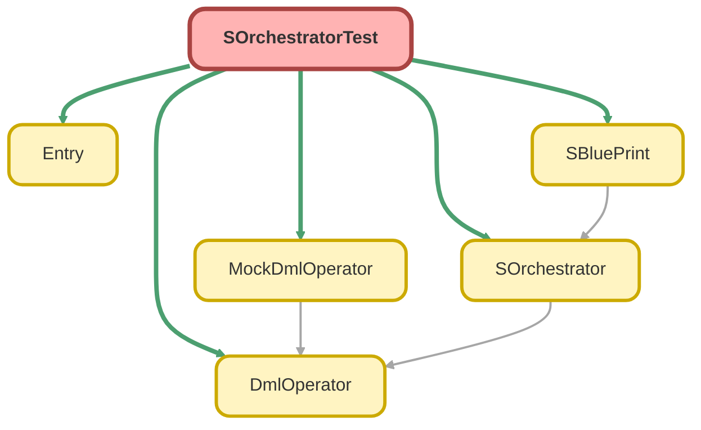

---
hide:
  - path
---

# SOrchestratorTest Class

`ISTEST`

## Class Diagram



<!-- Apex description -->

## Apex Code

```java
@isTest
public with sharing class SOrchestratorTest {
  @isTest
  static void testAdd_WhenAdd_ReturnNewSOrchestrator() {
    // Act
    SOrchestrator orchestrator = SOrchestrator.start();

    // Arrange
    SOrchestrator newSOrchestrator = orchestrator.add(SBluePrint.of(Account.class));

    // Assert
    Assert.areEqual(0, orchestrator.sBluePrints.size());
    Assert.areEqual(1, newSOrchestrator.sBluePrints.size());
  }

  @isTest
  static void testCreate_WhenAddSingleSBluePrint_ThenInsertOneRecord() {
    // Arrange
    SOrchestrator orchestrator = SOrchestrator.start(new MockDmlOperator())
      .add(SBluePrint.of(Account.class).set('Name', 'Test Account'));

    // Act
    orchestrator.create();

    // Assert
    Account acc = (Account) orchestrator.getByAlias('__Account_0_1__');
    Assert.areEqual('Test Account', acc.Name);
  }

  @isTest
  static void testCreate_WHenAddSingleSBluePrintWithAlias_ThenCanAccessByAlias() {
    // Arrange
    SOrchestrator orchestrator = SOrchestrator.start(new MockDmlOperator())
      .add(SBluePrint.of(Account.class).set('Name', 'Test Account').alias('acc'));

    // Act
    orchestrator.create();

    // Assert
    Account acc = (Account) orchestrator.getByAlias('acc');
    Assert.areEqual('Test Account', acc.Name);
  }

  @isTest
  static void testCreate_WhenAddParentAndChildren_ThenInsertInOrder() {
    // Arrange
    SOrchestrator orchestrator = SOrchestrator.start(new MockDmlOperator())
      .add(
        SBluePrint.of(Account.class)
          .set('Name', 'Test Account')
          .withChildren(SBluePrint.of(Contact.class).set('LastName', 'Test Contact'))
      );

    // Act
    orchestrator.create();

    // Assert
    Account acc = (Account) orchestrator.getByAlias('__Account_0_1__');
    Assert.areEqual('Test Account', acc.Name);
    Contact con = (Contact) orchestrator.getByAlias('__Account_0_1_____Contact_1_1__');
    Assert.areEqual('Test Contact', con.LastName);
    Assert.areEqual(acc.Id, con.AccountId);
  }

  @isTest
  static void testCreate_WhenAddParentAndChildrenWithAlias_ThenCanAccessByAlias() {
    // Arrange
    SOrchestrator orchestrator = SOrchestrator.start(new MockDmlOperator())
      .add(
        SBluePrint.of(Account.class)
          .set('Name', 'Test Account')
          .alias('acc')
          .withChildren(SBluePrint.of(Contact.class).set('LastName', 'Test Contact').alias('con'))
      );

    // Act
    orchestrator.create();

    // Assert
    Account acc = (Account) orchestrator.getByAlias('acc');
    Assert.areEqual('Test Account', acc.Name);
    Contact con = (Contact) orchestrator.getByAlias('con');
    Assert.areEqual('Test Contact', con.LastName);
    Assert.areEqual(acc.Id, con.AccountId);
  }

  @isTest
  static void testCreate_WhenAddParentAndChildrenWithAliasAndUse_ThenInsertInOrder() {
    // Arrange
    SOrchestrator orchestrator = SOrchestrator.start(new MockDmlOperator())
      .add(
        SBluePrint.of(Account.class)
          .set('Name', 'Test Account')
          .alias('acc')
          .withChildren(SBluePrint.of(Contact.class).use('acc', 'Name', 'LastName').alias('con'))
      );

    // Act
    orchestrator.create();

    // Assert
    Account acc = (Account) orchestrator.getByAlias('acc');
    Assert.areEqual('Test Account', acc.Name);
    Contact con = (Contact) orchestrator.getByAlias('con');
    Assert.areEqual('Test Account', con.LastName);
    Assert.areEqual(acc.Id, con.AccountId);
  }

  @isTest
  static void testCreate_WhenAddParentAndChildrenWithParentLayerAlias_ThenInsertInOrder() {
    // Arrange
    SOrchestrator orchestrator = SOrchestrator.start(new MockDmlOperator())
      .add(
        SBluePrint.of(Account.class)
          .set('Name', 'Test Account')
          .withChildren(SBluePrint.of(Contact.class).use('{P0}', 'Name', 'LastName').alias('con'))
      );

    // Act
    orchestrator.create();

    // Assert
    Account acc = (Account) orchestrator.getByAlias('__Account_0_1__');
    Assert.areEqual('Test Account', acc.Name);
    Contact con = (Contact) orchestrator.getByAlias('con');
    Assert.areEqual('Test Account', con.LastName);
    Assert.areEqual(acc.Id, con.AccountId);
  }

  @isTest
  static void testCreate_WhenAddParentAndChildrenWithParentLayerAlias_ThenInsertInOrder_2() {
    // Arrange
    SOrchestrator orchestrator = SOrchestrator.start(new MockDmlOperator())
      .add(
        SBluePrint.of(Account.class)
          .set('Name', 'Test Account')
          .withChildren(
            SBluePrint.of(Contact.class).use('{P0}', 'Name', 'LastName').alias('{P0}_con_{#}').times(2)
          )
      );

    // Act
    orchestrator.create();

    // Assert
    Account acc = (Account) orchestrator.getByAlias('__Account_0_1__');
    Assert.areEqual('Test Account', acc.Name);
    for (Integer i = 1; i <= 2; i++) {
      String contactAlias = '__Account_0_1__' + '_con_' + i;
      Contact con = (Contact) orchestrator.getByAlias(contactAlias);
      Assert.areEqual('Test Account', con.LastName);
      Assert.areEqual(acc.Id, con.AccountId);
    }
  }

  @isTest
  static void testCreate_WhenAddMultipleRoots_ThenInsertAllInOrder() {
    // Arrange
    SOrchestrator orchestrator = SOrchestrator.start(new MockDmlOperator())
      .add(
        SBluePrint.of(Account.class)
          .set('Name', 'Test Account 1')
          .alias('acc1')
          .withChildren(SBluePrint.of(Contact.class).set('LastName', 'Test Contact 1').alias('con1'))
      )
      .add(
        SBluePrint.of(Account.class)
          .set('Name', 'Test Account 2')
          .alias('acc2')
          .withChildren(SBluePrint.of(Contact.class).set('LastName', 'Test Contact 2').alias('con2'))
      );

    // Act
    orchestrator.create();

    // Assert
    Account acc1 = (Account) orchestrator.getByAlias('acc1');
    Assert.areEqual('Test Account 1', acc1.Name);
    Contact con1 = (Contact) orchestrator.getByAlias('con1');
    Assert.areEqual('Test Contact 1', con1.LastName);
    Assert.areEqual(acc1.Id, con1.AccountId);

    Account acc2 = (Account) orchestrator.getByAlias('acc2');
    Assert.areEqual('Test Account 2', acc2.Name);
    Contact con2 = (Contact) orchestrator.getByAlias('con2');
    Assert.areEqual('Test Contact 2', con2.LastName);
    Assert.areEqual(acc2.Id, con2.AccountId);
  }

  @isTest
  static void testCreate_WhenAddMulitipleParentWithChildren_ThenCreateChildrenToEachParent() {
    SOrchestrator orchestrator = SOrchestrator.start(new MockDmlOperator())
      .add(
        SBluePrint.of(Account.class)
          .set('Name', 'Test Account {#}', 1, 1)
          .alias('acc_{#}')
          .times(2)
          .withChildren(
            SBluePrint.of(Contact.class).set('LastName', 'Test Contact {#}', 1, 1).alias('{P0}_con_{#}').times(2)
          )
      );

    // Act
    orchestrator.create();

    // Assert
    for (Integer i = 1; i <= 2; i++) {
      Account acc = (Account) orchestrator.getByAlias('acc_' + i);
      Assert.areEqual('Test Account ' + i, acc.Name);
      for (Integer j = 1; j <= 2; j++) {
        Contact con = (Contact) orchestrator.getByAlias('acc_' + i + '_con_' + j);
        Assert.areEqual('Test Contact ' + j, con.LastName);
        Assert.areEqual(acc.Id, con.AccountId);
      }
    }
  }

  @isTest
  static void testCreate_WhenAddMultipleParentWithChildrenWithoutAlias_ThenCreateChildrenToEachParent() {
    SOrchestrator orchestrator = SOrchestrator.start(new MockDmlOperator())
      .add(
        SBluePrint.of(Account.class)
          .set('Name', 'Test Account {#}', 1)
          .times(2)
          .withChildren(SBluePrint.of(Contact.class).set('LastName', 'Test Contact {#}', 1).times(2))
      );

    // Act
    orchestrator.create();

    // Assert
    for (Integer i = 1; i <= 2; i++) {
      String accAlias = String.format('__Account_0_{0}__', new List<String>{ String.valueOf(i) });
      Account acc = (Account) orchestrator.getByAlias(accAlias);
      Assert.areEqual('Test Account ' + i, acc.Name);
      for (Integer j = 1; j <= 2; j++) {
        String conAlias =
          accAlias +
          '_' +
          String.format('__Contact_1_{0}__', new List<String>{ String.valueOf(j) });
        System.debug('conAlias: ' + conAlias);
        Contact con = (Contact) orchestrator.getByAlias(conAlias);
        Assert.areEqual('Test Contact ' + j, con.LastName);
        Assert.areEqual(acc.Id, con.AccountId);
      }
    }
  }

  @isTest
  static void testCreate_WhenAddNestedMultipleParentsWithChildren_ThenCreateChildrenToEachParent() {
    //Arrange
    Date today = Date.today();
    SOrchestrator orchestrator = SOrchestrator.start(new MockDmlOperator())
      .add(
        SBluePrint.of(Account.class)
          .set('Name', 'Test Account {#}', 1, 1)
          .times(2)
          .withChildren(
            SBluePrint.of(Opportunity.class)
              .parentIdField('AccountId')
              .set('Name', 'Test Opportunity {#}', 1, 1)
              .set('StageName', 'Prospecting')
              .set('CloseDate', today)
              .times(2)
              .withChildren(
                SBluePrint.of(Quote.class)
                  .parentIdField('OpportunityId')
                  .set('Name', 'Test Quote {#}', 1, 1)
                  .times(2)
              )
          )
      );

    // Act
    orchestrator.create();

    // Assert
    for (Integer i = 1; i <= 2; i++) {
      String accAlias = String.format('__Account_0_{0}__', new List<String>{ String.valueOf(i) });
      Account acc = (Account) orchestrator.getByAlias(accAlias);
      Assert.areEqual('Test Account ' + i, acc.Name);
      for (Integer j = 1; j <= 2; j++) {
        String oppAlias =
          accAlias +
          '_' +
          String.format('__Opportunity_1_{0}__', new List<String>{ String.valueOf(j) });
        Opportunity opp = (Opportunity) orchestrator.getByAlias(oppAlias);
        Assert.areEqual(acc.Id, opp.AccountId);
        Assert.areEqual('Test Opportunity ' + j, opp.Name);
        Assert.areEqual('Prospecting', opp.StageName);
        Assert.areEqual(today, opp.CloseDate);
        for (Integer k = 1; k <= 2; k++) {
          String quoteAlias =
            oppAlias +
            '_' +
            String.format('__Quote_2_{0}__', new List<String>{ String.valueOf(k) });
          Quote quote = (Quote) orchestrator.getByAlias(quoteAlias);
          Assert.areEqual(opp.Id, quote.OpportunityId);
          Assert.areEqual('Test Quote ' + k, quote.Name);
        }
      }
    }
  }

  @isTest
  static void testCreate_WhenAddNestedMultipleParentsWithChildren_ThenCreateChildrenToEachParent_2() {
    //Arrange
    Date today = Date.today();
    SOrchestrator orchestrator = SOrchestrator.start(new MockDmlOperator())
      .add(
        SBluePrint.of(Account.class)
          .set('Name', 'Test Account {#}', 1, 1)
          .times(2)
          .withChildren(
            SBluePrint.of(Opportunity.class)
              .parentIdField('AccountId')
              .set('Name', 'Test Opportunity {#}', 1, 1)
              .set('StageName', 'Prospecting')
              .set('CloseDate', today)
              .alias('{P0}_opp_{#}')
              .times(2)
              .withChildren(
                SBluePrint.of(Quote.class)
                  .parentIdField('OpportunityId')
                  .set('Name', 'Test Quote {#}', 1, 1)
                  .times(2)
              )
          )
      );

    // Act
    orchestrator.create();

    // Assert
    for (Integer i = 1; i <= 2; i++) {
      String accAlias = String.format('__Account_0_{0}__', new List<String>{ String.valueOf(i) });
      Account acc = (Account) orchestrator.getByAlias(accAlias);
      Assert.areEqual('Test Account ' + i, acc.Name);
      for (Integer j = 1; j <= 2; j++) {
        String oppAlias = accAlias + '_opp_' + j;
        Opportunity opp = (Opportunity) orchestrator.getByAlias(oppAlias);
        Assert.areEqual(acc.Id, opp.AccountId);
        Assert.areEqual('Test Opportunity ' + j, opp.Name);
        Assert.areEqual('Prospecting', opp.StageName);
        Assert.areEqual(today, opp.CloseDate);
        for (Integer k = 1; k <= 2; k++) {
          String quoteAlias =
            oppAlias +
            '_' +
            String.format('__Quote_1_{0}__', new List<String>{ String.valueOf(k) });
          System.debug('quoteAlias: ' + quoteAlias);
          Quote quote = (Quote) orchestrator.getByAlias(quoteAlias);
          Assert.areEqual(opp.Id, quote.OpportunityId);
          Assert.areEqual('Test Quote ' + k, quote.Name);
        }
      }
    }
  }

  @isTest
  static void testCreate_WhenAddNestedMultipleParentsWithChildren_ThenCreateChildrenToEachParent_3() {
    //Arrange
    Date today = Date.today();
    SOrchestrator orchestrator = SOrchestrator.start(new MockDmlOperator())
      .add(
        SBluePrint.of(Account.class)
          .set('Name', 'Test Account {#}', 1, 1)
          .times(2)
          .withChildren(
            SBluePrint.of(Opportunity.class)
              .parentIdField('AccountId')
              .set('Name', 'Test Opportunity {#}', 1, 1)
              .set('StageName', 'Prospecting')
              .set('CloseDate', today)
              .times(2)
              .withChildren(
                SBluePrint.of(Quote.class)
                  .parentIdField('OpportunityId')
                  .set('Name', 'Test Quote {#}', 1, 1)
                  .times(2)
                  .withChildren(
                    SBluePrint.of(QuoteLineItem.class)
                      .parentIdField('QuoteId')
                      .use('prod_{#}', 'Id', 'PricebookEntryId')
                      .set('Quantity', 1)
                      .set('UnitPrice', 100)
                      .times(2)
                  )
              )
          )
      )
      .add(SBluePrint.of(Product2.class).set('Name', 'Test Product {#}', 1, 1).times(2).alias('prod_{#}'));

    // Act
    orchestrator.create();

    // Assert
    for (Integer i = 1; i <= 2; i++) {
      String accAlias = String.format('__Account_0_{0}__', new List<String>{ String.valueOf(i) });
      Account acc = (Account) orchestrator.getByAlias(accAlias);
      Assert.areEqual('Test Account ' + i, acc.Name);
      for (Integer j = 1; j <= 2; j++) {
        String oppAlias =
          accAlias +
          '_' +
          String.format('__Opportunity_1_{0}__', new List<String>{ String.valueOf(j) });
        Opportunity opp = (Opportunity) orchestrator.getByAlias(oppAlias);
        Assert.areEqual(acc.Id, opp.AccountId);
        Assert.areEqual('Test Opportunity ' + j, opp.Name);
        Assert.areEqual('Prospecting', opp.StageName);
        Assert.areEqual(today, opp.CloseDate);
        for (Integer k = 1; k <= 2; k++) {
          String quoteAlias =
            oppAlias +
            '_' +
            String.format('__Quote_2_{0}__', new List<String>{ String.valueOf(k) });
          Quote quote = (Quote) orchestrator.getByAlias(quoteAlias);
          Assert.areEqual(opp.Id, quote.OpportunityId);
          Assert.areEqual('Test Quote ' + k, quote.Name);
        }
      }
    }
  }

  @isTest
  static void testCreate_WhenAddNestedMultipleParentsWithChildren_ThenCreateChildrenToEachParent_4() {
    //Arrange
    Date today = Date.today();
    SOrchestrator orchestrator = SOrchestrator.start(new MockDmlOperator())
      .add(
        SBluePrint.of(Account.class)
          .set('Name', 'Test Account')
          .withChildren(
            SBluePrint.of(Opportunity.class)
              .parentIdField('AccountId')
              .set('Name', 'Test Opportunity {#}', 1, 1)
              .set('StageName', 'Prospecting')
              .set('CloseDate', today)
              .times(2)
              .withChildren(
                SBluePrint.of(Quote.class)
                  .parentIdField('OpportunityId')
                  .set('Name', 'Test Quote {#}', 1, 1)
                  .times(2)
                  .withChildren(
                    SBluePrint.of(QuoteLineItem.class)
                      .parentIdField('QuoteId')
                      .use('prod_{#}', 'Id', 'PricebookEntryId')
                      .use('{P0}', 'Name', 'Description')
                      .set('Quantity', 1)
                      .set('UnitPrice', 100)
                      .times(2)
                  )
              )
          )
      )
      .add(SBluePrint.of(Product2.class).set('Name', 'Test Product {#}', 1, 1).times(2).alias('prod_{#}'));

    // Act
    orchestrator.create();

    // Assert
    String accAlias = '__Account_0_1__';
    Account acc = (Account) orchestrator.getByAlias(accAlias);
    Assert.areEqual('Test Account', acc.Name);
    for (Integer i = 1; i <= 2; i++) {
      String oppAlias =
        accAlias +
        '_' +
        String.format('__Opportunity_1_{0}__', new List<String>{ String.valueOf(i) });
      Opportunity opp = (Opportunity) orchestrator.getByAlias(oppAlias);
      Assert.areEqual(acc.Id, opp.AccountId);
      Assert.areEqual('Test Opportunity ' + i, opp.Name);
      Assert.areEqual('Prospecting', opp.StageName);
      Assert.areEqual(today, opp.CloseDate);
      for (Integer j = 1; j <= 2; j++) {
        String quoteAlias =
          oppAlias +
          '_' +
          String.format('__Quote_2_{0}__', new List<String>{ String.valueOf(j) });
        Quote quote = (Quote) orchestrator.getByAlias(quoteAlias);
        Assert.areEqual(opp.Id, quote.OpportunityId);
        Assert.areEqual('Test Quote ' + j, quote.Name);
        for (Integer k = 1; k <= 2; k++) {
          String qliAlias =
            quoteAlias +
            '_' +
            String.format('__QuoteLineItem_3_{0}__', new List<String>{ String.valueOf(k) });
          QuoteLineItem qli = (QuoteLineItem) orchestrator.getByAlias(qliAlias);
          Assert.areEqual(quote.Id, qli.QuoteId);
          Assert.areEqual(1, qli.Quantity);
          Assert.areEqual(100, qli.UnitPrice);
          Assert.areEqual('Test Account', qli.Description);
          Product2 prod = (Product2) orchestrator.getByAlias('prod_' + k);
          Assert.areEqual(prod.Id, qli.PricebookEntryId);
        }
      }
    }
  }

  @isTest
  static void testCreate_WhenAddNestedMultipleParentsWithChildren_ThenCreateChildrenToEachParent_5() {
    //Arrange
    Date today = Date.today();
    SOrchestrator orchestrator = SOrchestrator.start(new MockDmlOperator())
      .add(
        SBluePrint.of(Account.class)
          .set('Name', 'Test Account {#}', 1, 1)
          .times(2)
          .withChildren(
            SBluePrint.of(Opportunity.class)
              .parentIdField('AccountId')
              .set('Name', 'Test Opportunity')
              .set('StageName', 'Prospecting')
              .set('CloseDate', today)
              .withChildren(
                SBluePrint.of(Quote.class)
                  .parentIdField('OpportunityId')
                  .set('Name', 'Test Quote {#}', 1, 1)
                  .times(2)
                  .withChildren(
                    SBluePrint.of(QuoteLineItem.class)
                      .parentIdField('QuoteId')
                      .use('{P1}', 'Name', 'Description')
                      .set('Quantity', 1)
                      .set('UnitPrice', 100)
                      .times(2)
                  )
              )
          )
      );

    // Act
    orchestrator.create();

    // Assert
    for (Integer i = 1; i <= 2; i++) {
      String accAlias = String.format('__Account_0_{0}__', new List<String>{ String.valueOf(i) });
      Account acc = (Account) orchestrator.getByAlias(accAlias);
      Assert.areEqual('Test Account ' + i, acc.Name);
      String oppAlias = accAlias + '_' + '__Opportunity_1_1__';
      Opportunity opp = (Opportunity) orchestrator.getByAlias(oppAlias);
      Assert.areEqual(acc.Id, opp.AccountId);
      Assert.areEqual('Test Opportunity', opp.Name);
      Assert.areEqual('Prospecting', opp.StageName);
      Assert.areEqual(today, opp.CloseDate);
      for (Integer j = 1; j <= 2; j++) {
        String quoteAlias =
          oppAlias +
          '_' +
          String.format('__Quote_2_{0}__', new List<String>{ String.valueOf(j) });
        Quote quote = (Quote) orchestrator.getByAlias(quoteAlias);
        Assert.areEqual(opp.Id, quote.OpportunityId);
        Assert.areEqual('Test Quote ' + j, quote.Name);
        for (Integer k = 1; k <= 2; k++) {
          String qliAlias =
            quoteAlias +
            '_' +
            String.format('__QuoteLineItem_3_{0}__', new List<String>{ String.valueOf(k) });
          QuoteLineItem qli = (QuoteLineItem) orchestrator.getByAlias(qliAlias);
          Assert.areEqual(quote.Id, qli.QuoteId);
          Assert.areEqual(1, qli.Quantity);
          Assert.areEqual(100, qli.UnitPrice);
          Assert.areEqual('Test Opportunity', qli.Description);
        }
      }
    }
  }

  @isTest
  static void testCreate_WhenAddChildrenBeforeParent_ThenInsertInOrder() {
    // Arrange
    SOrchestrator orchestrator = SOrchestrator.start(new MockDmlOperator())
      .add(SBluePrint.of(Contact.class).use('acc', 'Id', 'AccountId').set('LastName', 'Test Contact').alias('con'))
      .add(SBluePrint.of(Account.class).set('Name', 'Test Account').alias('acc'));

    // Act
    orchestrator.create();

    // Assert
    Account acc = (Account) orchestrator.getByAlias('acc');
    Assert.areEqual('Test Account', acc.Name);
    Contact con = (Contact) orchestrator.getByAlias('con');
    Assert.areEqual('Test Contact', con.LastName);
    Assert.areEqual(acc.Id, con.AccountId);
  }

  @isTest
  static void testCreate_WhenAddMultipleChildrenWithTimes_ThenInsertAllInOrder() {
    // Arrange
    SOrchestrator orchestrator = SOrchestrator.start(new MockDmlOperator())
      .add(
        SBluePrint.of(Account.class)
          .set('Name', 'Test Account')
          .alias('acc')
          .withChildren(
            SBluePrint.of(Contact.class).set('LastName', 'Test Contact {#}', 1, 1).alias('con_{#}').times(3)
          )
      );

    // Act
    orchestrator.create();

    // Assert
    Account acc = (Account) orchestrator.getByAlias('acc');
    Assert.areEqual('Test Account', acc.Name);
    for (Integer i = 1; i <= 3; i++) {
      Contact con = (Contact) orchestrator.getByAlias('con_' + i);
      Assert.areEqual('Test Contact ' + i, con.LastName);
      Assert.areEqual(acc.Id, con.AccountId);
    }
  }

  @isTest
  static void testCreate_WhenAddMultiParentAndMultiChildrenWithTimes_ThenInsertAllInOrder_1() {
    // Arrange
    SOrchestrator orchestrator = SOrchestrator.start(new MockDmlOperator())
      .add(SBluePrint.of(Account.class).set('Name', 'Test Account {#}', 1, 1).alias('acc_{#}').times(2))
      .add(
        SBluePrint.of(Contact.class)
          .set('LastName', 'Test Contact {#}', 1, 1)
          .use('acc_{#}', 'Id', 'AccountId')
          .alias('con_{#}')
          .times(2)
      );

    // Act
    orchestrator.create();

    // Assert
    for (Integer i = 1; i <= 2; i++) {
      Account acc = (Account) orchestrator.getByAlias('acc_' + i);
      Assert.areEqual('Test Account ' + i, acc.Name);
      Contact con = (Contact) orchestrator.getByAlias('con_' + i);
      Assert.areEqual('Test Contact ' + i, con.LastName);
      Assert.areEqual(acc.Id, con.AccountId);
    }
  }

  @isTest
  static void testCreate_WhenAddMultiParentAndMultiChildrenWithTimes_ThenInsertAllInOrder_2() {
    // Arrange
    SOrchestrator orchestrator = SOrchestrator.start(new MockDmlOperator())
      .add(SBluePrint.of(Account.class).set('Name', 'Test Account {#}', 1, 1).alias('acc_{#}').times(2))
      .add(
        SBluePrint.of(Contact.class)
          .set('LastName', 'Test Contact {#}', 1, 1)
          .use('acc_1', 'Id', 'AccountId')
          .alias('con_{#}')
          .times(2)
      )
      .add(
        SBluePrint.of(Contact.class)
          .set('LastName', 'Test Contact {#}', 3, 1)
          .use('acc_2', 'Id', 'AccountId')
          .alias('con_{#}', 3, 1)
          .times(2)
      );

    // Act
    orchestrator.create();

    // Assert
    for (Integer i = 1; i <= 2; i++) {
      Account acc = (Account) orchestrator.getByAlias('acc_' + i);
      Assert.areEqual('Test Account ' + i, acc.Name);
    }
    for (Integer i = 1; i <= 4; i++) {
      Contact con = (Contact) orchestrator.getByAlias('con_' + i);
      Assert.areEqual('Test Contact ' + i, con.LastName);
      Integer accIndex = (i <= 2) ? 1 : 2;
      Account acc = (Account) orchestrator.getByAlias('acc_' + accIndex);
      Assert.areEqual(acc.Id, con.AccountId);
    }
  }

  @isTest
  static void testCreate_WhenAddUseWithOffset_ThenInsertInOrder_1() {
    // Arrange
    SOrchestrator orchestrator = SOrchestrator.start(new MockDmlOperator())
      .add(SBluePrint.of(Account.class).set('Name', 'Test Account {#}', 1).alias('acc_{#}').times(2))
      .add(
        SBluePrint.of(Contact.class)
          .set('LastName', 'Test Contact {#}', 1)
          .use('acc_{#}', 'Id', 'AccountId', 1)
          .alias('con_{#}')
          .times(2)
      );

    // Act
    orchestrator.create();

    // Assert
    for (Integer i = 1; i <= 2; i++) {
      Account acc = (Account) orchestrator.getByAlias('acc_' + i);
      Assert.areEqual('Test Account ' + i, acc.Name);

      Contact con = (Contact) orchestrator.getByAlias('con_' + i);
      Assert.areEqual('Test Contact ' + i, con.LastName);
      Assert.areEqual(acc.Id, con.AccountId);
    }
  }

  @isTest
  static void testCreate_WhenAddUseWithOffset_ThenInsertInORder_2() {
    // Arrange
    SOrchestrator orchestrator = SOrchestrator.start(new MockDmlOperator())
      .add(SBluePrint.of(Account.class).set('Name', 'Test Account {#}', 1).alias('acc_{#}').times(10))
      .add(
        SBluePrint.of(Contact.class)
          .set('LastName', 'Test Contact {#}', 6)
          .use('acc_{#}', 'Id', 'AccountId', 6)
          .alias('con_{#}', 6)
          .times(5)
      );

    // Act
    orchestrator.create();

    // Assert
    for (Integer i = 1; i <= 10; i++) {
      Account acc = (Account) orchestrator.getByAlias('acc_' + i);
      Assert.areEqual('Test Account ' + i, acc.Name);

      Contact con = (Contact) orchestrator.getByAlias('con_' + i);
      if (i <= 5) {
        Assert.areEqual(null, con);
      } else {
        Assert.areEqual(acc.Id, con.AccountId);
      }
    }
  }

  @isTest
  static void testCreate_WhenAddCircularReference_ThenThrowException() {
    // Arrange
    SOrchestrator orchestrator = SOrchestrator.start(new MockDmlOperator())
      .add(SBluePrint.of(Account.class).set('Name', 'Test Account').alias('acc'))
      .add(
        SBluePrint.of(Contact.class)
          .use('con2', 'AccountId', 'AccountId')
          .set('LastName', 'Test Contact 1')
          .alias('con1')
      )
      .add(
        SBluePrint.of(Contact.class)
          .use('con1', 'AccountId', 'AccountId')
          .set('LastName', 'Test Contact 2')
          .alias('con2')
      );

    // Act / Assert
    try {
      orchestrator.create();
      Assert.fail();
    } catch (Exception e) {
      System.debug(e.getMessage());
      Assert.isTrue(e.getMessage().contains('Circular or invalid reference detected below aliases'));
    }
  }

  @isTest
  static void testCreate_WhenAddInvalidReference_ThenThrowException() {
    // Arrange
    SOrchestrator orchestrator = SOrchestrator.start(new MockDmlOperator())
      .add(SBluePrint.of(Account.class).set('Name', 'Test Account').alias('acc'))
      .add(
        SBluePrint.of(Contact.class)
          .use('non_exist', 'AccountId', 'AccountId')
          .set('LastName', 'Test Contact')
          .alias('con')
      );

    // Act / Assert
    try {
      orchestrator.create();
      Assert.fail();
    } catch (Exception e) {
      System.debug(e.getMessage());
      Assert.isTrue(e.getMessage().contains('Circular or invalid reference detected below aliases'));
    }
  }

  @isTest
  static void testCreate_WhenSameAliasInSameBluePrint_ThenThrowException() {
    // Arrange
    SOrchestrator orchestrator = SOrchestrator.start(new MockDmlOperator())
      .add(
        SBluePrint.of(Account.class)
          .set('Name', 'Test Account')
          .alias('acc')
          .withChildren(SBluePrint.of(Contact.class).set('LastName', 'Test Contact {#}').alias('con').times(2))
      );

    // Act / Assert
    try {
      orchestrator.create();
      Assert.fail();
    } catch (Exception e) {
      System.debug(e.getMessage());
      Assert.isTrue(e.getMessage().contains('Duplicate alias detected: con'));
    }
  }

  @isTest
  static void testCreate_WhenSameAliasInDifferentBluePrint_ThenThrowException() {
    // Arrange
    SOrchestrator orchestrator = SOrchestrator.start(new MockDmlOperator())
      .add(SBluePrint.of(Account.class).set('Name', 'Test Account 1').alias('acc'))
      .add(SBluePrint.of(Account.class).set('Name', 'Test Account 2').alias('acc'));

    // Act / Assert
    try {
      orchestrator.create();
      Assert.fail();
    } catch (Exception e) {
      System.debug(e.getMessage());
      Assert.isTrue(e.getMessage().contains('Duplicate alias detected: acc'));
    }
  }

  @isTest
  static void testCreate_WhenAmbiousRelationship_ThenThrowException() {
    // Arrange
    SOrchestrator orchestrator = SOrchestrator.start(new MockDmlOperator())
      .add(
        SBluePrint.of(User.class)
          .set('LastName', 'Test User')
          .alias('usr')
          .withChildren(SBluePrint.of(Account.class).set('Name', 'Test Account').alias('acc'))
      );
    // Act / Assert
    try {
      orchestrator.create();
      Assert.fail();
    } catch (Exception e) {
      System.debug(e.getMessage());
      String expectedMessage = String.format(
        'The child object has multiple parent relationships with the same parent object. object name: {0}, parent object name: {1}',
        new List<String>{ 'Account', 'User' }
      );
      Assert.isTrue(e.getMessage().contains(expectedMessage));
    }
  }
}
```

## Methods
### `testAdd_WhenAdd_ReturnNewSOrchestrator()`

`ISTEST`

#### Signature
```apex
private static void testAdd_WhenAdd_ReturnNewSOrchestrator()
```

#### Return Type
**void**

---

### `testCreate_WhenAddSingleSBluePrint_ThenInsertOneRecord()`

`ISTEST`

#### Signature
```apex
private static void testCreate_WhenAddSingleSBluePrint_ThenInsertOneRecord()
```

#### Return Type
**void**

---

### `testCreate_WHenAddSingleSBluePrintWithAlias_ThenCanAccessByAlias()`

`ISTEST`

#### Signature
```apex
private static void testCreate_WHenAddSingleSBluePrintWithAlias_ThenCanAccessByAlias()
```

#### Return Type
**void**

---

### `testCreate_WhenAddParentAndChildren_ThenInsertInOrder()`

`ISTEST`

#### Signature
```apex
private static void testCreate_WhenAddParentAndChildren_ThenInsertInOrder()
```

#### Return Type
**void**

---

### `testCreate_WhenAddParentAndChildrenWithAlias_ThenCanAccessByAlias()`

`ISTEST`

#### Signature
```apex
private static void testCreate_WhenAddParentAndChildrenWithAlias_ThenCanAccessByAlias()
```

#### Return Type
**void**

---

### `testCreate_WhenAddParentAndChildrenWithAliasAndUse_ThenInsertInOrder()`

`ISTEST`

#### Signature
```apex
private static void testCreate_WhenAddParentAndChildrenWithAliasAndUse_ThenInsertInOrder()
```

#### Return Type
**void**

---

### `testCreate_WhenAddParentAndChildrenWithParentLayerAlias_ThenInsertInOrder()`

`ISTEST`

#### Signature
```apex
private static void testCreate_WhenAddParentAndChildrenWithParentLayerAlias_ThenInsertInOrder()
```

#### Return Type
**void**

---

### `testCreate_WhenAddParentAndChildrenWithParentLayerAlias_ThenInsertInOrder_2()`

`ISTEST`

#### Signature
```apex
private static void testCreate_WhenAddParentAndChildrenWithParentLayerAlias_ThenInsertInOrder_2()
```

#### Return Type
**void**

---

### `testCreate_WhenAddMultipleRoots_ThenInsertAllInOrder()`

`ISTEST`

#### Signature
```apex
private static void testCreate_WhenAddMultipleRoots_ThenInsertAllInOrder()
```

#### Return Type
**void**

---

### `testCreate_WhenAddMulitipleParentWithChildren_ThenCreateChildrenToEachParent()`

`ISTEST`

#### Signature
```apex
private static void testCreate_WhenAddMulitipleParentWithChildren_ThenCreateChildrenToEachParent()
```

#### Return Type
**void**

---

### `testCreate_WhenAddMultipleParentWithChildrenWithoutAlias_ThenCreateChildrenToEachParent()`

`ISTEST`

#### Signature
```apex
private static void testCreate_WhenAddMultipleParentWithChildrenWithoutAlias_ThenCreateChildrenToEachParent()
```

#### Return Type
**void**

---

### `testCreate_WhenAddNestedMultipleParentsWithChildren_ThenCreateChildrenToEachParent()`

`ISTEST`

#### Signature
```apex
private static void testCreate_WhenAddNestedMultipleParentsWithChildren_ThenCreateChildrenToEachParent()
```

#### Return Type
**void**

---

### `testCreate_WhenAddNestedMultipleParentsWithChildren_ThenCreateChildrenToEachParent_2()`

`ISTEST`

#### Signature
```apex
private static void testCreate_WhenAddNestedMultipleParentsWithChildren_ThenCreateChildrenToEachParent_2()
```

#### Return Type
**void**

---

### `testCreate_WhenAddNestedMultipleParentsWithChildren_ThenCreateChildrenToEachParent_3()`

`ISTEST`

#### Signature
```apex
private static void testCreate_WhenAddNestedMultipleParentsWithChildren_ThenCreateChildrenToEachParent_3()
```

#### Return Type
**void**

---

### `testCreate_WhenAddNestedMultipleParentsWithChildren_ThenCreateChildrenToEachParent_4()`

`ISTEST`

#### Signature
```apex
private static void testCreate_WhenAddNestedMultipleParentsWithChildren_ThenCreateChildrenToEachParent_4()
```

#### Return Type
**void**

---

### `testCreate_WhenAddNestedMultipleParentsWithChildren_ThenCreateChildrenToEachParent_5()`

`ISTEST`

#### Signature
```apex
private static void testCreate_WhenAddNestedMultipleParentsWithChildren_ThenCreateChildrenToEachParent_5()
```

#### Return Type
**void**

---

### `testCreate_WhenAddChildrenBeforeParent_ThenInsertInOrder()`

`ISTEST`

#### Signature
```apex
private static void testCreate_WhenAddChildrenBeforeParent_ThenInsertInOrder()
```

#### Return Type
**void**

---

### `testCreate_WhenAddMultipleChildrenWithTimes_ThenInsertAllInOrder()`

`ISTEST`

#### Signature
```apex
private static void testCreate_WhenAddMultipleChildrenWithTimes_ThenInsertAllInOrder()
```

#### Return Type
**void**

---

### `testCreate_WhenAddMultiParentAndMultiChildrenWithTimes_ThenInsertAllInOrder_1()`

`ISTEST`

#### Signature
```apex
private static void testCreate_WhenAddMultiParentAndMultiChildrenWithTimes_ThenInsertAllInOrder_1()
```

#### Return Type
**void**

---

### `testCreate_WhenAddMultiParentAndMultiChildrenWithTimes_ThenInsertAllInOrder_2()`

`ISTEST`

#### Signature
```apex
private static void testCreate_WhenAddMultiParentAndMultiChildrenWithTimes_ThenInsertAllInOrder_2()
```

#### Return Type
**void**

---

### `testCreate_WhenAddUseWithOffset_ThenInsertInOrder_1()`

`ISTEST`

#### Signature
```apex
private static void testCreate_WhenAddUseWithOffset_ThenInsertInOrder_1()
```

#### Return Type
**void**

---

### `testCreate_WhenAddUseWithOffset_ThenInsertInORder_2()`

`ISTEST`

#### Signature
```apex
private static void testCreate_WhenAddUseWithOffset_ThenInsertInORder_2()
```

#### Return Type
**void**

---

### `testCreate_WhenAddCircularReference_ThenThrowException()`

`ISTEST`

#### Signature
```apex
private static void testCreate_WhenAddCircularReference_ThenThrowException()
```

#### Return Type
**void**

---

### `testCreate_WhenAddInvalidReference_ThenThrowException()`

`ISTEST`

#### Signature
```apex
private static void testCreate_WhenAddInvalidReference_ThenThrowException()
```

#### Return Type
**void**

---

### `testCreate_WhenSameAliasInSameBluePrint_ThenThrowException()`

`ISTEST`

#### Signature
```apex
private static void testCreate_WhenSameAliasInSameBluePrint_ThenThrowException()
```

#### Return Type
**void**

---

### `testCreate_WhenSameAliasInDifferentBluePrint_ThenThrowException()`

`ISTEST`

#### Signature
```apex
private static void testCreate_WhenSameAliasInDifferentBluePrint_ThenThrowException()
```

#### Return Type
**void**

---

### `testCreate_WhenAmbiousRelationship_ThenThrowException()`

`ISTEST`

#### Signature
```apex
private static void testCreate_WhenAmbiousRelationship_ThenThrowException()
```

#### Return Type
**void**