---
hide:
  - path
---

# Scribe Class

A fluent, immutable, and type-safe query builder for SOQL, inspired by Laravel Eloquent. 
Scribe allows developers to construct complex SOQL queries programmatically 
without string concatenation, reducing errors and improving readability. 
It is the core of the ApexEloquent ORM&#x27;s query building capabilities.

## Class Diagram

```mermaid
graph LR
  Scribe["Scribe"]:::mainApexClass
  click Scribe "/objects/Scribe/"
  AverageClause["AverageClause"]:::apexClass
  click AverageClause "/apex/AverageClause/"
  CountClause["CountClause"]:::apexClass
  click CountClause "/apex/CountClause/"
  CountDistinctClause["CountDistinctClause"]:::apexClass
  click CountDistinctClause "/apex/CountDistinctClause/"
  Eloquent["Eloquent"]:::apexClass
  click Eloquent "/apex/Eloquent/"
  Entry["Entry"]:::apexClass
  click Entry "/apex/Entry/"
  EqualConditionClause["EqualConditionClause"]:::apexClass
  click EqualConditionClause "/apex/EqualConditionClause/"
  ExcludeConditionClause["ExcludeConditionClause"]:::apexClass
  click ExcludeConditionClause "/apex/ExcludeConditionClause/"
  FieldStructure["FieldStructure"]:::apexClass
  click FieldStructure "/apex/FieldStructure/"
  GreaterThanConditionClause["GreaterThanConditionClause"]:::apexClass
  click GreaterThanConditionClause "/apex/GreaterThanConditionClause/"
  GreaterThanOrEqualConditionClause["GreaterThanOrEqualConditionClause"]:::apexClass
  click GreaterThanOrEqualConditionClause "/apex/GreaterThanOrEqualConditionClause/"
  IAggregateClause["IAggregateClause"]:::apexClass
  click IAggregateClause "/apex/IAggregateClause/"
  IConditionClause["IConditionClause"]:::apexClass
  click IConditionClause "/apex/IConditionClause/"
  IncludesConditionClause["IncludesConditionClause"]:::apexClass
  click IncludesConditionClause "/apex/IncludesConditionClause/"
  InConditionClause["InConditionClause"]:::apexClass
  click InConditionClause "/apex/InConditionClause/"
  InSubQueryConditionClause["InSubQueryConditionClause"]:::apexClass
  click InSubQueryConditionClause "/apex/InSubQueryConditionClause/"
  IsNotNullConditionClause["IsNotNullConditionClause"]:::apexClass
  click IsNotNullConditionClause "/apex/IsNotNullConditionClause/"
  IsNullConditionClause["IsNullConditionClause"]:::apexClass
  click IsNullConditionClause "/apex/IsNullConditionClause/"
  LessThanConditionClause["LessThanConditionClause"]:::apexClass
  click LessThanConditionClause "/apex/LessThanConditionClause/"
  LessThanOrEqualConditionClause["LessThanOrEqualConditionClause"]:::apexClass
  click LessThanOrEqualConditionClause "/apex/LessThanOrEqualConditionClause/"
  LikeConditionClause["LikeConditionClause"]:::apexClass
  click LikeConditionClause "/apex/LikeConditionClause/"
  MaxClause["MaxClause"]:::apexClass
  click MaxClause "/apex/MaxClause/"
  MinClause["MinClause"]:::apexClass
  click MinClause "/apex/MinClause/"
  MockEntry["MockEntry"]:::apexClass
  click MockEntry "/apex/MockEntry/"
  NotEqualConditionClause["NotEqualConditionClause"]:::apexClass
  click NotEqualConditionClause "/apex/NotEqualConditionClause/"
  NotInConditionClause["NotInConditionClause"]:::apexClass
  click NotInConditionClause "/apex/NotInConditionClause/"
  NotInSubQueryConditionClause["NotInSubQueryConditionClause"]:::apexClass
  click NotInSubQueryConditionClause "/apex/NotInSubQueryConditionClause/"
  NotLikeConditionClause["NotLikeConditionClause"]:::apexClass
  click NotLikeConditionClause "/apex/NotLikeConditionClause/"
  SumClause["SumClause"]:::apexClass
  click SumClause "/apex/SumClause/"
  AbstractAggregateClause["AbstractAggregateClause"]:::apexClass
  click AbstractAggregateClause "/apex/AbstractAggregateClause/"
  AbstractConditionClause["AbstractConditionClause"]:::apexClass
  click AbstractConditionClause "/apex/AbstractConditionClause/"
  ApexEloquentTest["ApexEloquentTest"]:::apexTestClass
  click ApexEloquentTest "/apex/ApexEloquentTest/"
  EloquentTest["EloquentTest"]:::apexTestClass
  click EloquentTest "/apex/EloquentTest/"
  EntryTest["EntryTest"]:::apexTestClass
  click EntryTest "/apex/EntryTest/"
  IEloquent["IEloquent"]:::apexClass
  click IEloquent "/apex/IEloquent/"
  InSubQueryConditionClauseTest["InSubQueryConditionClauseTest"]:::apexTestClass
  click InSubQueryConditionClauseTest "/apex/InSubQueryConditionClauseTest/"
  MockEloquent["MockEloquent"]:::apexClass
  click MockEloquent "/apex/MockEloquent/"
  MockEloquentTest["MockEloquentTest"]:::apexTestClass
  click MockEloquentTest "/apex/MockEloquentTest/"
  MockEntryTest["MockEntryTest"]:::apexTestClass
  click MockEntryTest "/apex/MockEntryTest/"
  NotInSubQueryConditionClauseTest["NotInSubQueryConditionClauseTest"]:::apexTestClass
  click NotInSubQueryConditionClauseTest "/apex/NotInSubQueryConditionClauseTest/"
  ScribeTest["ScribeTest"]:::apexTestClass
  click ScribeTest "/apex/ScribeTest/"

  Scribe --> AverageClause
  Scribe --> CountClause
  Scribe --> CountDistinctClause
  Scribe --> Eloquent
  Scribe --> Entry
  Scribe --> EqualConditionClause
  Scribe --> ExcludeConditionClause
  Scribe --> FieldStructure
  Scribe --> GreaterThanConditionClause
  Scribe --> GreaterThanOrEqualConditionClause
  Scribe --> IAggregateClause
  Scribe --> IConditionClause
  Scribe --> IncludesConditionClause
  Scribe --> InConditionClause
  Scribe --> InSubQueryConditionClause
  Scribe --> IsNotNullConditionClause
  Scribe --> IsNullConditionClause
  Scribe --> LessThanConditionClause
  Scribe --> LessThanOrEqualConditionClause
  Scribe --> LikeConditionClause
  Scribe --> MaxClause
  Scribe --> MinClause
  Scribe --> MockEntry
  Scribe --> NotEqualConditionClause
  Scribe --> NotInConditionClause
  Scribe --> NotInSubQueryConditionClause
  Scribe --> NotLikeConditionClause
  Scribe --> SumClause

  AbstractAggregateClause --> Scribe
  AbstractConditionClause --> Scribe
  ApexEloquentTest --> Scribe
  Eloquent --> Scribe
  EloquentTest --> Scribe
  Entry --> Scribe
  EntryTest --> Scribe
  FieldStructure --> Scribe
  IAggregateClause --> Scribe
  IConditionClause --> Scribe
  IEloquent --> Scribe
  InSubQueryConditionClause --> Scribe
  InSubQueryConditionClauseTest --> Scribe
  MockEloquent --> Scribe
  MockEloquentTest --> Scribe
  MockEntry --> Scribe
  MockEntryTest --> Scribe
  NotInConditionClause --> Scribe
  NotInSubQueryConditionClause --> Scribe
  NotInSubQueryConditionClauseTest --> Scribe
  ScribeTest --> Scribe

  %% Too many related classes, skipping transverse links


classDef apexClass fill:#FFF4C2,stroke:#CCAA00,stroke-width:3px,rx:12px,ry:12px,shadow:drop,color:#333;
classDef apexTestClass fill:#F5F5F5,stroke:#999999,stroke-width:3px,rx:12px,ry:12px,shadow:drop,color:#333;
classDef mainApexClass fill:#FFB3B3,stroke:#A94442,stroke-width:4px,rx:14px,ry:14px,shadow:drop,color:#333,font-weight:bold;

linkStyle 0,1,2,3,4,5,6,7,8,9,10,11,12,13,14,15,16,17,18,19,20,21,22,23,24,25,26,27 stroke:#4C9F70,stroke-width:4px;
linkStyle 28,29,30,31,32,33,34,35,36,37,38,39,40,41,42,43,44,45,46,47,48 stroke:#FF8C00,stroke-width:2px;
```



<!-- Apex description -->

## Apex Code

```java
/**
 * Copyright 2025 Hiroyuki Matsuoka
 *
 * Licensed under the Apache License, Version 2.0 (the "License");
 * you may not use this file except in compliance with the License.
 * You may obtain a copy of the License at
 *
 * http://www.apache.org/licenses/LICENSE-2.0
 *
 * Unless required by applicable law or agreed to in writing, software
 * distributed under the License is distributed on an "AS IS" BASIS,
 * WITHOUT WARRANTIES OR CONDITIONS OF ANY KIND, either express or implied.
 * See the License for the specific language governing permissions and
 * limitations under the License.
 */

/**
 * @description A fluent, immutable, and type-safe query builder for SOQL, inspired by Laravel Eloquent.
 * Scribe allows developers to construct complex SOQL queries programmatically
 * without string concatenation, reducing errors and improving readability.
 * It is the core of the ApexEloquent ORM's query building capabilities.
 */
public with sharing class Scribe {
  // =================================================================================================================
  // Properties
  // =================================================================================================================

  @TestVisible
  private Schema.SObjectType sObjectType;
  private Schema.DescribeSObjectResult describe;

  // SELECT clause properties
  @TestVisible
  private Set<String> selectFields = new Set<String>();
  private List<IAggregateClause> aggregateClauses = new List<IAggregateClause>();
  private Boolean isSelectAll = false;

  // WHERE clause properties
  private List<ConditionPart> conditionParts = new List<ConditionPart>();
  private Boolean isNextConditionOr = false;
  private Boolean canOnlyAddOrCondition = false;

  // Relationship properties
  private List<ParentScribe> parents = new List<ParentScribe>();
  private List<Scribe> children = new List<Scribe>();
  private List<Scribe> throughScribes = new List<Scribe>();
  private Schema.SObjectType junctionSObjectType;
  private String parentRelationIdFieldName;
  private String relationName = '';

  // Aggregate clause properties
  private List<GroupByClause> groupByClauses = new List<GroupByClause>();
  private Map<String, AliasStructure> aggregateAliasMap = new Map<String, AliasStructure>();
  private Scribe havingScribe;

  // ORDER BY clause properties
  private List<Scribe.OrderByClause> orderByClauses = new List<Scribe.OrderByClause>();

  // LIMIT clause properties
  private Integer limitNumber = 0;

  // OFFSET clause properties
  private Integer offsetNumber = 0;

  // Other properties
  private Boolean isParent = false;
  private Boolean isChild = false;
  private Boolean isGroup = false;
  private Boolean isThrough = false;
  private Boolean isHaving = false;
  private Boolean isForUpdate = false;

  // Constants
  private final Integer MAX_UPPER_NESTING_DEPTH = 5;
  private final Integer MAX_LOWER_NESTING_DEPTH = 4;

  // =================================================================================================================
  // Constructor
  // =================================================================================================================

  /**
   * Constructor to initialize a Scribe instance.
   * Use the static `source()` method to start building a query.
   * @param sObjectType The SObject type for the query.
   */
  public Scribe(Schema.SObjectType sObjectType) {
    this.sObjectType = sObjectType;
    this.describe = sObjectType != null ? sObjectType.getDescribe() : null;
  }

  // =================================================================================================================
  // Static Factory Methods
  // =================================================================================================================

  /**
   * Creates a new Scribe instance, setting the source SObject (the FROM clause).
   * This is the entry point for building a new query.
   * Example: `Scribe.source(Account.getSObjectType())`
   *
   * @param sObjectType The SObject type to query from.
   * @return A new Scribe instance.
   */ public static Scribe source(Schema.SObjectType sObjectType) {
    Scribe newScribe = new Scribe(sObjectType);
    return newScribe;
  }

  /**
   * Creates a Scribe instance for grouping WHERE conditions with parentheses.
   * Example: `.whereGroup(Scribe.asGroup().whereEqual(...).whereIn())`
   *
   * @return A new Scribe instance configured for grouping.
   */
  public static Scribe asGroup() {
    Scribe newScribe = new Scribe(null);
    newScribe.isGroup = true;
    return newScribe;
  }
  /**
   * Creates a Scribe instance representing a parent relationship for field selection or conditions.
   * Example: `.parentField(Scribe.asParent('AccountId').fields(...).whereEqual(...))`
   *
   * @param parentRelationIdFieldName The API name of the lookup or master-detail field (e.g., 'AccountId').
   * @return A new Scribe instance configured for a parent relationship.
   * @throws QueryException if the field name is blank.
   */
  public static Scribe asParent(String parentRelationIdFieldName) {
    if (String.isBlank(parentRelationIdFieldName)) {
      throw new QueryException('The relationship field name for asParent() must be specified.');
    }
    Scribe newScribe = new Scribe(null);
    newScribe.isParent = true;
    newScribe.parentRelationIdFieldName = parentRelationIdFieldName;
    return newScribe;
  }

  /**
   * Creates a Scribe instance representing a child subquery.
   * Example: `.withChildren(Scribe.asChild(Contact.getSObjectType()).fields(...).whereEqual(...))`
   *
   * @param childSObjectType The SObjectType of the child records.
   * @return A new Scribe instance configured for a child relationship.
   * @throws QueryException if the SObjectType is null.
   */
  public static Scribe asChild(Schema.SObjectType childSObjectType) {
    if (childSObjectType == null) {
      throw new QueryException('The SObjectType provided to asChild() must not be null.');
    }
    Scribe newScribe = new Scribe(childSObjectType);
    newScribe.isChild = true;

    return newScribe;
  }

  /**
   * Creates a Scribe instance for a HAVING clause.
   * Example: `.havingCondition(Scribe.asHaving().whereGreaterThan(...))`
   *
   * @return A new Scribe instance configured for a HAVING clause.
   */
  public static Scribe asHaving() {
    Scribe newScribe = new Scribe(null);
    newScribe.isHaving = true;
    return newScribe;
  }

  /**
   * Creates a Scribe instance for a many-to-many relationship traversal.
   * Example: `.through(Scribe.asThrough(JunctionObject.getSObjectType(), 'TargetObject__c'))`
   *
   * @param junctionSObjectType The SObjectType of the junction object.
   * @param relatedKey The API name of the lookup/master-detail field on the junction object that points to the final target object.
   * @return A new Scribe instance configured for a many-to-many relationship.
   */
  public static Scribe asThrough(Schema.SObjectType junctionSObjectType, String relatedKey) {
    Scribe newScribe = new Scribe(null);
    newScribe.isThrough = true;
    newScribe.junctionSObjectType = junctionSObjectType;
    newScribe.parentRelationIdFieldName = relatedKey;

    return newScribe;
  }

  // =================================================================================================================
  // Public Helper Methods
  // =================================================================================================================

  /**
   * Checks if the current Scribe instance is configured for an aggregate query.
   *
   * @return True if aggregate or group-by clauses have been added, false otherwise.
   */
  public Boolean isAggregate() {
    return !this.aggregateClauses.isEmpty() || !this.groupByClauses.isEmpty();
  }

  /**
   * Builds a FieldStructure object representing the fields and aliases of an aggregate query result.
   *
   * This is used by MockEntry to validate mocked aggregate data.
   * @return A FieldStructure instance for the aggregate query.
   */
  public FieldStructure buildAggregateFieldStructure() {
    List<String> flattenedFieldStructure = this.buildFieldStructure().getAllFieldsAsFlatten();
    for (String alias : this.aggregateAliasMap.keySet()) {
      flattenedFieldStructure.add(alias.toLowerCase());
    }
    return new FieldStructure(flattenedFieldStructure);
  }

  // =================================================================================================================
  // SELECT Clause Methods
  // =================================================================================================================

  /**
   * Adds a single field to the SELECT clause.
   *
   * @param fieldName The API name of the field to select.
   * @return A new, immutable Scribe instance with the added field.
   */
  public Scribe field(String fieldName) {
    this.validateAddFieldClause();

    if (String.isBlank(fieldName)) {
      throw new QueryException('A field name must be provided.');
    }

    Scribe clonedScribe = this.deepClone();
    clonedScribe.selectFields.add(fieldName);

    return clonedScribe;
  }

  /**
   * Adds multiple fields to the SELECT clause from a list.
   *
   * @param fieldNames A list of field API names to select.
   * @return A new, immutable Scribe instance with the added fields.
   */
  public Scribe fields(List<String> fieldNames) {
    this.validateAddFieldClause();

    if (fieldNames == null || fieldNames.isEmpty()) {
      throw new QueryException('The list of field names cannot be empty.');
    }

    Scribe clonedScribe = this.deepClone();
    clonedScribe.selectFields.addAll(new Set<String>(fieldNames));

    return clonedScribe;
  }

  /**
   * Selects all fields of the source SObject.
   * Note: This is generally discouraged as a best practice, but provided for convenience.
   *
   * @return A new, immutable Scribe instance configured to select all fields.
   */
  public Scribe allFields() {
    this.validateAddFieldClause();

    Scribe clonedScribe = this.deepClone();
    clonedScribe.isSelectAll = true;

    return clonedScribe;
  }

  // =================================================================================================================
  // Aggregate Methods
  // =================================================================================================================

  /**
   * Adds an AVG() aggregate function to the query.
   *
   * @param fieldName The numeric field to average.
   * @param alias The alias for the result.
   * @return A new, immutable Scribe instance with the aggregate function.
   */
  public Scribe average(String fieldName, String alias) {
    this.validateAddAggregateClause();
    IAggregateClause averageClause = new AverageClause(this.sObjectType, null, fieldName, alias);

    Scribe clonedScribe = this.deepClone();
    clonedScribe.aggregateClauses.add(averageClause);

    return clonedScribe;
  }

  /**
   * Adds a COUNT() aggregate function to the query.
   *
   * @param fieldName The field to count.
   * @param alias The alias for the result.
   * @return A new, immutable Scribe instance with the aggregate function.
   */
  public Scribe count(String fieldName, String alias) {
    this.validateAddAggregateClause();
    IAggregateClause countClause = new CountClause(this.sObjectType, null, fieldName, alias);

    Scribe clonedScribe = this.deepClone();
    clonedScribe.aggregateClauses.add(countClause);

    return clonedScribe;
  }

  /**
   * Adds a COUNT_DISTINCT() aggregate function to the query.
   *
   * @param fieldName The field to count distinct values of.
   * @param alias The alias for the result.
   * @return A new, immutable Scribe instance with the aggregate function.
   */
  public Scribe countDistinct(String fieldName, String alias) {
    this.validateAddAggregateClause();
    IAggregateClause countDistinctClause = new CountDistinctClause(this.sObjectType, null, fieldName, alias);

    Scribe clonedScribe = this.deepClone();
    clonedScribe.aggregateClauses.add(countDistinctClause);

    return clonedScribe;
  }

  /**
   * Adds a MIN() aggregate function to the query.
   *
   * @param fieldName The field to find the minimum value of.
   * @param alias The alias for the result.
   * @return A new, immutable Scribe instance with the aggregate function.
   */
  public Scribe min(String fieldName, String alias) {
    this.validateAddAggregateClause();
    IAggregateClause minClause = new MinClause(this.sObjectType, null, fieldName, alias);

    Scribe clonedScribe = this.deepClone();
    clonedScribe.aggregateClauses.add(minClause);

    return clonedScribe;
  }

  /**
   * Adds a MAX() aggregate function to the query.
   *
   * @param fieldName The field to find the maximum value of.
   * @param alias The alias for the result.
   * @return A new, immutable Scribe instance with the aggregate function.
   */
  public Scribe max(String fieldName, String alias) {
    this.validateAddAggregateClause();
    IAggregateClause maxClause = new MaxClause(this.sObjectType, null, fieldName, alias);

    Scribe clonedScribe = this.deepClone();
    clonedScribe.aggregateClauses.add(maxClause);

    return clonedScribe;
  }

  /**
   * Adds a SUM() aggregate function to the query.
   *
   * @param fieldName The numeric field to sum.
   * @param alias The alias for the result.
   * @return A new, immutable Scribe instance with the aggregate function.
   */
  public Scribe sum(String fieldName, String alias) {
    this.validateAddAggregateClause();
    IAggregateClause sumClause = new SumClause(this.sObjectType, null, fieldName, alias);

    Scribe clonedScribe = this.deepClone();
    clonedScribe.aggregateClauses.add(sumClause);

    return clonedScribe;
  }

  /**
   * Adds a single field to the GROUP BY clause.
   *
   * @param fieldName The API name of the field to group by.
   * @return A new, immutable Scribe instance with the GROUP BY field.
   */
  public Scribe groupByField(string fieldName) {
    this.validateAddAggregateClause();

    if (String.isBlank(fieldName)) {
      throw new QueryException('The field name for groupByField() cannot be blank.');
    }

    Scribe clonedScribe = this.deepClone();
    GroupByClause groupByClause = new GroupByClause(fieldName);
    clonedScribe.groupByClauses.add(groupByClause);

    return clonedScribe;
  }

  /**
   * Adds multiple fields to the GROUP BY clause from a list.
   *
   * @param fieldNames A list of field API names to group by.
   * @return A new, immutable Scribe instance with the GROUP BY fields.
   */
  public Scribe groupByFields(List<String> fieldNames) {
    this.validateAddAggregateClause();

    if (fieldNames == null || fieldNames.isEmpty()) {
      throw new QueryException('The list of field names for groupByFields() cannot be empty.');
    }

    Scribe clonedScribe = this.deepClone();
    for (String fieldName : fieldNames) {
      GroupByClause groupByClause = new GroupByClause(fieldName);
      clonedScribe.groupByClauses.add(groupByClause);
    }

    return clonedScribe;
  }

  /**
   * Adds a parent relationship field to the GROUP BY clause.
   * Example: `.groupByParent(Scribe.asParent('parentIdField').groupByField('Id'));`
   *
   * @param parentScribe A Scribe instance created with `Scribe.asParent()` and configured with `groupByField()`.
   * @return A new, immutable Scribe instance with the parent GROUP BY field.
   */
  public Scribe groupByParent(Scribe parentScribe) {
    this.validateAddAggregateClause();

    if (parentScribe == null) {
      throw new QueryException('The Scribe instance for the groupByParent() method cannot be null.');
    }
    if (!parentScribe.isParent) {
      String error = 'The Scribe instance for the groupByParent() method must be created with Scribe.asParent().';
      throw new QueryException(error);
    }

    Scribe clonedScribe = this.deepClone();
    GroupByClause groupByClause = new GroupByClause(
      new ParentScribe(parentScribe.parentRelationIdFieldName, parentScribe)
    );
    clonedScribe.groupByClauses.add(groupByClause);

    return clonedScribe;
  }

  /**
   * Adds a HAVING clause to the aggregate query. Must be used with a GROUP BY clause.
   *
   * @param havingScribe A Scribe instance created with `Scribe.asHaving()` and configured with WHERE conditions on aggregate aliases.
   * @return A new, immutable Scribe instance with the HAVING clause.
   */
  public Scribe havingCondition(Scribe havingScribe) {
    if (this.groupByClauses.isEmpty()) {
      throw new QueryException('The havingCondition() method must be used in conjunction with a groupBy method.');
    }
    if (!havingScribe.isHaving) {
      String error = 'The Scribe instance for the havingCondition() method must be created with Scribe.asHaving().';
      throw new QueryException(error);
    }

    Scribe clonedScribe = this.deepClone();
    clonedScribe.havingScribe = havingScribe;

    return clonedScribe;
  }

  // =================================================================================================================
  // OR Condition Methods
  // =================================================================================================================

  /**
   * Specifies that the next WHERE condition should be joined with an OR operator.
   *
   * Cannot be the first condition. Subsequent conditions must also be OR unless grouped.
   * @return A new, immutable Scribe instance configured for an OR condition.
   */
  public Scribe orCondition() {
    this.validateOrConditionNotAllowed();

    Scribe clonedScribe = this.deepClone();

    if (clonedScribe.conditionParts.isEmpty() && !clonedScribe.isParent) {
      throw new QueryException(
        'The orCondition() method cannot be called first. Please add a condition with a where...() method before adding an OR condition.'
      );
    }
    clonedScribe.isNextConditionOr = true;
    clonedScribe.canOnlyAddOrCondition = true;

    return clonedScribe;
  }

  // =================================================================================================================
  // WHERE Clause Methods
  // =================================================================================================================

  /**
   * Adds an equality (=) or IS NULL condition to the WHERE clause.
   *
   * @param fieldName The field to filter on.
   * @param value The value to compare against. If null, becomes an IS NULL clause.
   * @return A new, immutable Scribe instance with the WHERE condition.
   */
  public Scribe whereEqual(String fieldName, Object value) {
    this.validateConditionClause(fieldName);

    Scribe clonedScribe = this.deepClone();
    IConditionClause conditionClause;
    if (value == null) {
      conditionClause = new IsNullConditionClause(clonedScribe.sObjectType, null, fieldName);
    } else {
      conditionClause = new EqualConditionClause(clonedScribe.sObjectType, null, fieldName, value);
    }
    ConditionPart conditionPart = new ConditionPart(conditionClause, this.isNextConditionOr);
    clonedScribe.conditionParts.add(conditionPart);
    clonedScribe.isNextConditionOr = false;

    return clonedScribe;
  }

  /**
   * Adds an inequality (!=) or IS NOT NULL condition to the WHERE clause.
   *
   * @param fieldName The field to filter on.
   * @param value The value to compare against. If null, becomes an IS NOT NULL clause.
   * @return A new, immutable Scribe instance with the WHERE condition.
   */
  public Scribe whereNotEqual(String fieldName, Object value) {
    this.validateConditionClause(fieldName);

    Scribe clonedScribe = this.deepClone();
    IConditionClause conditionClause;
    if (value == null) {
      conditionClause = new IsNotNullConditionClause(clonedScribe.sObjectType, null, fieldName);
    } else {
      conditionClause = new NotEqualConditionClause(clonedScribe.sObjectType, null, fieldName, value);
    }
    ConditionPart conditionPart = new ConditionPart(conditionClause, this.isNextConditionOr);
    clonedScribe.conditionParts.add(conditionPart);
    clonedScribe.isNextConditionOr = false;

    return clonedScribe;
  }

  /**
   * Adds a greater than (>) condition to the WHERE clause.
   *
   * @param fieldName The field to filter on.
   * @param value The value to compare against.
   * @return A new, immutable Scribe instance with the WHERE condition.
   */
  public Scribe whereGreaterThan(String fieldName, Object value) {
    this.validateConditionClause(fieldName);

    Scribe clonedScribe = this.deepClone();
    IConditionClause conditionClause = new GreaterThanConditionClause(
      clonedScribe.sObjectType,
      null,
      fieldName,
      value
    );
    ConditionPart conditionPart = new ConditionPart(conditionClause, this.isNextConditionOr);
    clonedScribe.conditionParts.add(conditionPart);
    clonedScribe.isNextConditionOr = false;

    return clonedScribe;
  }

  /**
   * Adds a greater than or equal (>=) condition to the WHERE clause.
   *
   * @param fieldName The field to filter on.
   * @param value The value to compare against.
   * @return A new, immutable Scribe instance with the WHERE condition.
   */
  public Scribe whereGreaterThanOrEqual(String fieldName, Object value) {
    this.validateConditionClause(fieldName);

    Scribe clonedScribe = this.deepClone();
    IConditionClause conditionClause = new GreaterThanOrEqualConditionClause(
      clonedScribe.sObjectType,
      null,
      fieldName,
      value
    );
    ConditionPart conditionPart = new ConditionPart(conditionClause, this.isNextConditionOr);
    clonedScribe.conditionParts.add(conditionPart);
    clonedScribe.isNextConditionOr = false;

    return clonedScribe;
  }

  /**
   * Adds a less than (<) condition to the WHERE clause.
   *
   * @param fieldName The field to filter on.
   * @param value The value to compare against.
   * @return A new, immutable Scribe instance with the WHERE condition.
   */
  public Scribe whereLessThan(String fieldName, Object value) {
    this.validateConditionClause(fieldName);

    Scribe clonedScribe = this.deepClone();
    IConditionClause conditionClause = new LessThanConditionClause(
      clonedScribe.sObjectType,
      null,
      fieldName,
      value
    );
    ConditionPart conditionPart = new ConditionPart(conditionClause, this.isNextConditionOr);
    clonedScribe.conditionParts.add(conditionPart);
    clonedScribe.isNextConditionOr = false;

    return clonedScribe;
  }

  /**
   * Adds a less than or equal (<=) condition to the WHERE clause.
   *
   * @param fieldName The field to filter on.
   * @param value The value to compare against.
   * @return A new, immutable Scribe instance with the WHERE condition.
   */
  public Scribe whereLessThanOrEqual(String fieldName, Object value) {
    this.validateConditionClause(fieldName);

    Scribe clonedScribe = this.deepClone();
    IConditionClause conditionClause = new LessThanOrEqualConditionClause(
      clonedScribe.sObjectType,
      null,
      fieldName,
      value
    );
    ConditionPart conditionPart = new ConditionPart(conditionClause, this.isNextConditionOr);
    clonedScribe.conditionParts.add(conditionPart);
    clonedScribe.isNextConditionOr = false;

    return clonedScribe;
  }

  /**
   * Adds a LIKE condition to the WHERE clause.
   *
   * @param fieldName The field to filter on.
   * @param value The string value to compare against, including wildcards (%).
   * @return A new, immutable Scribe instance with the WHERE condition.
   */
  public Scribe whereLike(String fieldName, String value) {
    this.validateConditionClause(fieldName);

    Scribe clonedScribe = this.deepClone();
    IConditionClause conditionClause = new LikeConditionClause(clonedScribe.sObjectType, null, fieldName, value);
    ConditionPart conditionPart = new ConditionPart(conditionClause, this.isNextConditionOr);
    clonedScribe.conditionParts.add(conditionPart);
    clonedScribe.isNextConditionOr = false;

    return clonedScribe;
  }

  /**
   * Adds a NOT LIKE condition to the WHERE clause.
   *
   * @param fieldName The field to filter on.
   * @param value The string value to compare against, including wildcards (%).
   * @return A new, immutable Scribe instance with the WHERE condition.
   */
  public Scribe whereNotLike(String fieldName, String value) {
    this.validateConditionClause(fieldName);

    Scribe clonedScribe = this.deepClone();
    IConditionClause conditionClause = new NotLikeConditionClause(
      clonedScribe.sObjectType,
      null,
      fieldName,
      value
    );
    ConditionPart conditionPart = new ConditionPart(conditionClause, this.isNextConditionOr);
    clonedScribe.conditionParts.add(conditionPart);
    clonedScribe.isNextConditionOr = false;

    return clonedScribe;
  }

  /**
   * Adds an IN condition to the WHERE clause.
   *
   * Handles empty lists gracefully by creating a logically impossible condition.
   * @param fieldName The field to filter on.
   * @param values A List or Set of values to include.
   * @return A new, immutable Scribe instance with the WHERE condition.
   */
  public Scribe whereIn(String fieldName, Object values) {
    this.validateConditionClause(fieldName);

    Scribe clonedScribe = this.deepClone();
    IConditionClause conditionClause = new InConditionClause(clonedScribe.sObjectType, null, fieldName, values);
    ConditionPart conditionPart = new ConditionPart(conditionClause, this.isNextConditionOr);
    clonedScribe.conditionParts.add(conditionPart);
    clonedScribe.isNextConditionOr = false;

    return clonedScribe;
  }

  /**
   * Adds an IN condition with a subquery to the WHERE clause.
   *
   * @param fieldName The field to filter on.
   * @param subQuery A Scribe instance representing the subquery.
   * @return A new, immutable Scribe instance with the WHERE condition.
   */
  public Scribe whereIn(String fieldName, Scribe subQuery) {
    this.validateConditionClause(fieldName);

    Scribe clonedScribe = this.deepClone();
    if (clonedScribe.isNextConditionOr) {
      throw new QueryException('The whereIn() method with a subquery is not supported after orCondition().');
    }

    IConditionClause conditionClause = new InSubQueryConditionClause(
      clonedScribe.sObjectType,
      null,
      fieldName,
      subQuery
    );
    ConditionPart conditionPart = new ConditionPart(conditionClause, this.isNextConditionOr);
    clonedScribe.conditionParts.add(conditionPart);
    clonedScribe.isNextConditionOr = false;

    return clonedScribe;
  }

  /**
   * Adds a NOT IN condition to the WHERE clause.
   *
   * Handles empty lists gracefully by ignoring the condition.
   * @param fieldName The field to filter on.
   * @param values A List or Set of values to exclude.
   * @return A new, immutable Scribe instance with the WHERE condition.
   */
  public Scribe whereNotIn(String fieldName, Object values) {
    this.validateConditionClause(fieldName);

    Scribe clonedScribe = this.deepClone();
    IConditionClause conditionClause = new NotInConditionClause(clonedScribe.sObjectType, null, fieldName, values);
    ConditionPart conditionPart = new ConditionPart(conditionClause, this.isNextConditionOr);
    clonedScribe.conditionParts.add(conditionPart);
    clonedScribe.isNextConditionOr = false;

    return clonedScribe;
  }

  /**
   * Adds a NOT IN condition with a subquery to the WHERE clause.
   *
   * @param fieldName The field to filter on.
   * @param subQuery A Scribe instance representing the subquery.
   * @return A new, immutable Scribe instance with the WHERE condition.
   */
  public Scribe whereNotIn(String fieldName, Scribe subQuery) {
    this.validateConditionClause(fieldName);

    Scribe clonedScribe = this.deepClone();
    if (clonedScribe.isNextConditionOr) {
      throw new QueryException('The whereNotIn() method with a subquery is not supported after orCondition().');
    }

    IConditionClause conditionClause = new NotInSubQueryConditionClause(
      clonedScribe.sObjectType,
      null,
      fieldName,
      subQuery
    );
    ConditionPart conditionPart = new ConditionPart(conditionClause, this.isNextConditionOr);
    clonedScribe.conditionParts.add(conditionPart);
    clonedScribe.isNextConditionOr = false;

    return clonedScribe;
  }

  /**
   * Adds an INCLUDES condition to the WHERE clause for multi-select picklists.
   *
   * @param fieldName The multi-select picklist field to filter on.
   * @param values A list of values to include.
   * @return A new, immutable Scribe instance with the WHERE condition.
   */
  public Scribe whereIncludes(String fieldName, List<String> values) {
    this.validateConditionClause(fieldName);

    Scribe clonedScribe = this.deepClone();
    IConditionClause conditionClause = new IncludesConditionClause(
      clonedScribe.sObjectType,
      null,
      fieldName,
      values
    );
    ConditionPart conditionPart = new ConditionPart(conditionClause, this.isNextConditionOr);
    clonedScribe.conditionParts.add(conditionPart);
    clonedScribe.isNextConditionOr = false;

    return clonedScribe;
  }

  /**
   * Adds an EXCLUDES condition to the WHERE clause for multi-select picklists.
   *
   * @param fieldName The multi-select picklist field to filter on.
   * @param values A list of values to exclude.
   * @return A new, immutable Scribe instance with the WHERE condition.
   */
  public Scribe whereExcludes(String fieldName, List<String> values) {
    this.validateConditionClause(fieldName);

    Scribe clonedScribe = this.deepClone();
    IConditionClause conditionClause = new ExcludeConditionClause(
      clonedScribe.sObjectType,
      null,
      fieldName,
      values
    );
    ConditionPart conditionPart = new ConditionPart(conditionClause, this.isNextConditionOr);
    clonedScribe.conditionParts.add(conditionPart);
    clonedScribe.isNextConditionOr = false;

    return clonedScribe;
  }

  /**
   * Adds an IS NULL condition to the WHERE clause.
   *
   * @param fieldName The field to check for null.
   * @return A new, immutable Scribe instance with the WHERE condition.
   */
  public Scribe whereNull(String fieldName) {
    this.validateConditionClause(fieldName);

    Scribe clonedScribe = this.deepClone();
    IconditionClause conditionClause = new IsNullConditionClause(clonedScribe.sObjectType, null, fieldName);
    ConditionPart conditionPart = new ConditionPart(conditionClause, this.isNextConditionOr);
    clonedScribe.conditionParts.add(conditionPart);
    clonedScribe.isNextConditionOr = false;

    return clonedScribe;
  }

  /**
   * Adds an IS NOT NULL condition to the WHERE clause.
   *
   * @param fieldName The field to check for non-null.
   * @return A new, immutable Scribe instance with the WHERE condition.
   */
  public Scribe whereNotNull(String fieldName) {
    this.validateConditionClause(fieldName);

    Scribe clonedScribe = this.deepClone();
    IconditionClause conditionClause = new IsNotNullConditionClause(clonedScribe.sObjectType, null, fieldName);
    ConditionPart conditionPart = new ConditionPart(conditionClause, this.isNextConditionOr);
    clonedScribe.conditionParts.add(conditionPart);
    clonedScribe.isNextConditionOr = false;

    return clonedScribe;
  }

  /**
   * Builds a FieldStructure object representing the fields selected in this Scribe instance.
   * This is used by MockEntry to validate mocked data.
   * @return A FieldStructure instance representing the query shape.
   */
  public FieldStructure buildFieldStructure() {
    Map<String, Schema.SObjectField> fieldMap = this.describe.fields.getMap();

    Map<String, FieldStructure> relationFieldStructures = new Map<String, FieldStructure>();
    if (!this.parents.isEmpty()) {
      for (ParentScribe parent : this.parents) {
        String parentFieldName = parent.getRelationFieldName().toLowerCase();
        FieldStructure parentFieldStructure = parent.buildFieldStructure(fieldMap);
        relationFieldStructures.put(parentFieldName, parentFieldStructure);
      }
    }

    if (!this.children.isEmpty()) {
      for (Scribe child : this.children) {
        String childObjectname = String.isBlank(child.relationName)
          ? child.getDescribe().getName().toLowerCase()
          : child.relationName.toLowerCase();
        FieldStructure childFieldStructure = child.buildFieldStructure();
        relationFieldStructures.put(childObjectname, childFieldStructure);
      }
    }

    List<String> selectedFields = this.getSelectedFields(fieldMap);
    return new FieldStructure(selectedFields, relationFieldStructures);
  }

  // =================================================================================================================
  // Grouping Methods
  // =================================================================================================================

  /**
   * Groups multiple WHERE conditions using parentheses.
   *
   * @param groupScribe A Scribe instance created with `Scribe.asGroup()` and configured with WHERE conditions.
   * @return A new, immutable Scribe instance with the grouped condition.
   */
  public Scribe whereGroup(Scribe groupScribe) {
    this.validateConditionOperator();

    if (groupScribe == null) {
      throw new QueryException('The Scribe instance provided to whereGroup() cannot be null.');
    }

    Scribe clonedScribe = this.deepClone();
    Conditionpart groupConditionPart = new ConditionPart(groupScribe, this.isNextConditionOr);
    clonedScribe.sObjectType = this.sObjectType;
    clonedScribe.conditionParts.add(groupConditionPart);
    clonedScribe.isNextConditionOr = false;

    return clonedScribe;
  }

  // =================================================================================================================
  // Relationship Methods
  // =================================================================================================================

  /**
   * Explicitly sets the child relationship name for a child subquery.
   * This is required when there are multiple relationships between the parent and child objects.
   * Example: `.withChildren(Scribe.asChild(Opportunity.getSObjectType()).relationName('Opportunities').field('Id'))`
   *
   * @param relationName The exact child relationship name (e.g., 'Opportunities').
   * @return A new, immutable Scribe instance with the relationship name set.
   */
  public Scribe relationName(String relationName) {
    if (String.isBlank(relationName)) {
      throw new QueryException('A relationship name must be provided.');
    }

    Scribe clonedScribe = this.deepClone();
    clonedScribe.relationName = relationName;

    return clonedScribe;
  }

  /**
   * Adds a child subquery.
   *
   * @param childScribe A Scribe instance created with `Scribe.asChild()`.
   * @return A new, immutable Scribe instance with the child subquery.
   */
  public Scribe withChildren(Scribe childScribe) {
    this.validateOrConditionNotAllowed();

    if (childScribe == null) {
      throw new QueryException('The child Scribe instance cannot be null.');
    }

    if (!this.groupByClauses.isEmpty() || !this.aggregateClauses.isEmpty()) {
      throw new QueryException(
        'Aggregate functions cannot be used in conjunction with the withChildren() method.'
      );
    }

    if (!childScribe.isChild) {
      String error = 'The Scribe instance for the withChildren() method must be created with Scribe.asChild().';
      throw new QueryException(error);
    }

    Scribe clonedScribe = this.deepClone();
    clonedScribe.children.add(childScribe);

    return clonedScribe;
  }

  /**
   * Adds a condition on a parent relationship field.
   *
   * @param parentScribe A Scribe instance created with `Scribe.asParent()` and configured with WHERE conditions.
   * @return A new, immutable Scribe instance with the parent condition.
   */
  public Scribe parentCondition(Scribe parentScribe) {
    this.validateOrConditionNotAllowed();

    if (parentScribe == null) {
      throw new QueryException('The parent Scribe instance cannot be null.');
    }

    if (!parentScribe.isParent) {
      String error = 'The Scribe instance for the parentCondition() method must be created with Scribe.asParent().';
      throw new QueryException(error);
    }

    Scribe clonedScribe = this.deepClone();
    ConditionPart parentConditionPart = new ConditionPart(
      new ParentScribe(parentScribe.parentRelationIdFieldName, parentScribe)
    );
    clonedScribe.conditionParts.add(parentConditionPart);
    clonedScribe.isNextConditionOr = false;

    return clonedScribe;
  }

  /**
   * Selects fields from a parent relationship.
   *
   * @param parentScribe A Scribe instance created with `Scribe.asParent()` and configured with fields to select.
   * @return A new, immutable Scribe instance with the parent fields in the SELECT clause.
   */
  public Scribe parentField(Scribe parentScribe) {
    this.validateOrConditionNotAllowed();

    if (parentScribe == null) {
      throw new QueryException('The parent Scribe instance cannot be null.');
    }

    if (!parentScribe.isParent) {
      String error = 'The Scribe instance for the parentField() method must be created with Scribe.asParent().';
      throw new QueryException(error);
    }

    Scribe clonedScribe = this.deepClone();
    clonedScribe.parents.add(new ParentScribe(parentScribe.parentRelationIdFieldName, parentScribe));

    return clonedScribe;
  }

  /**
   * Eager loads a many-to-many relationship by traversing through a junction object.
   * This is an abstraction over a `withChildren` subquery on a junction object that includes `parentField` and `parentCondition`.
   * Example: `.through(Scribe.asThrough(JunctionSObjectType, 'relationIdField').field(...).whereEqual(...))`
   *
   * @param throughScribe The Scribe instance defining the junction object and the final target, created via `Scribe.asThrough()`.
   * @return The Scribe instance for method chaining.
   */
  public Scribe through(Scribe throughScribe) {
    if (!throughScribe.isThrough) {
      String error = 'The Scribe instance for the through() method must be created with Scribe.asThrough().';
      throw new QueryException(error);
    }
    throughScribe.isParent = true;
    Scribe childScribe = Scribe.asChild(throughScribe.junctionSObjectType)
      .field(throughScribe.parentRelationIdFieldName)
      .parentField(throughScribe)
      .parentCondition(throughScribe);
    if (String.isNotBlank(throughScribe.relationName)) {
      childScribe = childScribe.relationName(throughScribe.relationName);
    }
    Scribe clonedScribe = this.deepClone();
    clonedScribe = clonedScribe.withChildren(childScribe);

    return clonedScribe;
  }

  // =================================================================================================================
  // Other Clause Methods
  // =================================================================================================================

  /**
   * Adds a LIMIT clause to the query.
   *
   * @param limitNumber The maximum number of records to return.
   * @return A new, immutable Scribe instance with the LIMIT clause.
   */
  public Scribe take(Integer limitNumber) {
    if (limitNumber == null || limitNumber <= 0) {
      throw new QueryException('The limit number must be greater than zero.');
    }
    Scribe clonedScribe = this.deepClone();
    clonedScribe.limitNumber = limitNumber;

    return clonedScribe;
  }

  /**
   * Adds an OFFSET clause to the query.
   *
   * @param offsetNumber The number of records to skip.
   * @return A new, immutable Scribe instance with the OFFSET clause.
   */
  public Scribe offset(Integer offsetNumber) {
    if (offsetNumber == null || offsetNumber < 0) {
      throw new QueryException('The offset number must be greater than zero.');
    }

    if (offsetNumber > 2000) {
      throw new QueryException('The offset number cannot exceed 2000.');
    }
    Scribe clonedScribe = this.deepClone();
    clonedScribe.offsetNumber = offsetNumber;

    return clonedScribe;
  }

  /**
   * Adds a FOR UPDATE clause to the query.
   *
   * @return A new, immutable Scribe instance with the FOR UPDATE clause.
   */
  public Scribe forUpdate() {
    Scribe clonedScribe = this.deepClone();
    clonedScribe.isForUpdate = true;
    return clonedScribe;
  }

  /**
   * Adds an ORDER BY clause to the query (defaults to ASC).
   *
   * @param field The field to order by.
   * @return A new, immutable Scribe instance with the ORDER BY clause.
   */
  public Scribe orderBy(String field) {
    Scribe clonedScribe = this.deepClone();
    clonedScribe.orderByClauses.add(new Scribe.OrderByClause(field));
    return clonedScribe;
  }

  /**
   * Adds an ORDER BY clause to the query.
   *
   * @param field The field to order by.
   * @param order The direction ('ASC' or 'DESC').
   * @return A new, immutable Scribe instance with the ORDER BY clause.
   */
  public Scribe orderBy(String field, String order) {
    Scribe clonedScribe = this.deepClone();
    clonedScribe.orderByClauses.add(new Scribe.OrderByClause(field, order));
    return clonedScribe;
  }

  /**
   * Adds an ORDER BY clause with nulls ordering to the query.
   *
   * @param field The field to order by.
   * @param order The direction ('ASC' or 'DESC').
   * @param nullsOperator The nulls ordering ('FIRST' or 'LAST').
   * @return A new, immutable Scribe instance with the ORDER BY clause.
   */
  public Scribe orderBy(String field, String order, String nullsOperator) {
    Scribe clonedScribe = this.deepClone();
    clonedScribe.orderByClauses.add(new Scribe.OrderByClause(field, order, nullsOperator));
    return clonedScribe;
  }

  // =================================================================================================================
  // Build Methods
  // =================================================================================================================

  /**
   * Builds the final SOQL query string.
   *
   * @return The complete, executable SOQL query string.
   */
  public String toSoql() {
    this.validateAndInitialize();

    Map<String, Schema.SObjectField> fieldMap = this.describe.fields.getMap();

    String selectFieldsString = this.buildSelectFields(fieldMap, 0);
    String fromString = this.describe.getName();

    String query = String.format('SELECT {0} FROM {1}', new List<String>{ selectFieldsString, fromString });

    query = this.buildQueryTrail(query, fieldMap, selectFieldsString);

    System.debug('SOQL Query: ' + query);
    return query;
  }

  /**
   * Builds the clauses that follow the FROM clause.
   *
   * @param query The query string up to the FROM clause.
   * @param fieldMap A map of the source object's fields.
   * @param selectFieldsString The already built SELECT clause string.
   * @return The complete query string.
   */
  private String buildQueryTrail(
    String query,
    Map<String, Schema.SObjectField> fieldMap,
    String selectFieldsString
  ) {
    WhereClauseData whereClauseData = this.buildWhereClause(fieldMap, null);
    String whereString = whereClauseData.whereClauseString;
    if (String.isNotBlank(whereString)) {
      query += ' WHERE ' + whereString;
    }

    FieldStructure fieldStructure = this.buildFieldStructure();
    query = this.buildGroupByClause(query, fieldMap, fieldStructure, new List<String>(), new List<String>());

    query = this.buildHavingClause(query);

    query = this.buildOrderByClause(query);

    query = this.buildLimitClause(query);

    query = this.buildOffsetClause(query);

    query = this.buildForUpdateClause(query);

    return query;
  }

  /**
   * Gets the list of fields to be included in the SELECT clause, validating their existence.
   *
   * @param fieldMap A map of the source object's fields.
   * @return A list of validated field names.
   */
  public List<String> getSelectedFields(Map<String, Schema.SObjectField> fieldMap) {
    List<String> selectFields = new List<String>();

    if (this.isSelectAll) {
      for (String fieldName : fieldMap.keyset()) {
        selectFields.add(fieldName.toLowerCase());
      }
    } else {
      for (String fieldName : this.selectFields) {
        if (!fieldMap.containsKey(fieldName.toLowerCase())) {
          String error = String.format(
            'The specified field does not exist in the object\'s fields. object name: {0}, field name: {1}',
            new List<String>{ this.describe.getName(), fieldName }
          );
          throw new QueryException(error);
        }
        selectFields.add(fieldName.toLowerCase());
      }
    }

    return selectFields;
  }

  // =================================================================================================================
  // Private Helper Methods
  // =================================================================================================================

  /**
   * Creates a deep clone of the current Scribe instance to maintain immutability.
   *
   * @return A new Scribe instance with the same state.
   */
  private Scribe deepClone() {
    Scribe newScribe = new Scribe(this.sObjectType);
    newScribe.describe = this.describe;

    newScribe.selectFields = this.selectFields.clone();
    newScribe.aggregateClauses = this.aggregateClauses.clone();
    newScribe.isSelectAll = this.isSelectAll;

    newScribe.conditionParts = this.conditionParts.clone();
    newScribe.isNextConditionOr = this.isNextConditionOr;
    newScribe.canOnlyAddOrCondition = this.canOnlyAddOrCondition;

    newScribe.parents = this.parents.clone();
    newScribe.children = this.children.clone();
    newScribe.throughScribes = this.throughScribes.clone();
    newScribe.junctionSObjectType = this.junctionSObjectType;
    newScribe.parentRelationIdFieldName = this.parentRelationIdFieldName;
    newScribe.relationName = this.relationName;

    newScribe.groupByClauses = this.groupByClauses.clone();
    newScribe.aggregateAliasMap = this.aggregateAliasMap.clone();
    newScribe.havingScribe = this.havingScribe;

    newScribe.orderByClauses = this.orderByClauses.clone();

    newScribe.limitNumber = this.limitNumber;

    newScribe.offsetNumber = this.offsetNumber;

    newScribe.isParent = this.isParent;
    newScribe.isChild = this.isChild;
    newScribe.isGroup = this.isGroup;
    newScribe.isThrough = this.isThrough;
    newScribe.isHaving = this.isHaving;
    newScribe.isForUpdate = this.isForUpdate;

    return newScribe;
  }

  /**
   * Gets the map of aggregate aliases..
   *
   * @return The map of aliases to their structures.
   */
  private Map<String, AliasStructure> getAggregateAliasMap() {
    return this.aggregateAliasMap;
  }

  /**
   * Constructs the complete SELECT clause, including fields, aggregates, and subqueries.
   *
   * @param fieldMap A map of the source object's fields.
   * @param lowerNestingDepth The current nesting depth for child subqueries.
   * @return The formatted SELECT clause string.
   */
  private String buildSelectFields(Map<String, Schema.SObjectField> fieldMap, Integer lowerNestingDepth) {
    String selectFieldsString = '';

    // add select fields
    if (this.isSelectAll || !this.selectFields.isEmpty()) {
      selectFieldsString = String.join(this.getSelectedFields(fieldMap), ', ');
    }

    // add aggregate clauses
    for (IAggregateClause aggregateClause : this.aggregateClauses) {
      if (String.isNotBlank(selectFieldsString)) {
        selectFieldsString += ', ';
      }
      aggregateClause = aggregateClause.overrideMetaData(this.sObjectType, fieldMap);
      String aggregateClauseString = aggregateClause.build();
      selectFieldsString += aggregateClauseString;
      String alias = aggregateClause.getAlias();
      if (this.aggregateAliasMap.containsKey(alias)) {
        String error = String.format(
          'The alias {0} in the aggregate clause conflicts with an existing alias.',
          new List<String>{ alias }
        );
        throw new QueryException(error);
      }
      String aggregateField = aggregateClause.getFieldName();
      String aggregateTarget = aggregateClauseString.split(' ')[0];
      this.aggregateAliasMap.put(alias, new AliasStructure(aggregateField, aggregateTarget, fieldMap));
    }

    // Add parent queries
    for (ParentScribe parent : this.parents) {
      if (String.isNotBlank(selectFieldsString)) {
        selectFieldsString += ', ';
      }
      selectFieldsString += parent.buildSelectClause(fieldMap, null, 0);
      Map<String, AliasStructure> parentAggregateAliasMap = parent.getAggregateAliasMap();
      for (String alias : parentAggregateAliasMap.keySet()) {
        if (this.aggregateAliasMap.containsKey(alias)) {
          String error = String.format(
            'The alias {0} in the parent query conflicts with an existing alias.',
            new List<String>{ alias }
          );
          throw new QueryException(error);
        }
        this.aggregateAliasMap.put(alias, parentAggregateAliasMap.get(alias));
      }
    }

    // Add child queries
    if (!this.children.isEmpty()) {
      lowerNestingDepth++;
      if (lowerNestingDepth > this.MAX_LOWER_NESTING_DEPTH) {
        List<String> overNestedChildrenNames = new List<String>();
        for (Scribe child : this.children) {
          overNestedChildrenNames.add(child.getDescribe().getName());
        }
        String error = String.format(
          'Maximum nesting depth for child queries reached. Max depth: {0}, Object name: {1}',
          new List<String>{
            String.valueOf(this.MAX_LOWER_NESTING_DEPTH),
            String.join(overNestedChildrenNames, ', ')
          }
        );
        throw new QueryException(error);
      }
      for (Scribe child : this.children) {
        selectFieldsString += String.format(
          ', ({0})',
          new List<String>{ child.buildChildSoql(this.sObjectType, lowerNestingDepth) }
        );
      }
    }

    return selectFieldsString;
  }

  /**
   * Constructs the complete WHERE clause string from all condition parts.
   *
   * @param fieldMap A map of the source object's fields.
   * @param childObjectName The relationship name, if this is part of a parent condition.
   * @return A WhereClauseData object containing the WHERE string and operator info.
   */
  private WhereClauseData buildWhereClause(Map<String, Schema.SObjectField> fieldMap, String childObjectName) {
    String whereClauseString = '';

    if (this.conditionParts.isEmpty()) {
      return new WhereClauseData('', false, false);
    }

    Boolean isFirstOperatorOr = null;
    Boolean isLastOperatorOr = false;
    for (ConditionPart conditionPart : this.conditionParts) {
      if (isLastOperatorOr && !conditionPart.isOr) {
        throw new QueryException(
          'The condition following an OR must also be an OR. To create complex conditions, please group them using the whereGroup() method.'
        );
      }
      isFirstOperatorOr = isFirstOperatorOr == null ? conditionPart.isOr : isFirstOperatorOr;
      WhereClauseData whereClauseData = null;
      String clause = '';

      if (conditionPart.condition != null) {
        IConditionClause condition = conditionPart.condition.overrideMetaData(this.sObjectType, fieldMap);
        clause = condition.build();
        if (String.isBlank(clause)) {
          continue;
        }
        if (String.isNotBlank(childObjectName)) {
          clause = childObjectName + '.' + clause;
        }
        isLastOperatorOr = conditionPart.isOr;
      } else if (conditionPart.groupScribe != null) {
        Scribe groupScribe = conditionPart.groupScribe;
        groupScribe.sObjectType = this.sObjectType;
        WhereClauseData groupWhereClauseData = groupScribe.buildWhereClause(fieldMap, null);
        if (String.isBlank(groupWhereClauseData.whereClauseString)) {
          continue;
        }
        clause = String.format('({0})', new List<String>{ groupWhereClauseData.whereClauseString });
        isLastOperatorOr = conditionPart.isOr;
      } else if (conditionPart.parentScribe != null) {
        ParentScribe parentScribe = conditionPart.parentScribe;
        WhereClauseData parentWhereClauseData = parentScribe.buildWhereClause(fieldMap, childObjectName);
        clause = parentWhereClauseData.whereClauseString;
        isLastOperatorOr = parentWhereClauseData.isLastOperatorOr;
        conditionPart.isOr = parentWhereClauseData.isFirstOperatorOr;
      }

      if (String.isNotBlank(clause)) {
        if (String.isNotBlank(whereClauseString)) {
          whereClauseString += conditionPart.isOr ? ' OR ' : ' AND ';
        }
        whereClauseString += clause;
      }
    }

    return new WhereClauseData(whereClauseString, isFirstOperatorOr, isLastOperatorOr);
  }

  /**
   * Constructs the complete HAVING clause string.
   *
   * @param aggregateAliasMap A map of all defined aggregate aliases.
   * @return A WhereClauseData object containing the HAVING string.
   */
  private WhereClauseData buildHavingClause(Map<String, AliasStructure> aggregateAliasMap) {
    String whereClauseString = '';

    if (this.conditionParts.isEmpty()) {
      return new WhereClauseData('', false, false);
    }

    Boolean isFirstOperatorOr = null;
    Boolean isLastOperatorOr = false;

    for (ConditionPart conditionPart : this.conditionParts) {
      if (isLastOperatorOr && !conditionPart.isOr) {
        throw new QueryException(
          'The condition following an OR must also be an OR. To create complex conditions, please group them using the whereGroup() method.'
        );
      }
      WhereClauseData whereClauseData = null;
      String clause = '';

      if (conditionPart.condition != null) {
        // We assume that in a HAVING clause, a where...() method is used with an alias instead of a field name.
        // Thus, getFieldName() retrieves the alias.
        String alias = conditionPart.condition.getFieldName();

        if (!aggregateAliasMap.containsKey(alias)) {
          String error = String.format(
            'The alias {0} in the HAVING clause does not match any aggregate alias',
            new List<String>{ alias }
          );
          throw new QueryException(error);
        }
        AliasStructure aliasStructure = aggregateAliasMap.get(alias);

        IConditionClause condition = conditionPart
          .condition
          .overrideMetaData(this.sObjectType, aliasStructure.getFieldMap())
          .overrideField(aliasStructure.getFieldName());
        String clauseWithAlias = condition.build();

        // The initial build() result uses the SObject field name, so we need to replace it with the full aggregate function.
        // e.g., 'Amount > 1000' becomes 'AVG(Amount) > 1000'
        List<String> clauseParts = clauseWithAlias.split(' ');
        clauseParts[0] = aliasStructure.getAggregateClause();

        // The initial build() formats the value based on the original field's data type.
        // However, for some aggregate functions (like COUNT, SUM, AVG), the result is numeric and should not be quoted.
        // We only preserve the original casting for MIN and MAX, as their return type matches the original field's type.
        Boolean needsCast = clauseParts[0].startsWith('MAX') || clauseParts[0].startsWith('MIN');
        if (!needsCast) {
          // The value part is everything from the 3rd element (index 2) onwards.
          List<String> valueList = new List<String>();
          for (Integer i = 2; i < clauseParts.size(); i++) {
            valueList.add(clauseParts[i]);
          }
          String valueString = String.join(valueList, ' ');
          // Remove the surrounding single quotes.
          valueString = valueString.replaceAll('^\'|\'$', '');
          clauseParts = new List<String>{ clauseParts[0], clauseParts[1], valueString };
        }
        clause = String.join(clauseParts, ' ');
        isLastOperatorOr = conditionPart.isOr;
      } else if (conditionPart.groupScribe != null) {
        Scribe groupScribe = conditionPart.groupScribe;
        groupScribe.sObjectType = this.sObjectType;
        WhereClauseData groupWhereClauseData = groupScribe.buildHavingClause(aggregateAliasMap);
        if (String.isBlank(groupWhereClauseData.whereClauseString)) {
          continue;
        }
        clause = String.format('({0})', new List<String>{ groupWhereClauseData.whereClauseString });
        isLastOperatorOr = conditionPart.isOr;
      }

      if (String.isNotBlank(clause)) {
        if (String.isNotBlank(whereClauseString)) {
          whereClauseString += conditionPart.isOr ? ' OR ' : ' AND ';
        }
        whereClauseString += clause;
      }
    }

    return new WhereClauseData(whereClauseString, isFirstOperatorOr, isLastOperatorOr);
  }

  /**
   * Constructs the ORDER BY clause string.
   *
   * @param query The current query string.
   * @return The query string with the ORDER BY clause appended.
   */
  private String buildOrderByClause(String query) {
    if (this.orderByClauses.isEmpty()) {
      return query;
    }
    if(this.isForUpdate) {
      throw new QueryException('ORDER BY cannot be used with FOR UPDATE clause.');
    }

    query += ' ORDER BY ';
    List<String> orderByStrings = new List<String>();
    for (OrderByClause orderByClause : this.orderByClauses) {
      orderByStrings.add(orderByClause.build());
    }
    query += String.join(orderByStrings, ', ');

    return query;
  }

  /**
   * Constructs the LIMIT clause string.
   *
   * @param query The current query string.
   * @return The query string with the LIMIT clause appended.
   */
  private String buildLimitClause(String query) {
    if (this.limitNumber == 0) {
      return query;
    }

    return query += ' LIMIT ' + String.valueOf(this.limitNumber);
  }

  /**
   * Constructs the OFFSET clause string.
   *
   * @param query The current query string.
   * @return The query string with the OFFSET clause appended.
   */
  private String buildOffsetClause(String query) {
    if (this.offsetNumber == 0) {
      return query;
    }
    if(this.isForUpdate){
      throw new QueryException('OFFSET cannot be used with FOR UPDATE clause.');
    }

    return query += ' OFFSET ' + String.valueOf(this.offsetNumber);
  }

  /**
  * Constructs the FOR UPDATE clause string.
  *
  * @param query The current query string.
  * @return The query string with the FOR UPDATE clause appended.
  */
  private String buildForUpdateClause(String query) {
    if(!this.isForUpdate){
      return query;
    }

    return query += ' FOR UPDATE';
  }

  /**
   * Constructs the child subquery string.
   *
   * @param parentSObjectType The SObjectType of the parent query.
   * @param lowerNestingdepth The current nesting depth.
   * @return The complete child subquery string.
   */
  private String buildChildSoql(Schema.SObjectType parentSObjectType, Integer lowerNestingdepth) {
    this.validateAndInitialize();

    Map<String, Schema.SObjectField> fieldMap = this.describe.fields.getMap();
    String selectFieldsString = this.buildSelectFields(fieldMap, lowerNestingDepth);

    String fromString;
    List<Schema.ChildRelationship> childRelationships = parentSObjectType.getDescribe().getChildRelationships();
    if (String.isNotBlank(this.relationName)) {
      fromString = this.relationName;
      Boolean isRelationNameValid = false;
      for (Schema.ChildRelationship childRelationship : childRelationships) {
        if (childRelationship.getRelationshipName() == fromString) {
          isRelationNameValid = true;
          break;
        }
      }
      if (!isRelationNameValid) {
        String parentObjectName = parentSObjectType.getDescribe().getName();
        String objectName = this.describe.getName();
        String errorMessage = String.format(
          'The specified parent relationship name is not valid. child object name: {0}, parent object name: {1}, relationship name: {2}',
          new List<String>{ objectName, parentObjectName, fromString }
        );
        throw new QueryException(errorMessage);
      }
    } else {
      String objectName = this.describe.getName();
      for (Schema.ChildRelationship childRelationship : childRelationships) {
        if (childRelationship.getChildSObject().getDescribe().getName() == objectName) {
          if (fromString == null) {
            fromString = childRelationship.getRelationshipName();
          } else {
            String parentObjectName = parentSObjectType.getDescribe().getName();
            String errorMessage = String.format(
              'The child object has multiple parent relationships with the same parent object. object name: {0}, parent object name: {1}\nPlease specify the relationship name explicitly using the relationName() method.',
              new List<String>{ objectName, parentObjectName }
            );
            throw new QueryException(errorMessage);
          }
        }
      }
      if (fromString == null) {
        String parentObjectName = parentSObjectType.getDescribe().getName();
        String error = String.format(
          '{0} does not have a child relationship with {1}',
          new List<String>{ parentObjectName, objectName }
        );
        throw new QueryException(error);
      }
    }

    String query = String.format('SELECT {0} FROM {1}', new List<String>{ selectFieldsString, fromString });
    query = this.buildQueryTrail(query, fieldMap, selectFieldsString);

    return query;
  }

  /**
   * Gets the describe result for the source SObject.
   *
   * @return The describe result.
   */
  private Schema.DescribeSObjectResult getDescribe() {
    return this.describe;
  }

  /**
   * Constructs the GROUP BY clause and validates selected fields against it.
   *
   * @param query The current query string.
   * @param fieldMap A map of the source object's fields.
   * @param fieldStructure The field structure representing all selected fields.
   * @param childObjectNames The list of child relationship names for context.
   * @param parentIdFieldNames The list of parent relationship ID fields for context.
   * @return The query string with the GROUP BY clause appended.
   */
  private String buildGroupByClause(
    String query,
    Map<String, Schema.SObjectField> fieldMap,
    FieldStructure fieldStructure,
    List<String> childObjectNames,
    List<String> parentIdFieldNames
  ) {
    if (this.groupByClauses.isEmpty()) {
      return query;
    }

    List<String> groupByStrings = this.buildGroupByFields(fieldMap, fieldStructure, childObjectNames);

    if (!fieldStructure.isEmpty()) {
      String error = String.format(
        'There are fields in the SELECT clause that are not included in the GROUP BY clause. Non-grouped fields: {0}',
        new List<String>{ String.join(fieldStructure.getFieldsAsFlattenWithRelationName(null), ', ') }
      );
      throw new QueryException(error);
    }
    return query + ' GROUP BY ' + String.join(groupByStrings, ', ');
  }

  /**
   * Helper method to build the list of GROUP BY field strings.
   *
   * @param fieldMap A map of the source object's fields.
   * @param fieldStructure The field structure for validation.
   * @param childObjectNames The list of child relationship names for context.
   * @return A list of formatted GROUP BY field strings.
   */
  private List<String> buildGroupByFields(
    Map<String, Schema.SObjectField> fieldMap,
    FieldStructure fieldStructure,
    List<String> childObjectNames
  ) {
    List<String> groupByStrings = new List<String>();
    for (GroupByClause groupByClause : this.groupByClauses) {
      groupByStrings.addAll(
        groupByClause.buildGroupField(this.describe, fieldStructure, fieldMap, childObjectNames)
      );
    }

    return groupByStrings;
  }

  /**
   * Constructs the complete HAVING clause string.
   *
   * @param query The current query string.
   * @return The query string with the HAVING clause appended.
   */
  private String buildHavingClause(String query) {
    if (this.havingScribe == null) {
      return query;
    }

    this.havingScribe.sObjectType = this.sObjectType;
    WhereClauseData havingClauseData = this.havingScribe.buildHavingClause(this.aggregateAliasMap);
    String havingString = havingClauseData.whereClauseString;
    if (String.isNotBlank(havingString)) {
      query += ' HAVING ' + havingString;
    }

    return query;
  }

  // =================================================================================================================
  // Validation Methods
  // =================================================================================================================

  /**
   * Validates that a field name is provided and that the operator logic is valid.
   *
   * @param fieldName The field name being added to a condition.
   */
  private void validateConditionClause(String fieldName) {
    if (String.isBlank(fieldName)) {
      throw new QueryException('Field name must be provided.');
    }
    this.validateConditionOperator();
  }

  /**
   * Validates the OR/AND operator chaining logic.
   */
  private void validateConditionOperator() {
    if (this.canOnlyAddOrCondition && !this.isNextConditionOr) {
      throw new QueryException(
        'The condition following an OR must also be an OR. To create complex conditions, please group them using the whereGroup() method. '
      );
    }
  }

  /**
   * Validates that OR is not followed by a non-WHERE clause method.
   */
  private void validateOrConditionNotAllowed() {
    if (this.isNextConditionOr) {
      throw new QueryException(
        'The method following orCondition() must be a where...() method or the whereGroup() method.'
      );
    }
  }

  /**
   * Validates that aggregate functions are not used in unsupported contexts.
   */
  private void validateAddAggregateClause() {
    if (this.isChild) {
      throw new QueryException('Aggregate functions cannot be used in a child Scribe.');
    }
    if (this.isHaving) {
      throw new QueryException('Aggregate functions cannot be used within a HAVING clause.');
    }
  }

  /**
   * Validates that fields are not added in unsupported contexts.
   */
  private void validateAddFieldClause() {
    if (this.isGroup) {
      throw new QueryException('Fields cannot be added while defining a group condition (inside whereGroup()).');
    }
    if (this.isHaving) {
      throw new QueryException(
        'Fields cannot be added while defining a having condition(inside havingCondition().'
      );
    }
  }

  /**
   * Validates essential parameters and initializes defaults if necessary.
   * For example, adds 'Id' to the select fields if no other fields are specified.
   */
  private void validateAndInitialize() {
    Boolean isSObjectTypeNull = this.sObjectType == null;
    if (isSObjectTypeNull) {
      throw new QueryException('source is not set');
    }
    if (
      this.selectFields.isEmpty() &&
      !this.isSelectAll &&
      this.aggregateClauses.isEmpty() &&
      this.parents.isEmpty() &&
      this.children.isEmpty()
    ) {
      this.selectFields.add('Id');
    }
  }

  // =================================================================================================================
  // Inner Classes
  // =================================================================================================================

  /**
   * Private inner class to hold a part of a WHERE clause.
   * It can represent a single condition, a grouped condition, or a parent condition.
   */
  private class ConditionPart {
    public IConditionClause condition = null;
    public Scribe groupScribe = null;
    public ParentScribe parentScribe = null;
    public Boolean isOr = false;

    public ConditionPart(IConditionClause condition, Boolean isOr) {
      this.condition = condition;
      this.isOr = isOr;
    }

    public ConditionPart(Scribe groupScribe, Boolean isOr) {
      this.groupScribe = groupScribe;
      this.isOr = isOr;
    }

    public ConditionPart(ParentScribe parentScribe) {
      this.parentScribe = parentScribe;
      this.isOr = false;
    }
  }

  /**
   * Private inner class to hold describe information for a parent object relationship.
   */
  private class ParentObjectData {
    public Schema.DescribeFieldResult relationFieldDescribe;
    public String relationFieldName;
    public Schema.SObjectType relationSObjectType;

    public ParentObjectData(
      Schema.DescribeFieldResult relationFieldDescribe,
      String relationFieldName,
      Schema.SObjectType relationSObjectType
    ) {
      this.relationFieldDescribe = relationFieldDescribe;
      this.relationFieldName = relationFieldName;
      this.relationSObjectType = relationSObjectType;
    }
  }

  /**
   * Private inner class to hold the result of building a WHERE clause string.
   */
  private class WhereClauseData {
    public String whereClauseString;
    public boolean isFirstOperatorOr;
    public boolean isLastOperatorOr;

    public WhereClauseData(String whereClauseString, boolean isFirstOperatorOr, boolean isLastOperatorOr) {
      this.whereClauseString = whereClauseString;
      this.isFirstOperatorOr = isFirstOperatorOr;
      this.isLastOperatorOr = isLastOperatorOr;
    }
  }

  /**
   * Private inner class to represent a parent relationship query component.
   * It holds the relationship field name and the Scribe instance for the parent.
   */
  private class ParentScribe {
    public String relationFieldName;
    public Scribe scribe;

    private final Integer MAX_UPPER_NESTING_DEPTH = 5;

    public ParentScribe(String relationFieldName, Scribe scribe) {
      this.relationFieldName = relationFieldName;
      this.scribe = scribe;
    }

    public String getRelationFieldName() {
      return this.relationFieldName;
    }

    public Map<String, AliasStructure> getAggregateAliasMap() {
      return this.scribe.getAggregateAliasMap();
    }

    public String buildSelectClause(
      Map<String, Schema.SObjectField> childFieldMap,
      String childObjectName,
      Integer upperNestingDepth
    ) {
      ParentObjectData parentObjectData = this.validate(childFieldMap);

      Integer currentUpperNestingDepth = upperNestingDepth + 1;
      if (currentUpperNestingDepth > this.MAX_UPPER_NESTING_DEPTH) {
        String error = String.format(
          'Maximum nesting depth for parent queries reached. Max depth: {0}, Object name: {1}',
          new List<String>{
            String.valueOf(this.MAX_UPPER_NESTING_DEPTH),
            parentObjectData.relationSObjectType.getDescribe().getName()
          }
        );
        throw new QueryException(error);
      }

      if (this.scribe.sObjectType == null) {
        this.scribe.sObjectType = parentObjectData.relationSObjectType;
      }

      String parentObjectRelationName = parentObjectData.relationFieldName;
      String currentChainedParentObjectName = childObjectName == null
        ? parentObjectRelationName
        : childObjectName + '.' + parentObjectRelationName;
      Map<String, Schema.SObjectField> parentFieldMap = parentObjectData
        .relationSObjectType
        .getDescribe()
        .fields
        .getMap();
      List<String> parentSelects = new List<String>();
      for (String parentFieldName : this.scribe.getSelectedFields(parentFieldMap)) {
        String parentSelect = '';
        parentSelect += currentChainedParentObjectName + '.' + parentFieldName;
        parentSelects.add(parentSelect);
      }

      for (IAggregateClause aggregateClause : this.scribe.aggregateClauses) {
        aggregateClause = aggregateClause.overrideMetaData(this.scribe.sObjectType, parentFieldMap);

        String aggregateClauseString = aggregateClause.buildWithChild(currentChainedParentObjectName);
        parentSelects.add(aggregateClauseString);

        String alias = aggregateClause.getAlias();
        String aggregateField = aggregateClause.getFieldName();
        String aggregateTarget = aggregateClauseString.split(' ')[0];
        this.scribe.aggregateAliasMap.put(
          alias,
          new AliasStructure(aggregateField, aggregateTarget, parentFieldMap)
        );
      }

      if (!this.scribe.parents.isEmpty()) {
        for (ParentScribe grandParentScribe : this.scribe.parents) {
          String grandParentSelectsAsString = grandParentScribe.buildSelectClause(
            parentFieldMap,
            currentChainedParentObjectName,
            currentUpperNestingDepth
          );
          parentSelects.add(grandParentSelectsAsString);
          Map<String, AliasStructure> grandParentAggregateAliasMap = grandParentScribe.getAggregateAliasMap();
          for (String alias : grandParentAggregateAliasMap.keySet()) {
            if (this.scribe.aggregateAliasMap.containsKey(alias)) {
              String error = String.format(
                'The alias {0} in the parent query conflicts with an existing alias.',
                new List<String>{ alias }
              );
              throw new QueryException(error);
            }
            this.scribe.aggregateAliasMap.put(alias, grandParentAggregateAliasMap.get(alias));
          }
        }
      }
      if (parentSelects.isEmpty()) {
        throw new QueryException('The parent fields list is empty');
      }
      return String.join(parentSelects, ', ');
    }

    public WhereClauseData buildWhereClause(Map<String, Schema.SObjectField> fieldMap, String childObjectName) {
      ParentObjectData parentObjectData = this.validate(fieldMap);

      if (this.scribe.conditionParts.isEmpty()) {
        return new WhereClauseData('', false, false);
      }

      String newChildObjectName;
      if (childObjectName == null) {
        newChildObjectName = parentObjectData.relationFieldName;
      } else {
        newChildObjectName = childObjectName + '.' + parentObjectData.relationFieldName;
      }

      Schema.SObjectType parentSObjectType = parentObjectData.relationSObjectType;
      this.scribe.sObjectType = parentSObjectType;
      Map<String, Schema.SObjectField> parentFieldMap = parentSObjectType.getDescribe().fields.getMap();

      return this.scribe.buildWhereClause(parentFieldMap, newChildObjectName);
    }

    public List<String> buildGroupByClause(
      Map<String, Schema.SObjectField> childFieldMap,
      FieldStructure parentFieldStructure,
      List<String> childObjectNames
    ) {
      ParentObjectData parentObjectData = this.validate(childFieldMap);

      if (this.scribe.sObjectType == null) {
        this.scribe.sObjectType = parentObjectData.relationSObjectType;
      }

      String lowerParentObjectIdFieldName = this.scribe.parentRelationIdFieldName.toLowerCase();

      FieldStructure parentFieldStruture = parentFieldStructure.getRelationFieldStructure(
        lowerParentObjectIdFieldName
      );

      childObjectNames.add(parentObjectData.relationFieldName);

      Map<String, Schema.SObjectField> parentFieldMap = parentObjectData
        .relationSObjectType
        .getDescribe()
        .fields
        .getMap();

      return this.scribe.buildGroupByFields(parentFieldMap, parentFieldStruture, childObjectNames);
    }

    private ParentObjectData validate(Map<String, Schema.SObjectField> fieldMap) {
      if (!fieldMap.containsKey(this.relationFieldName)) {
        throw new QueryException(
          'The specified relation ID field does not exist in the object\'s fields. field name: ' +
          this.relationFieldName
        );
      }

      Schema.SObjectField relationField = fieldMap.get(this.relationFieldName);
      Schema.DescribeFieldResult relationFieldDescribe = relationField.getDescribe();

      if (relationFieldDescribe.getType() != Schema.DisplayType.REFERENCE) {
        throw new QueryException(
          'The specified relation ID field is not of reference type. field name: ' + this.relationFieldName
        );
      }

      String relationFieldNameString = relationFieldDescribe.getRelationshipName();
      if (relationFieldNameString == null) {
        throw new QueryException(
          'The specified relation ID field does not have a relationship name. field name: ' +
          this.relationFieldName
        );
      }

      if (relationFieldDescribe.isNamePointing()) {
        throw new QueryException(
          'Sorry, we don\'t support relation IDs that can point to multiple SObject types yet. ' +
          this.relationFieldName
        );
      }

      Schema.SObjectType relationSObjectType = relationFieldDescribe.getReferenceTo()[0];
      return new ParentObjectData(relationFieldDescribe, relationFieldNameString, relationSObjectType);
    }

    public FieldStructure buildFieldStructure(Map<String, Schema.SObjectField> childFieldMap) {
      ParentObjectData parentObjectData = this.validate(childFieldMap);
      if (this.scribe.sObjectType == null) {
        this.scribe.sObjectType = parentObjectData.relationSObjectType;
      }

      List<String> parentSelects = new List<String>();
      List<String> parentFieldNames = this.scribe.getSelectedFields(
        parentObjectData.relationSObjectType.getDescribe().fields.getMap()
      );
      for (String parentFieldName : parentFieldNames) {
        parentSelects.add(parentFieldName);
      }

      Map<String, FieldStructure> grandParentFieldStructures = new Map<String, FieldStructure>();
      if (!this.scribe.parents.isEmpty()) {
        Map<String, Schema.sObjectField> parentFieldMap = parentObjectData.relationSObjectType.getDescribe()
          .fields.getMap();
        for (ParentScribe grandParentScribe : this.scribe.parents) {
          String grandParentRelationFieldName = grandParentScribe.getRelationFieldName().toLowerCase();
          FieldStructure grandParentFieldStructure = grandParentScribe.buildFieldStructure(parentFieldMap);
          grandParentFieldStructures.put(grandParentRelationFieldName, grandParentFieldStructure);
        }
      }
      return new FieldStructure(parentSelects, grandParentFieldStructures);
    }
  }

  /**
   * Private inner class to represent an ORDER BY clause component.
   */
  private class OrderByClause {
    private Set<String> ORDERS = new Set<String>{ 'ASC', 'DESC' };
    private Set<String> NULLS_OPERATORS = new Set<String>{ 'FIRST', 'LAST' };

    private final String field;
    private final String order;
    private final String nullsOperator;

    public OrderByClause(String field) {
      this.validateField(field);
      this.field = field;
      this.order = 'ASC';
      this.nullsOperator = null;
    }

    public OrderByClause(String field, String order) {
      this.validateField(field);
      this.validateOrder(order);
      this.field = field;
      this.order = order;
      this.nullsOperator = null;
    }

    public OrderByClause(String field, String order, String nullsOperator) {
      this.validateField(field);
      this.validateOrder(order);
      this.validateNullsOperator(nullsOperator);
      this.field = field;
      this.order = order;
      this.nullsOperator = nullsOperator;
    }

    public String build() {
      String orderBy = this.field + ' ' + this.order;
      if (this.nullsOperator != null) {
        orderBy += ' NULLS ' + this.nullsOperator;
      }
      return orderBy;
    }

    private void validateField(String field) {
      if (String.isBlank(field)) {
        throw new QueryException('The field name for orderBy() cannot be blank.');
      }
    }

    private void validateFields(List<String> fields) {
      if (fields == null || fields.isEmpty()) {
        throw new QueryException('The list of field names for orderBy() cannot be null or empty.');
      }
      for (String field : fields) {
        this.validateField(field);
      }
    }

    private void validateOrder(String order) {
      if (String.isBlank(order) || !this.ORDERS.contains(order.toUpperCase())) {
        throw new QueryException('Invalid order direction for orderBy(). Please use \'ASC\' or \'DESC\'.');
      }
    }

    private void validateNullsOperator(String nullsOperator) {
      if (String.isBlank(nullsOperator) || !this.NULLS_OPERATORS.contains(nullsOperator.toUpperCase())) {
        throw new QueryException('Invalid nulls operator for orderBy(). Please use \'FIRST\' or \'LAST\'.');
      }
    }
  }

  /**
   * Private inner class to represent a GROUP BY clause component.
   */
  private class GroupByClause {
    private final String fieldName;
    private final ParentScribe parentScribe;
    private Boolean isGroupByField = false;
    private Boolean isGroupByParent = false;

    public GroupByClause(String fieldName) {
      if (String.isBlank(fieldName)) {
        throw new QueryException('The field name for grouping cannot be blank.');
      }
      this.fieldName = fieldName;
      this.parentScribe = null;
      this.isGroupByField = true;
    }

    public GroupByClause(ParentScribe parentScribe) {
      if (parentScribe == null) {
        throw new QueryException('The parent Scribe for grouping cannot be null.');
      }
      this.fieldName = null;
      this.parentScribe = parentScribe;
      this.isGroupByParent = true;
    }

    public List<String> buildGroupField(
      Schema.DescribeSObjectResult describe,
      FieldStructure fieldStructure,
      Map<String, Schema.SObjectField> fieldMap,
      List<String> childObjectNames
    ) {
      if (this.isGroupByField) {
        String lowerFieldName = this.fieldName.toLowerCase();
        if (!fieldMap.containsKey(lowerFieldName)) {
          String error = String.format(
            'The specified group by field does not exist in the object\'s fields. object name: {0}, field name: {1}',
            new List<String>{ describe.getName(), this.fieldName }
          );
          throw new QueryException(error);
        }

        fieldStructure.removeField(lowerFieldName);

        String groupField = childObjectNames.isEmpty()
          ? this.fieldName
          : String.join(childObjectNames, '.') + '.' + this.fieldName;
        return new List<String>{ groupField };
      }

      return this.parentScribe.buildGroupByClause(fieldMap, fieldStructure, childObjectNames);
    }
  }

  /**
   * Private inner class to store metadata about an aggregate function alias.
   */
  private class AliasStructure {
    private final String fieldName;
    private final String aggregateClause;
    private final Map<String, Schema.SObjectField> fieldMap;

    public AliasStructure(String fieldName, String aggregateClause, Map<String, Schema.SObjectField> fieldMap) {
      this.fieldName = fieldName;
      this.aggregateClause = aggregateClause;
      this.fieldMap = fieldMap;
    }

    public String getFieldName() {
      return this.fieldName;
    }

    public String getAggregateClause() {
      return this.aggregateClause;
    }

    public Map<String, Schema.SObjectField> getFieldMap() {
      return this.fieldMap;
    }
  }
}
```

## Fields
### `sObjectType`

`TESTVISIBLE`

#### Signature
```apex
private sObjectType
```

#### Type
Schema.SObjectType

---

### `describe`

#### Signature
```apex
private describe
```

#### Type
Schema.DescribeSObjectResult

---

### `selectFields`

`TESTVISIBLE`

#### Signature
```apex
private selectFields
```

#### Type
Set<String>

---

### `aggregateClauses`

#### Signature
```apex
private aggregateClauses
```

#### Type
List<IAggregateClause>

---

### `isSelectAll`

#### Signature
```apex
private isSelectAll
```

#### Type
Boolean

---

### `conditionParts`

#### Signature
```apex
private conditionParts
```

#### Type
List<ConditionPart>

---

### `isNextConditionOr`

#### Signature
```apex
private isNextConditionOr
```

#### Type
Boolean

---

### `canOnlyAddOrCondition`

#### Signature
```apex
private canOnlyAddOrCondition
```

#### Type
Boolean

---

### `parents`

#### Signature
```apex
private parents
```

#### Type
List<ParentScribe>

---

### `children`

#### Signature
```apex
private children
```

#### Type
List<Scribe>

---

### `throughScribes`

#### Signature
```apex
private throughScribes
```

#### Type
List<Scribe>

---

### `junctionSObjectType`

#### Signature
```apex
private junctionSObjectType
```

#### Type
Schema.SObjectType

---

### `parentRelationIdFieldName`

#### Signature
```apex
private parentRelationIdFieldName
```

#### Type
String

---

### `relationName`

#### Signature
```apex
private relationName
```

#### Type
String

---

### `groupByClauses`

#### Signature
```apex
private groupByClauses
```

#### Type
List<GroupByClause>

---

### `aggregateAliasMap`

#### Signature
```apex
private aggregateAliasMap
```

#### Type
Map<String,AliasStructure>

---

### `havingScribe`

#### Signature
```apex
private havingScribe
```

#### Type
[Scribe](Scribe.md)

---

### `orderByClauses`

#### Signature
```apex
private orderByClauses
```

#### Type
List<Scribe.OrderByClause>

---

### `limitNumber`

#### Signature
```apex
private limitNumber
```

#### Type
Integer

---

### `offsetNumber`

#### Signature
```apex
private offsetNumber
```

#### Type
Integer

---

### `isParent`

#### Signature
```apex
private isParent
```

#### Type
Boolean

---

### `isChild`

#### Signature
```apex
private isChild
```

#### Type
Boolean

---

### `isGroup`

#### Signature
```apex
private isGroup
```

#### Type
Boolean

---

### `isThrough`

#### Signature
```apex
private isThrough
```

#### Type
Boolean

---

### `isHaving`

#### Signature
```apex
private isHaving
```

#### Type
Boolean

---

### `isForUpdate`

#### Signature
```apex
private isForUpdate
```

#### Type
Boolean

---

### `MAX_UPPER_NESTING_DEPTH`

#### Signature
```apex
private final MAX_UPPER_NESTING_DEPTH
```

#### Type
Integer

---

### `MAX_LOWER_NESTING_DEPTH`

#### Signature
```apex
private final MAX_LOWER_NESTING_DEPTH
```

#### Type
Integer

## Constructors
### `Scribe(sObjectType)`

Constructor to initialize a Scribe instance. 
Use the static `source()` method to start building a query.

#### Signature
```apex
public Scribe(Schema.SObjectType sObjectType)
```

#### Parameters
| Name | Type | Description |
|------|------|-------------|
| sObjectType | Schema.SObjectType | The SObject type for the query. |

## Methods
### `source(sObjectType)`

Creates a new Scribe instance, setting the source SObject (the FROM clause). 
This is the entry point for building a new query. 
Example: `Scribe.source(Account.getSObjectType())`

#### Signature
```apex
public static Scribe source(Schema.SObjectType sObjectType)
```

#### Parameters
| Name | Type | Description |
|------|------|-------------|
| sObjectType | Schema.SObjectType | The SObject type to query from. |

#### Return Type
**[Scribe](Scribe.md)**

A new Scribe instance.

---

### `asGroup()`

Creates a Scribe instance for grouping WHERE conditions with parentheses. 
Example: `.whereGroup(Scribe.asGroup().whereEqual(...).whereIn())`

#### Signature
```apex
public static Scribe asGroup()
```

#### Return Type
**[Scribe](Scribe.md)**

A new Scribe instance configured for grouping.

---

### `asParent(parentRelationIdFieldName)`

Creates a Scribe instance representing a parent relationship for field selection or conditions. 
Example: `.parentField(Scribe.asParent('AccountId').fields(...).whereEqual(...))`

#### Signature
```apex
public static Scribe asParent(String parentRelationIdFieldName)
```

#### Parameters
| Name | Type | Description |
|------|------|-------------|
| parentRelationIdFieldName | String | The API name of the lookup or master-detail field (e.g., &#x27;AccountId&#x27;). |

#### Return Type
**[Scribe](Scribe.md)**

A new Scribe instance configured for a parent relationship.

#### Throws
QueryException: if the field name is blank.

---

### `asChild(childSObjectType)`

Creates a Scribe instance representing a child subquery. 
Example: `.withChildren(Scribe.asChild(Contact.getSObjectType()).fields(...).whereEqual(...))`

#### Signature
```apex
public static Scribe asChild(Schema.SObjectType childSObjectType)
```

#### Parameters
| Name | Type | Description |
|------|------|-------------|
| childSObjectType | Schema.SObjectType | The SObjectType of the child records. |

#### Return Type
**[Scribe](Scribe.md)**

A new Scribe instance configured for a child relationship.

#### Throws
QueryException: if the SObjectType is null.

---

### `asHaving()`

Creates a Scribe instance for a HAVING clause. 
Example: `.havingCondition(Scribe.asHaving().whereGreaterThan(...))`

#### Signature
```apex
public static Scribe asHaving()
```

#### Return Type
**[Scribe](Scribe.md)**

A new Scribe instance configured for a HAVING clause.

---

### `asThrough(junctionSObjectType, relatedKey)`

Creates a Scribe instance for a many-to-many relationship traversal. 
Example: `.through(Scribe.asThrough(JunctionObject.getSObjectType(), 'TargetObject__c'))`

#### Signature
```apex
public static Scribe asThrough(Schema.SObjectType junctionSObjectType, String relatedKey)
```

#### Parameters
| Name | Type | Description |
|------|------|-------------|
| junctionSObjectType | Schema.SObjectType | The SObjectType of the junction object. |
| relatedKey | String | The API name of the lookup/master-detail field on the junction object that points to the final target object. |

#### Return Type
**[Scribe](Scribe.md)**

A new Scribe instance configured for a many-to-many relationship.

---

### `isAggregate()`

Checks if the current Scribe instance is configured for an aggregate query.

#### Signature
```apex
public Boolean isAggregate()
```

#### Return Type
**Boolean**

True if aggregate or group-by clauses have been added, false otherwise.

---

### `buildAggregateFieldStructure()`

Builds a FieldStructure object representing the fields and aliases of an aggregate query result. 
 
This is used by MockEntry to validate mocked aggregate data.

#### Signature
```apex
public FieldStructure buildAggregateFieldStructure()
```

#### Return Type
**[FieldStructure](FieldStructure.md)**

A FieldStructure instance for the aggregate query.

---

### `field(fieldName)`

Adds a single field to the SELECT clause.

#### Signature
```apex
public Scribe field(String fieldName)
```

#### Parameters
| Name | Type | Description |
|------|------|-------------|
| fieldName | String | The API name of the field to select. |

#### Return Type
**[Scribe](Scribe.md)**

A new, immutable Scribe instance with the added field.

---

### `fields(fieldNames)`

Adds multiple fields to the SELECT clause from a list.

#### Signature
```apex
public Scribe fields(List<String> fieldNames)
```

#### Parameters
| Name | Type | Description |
|------|------|-------------|
| fieldNames | List<String> | A list of field API names to select. |

#### Return Type
**[Scribe](Scribe.md)**

A new, immutable Scribe instance with the added fields.

---

### `allFields()`

Selects all fields of the source SObject. 
Note: This is generally discouraged as a best practice, but provided for convenience.

#### Signature
```apex
public Scribe allFields()
```

#### Return Type
**[Scribe](Scribe.md)**

A new, immutable Scribe instance configured to select all fields.

---

### `average(fieldName, alias)`

Adds an AVG() aggregate function to the query.

#### Signature
```apex
public Scribe average(String fieldName, String alias)
```

#### Parameters
| Name | Type | Description |
|------|------|-------------|
| fieldName | String | The numeric field to average. |
| alias | String | The alias for the result. |

#### Return Type
**[Scribe](Scribe.md)**

A new, immutable Scribe instance with the aggregate function.

---

### `count(fieldName, alias)`

Adds a COUNT() aggregate function to the query.

#### Signature
```apex
public Scribe count(String fieldName, String alias)
```

#### Parameters
| Name | Type | Description |
|------|------|-------------|
| fieldName | String | The field to count. |
| alias | String | The alias for the result. |

#### Return Type
**[Scribe](Scribe.md)**

A new, immutable Scribe instance with the aggregate function.

---

### `countDistinct(fieldName, alias)`

Adds a COUNT_DISTINCT() aggregate function to the query.

#### Signature
```apex
public Scribe countDistinct(String fieldName, String alias)
```

#### Parameters
| Name | Type | Description |
|------|------|-------------|
| fieldName | String | The field to count distinct values of. |
| alias | String | The alias for the result. |

#### Return Type
**[Scribe](Scribe.md)**

A new, immutable Scribe instance with the aggregate function.

---

### `min(fieldName, alias)`

Adds a MIN() aggregate function to the query.

#### Signature
```apex
public Scribe min(String fieldName, String alias)
```

#### Parameters
| Name | Type | Description |
|------|------|-------------|
| fieldName | String | The field to find the minimum value of. |
| alias | String | The alias for the result. |

#### Return Type
**[Scribe](Scribe.md)**

A new, immutable Scribe instance with the aggregate function.

---

### `max(fieldName, alias)`

Adds a MAX() aggregate function to the query.

#### Signature
```apex
public Scribe max(String fieldName, String alias)
```

#### Parameters
| Name | Type | Description |
|------|------|-------------|
| fieldName | String | The field to find the maximum value of. |
| alias | String | The alias for the result. |

#### Return Type
**[Scribe](Scribe.md)**

A new, immutable Scribe instance with the aggregate function.

---

### `sum(fieldName, alias)`

Adds a SUM() aggregate function to the query.

#### Signature
```apex
public Scribe sum(String fieldName, String alias)
```

#### Parameters
| Name | Type | Description |
|------|------|-------------|
| fieldName | String | The numeric field to sum. |
| alias | String | The alias for the result. |

#### Return Type
**[Scribe](Scribe.md)**

A new, immutable Scribe instance with the aggregate function.

---

### `groupByField(fieldName)`

Adds a single field to the GROUP BY clause.

#### Signature
```apex
public Scribe groupByField(string fieldName)
```

#### Parameters
| Name | Type | Description |
|------|------|-------------|
| fieldName | string | The API name of the field to group by. |

#### Return Type
**[Scribe](Scribe.md)**

A new, immutable Scribe instance with the GROUP BY field.

---

### `groupByFields(fieldNames)`

Adds multiple fields to the GROUP BY clause from a list.

#### Signature
```apex
public Scribe groupByFields(List<String> fieldNames)
```

#### Parameters
| Name | Type | Description |
|------|------|-------------|
| fieldNames | List<String> | A list of field API names to group by. |

#### Return Type
**[Scribe](Scribe.md)**

A new, immutable Scribe instance with the GROUP BY fields.

---

### `groupByParent(parentScribe)`

Adds a parent relationship field to the GROUP BY clause. 
Example: `.groupByParent(Scribe.asParent('parentIdField').groupByField('Id'));`

#### Signature
```apex
public Scribe groupByParent(Scribe parentScribe)
```

#### Parameters
| Name | Type | Description |
|------|------|-------------|
| parentScribe | [Scribe](Scribe.md) | A Scribe instance created with `Scribe.asParent()` and configured with `groupByField()` . |

#### Return Type
**[Scribe](Scribe.md)**

A new, immutable Scribe instance with the parent GROUP BY field.

---

### `havingCondition(havingScribe)`

Adds a HAVING clause to the aggregate query. Must be used with a GROUP BY clause.

#### Signature
```apex
public Scribe havingCondition(Scribe havingScribe)
```

#### Parameters
| Name | Type | Description |
|------|------|-------------|
| havingScribe | [Scribe](Scribe.md) | A Scribe instance created with `Scribe.asHaving()` and configured with WHERE conditions on aggregate aliases. |

#### Return Type
**[Scribe](Scribe.md)**

A new, immutable Scribe instance with the HAVING clause.

---

### `orCondition()`

Specifies that the next WHERE condition should be joined with an OR operator. 
 
Cannot be the first condition. Subsequent conditions must also be OR unless grouped.

#### Signature
```apex
public Scribe orCondition()
```

#### Return Type
**[Scribe](Scribe.md)**

A new, immutable Scribe instance configured for an OR condition.

---

### `whereEqual(fieldName, value)`

Adds an equality (&#x3D;) or IS NULL condition to the WHERE clause.

#### Signature
```apex
public Scribe whereEqual(String fieldName, Object value)
```

#### Parameters
| Name | Type | Description |
|------|------|-------------|
| fieldName | String | The field to filter on. |
| value | Object | The value to compare against. If null, becomes an IS NULL clause. |

#### Return Type
**[Scribe](Scribe.md)**

A new, immutable Scribe instance with the WHERE condition.

---

### `whereNotEqual(fieldName, value)`

Adds an inequality (!&#x3D;) or IS NOT NULL condition to the WHERE clause.

#### Signature
```apex
public Scribe whereNotEqual(String fieldName, Object value)
```

#### Parameters
| Name | Type | Description |
|------|------|-------------|
| fieldName | String | The field to filter on. |
| value | Object | The value to compare against. If null, becomes an IS NOT NULL clause. |

#### Return Type
**[Scribe](Scribe.md)**

A new, immutable Scribe instance with the WHERE condition.

---

### `whereGreaterThan(fieldName, value)`

Adds a greater than (&gt;) condition to the WHERE clause.

#### Signature
```apex
public Scribe whereGreaterThan(String fieldName, Object value)
```

#### Parameters
| Name | Type | Description |
|------|------|-------------|
| fieldName | String | The field to filter on. |
| value | Object | The value to compare against. |

#### Return Type
**[Scribe](Scribe.md)**

A new, immutable Scribe instance with the WHERE condition.

---

### `whereGreaterThanOrEqual(fieldName, value)`

Adds a greater than or equal (&gt;&#x3D;) condition to the WHERE clause.

#### Signature
```apex
public Scribe whereGreaterThanOrEqual(String fieldName, Object value)
```

#### Parameters
| Name | Type | Description |
|------|------|-------------|
| fieldName | String | The field to filter on. |
| value | Object | The value to compare against. |

#### Return Type
**[Scribe](Scribe.md)**

A new, immutable Scribe instance with the WHERE condition.

---

### `whereLessThan(fieldName, value)`

Adds a less than (&lt;) condition to the WHERE clause.

#### Signature
```apex
public Scribe whereLessThan(String fieldName, Object value)
```

#### Parameters
| Name | Type | Description |
|------|------|-------------|
| fieldName | String | The field to filter on. |
| value | Object | The value to compare against. |

#### Return Type
**[Scribe](Scribe.md)**

A new, immutable Scribe instance with the WHERE condition.

---

### `whereLessThanOrEqual(fieldName, value)`

Adds a less than or equal (&lt;&#x3D;) condition to the WHERE clause.

#### Signature
```apex
public Scribe whereLessThanOrEqual(String fieldName, Object value)
```

#### Parameters
| Name | Type | Description |
|------|------|-------------|
| fieldName | String | The field to filter on. |
| value | Object | The value to compare against. |

#### Return Type
**[Scribe](Scribe.md)**

A new, immutable Scribe instance with the WHERE condition.

---

### `whereLike(fieldName, value)`

Adds a LIKE condition to the WHERE clause.

#### Signature
```apex
public Scribe whereLike(String fieldName, String value)
```

#### Parameters
| Name | Type | Description |
|------|------|-------------|
| fieldName | String | The field to filter on. |
| value | String | The string value to compare against, including wildcards (%). |

#### Return Type
**[Scribe](Scribe.md)**

A new, immutable Scribe instance with the WHERE condition.

---

### `whereNotLike(fieldName, value)`

Adds a NOT LIKE condition to the WHERE clause.

#### Signature
```apex
public Scribe whereNotLike(String fieldName, String value)
```

#### Parameters
| Name | Type | Description |
|------|------|-------------|
| fieldName | String | The field to filter on. |
| value | String | The string value to compare against, including wildcards (%). |

#### Return Type
**[Scribe](Scribe.md)**

A new, immutable Scribe instance with the WHERE condition.

---

### `whereIn(fieldName, values)`

Adds an IN condition to the WHERE clause. 
 
Handles empty lists gracefully by creating a logically impossible condition.

#### Signature
```apex
public Scribe whereIn(String fieldName, Object values)
```

#### Parameters
| Name | Type | Description |
|------|------|-------------|
| fieldName | String | The field to filter on. |
| values | Object | A List or Set of values to include. |

#### Return Type
**[Scribe](Scribe.md)**

A new, immutable Scribe instance with the WHERE condition.

---

### `whereIn(fieldName, subQuery)`

Adds an IN condition with a subquery to the WHERE clause.

#### Signature
```apex
public Scribe whereIn(String fieldName, Scribe subQuery)
```

#### Parameters
| Name | Type | Description |
|------|------|-------------|
| fieldName | String | The field to filter on. |
| subQuery | [Scribe](Scribe.md) | A Scribe instance representing the subquery. |

#### Return Type
**[Scribe](Scribe.md)**

A new, immutable Scribe instance with the WHERE condition.

---

### `whereNotIn(fieldName, values)`

Adds a NOT IN condition to the WHERE clause. 
 
Handles empty lists gracefully by ignoring the condition.

#### Signature
```apex
public Scribe whereNotIn(String fieldName, Object values)
```

#### Parameters
| Name | Type | Description |
|------|------|-------------|
| fieldName | String | The field to filter on. |
| values | Object | A List or Set of values to exclude. |

#### Return Type
**[Scribe](Scribe.md)**

A new, immutable Scribe instance with the WHERE condition.

---

### `whereNotIn(fieldName, subQuery)`

Adds a NOT IN condition with a subquery to the WHERE clause.

#### Signature
```apex
public Scribe whereNotIn(String fieldName, Scribe subQuery)
```

#### Parameters
| Name | Type | Description |
|------|------|-------------|
| fieldName | String | The field to filter on. |
| subQuery | [Scribe](Scribe.md) | A Scribe instance representing the subquery. |

#### Return Type
**[Scribe](Scribe.md)**

A new, immutable Scribe instance with the WHERE condition.

---

### `whereIncludes(fieldName, values)`

Adds an INCLUDES condition to the WHERE clause for multi-select picklists.

#### Signature
```apex
public Scribe whereIncludes(String fieldName, List<String> values)
```

#### Parameters
| Name | Type | Description |
|------|------|-------------|
| fieldName | String | The multi-select picklist field to filter on. |
| values | List<String> | A list of values to include. |

#### Return Type
**[Scribe](Scribe.md)**

A new, immutable Scribe instance with the WHERE condition.

---

### `whereExcludes(fieldName, values)`

Adds an EXCLUDES condition to the WHERE clause for multi-select picklists.

#### Signature
```apex
public Scribe whereExcludes(String fieldName, List<String> values)
```

#### Parameters
| Name | Type | Description |
|------|------|-------------|
| fieldName | String | The multi-select picklist field to filter on. |
| values | List<String> | A list of values to exclude. |

#### Return Type
**[Scribe](Scribe.md)**

A new, immutable Scribe instance with the WHERE condition.

---

### `whereNull(fieldName)`

Adds an IS NULL condition to the WHERE clause.

#### Signature
```apex
public Scribe whereNull(String fieldName)
```

#### Parameters
| Name | Type | Description |
|------|------|-------------|
| fieldName | String | The field to check for null. |

#### Return Type
**[Scribe](Scribe.md)**

A new, immutable Scribe instance with the WHERE condition.

---

### `whereNotNull(fieldName)`

Adds an IS NOT NULL condition to the WHERE clause.

#### Signature
```apex
public Scribe whereNotNull(String fieldName)
```

#### Parameters
| Name | Type | Description |
|------|------|-------------|
| fieldName | String | The field to check for non-null. |

#### Return Type
**[Scribe](Scribe.md)**

A new, immutable Scribe instance with the WHERE condition.

---

### `buildFieldStructure()`

Builds a FieldStructure object representing the fields selected in this Scribe instance. 
This is used by MockEntry to validate mocked data.

#### Signature
```apex
public FieldStructure buildFieldStructure()
```

#### Return Type
**[FieldStructure](FieldStructure.md)**

A FieldStructure instance representing the query shape.

---

### `whereGroup(groupScribe)`

Groups multiple WHERE conditions using parentheses.

#### Signature
```apex
public Scribe whereGroup(Scribe groupScribe)
```

#### Parameters
| Name | Type | Description |
|------|------|-------------|
| groupScribe | [Scribe](Scribe.md) | A Scribe instance created with `Scribe.asGroup()` and configured with WHERE conditions. |

#### Return Type
**[Scribe](Scribe.md)**

A new, immutable Scribe instance with the grouped condition.

---

### `relationName(relationName)`

Explicitly sets the child relationship name for a child subquery. 
This is required when there are multiple relationships between the parent and child objects. 
Example: `.withChildren(Scribe.asChild(Opportunity.getSObjectType()).relationName('Opportunities').field('Id'))`

#### Signature
```apex
public Scribe relationName(String relationName)
```

#### Parameters
| Name | Type | Description |
|------|------|-------------|
| relationName | String | The exact child relationship name (e.g., &#x27;Opportunities&#x27;). |

#### Return Type
**[Scribe](Scribe.md)**

A new, immutable Scribe instance with the relationship name set.

---

### `withChildren(childScribe)`

Adds a child subquery.

#### Signature
```apex
public Scribe withChildren(Scribe childScribe)
```

#### Parameters
| Name | Type | Description |
|------|------|-------------|
| childScribe | [Scribe](Scribe.md) | A Scribe instance created with `Scribe.asChild()` . |

#### Return Type
**[Scribe](Scribe.md)**

A new, immutable Scribe instance with the child subquery.

---

### `parentCondition(parentScribe)`

Adds a condition on a parent relationship field.

#### Signature
```apex
public Scribe parentCondition(Scribe parentScribe)
```

#### Parameters
| Name | Type | Description |
|------|------|-------------|
| parentScribe | [Scribe](Scribe.md) | A Scribe instance created with `Scribe.asParent()` and configured with WHERE conditions. |

#### Return Type
**[Scribe](Scribe.md)**

A new, immutable Scribe instance with the parent condition.

---

### `parentField(parentScribe)`

Selects fields from a parent relationship.

#### Signature
```apex
public Scribe parentField(Scribe parentScribe)
```

#### Parameters
| Name | Type | Description |
|------|------|-------------|
| parentScribe | [Scribe](Scribe.md) | A Scribe instance created with `Scribe.asParent()` and configured with fields to select. |

#### Return Type
**[Scribe](Scribe.md)**

A new, immutable Scribe instance with the parent fields in the SELECT clause.

---

### `through(throughScribe)`

Eager loads a many-to-many relationship by traversing through a junction object. 
This is an abstraction over a `withChildren` subquery on a junction object that includes `parentField` and `parentCondition` . 
Example: `.through(Scribe.asThrough(JunctionSObjectType, 'relationIdField').field(...).whereEqual(...))`

#### Signature
```apex
public Scribe through(Scribe throughScribe)
```

#### Parameters
| Name | Type | Description |
|------|------|-------------|
| throughScribe | [Scribe](Scribe.md) | The Scribe instance defining the junction object and the final target, created via `Scribe.asThrough()` . |

#### Return Type
**[Scribe](Scribe.md)**

The Scribe instance for method chaining.

---

### `take(limitNumber)`

Adds a LIMIT clause to the query.

#### Signature
```apex
public Scribe take(Integer limitNumber)
```

#### Parameters
| Name | Type | Description |
|------|------|-------------|
| limitNumber | Integer | The maximum number of records to return. |

#### Return Type
**[Scribe](Scribe.md)**

A new, immutable Scribe instance with the LIMIT clause.

---

### `offset(offsetNumber)`

Adds an OFFSET clause to the query.

#### Signature
```apex
public Scribe offset(Integer offsetNumber)
```

#### Parameters
| Name | Type | Description |
|------|------|-------------|
| offsetNumber | Integer | The number of records to skip. |

#### Return Type
**[Scribe](Scribe.md)**

A new, immutable Scribe instance with the OFFSET clause.

---

### `forUpdate()`

Adds a FOR UPDATE clause to the query.

#### Signature
```apex
public Scribe forUpdate()
```

#### Return Type
**[Scribe](Scribe.md)**

A new, immutable Scribe instance with the FOR UPDATE clause.

---

### `orderBy(field)`

Adds an ORDER BY clause to the query (defaults to ASC).

#### Signature
```apex
public Scribe orderBy(String field)
```

#### Parameters
| Name | Type | Description |
|------|------|-------------|
| field | String | The field to order by. |

#### Return Type
**[Scribe](Scribe.md)**

A new, immutable Scribe instance with the ORDER BY clause.

---

### `orderBy(field, order)`

Adds an ORDER BY clause to the query.

#### Signature
```apex
public Scribe orderBy(String field, String order)
```

#### Parameters
| Name | Type | Description |
|------|------|-------------|
| field | String | The field to order by. |
| order | String | The direction (&#x27;ASC&#x27; or &#x27;DESC&#x27;). |

#### Return Type
**[Scribe](Scribe.md)**

A new, immutable Scribe instance with the ORDER BY clause.

---

### `orderBy(field, order, nullsOperator)`

Adds an ORDER BY clause with nulls ordering to the query.

#### Signature
```apex
public Scribe orderBy(String field, String order, String nullsOperator)
```

#### Parameters
| Name | Type | Description |
|------|------|-------------|
| field | String | The field to order by. |
| order | String | The direction (&#x27;ASC&#x27; or &#x27;DESC&#x27;). |
| nullsOperator | String | The nulls ordering (&#x27;FIRST&#x27; or &#x27;LAST&#x27;). |

#### Return Type
**[Scribe](Scribe.md)**

A new, immutable Scribe instance with the ORDER BY clause.

---

### `toSoql()`

Builds the final SOQL query string.

#### Signature
```apex
public String toSoql()
```

#### Return Type
**String**

The complete, executable SOQL query string.

---

### `buildQueryTrail(query, fieldMap, selectFieldsString)`

Builds the clauses that follow the FROM clause.

#### Signature
```apex
private String buildQueryTrail(String query, Map<String,Schema.SObjectField> fieldMap, String selectFieldsString)
```

#### Parameters
| Name | Type | Description |
|------|------|-------------|
| query | String | The query string up to the FROM clause. |
| fieldMap | Map<String,Schema.SObjectField> | A map of the source object&#x27;s fields. |
| selectFieldsString | String | The already built SELECT clause string. |

#### Return Type
**String**

The complete query string.

---

### `getSelectedFields(fieldMap)`

Gets the list of fields to be included in the SELECT clause, validating their existence.

#### Signature
```apex
public List<String> getSelectedFields(Map<String,Schema.SObjectField> fieldMap)
```

#### Parameters
| Name | Type | Description |
|------|------|-------------|
| fieldMap | Map<String,Schema.SObjectField> | A map of the source object&#x27;s fields. |

#### Return Type
**List<String>**

A list of validated field names.

---

### `deepClone()`

Creates a deep clone of the current Scribe instance to maintain immutability.

#### Signature
```apex
private Scribe deepClone()
```

#### Return Type
**[Scribe](Scribe.md)**

A new Scribe instance with the same state.

---

### `getAggregateAliasMap()`

Gets the map of aggregate aliases..

#### Signature
```apex
private Map<String,AliasStructure> getAggregateAliasMap()
```

#### Return Type
**Map<String,AliasStructure>**

The map of aliases to their structures.

---

### `buildSelectFields(fieldMap, lowerNestingDepth)`

Constructs the complete SELECT clause, including fields, aggregates, and subqueries.

#### Signature
```apex
private String buildSelectFields(Map<String,Schema.SObjectField> fieldMap, Integer lowerNestingDepth)
```

#### Parameters
| Name | Type | Description |
|------|------|-------------|
| fieldMap | Map<String,Schema.SObjectField> | A map of the source object&#x27;s fields. |
| lowerNestingDepth | Integer | The current nesting depth for child subqueries. |

#### Return Type
**String**

The formatted SELECT clause string.

---

### `buildWhereClause(fieldMap, childObjectName)`

Constructs the complete WHERE clause string from all condition parts.

#### Signature
```apex
private WhereClauseData buildWhereClause(Map<String,Schema.SObjectField> fieldMap, String childObjectName)
```

#### Parameters
| Name | Type | Description |
|------|------|-------------|
| fieldMap | Map<String,Schema.SObjectField> | A map of the source object&#x27;s fields. |
| childObjectName | String | The relationship name, if this is part of a parent condition. |

#### Return Type
**WhereClauseData**

A WhereClauseData object containing the WHERE string and operator info.

---

### `buildHavingClause(aggregateAliasMap)`

Constructs the complete HAVING clause string.

#### Signature
```apex
private WhereClauseData buildHavingClause(Map<String,AliasStructure> aggregateAliasMap)
```

#### Parameters
| Name | Type | Description |
|------|------|-------------|
| aggregateAliasMap | Map<String,AliasStructure> | A map of all defined aggregate aliases. |

#### Return Type
**WhereClauseData**

A WhereClauseData object containing the HAVING string.

---

### `buildOrderByClause(query)`

Constructs the ORDER BY clause string.

#### Signature
```apex
private String buildOrderByClause(String query)
```

#### Parameters
| Name | Type | Description |
|------|------|-------------|
| query | String | The current query string. |

#### Return Type
**String**

The query string with the ORDER BY clause appended.

---

### `buildLimitClause(query)`

Constructs the LIMIT clause string.

#### Signature
```apex
private String buildLimitClause(String query)
```

#### Parameters
| Name | Type | Description |
|------|------|-------------|
| query | String | The current query string. |

#### Return Type
**String**

The query string with the LIMIT clause appended.

---

### `buildOffsetClause(query)`

Constructs the OFFSET clause string.

#### Signature
```apex
private String buildOffsetClause(String query)
```

#### Parameters
| Name | Type | Description |
|------|------|-------------|
| query | String | The current query string. |

#### Return Type
**String**

The query string with the OFFSET clause appended.

---

### `buildForUpdateClause(query)`

Constructs the FOR UPDATE clause string.

#### Signature
```apex
private String buildForUpdateClause(String query)
```

#### Parameters
| Name | Type | Description |
|------|------|-------------|
| query | String | The current query string. |

#### Return Type
**String**

The query string with the FOR UPDATE clause appended.

---

### `buildChildSoql(parentSObjectType, lowerNestingdepth)`

Constructs the child subquery string.

#### Signature
```apex
private String buildChildSoql(Schema.SObjectType parentSObjectType, Integer lowerNestingdepth)
```

#### Parameters
| Name | Type | Description |
|------|------|-------------|
| parentSObjectType | Schema.SObjectType | The SObjectType of the parent query. |
| lowerNestingdepth | Integer | The current nesting depth. |

#### Return Type
**String**

The complete child subquery string.

---

### `getDescribe()`

Gets the describe result for the source SObject.

#### Signature
```apex
private Schema.DescribeSObjectResult getDescribe()
```

#### Return Type
**Schema.DescribeSObjectResult**

The describe result.

---

### `buildGroupByClause(query, fieldMap, fieldStructure, childObjectNames, parentIdFieldNames)`

Constructs the GROUP BY clause and validates selected fields against it.

#### Signature
```apex
private String buildGroupByClause(String query, Map<String,Schema.SObjectField> fieldMap, FieldStructure fieldStructure, List<String> childObjectNames, List<String> parentIdFieldNames)
```

#### Parameters
| Name | Type | Description |
|------|------|-------------|
| query | String | The current query string. |
| fieldMap | Map<String,Schema.SObjectField> | A map of the source object&#x27;s fields. |
| fieldStructure | [FieldStructure](FieldStructure.md) | The field structure representing all selected fields. |
| childObjectNames | List<String> | The list of child relationship names for context. |
| parentIdFieldNames | List<String> | The list of parent relationship ID fields for context. |

#### Return Type
**String**

The query string with the GROUP BY clause appended.

---

### `buildGroupByFields(fieldMap, fieldStructure, childObjectNames)`

Helper method to build the list of GROUP BY field strings.

#### Signature
```apex
private List<String> buildGroupByFields(Map<String,Schema.SObjectField> fieldMap, FieldStructure fieldStructure, List<String> childObjectNames)
```

#### Parameters
| Name | Type | Description |
|------|------|-------------|
| fieldMap | Map<String,Schema.SObjectField> | A map of the source object&#x27;s fields. |
| fieldStructure | [FieldStructure](FieldStructure.md) | The field structure for validation. |
| childObjectNames | List<String> | The list of child relationship names for context. |

#### Return Type
**List<String>**

A list of formatted GROUP BY field strings.

---

### `buildHavingClause(query)`

Constructs the complete HAVING clause string.

#### Signature
```apex
private String buildHavingClause(String query)
```

#### Parameters
| Name | Type | Description |
|------|------|-------------|
| query | String | The current query string. |

#### Return Type
**String**

The query string with the HAVING clause appended.

---

### `validateConditionClause(fieldName)`

Validates that a field name is provided and that the operator logic is valid.

#### Signature
```apex
private void validateConditionClause(String fieldName)
```

#### Parameters
| Name | Type | Description |
|------|------|-------------|
| fieldName | String | The field name being added to a condition. |

#### Return Type
**void**

---

### `validateConditionOperator()`

Validates the OR/AND operator chaining logic.

#### Signature
```apex
private void validateConditionOperator()
```

#### Return Type
**void**

---

### `validateOrConditionNotAllowed()`

Validates that OR is not followed by a non-WHERE clause method.

#### Signature
```apex
private void validateOrConditionNotAllowed()
```

#### Return Type
**void**

---

### `validateAddAggregateClause()`

Validates that aggregate functions are not used in unsupported contexts.

#### Signature
```apex
private void validateAddAggregateClause()
```

#### Return Type
**void**

---

### `validateAddFieldClause()`

Validates that fields are not added in unsupported contexts.

#### Signature
```apex
private void validateAddFieldClause()
```

#### Return Type
**void**

---

### `validateAndInitialize()`

Validates essential parameters and initializes defaults if necessary. 
For example, adds &#x27;Id&#x27; to the select fields if no other fields are specified.

#### Signature
```apex
private void validateAndInitialize()
```

#### Return Type
**void**

## Classes
### ConditionPart Class

Private inner class to hold a part of a WHERE clause. 
It can represent a single condition, a grouped condition, or a parent condition.

#### Fields
##### `condition`

###### Signature
```apex
public condition
```

###### Type
[IConditionClause](IConditionClause.md)

---

##### `groupScribe`

###### Signature
```apex
public groupScribe
```

###### Type
[Scribe](Scribe.md)

---

##### `parentScribe`

###### Signature
```apex
public parentScribe
```

###### Type
ParentScribe

---

##### `isOr`

###### Signature
```apex
public isOr
```

###### Type
Boolean

#### Constructors
##### `ConditionPart(condition, isOr)`

###### Signature
```apex
public ConditionPart(IConditionClause condition, Boolean isOr)
```

###### Parameters
| Name | Type | Description |
|------|------|-------------|
| condition | [IConditionClause](IConditionClause.md) |  |
| isOr | Boolean |  |

---

##### `ConditionPart(groupScribe, isOr)`

###### Signature
```apex
public ConditionPart(Scribe groupScribe, Boolean isOr)
```

###### Parameters
| Name | Type | Description |
|------|------|-------------|
| groupScribe | [Scribe](Scribe.md) |  |
| isOr | Boolean |  |

---

##### `ConditionPart(parentScribe)`

###### Signature
```apex
public ConditionPart(ParentScribe parentScribe)
```

###### Parameters
| Name | Type | Description |
|------|------|-------------|
| parentScribe | ParentScribe |  |

### ParentObjectData Class

Private inner class to hold describe information for a parent object relationship.

#### Fields
##### `relationFieldDescribe`

###### Signature
```apex
public relationFieldDescribe
```

###### Type
Schema.DescribeFieldResult

---

##### `relationFieldName`

###### Signature
```apex
public relationFieldName
```

###### Type
String

---

##### `relationSObjectType`

###### Signature
```apex
public relationSObjectType
```

###### Type
Schema.SObjectType

#### Constructors
##### `ParentObjectData(relationFieldDescribe, relationFieldName, relationSObjectType)`

###### Signature
```apex
public ParentObjectData(Schema.DescribeFieldResult relationFieldDescribe, String relationFieldName, Schema.SObjectType relationSObjectType)
```

###### Parameters
| Name | Type | Description |
|------|------|-------------|
| relationFieldDescribe | Schema.DescribeFieldResult |  |
| relationFieldName | String |  |
| relationSObjectType | Schema.SObjectType |  |

### WhereClauseData Class

Private inner class to hold the result of building a WHERE clause string.

#### Fields
##### `whereClauseString`

###### Signature
```apex
public whereClauseString
```

###### Type
String

---

##### `isFirstOperatorOr`

###### Signature
```apex
public isFirstOperatorOr
```

###### Type
boolean

---

##### `isLastOperatorOr`

###### Signature
```apex
public isLastOperatorOr
```

###### Type
boolean

#### Constructors
##### `WhereClauseData(whereClauseString, isFirstOperatorOr, isLastOperatorOr)`

###### Signature
```apex
public WhereClauseData(String whereClauseString, boolean isFirstOperatorOr, boolean isLastOperatorOr)
```

###### Parameters
| Name | Type | Description |
|------|------|-------------|
| whereClauseString | String |  |
| isFirstOperatorOr | boolean |  |
| isLastOperatorOr | boolean |  |

### ParentScribe Class

Private inner class to represent a parent relationship query component. 
It holds the relationship field name and the Scribe instance for the parent.

#### Fields
##### `relationFieldName`

###### Signature
```apex
public relationFieldName
```

###### Type
String

---

##### `scribe`

###### Signature
```apex
public scribe
```

###### Type
[Scribe](Scribe.md)

---

##### `MAX_UPPER_NESTING_DEPTH`

###### Signature
```apex
private final MAX_UPPER_NESTING_DEPTH
```

###### Type
Integer

#### Constructors
##### `ParentScribe(relationFieldName, scribe)`

###### Signature
```apex
public ParentScribe(String relationFieldName, Scribe scribe)
```

###### Parameters
| Name | Type | Description |
|------|------|-------------|
| relationFieldName | String |  |
| scribe | [Scribe](Scribe.md) |  |

#### Methods
##### `getRelationFieldName()`

###### Signature
```apex
public String getRelationFieldName()
```

###### Return Type
**String**

---

##### `getAggregateAliasMap()`

###### Signature
```apex
public Map<String,AliasStructure> getAggregateAliasMap()
```

###### Return Type
**Map<String,AliasStructure>**

---

##### `buildSelectClause(childFieldMap, childObjectName, upperNestingDepth)`

###### Signature
```apex
public String buildSelectClause(Map<String,Schema.SObjectField> childFieldMap, String childObjectName, Integer upperNestingDepth)
```

###### Parameters
| Name | Type | Description |
|------|------|-------------|
| childFieldMap | Map<String,Schema.SObjectField> |  |
| childObjectName | String |  |
| upperNestingDepth | Integer |  |

###### Return Type
**String**

---

##### `buildWhereClause(fieldMap, childObjectName)`

###### Signature
```apex
public WhereClauseData buildWhereClause(Map<String,Schema.SObjectField> fieldMap, String childObjectName)
```

###### Parameters
| Name | Type | Description |
|------|------|-------------|
| fieldMap | Map<String,Schema.SObjectField> |  |
| childObjectName | String |  |

###### Return Type
**WhereClauseData**

---

##### `buildGroupByClause(childFieldMap, parentFieldStructure, childObjectNames)`

###### Signature
```apex
public List<String> buildGroupByClause(Map<String,Schema.SObjectField> childFieldMap, FieldStructure parentFieldStructure, List<String> childObjectNames)
```

###### Parameters
| Name | Type | Description |
|------|------|-------------|
| childFieldMap | Map<String,Schema.SObjectField> |  |
| parentFieldStructure | [FieldStructure](FieldStructure.md) |  |
| childObjectNames | List<String> |  |

###### Return Type
**List<String>**

---

##### `validate(fieldMap)`

###### Signature
```apex
private ParentObjectData validate(Map<String,Schema.SObjectField> fieldMap)
```

###### Parameters
| Name | Type | Description |
|------|------|-------------|
| fieldMap | Map<String,Schema.SObjectField> |  |

###### Return Type
**ParentObjectData**

---

##### `buildFieldStructure(childFieldMap)`

###### Signature
```apex
public FieldStructure buildFieldStructure(Map<String,Schema.SObjectField> childFieldMap)
```

###### Parameters
| Name | Type | Description |
|------|------|-------------|
| childFieldMap | Map<String,Schema.SObjectField> |  |

###### Return Type
**[FieldStructure](FieldStructure.md)**

### OrderByClause Class

Private inner class to represent an ORDER BY clause component.

#### Fields
##### `ORDERS`

###### Signature
```apex
private ORDERS
```

###### Type
Set<String>

---

##### `NULLS_OPERATORS`

###### Signature
```apex
private NULLS_OPERATORS
```

###### Type
Set<String>

---

##### `field`

###### Signature
```apex
private final field
```

###### Type
String

---

##### `order`

###### Signature
```apex
private final order
```

###### Type
String

---

##### `nullsOperator`

###### Signature
```apex
private final nullsOperator
```

###### Type
String

#### Constructors
##### `OrderByClause(field)`

###### Signature
```apex
public OrderByClause(String field)
```

###### Parameters
| Name | Type | Description |
|------|------|-------------|
| field | String |  |

---

##### `OrderByClause(field, order)`

###### Signature
```apex
public OrderByClause(String field, String order)
```

###### Parameters
| Name | Type | Description |
|------|------|-------------|
| field | String |  |
| order | String |  |

---

##### `OrderByClause(field, order, nullsOperator)`

###### Signature
```apex
public OrderByClause(String field, String order, String nullsOperator)
```

###### Parameters
| Name | Type | Description |
|------|------|-------------|
| field | String |  |
| order | String |  |
| nullsOperator | String |  |

#### Methods
##### `build()`

###### Signature
```apex
public String build()
```

###### Return Type
**String**

---

##### `validateField(field)`

###### Signature
```apex
private void validateField(String field)
```

###### Parameters
| Name | Type | Description |
|------|------|-------------|
| field | String |  |

###### Return Type
**void**

---

##### `validateFields(fields)`

###### Signature
```apex
private void validateFields(List<String> fields)
```

###### Parameters
| Name | Type | Description |
|------|------|-------------|
| fields | List<String> |  |

###### Return Type
**void**

---

##### `validateOrder(order)`

###### Signature
```apex
private void validateOrder(String order)
```

###### Parameters
| Name | Type | Description |
|------|------|-------------|
| order | String |  |

###### Return Type
**void**

---

##### `validateNullsOperator(nullsOperator)`

###### Signature
```apex
private void validateNullsOperator(String nullsOperator)
```

###### Parameters
| Name | Type | Description |
|------|------|-------------|
| nullsOperator | String |  |

###### Return Type
**void**

### GroupByClause Class

Private inner class to represent a GROUP BY clause component.

#### Fields
##### `fieldName`

###### Signature
```apex
private final fieldName
```

###### Type
String

---

##### `parentScribe`

###### Signature
```apex
private final parentScribe
```

###### Type
ParentScribe

---

##### `isGroupByField`

###### Signature
```apex
private isGroupByField
```

###### Type
Boolean

---

##### `isGroupByParent`

###### Signature
```apex
private isGroupByParent
```

###### Type
Boolean

#### Constructors
##### `GroupByClause(fieldName)`

###### Signature
```apex
public GroupByClause(String fieldName)
```

###### Parameters
| Name | Type | Description |
|------|------|-------------|
| fieldName | String |  |

---

##### `GroupByClause(parentScribe)`

###### Signature
```apex
public GroupByClause(ParentScribe parentScribe)
```

###### Parameters
| Name | Type | Description |
|------|------|-------------|
| parentScribe | ParentScribe |  |

#### Methods
##### `buildGroupField(describe, fieldStructure, fieldMap, childObjectNames)`

###### Signature
```apex
public List<String> buildGroupField(Schema.DescribeSObjectResult describe, FieldStructure fieldStructure, Map<String,Schema.SObjectField> fieldMap, List<String> childObjectNames)
```

###### Parameters
| Name | Type | Description |
|------|------|-------------|
| describe | Schema.DescribeSObjectResult |  |
| fieldStructure | [FieldStructure](FieldStructure.md) |  |
| fieldMap | Map<String,Schema.SObjectField> |  |
| childObjectNames | List<String> |  |

###### Return Type
**List<String>**

### AliasStructure Class

Private inner class to store metadata about an aggregate function alias.

#### Fields
##### `fieldName`

###### Signature
```apex
private final fieldName
```

###### Type
String

---

##### `aggregateClause`

###### Signature
```apex
private final aggregateClause
```

###### Type
String

---

##### `fieldMap`

###### Signature
```apex
private final fieldMap
```

###### Type
Map<String,Schema.SObjectField>

#### Constructors
##### `AliasStructure(fieldName, aggregateClause, fieldMap)`

###### Signature
```apex
public AliasStructure(String fieldName, String aggregateClause, Map<String,Schema.SObjectField> fieldMap)
```

###### Parameters
| Name | Type | Description |
|------|------|-------------|
| fieldName | String |  |
| aggregateClause | String |  |
| fieldMap | Map<String,Schema.SObjectField> |  |

#### Methods
##### `getFieldName()`

###### Signature
```apex
public String getFieldName()
```

###### Return Type
**String**

---

##### `getAggregateClause()`

###### Signature
```apex
public String getAggregateClause()
```

###### Return Type
**String**

---

##### `getFieldMap()`

###### Signature
```apex
public Map<String,Schema.SObjectField> getFieldMap()
```

###### Return Type
**Map<String,Schema.SObjectField>**