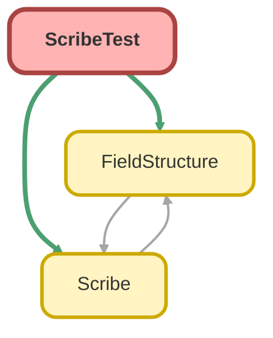

---
hide:
  - path
---

# ScribeTest Class

`ISTEST`

Copyright 2025 Hiroyuki Matsuoka 
 
Licensed under the Apache License, Version 2.0 (the &quot;License&quot;); 
you may not use this file except in compliance with the License. 
You may obtain a copy of the License at 
 
http://www.apache.org/licenses/LICENSE-2.0 
 
Unless required by applicable law or agreed to in writing, software 
distributed under the License is distributed on an &quot;AS IS&quot; BASIS, 
WITHOUT WARRANTIES OR CONDITIONS OF ANY KIND, either express or implied. 
See the License for the specific language governing permissions and 
limitations under the License.

## Class Diagram



<!-- Apex description -->

## Apex Code

```java
/**
 * Copyright 2025 Hiroyuki Matsuoka
 *
 * Licensed under the Apache License, Version 2.0 (the "License");
 * you may not use this file except in compliance with the License.
 * You may obtain a copy of the License at
 *
 * http://www.apache.org/licenses/LICENSE-2.0
 *
 * Unless required by applicable law or agreed to in writing, software
 * distributed under the License is distributed on an "AS IS" BASIS,
 * WITHOUT WARRANTIES OR CONDITIONS OF ANY KIND, either express or implied.
 * See the License for the specific language governing permissions and
 * limitations under the License.
 */
@isTest(seeAllData=false)
public with sharing class ScribeTest {
  @isTest
  static void testScribeIsImmutableTest() {
    // Arrange
    Scribe scribeOriginal = Scribe.source(Account.getSObjectType());

    // Act
    Scribe scribeAfterAddingId = scribeOriginal.field('Id');

    // Assert
    Assert.areEqual(0, scribeOriginal.selectFields.size());
    Assert.areEqual(1, scribeAfterAddingId.selectFields.size());

    // Additional Act
    Scribe scribeAfterAddingName = scribeAfterAddingId.field('Name');
    scribeOriginal = scribeOriginal.fields(new List<String>{ 'Name', 'StageName', 'CloseDate' });

    // Additional Assert
    Assert.areEqual(3, scribeOriginal.selectFields.size());
    Assert.areEqual(1, scribeAfterAddingId.selectFields.size());
    Assert.areEqual(2, scribeAfterAddingName.selectFields.size());
  }

  @isTest
  static void testField_WhenAddField_ThenAddFieldToSelect() {
    // Arrange
    Scribe scribe = Scribe.source(Account.getSObjectType()).field('Id');

    // Act
    String soql = scribe.toSoql();

    // Assert
    String expectedSoql = 'SELECT id FROM Account';
    Assert.areEqual(expectedSoql, soql);
  }

  @isTest
  static void testField_WhenAddMultiFieldsUsingFieldMethod_ThenAddFieldsToSelect() {
    // Arrange
    Scribe scribe = Scribe.source(Opportunity.getSObjectType()).field('Id').field('Name').field('StageName');

    // Act
    String soql = scribe.toSoql();

    // Assert
    String expectedSoql = 'SELECT id, name, stagename FROM Opportunity';
    Assert.areEqual(expectedSoql, soql);
  }

  @isTest
  static void testField_WhenAddNonExistField_ThenThrowException() {
    // Arrange
    Scribe scribe = Scribe.source(Account.getSObjectType()).field('NonExistField');

    // Act & Assert
    try {
      String soql = scribe.toSoql();
      Assert.fail('Expected QueryException to be thrown');
    } catch (QueryException e) {
      // Assert that the exception message is as expected
      String expectedMessage = 'The specified field does not exist in the object\'s fields. object name: Account, field name: NonExistField';
      Assert.areEqual(expectedMessage, e.getMessage());
    }
  }

  @isTest
  static void testFields_WhenAddList_ThenAddFieldsToSelect() {
    // Arrange
    List<String> fields = new List<String>{ 'Id', 'Name', 'StageName' };
    Scribe scribe = Scribe.source(Opportunity.getSObjectType()).fields(fields);

    // Act
    String soql = scribe.toSoql();

    // Assert
    String expectedSoql = 'SELECT id, name, stagename FROM Opportunity';
    Assert.areEqual(expectedSoql, soql);
  }

  @isTest
  static void testAllFields_WhenAddAllFields_ThenAddAllFieldsToSelect() {
    // Arrange
    Scribe scribe = Scribe.source(Opportunity.getSObjectType()).allFields();

    // Act
    String soql = scribe.toSoql();

    // Assert
    Assert.isTrue(soql.contains('id'));
    Assert.isTrue(soql.contains('name'));
    Assert.isTrue(soql.contains('stagename'));
  }

  @isTest
  static void testEqual_WhenValueIsNotNull_ThenAddEqualCondition() {
    // Arrange
    Scribe scribe = Scribe.source(Account.getSObjectType()).field('Id').whereEqual('Name', 'Test Account');

    // Act
    String soql = scribe.toSoql();

    // Assert
    String expectedSoql = 'SELECT id FROM Account WHERE Name = \'Test Account\'';
    Assert.areEqual(expectedSoql, soql);
  }

  @isTest
  static void testEqual_WhenValueIsNull_ThenAddIsNullCondition() {
    // Arrange
    Scribe scribe = Scribe.source(Account.getSObjectType()).field('Id').whereEqual('Name', null);

    // Act
    String soql = scribe.toSoql();

    // Assert
    String expectedSoql = 'SELECT id FROM Account WHERE Name = NULL';
    Assert.areEqual(expectedSoql, soql);
  }

  @isTest
  static void testNotEqual_WhenValueIsNotNull_ThenAddEqualCondition() {
    // Arrange
    Scribe scribe = Scribe.source(Account.getSObjectType()).field('Id').whereNotEqual('Name', 'Test Account');

    // Act
    String soql = scribe.toSoql();

    // Assert
    String expectedSoql = 'SELECT id FROM Account WHERE Name != \'Test Account\'';
    Assert.areEqual(expectedSoql, soql);
  }

  @isTest
  static void testNotEqual_WhenValueIsNull_ThenAddIsNotNullCondition() {
    // Arrange
    Scribe scribe = Scribe.source(Account.getSObjectType()).field('Id').whereNotEqual('Name', null);

    // Act
    String soql = scribe.toSoql();

    // Assert
    String expectedSoql = 'SELECT id FROM Account WHERE Name != NULL';
    Assert.areEqual(expectedSoql, soql);
  }

  @isTest
  static void testGreaterThan_WhenValueIsNotNull_ThenAddGreaterThanCondition() {
    // Arrange
    Scribe scribe = Scribe.source(Opportunity.getSObjectType())
      .field('Id')
      .whereGreaterThan('TotalOpportunityQuantity', 1000);

    // Act
    String soql = scribe.toSoql();

    // Assert
    String expectedSoql = 'SELECT id FROM Opportunity WHERE TotalOpportunityQuantity > 1000';
    Assert.areEqual(expectedSoql, soql);
  }

  @isTest
  static void testGreaterThan_WhenValueIsNull_ThenThrowException() {
    // Arrange
    Scribe scribe = Scribe.source(Opportunity.getSObjectType())
      .field('Id')
      .whereGreaterThan('TotalOpportunityQuantity', null);

    // Act & Assert
    try {
      String soql = scribe.toSoql();
      Assert.fail('Expected QueryException to be thrown');
    } catch (QueryException e) {
      // Assert that the exception message is as expected
      String expectedMessage = 'Value cannot be null for GreaterThan condition. field: TotalOpportunityQuantity';
      Assert.areEqual(expectedMessage, e.getMessage());
    }
  }

  @isTest
  static void testGreaterThan_WhenTypeOfValueIsDatetime_ThenAddGreaterThanCondition() {
    // Arrange
    Datetime dt = Datetime.newInstance(2023, 1, 1, 0, 0, 0);
    Scribe scribe = Scribe.source(Opportunity.getSObjectType())
      .field('Id')
      .whereGreaterThan('LastModifiedDate', dt);

    // Act
    String soql = scribe.toSoql();

    // Assert
    String expectedDatetime = dt.formatGmt('yyyy-MM-dd\'T\'HH:mm:ss\'Z\'');
    String expectedSoql = 'SELECT id FROM Opportunity WHERE LastModifiedDate > ' + expectedDatetime;
    Assert.areEqual(expectedSoql, soql);
  }

  @isTest
  static void testGreaterThanOrEqual_WhenValueIsNotNull_ThenAddGreaterThanCondition() {
    // Arrange
    Scribe scribe = Scribe.source(Opportunity.getSObjectType())
      .field('Id')
      .whereGreaterThanOrEqual('TotalOpportunityQuantity', 1000);

    // Act
    String soql = scribe.toSoql();

    // Assert
    String expectedSoql = 'SELECT id FROM Opportunity WHERE TotalOpportunityQuantity >= 1000';
    Assert.areEqual(expectedSoql, soql);
  }

  @isTest
  static void testGreaterThanOrEqual_WhenValueIsNull_ThenThrowException() {
    // Arrange
    Scribe scribe = Scribe.source(Opportunity.getSObjectType())
      .field('Id')
      .whereGreaterThanOrEqual('TotalOpportunityQuantity', null);

    // Act & Assert
    try {
      String soql = scribe.toSoql();
      Assert.fail('Expected QueryException to be thrown');
    } catch (QueryException e) {
      // Assert that the exception message is as expected
      String expectedMessage = 'Value cannot be null for GreaterThanOrEqual condition. field: TotalOpportunityQuantity';
      Assert.areEqual(expectedMessage, e.getMessage());
    }
  }

  @isTest
  static void testLessThan_WhenValueIsNotNull_ThenAddLessThanCondition() {
    // Arrange
    Scribe scribe = Scribe.source(Opportunity.getSObjectType())
      .field('Id')
      .whereLessThan('TotalOpportunityQuantity', 1000);

    // Act
    String soql = scribe.toSoql();

    // Assert
    String expectedSoql = 'SELECT id FROM Opportunity WHERE TotalOpportunityQuantity < 1000';
    Assert.areEqual(expectedSoql, soql);
  }

  @isTest
  static void testLessThan_WhenValueIsNull_ThenThrowException() {
    // Arrange
    Scribe scribe = Scribe.source(Opportunity.getSObjectType())
      .field('Id')
      .whereLessThan('TotalOpportunityQuantity', null);

    // Act & Assert
    try {
      String soql = scribe.toSoql();
      Assert.fail('Expected QueryException to be thrown');
    } catch (QueryException e) {
      // Assert that the exception message is as expected
      String expectedMessage = 'Value cannot be null for LessThan condition. field: TotalOpportunityQuantity';
      Assert.areEqual(expectedMessage, e.getMessage());
    }
  }

  @isTest
  static void testLessThanOrEqual_WhenValueIsNotNull_ThenAddLessThanOrEqualCondition() {
    // Arrange
    Scribe scribe = Scribe.source(Opportunity.getSObjectType())
      .field('Id')
      .whereLessThanOrEqual('TotalOpportunityQuantity', 1000);

    // Act
    String soql = scribe.toSoql();

    // Assert
    String expectedSoql = 'SELECT id FROM Opportunity WHERE TotalOpportunityQuantity <= 1000';
    Assert.areEqual(expectedSoql, soql);
  }

  @isTest
  static void testLessThanOrEqual_WhenValueIsNull_ThenThrowException() {
    // Arrange
    Scribe scribe = Scribe.source(Opportunity.getSObjectType())
      .field('Id')
      .whereLessThanOrEqual('TotalOpportunityQuantity', null);

    // Act & Assert
    try {
      String soql = scribe.toSoql();
      Assert.fail('Expected QueryException to be thrown');
    } catch (QueryException e) {
      // Assert that the exception message is as expected
      String expectedMessage = 'Value cannot be null for LessThanOrEqual condition. field: TotalOpportunityQuantity';
      Assert.areEqual(expectedMessage, e.getMessage());
    }
  }

  @isTest
  static void testLike_WhenValueIsNotNull_ThenAddLikeCondition() {
    // Arrange
    Scribe scribe = Scribe.source(Account.getSObjectType()).field('Id').whereLike('Name', '%Test%');

    // Act
    String soql = scribe.toSoql();

    // Assert
    String expectedSoql = 'SELECT id FROM Account WHERE Name LIKE \'%Test%\'';
    Assert.areEqual(expectedSoql, soql);
  }

  @isTest
  static void testLike_WhenValueIsNull_ThenThrowException() {
    // Arrange
    Scribe scribe = Scribe.source(Account.getSObjectType()).field('Id').whereLike('Name', null);

    // Act & Assert
    try {
      String soql = scribe.toSoql();
      Assert.fail('Expected QueryException to be thrown');
    } catch (QueryException e) {
      // Assert that the exception message is as expected
      String expectedMessage = 'Value cannot be null for LIKE condition. field: Name';
      Assert.areEqual(expectedMessage, e.getMessage());
    }
  }

  @isTest
  static void testNotLike_WhenValueIsNotNull_ThenAddNotLikeCondition() {
    // Arrange
    Scribe scribe = Scribe.source(Account.getSObjectType()).field('Id').whereNotLike('Name', '%Test%');

    // Act
    String soql = scribe.toSoql();

    // Assert
    String expectedSoql = 'SELECT id FROM Account WHERE (NOT Name LIKE \'%Test%\')';
    Assert.areEqual(expectedSoql, soql);
  }

  @isTest
  static void testNotLike_WhenValueIsNull_ThenThrowException() {
    // Arrange
    Scribe scribe = Scribe.source(Account.getSObjectType()).field('Id').whereNotLike('Name', null);

    // Act & Assert
    try {
      String soql = scribe.toSoql();
      Assert.fail('Expected QueryException to be thrown');
    } catch (QueryException e) {
      // Assert that the exception message is as expected
      String expectedMessage = 'Value cannot be null for NOT LIKE condition. field: Name';
      Assert.areEqual(expectedMessage, e.getMessage());
    }
  }

  @isTest
  static void testIn_WhenValueIsList_ThenAddInCondition() {
    // Arrange
    List<String> values = new List<String>{ 'Test Account 1', 'Test Account 2' };
    Scribe scribe = Scribe.source(Account.getSObjectType()).field('Id').whereIn('Name', values);

    // Act
    String soql = scribe.toSoql();

    // Assert
    String expectedSoql = 'SELECT id FROM Account WHERE Name IN (\'Test Account 1\', \'Test Account 2\')';
    Assert.areEqual(expectedSoql, soql);
  }

  @isTest
  static void testIn_WhenValueIsIdSet_ThenAddInCondition() {
    // Arrange
    Set<Id> values = new Set<Id>{ '001000000000000AAA', '001000000000000AAB' };
    Scribe scribe = Scribe.source(Account.getSObjectType()).field('Id').whereIn('Id', values);

    // Act
    String soql = scribe.toSoql();

    // Assert
    String expectedSoql = 'SELECT id FROM Account WHERE Id IN (\'001000000000000AAA\', \'001000000000000AAB\')';
    Assert.areEqual(expectedSoql, soql);
  }

  @isTest
  static void testIn_WhenValueIncludeNull_ThenAddInConditionWithNull() {
    // Arrange
    List<String> values = new List<String>{ 'Test Account 1', null };
    Scribe scribe = Scribe.source(Account.getSObjectType()).field('Id').whereIn('Name', values);

    // Act
    String soql = scribe.toSoql();

    // Assert
    String expectedSoql = 'SELECT id FROM Account WHERE Name IN (\'Test Account 1\', NULL)';
    Assert.areEqual(expectedSoql, soql);
  }

  @isTest
  static void testIn_WhenValueIsEmptyList_ThenAddConditionThatAlwaysFalse() {
    // Arrange
    List<String> values = new List<String>();
    Scribe scribe = Scribe.source(Account.getSObjectType()).field('Id').whereIn('Name', values);

    // Act
    String soql = scribe.toSoql();

    // Assert
    String expectedSoql = 'SELECT id FROM Account WHERE Id = null';
    Assert.areEqual(expectedSoql, soql);
  }

  @isTest
  static void testNotIn_WhenValueIsList_ThenAddNotInCondition() {
    // Arrange
    List<String> values = new List<String>{ 'Test Account 1', 'Test Account 2' };
    Scribe scribe = Scribe.source(Account.getSObjectType()).field('Id').whereNotIn('Name', values);

    // Act
    String soql = scribe.toSoql();

    // Assert
    String expectedSoql = 'SELECT id FROM Account WHERE Name NOT IN (\'Test Account 1\', \'Test Account 2\')';
    Assert.areEqual(expectedSoql, soql);
  }

  @isTest
  static void testNotIn_WhenValueIsIdSet_ThenAddNotInCondition() {
    // Arrange
    Set<Id> values = new Set<Id>{ '001000000000000AAA', '001000000000000AAB' };
    Scribe scribe = Scribe.source(Account.getSObjectType()).field('Id').whereNotIn('Id', values);

    // Act
    String soql = scribe.toSoql();

    // Assert
    String expectedSoql = 'SELECT id FROM Account WHERE Id NOT IN (\'001000000000000AAA\', \'001000000000000AAB\')';
    Assert.areEqual(expectedSoql, soql);
  }

  @isTest
  static void testNotIn_WhenValueIncludeNull_ThenAddNotInConditionWithNull() {
    // Arrange
    List<String> values = new List<String>{ 'Test Account 1', null };
    Scribe scribe = Scribe.source(Account.getSObjectType()).field('Id').whereNotIn('Name', values);

    // Act
    String soql = scribe.toSoql();

    // Assert
    String expectedSoql = 'SELECT id FROM Account WHERE Name NOT IN (\'Test Account 1\', NULL)';
    Assert.areEqual(expectedSoql, soql);
  }

  @isTest
  static void testNotIn_WhenValueIsEmptyList_ThenIgnoreNotInCondition() {
    // Arrange
    List<String> values = new List<String>();
    Scribe scribe = Scribe.source(Account.getSObjectType())
      .field('Id')
      .whereNotIn('Name', values)
      .whereEqual('Name', 'Test Account');

    // Act
    String soql = scribe.toSoql();

    // Assert
    String expectedSoql = 'SELECT id FROM Account WHERE Name = \'Test Account\'';
    Assert.areEqual(expectedSoql, soql);
  }

  @isTest
  static void testIncludes_WhenValueIsList_ThenAddIncludesCondition() {
    // Arrange
    List<String> values = new List<String>{ 'Type1', 'Type2' };
    Scribe scribe = Scribe.source(Account.getSObjectType()).field('Id').whereIncludes('Type', values);

    // Act
    String soql = scribe.toSoql();

    // Assert
    // Note: this test assert soql building with INCUDES condition is success.
    // If you execute below expected soql, Type field is not multi picklist field, so it will throw exception.
    String expectedSoql = 'SELECT id FROM Account WHERE Type INCLUDES (\'Type1\', \'Type2\')';
    Assert.areEqual(expectedSoql, soql);
  }

  @isTest
  static void testExcudes_WhenValueIsList_ThenAddExcludesCondition() {
    // Arrange
    List<String> values = new List<String>{ 'Type1', 'Type2' };
    Scribe scribe = Scribe.source(Account.getSObjectType()).field('Id').whereExcludes('Type', values);

    // Act
    String soql = scribe.toSoql();

    // Assert
    // Note: this test assert soql building with EXCLUDES condition is success.
    // If you execute below expected soql, Type field is not multi picklist field, so it will throw exception.
    String expectedSoql = 'SELECT id FROM Account WHERE Type EXCLUDES (\'Type1\', \'Type2\')';
    Assert.areEqual(expectedSoql, soql);
  }

  @isTest
  static void testIsNull_WhenFieldIsNotNull_ThenAddIsNullCondition() {
    // Arrange
    Scribe scribe = Scribe.source(Account.getSObjectType()).field('Id').whereNull('Name');

    // Act
    String soql = scribe.toSoql();

    // Assert
    String expectedSoql = 'SELECT id FROM Account WHERE Name = NULL';
    Assert.areEqual(expectedSoql, soql);
  }

  @isTest
  static void testIsNotNull_WhenFieldIsNotNull_ThenAddIsNotNullCondition() {
    // Arrange
    Scribe scribe = Scribe.source(Account.getSObjectType()).field('Id').whereNotNull('Name');

    // Act
    String soql = scribe.toSoql();

    // Assert
    String expectedSoql = 'SELECT id FROM Account WHERE Name != NULL';
    Assert.areEqual(expectedSoql, soql);
  }

  @isTest
  static void testOrCondition_WhenAddOrConditionAtFirst_ThenThrownException() {
    // Arrange / Act / Assert
    try {
      Scribe scribe = Scribe.source(Account.getSObjectType())
        .field('Id')
        .orCondition()
        .whereEqual('Name', 'Test Account');

      Assert.fail('Expected exception to be thrown');
    } catch (Exception e) {
      System.debug('Expected exception: ' + e.getMessage());
      Assert.areEqual(
        'The orCondition() method cannot be called first. Please add a condition with a where...() method before adding an OR condition.',
        e.getMessage()
      );
    }
  }

  @isTest
  static void testEqual_WhenAddAndConditionAfterOrCondition_ThenThrowException() {
    // Arrange / Act / Assert
    try {
      Scribe scribe = Scribe.source(Account.getSObjectType())
        .field('Id')
        .whereEqual('Name', 'Test Account')
        .orCondition()
        .whereEqual('Name', 'Or Account Name')
        .whereEqual('Name', 'And Account Name');

      Assert.fail('Expected exception to be thrown');
    } catch (Exception e) {
      System.debug('Expected exception: ' + e.getMessage());
      Assert.areEqual(
        'The condition following an OR must also be an OR. To create complex conditions, please group them using the whereGroup() method. ',
        e.getMessage()
      );
    }
  }

  @isTest
  static void testEqual_WhenAddOrConditionAfterOrCondition_ThenAddOrCondition() {
    // Arrange
    Scribe scribe = Scribe.source(Account.getSObjectType())
      .field('Id')
      .whereEqual('Name', 'Test Account')
      .orCondition()
      .whereEqual('Name', 'Or Account Name')
      .orCondition()
      .whereEqual('Name', 'Another Or Account Name');

    // Act
    String soql = scribe.toSoql();

    // Assert
    String expectedSoql = 'SELECT id FROM Account WHERE Name = \'Test Account\' OR Name = \'Or Account Name\' OR Name = \'Another Or Account Name\'';
    Assert.areEqual(expectedSoql, soql);
  }

  @isTest
  static void testWhereGroup_WhenAddGroup_ThenAddGroupCondition() {
    // Arrange
    Scribe scribe = Scribe.source(Opportunity.getSObjectType())
      .field('Id')
      .whereEqual('Name', 'Test Opportunity')
      .whereGroup(
        Scribe.asGroup()
          .whereGreaterThan('TotalOpportunityQuantity', 10000)
          .orCondition()
          .whereEqual('Type', 'Test Type')
      );

    // Act
    String soql = scribe.toSoql();

    // Assert
    String expectedSoql = 'SELECT id FROM Opportunity WHERE Name = \'Test Opportunity\' AND (TotalOpportunityQuantity > 10000 OR Type = \'Test Type\')';
    Assert.areEqual(expectedSoql, soql);
  }

  @isTest
  static void testWhereGroup_WhenAddOrGroup_ThenAddOrGroupCondition() {
    // Arrange
    Scribe scribe = Scribe.source(Opportunity.getSObjectType())
      .field('Id')
      .whereEqual('Name', 'Test Opportunity')
      .orCondition()
      .whereGroup(
        Scribe.asGroup()
          .whereGreaterThan('TotalOpportunityQuantity', 10000)
          .orCondition()
          .whereEqual('Type', 'Test Type')
      );

    // Act
    String soql = scribe.toSoql();

    // Assert
    String expectedSoql = 'SELECT id FROM Opportunity WHERE Name = \'Test Opportunity\' OR (TotalOpportunityQuantity > 10000 OR Type = \'Test Type\')';
    Assert.areEqual(expectedSoql, soql);
  }

  @isTest
  static void testWhereGroup_WhenAddMultiGroup_ThenAddMultiGroupCondition() {
    // Arrange
    Scribe scribe = Scribe.source(Opportunity.getSObjectType())
      .field('Id')
      .whereEqual('Name', 'Test Opportunity')
      .whereGroup(
        Scribe.asGroup()
          .whereGreaterThan('TotalOpportunityQuantity', 10000)
          .orCondition()
          .whereEqual('Type', 'Test Type')
      )
      .whereGroup(
        Scribe.asGroup()
          .whereLessThan('CloseDate', Date.newInstance(2030, 12, 31))
          .orCondition()
          .whereEqual('StageName', 'Closed Won')
      );

    // Act
    String soql = scribe.toSoql();

    // Assert
    String expectedSoql = 'SELECT id FROM Opportunity WHERE Name = \'Test Opportunity\' AND (TotalOpportunityQuantity > 10000 OR Type = \'Test Type\') AND (CloseDate < 2030-12-31 OR StageName = \'Closed Won\')';
    Assert.areEqual(expectedSoql, soql);
  }

  @isTest
  static void testWhereGroup_WhenAddAndConditionAfterOrConditionInGroup_ThenThrowException() {
    // Arrange / Act / Assert
    try {
      Scribe scribe = Scribe.source(Account.getSObjectType())
        .field('Id')
        .whereEqual('Name', 'Test Account')
        .whereGroup(
          Scribe.asGroup()
            .whereGreaterThan('TotalOpportunityQuantity', 10000)
            .orCondition()
            .whereEqual('Type', 'Test Type')
            .whereEqual('StageName', 'Closed Won') // This should throw an exception
        );

      Assert.fail('Expected exception to be thrown');
    } catch (Exception e) {
      System.debug('Expected exception: ' + e.getMessage());
      Assert.areEqual(
        'The condition following an OR must also be an OR. To create complex conditions, please group them using the whereGroup() method. ',
        e.getMessage()
      );
    }
  }

  @isTest
  static void testWhereGroup_WhenAddAndGroupAfterOrGroup_ThenThrowException() {
    // Arrange / Act / Assert
    try {
      Scribe scribe = Scribe.source(Account.getSObjectType())
        .field('Id')
        .whereEqual('Name', 'Test Account')
        .orCondition()
        .whereGroup(
          Scribe.asGroup()
            .whereGreaterThan('TotalOpportunityQuantity', 10000)
            .orCondition()
            .whereEqual('Type', 'Test Type')
        )
        .whereGroup(
          Scribe.asGroup().whereEqual('StageName', 'Closed Won') // This should throw an exception
        );

      Assert.fail('Expected exception to be thrown');
    } catch (Exception e) {
      System.debug('Expected exception: ' + e.getMessage());
      Assert.areEqual(
        'The condition following an OR must also be an OR. To create complex conditions, please group them using the whereGroup() method. ',
        e.getMessage()
      );
    }
  }

  @isTest
  static void testWhereGroup_WhenGroupConditionIsEmpty_ThenIgnoreGroupCondition() {
    // Arrange
    List<Id> Ids = new List<Id>();
    List<String> stages = new List<String>();
    Scribe scribe = Scribe.source(Account.getSObjectType())
      .field('Id')
      .whereGroup(Scribe.asGroup().whereNotIn('Id', Ids).whereNotIn('StageName', stages)) // Empty group condition
      .whereEqual('Name', 'Test Account');

    // Act
    String soql = scribe.toSoql();

    // Assert
    String expectedSoql = 'SELECT id FROM Account WHERE Name = \'Test Account\'';
    Assert.areEqual(expectedSoql, soql);
  }

  @isTest
  static void testWhereGroup_WhenAddFieldInGroup_ThenThrowException() {
    // Arrange / Act / Assert
    try {
      Scribe scribe = Scribe.source(Account.getSObjectType())
        .field('Id')
        .whereGroup(
          Scribe.asGroup()
            .field('Name') // This should throw an exception
            .whereEqual('Name', 'Test Account')
        );

      Assert.fail('Expected exception to be thrown');
    } catch (Exception e) {
      System.debug('Expected exception: ' + e.getMessage());
      Assert.areEqual(
        'Fields cannot be added while defining a group condition (inside whereGroup()).',
        e.getMessage()
      );
    }
  }

  @isTest
  static void testIN_WhenUsingSubquery_ThenAddInSubQueryCondition() {
    // Arrange
    Scribe scribe = Scribe.source(Opportunity.getSObjectType())
      .field('Id')
      .whereIn(
        'AccountId',
        Scribe.source(Account.getSObjectType()).field('Id').whereEqual('Name', 'Test Account')
      );

    // Act
    String soql = scribe.toSoql();

    // Assert
    String expectedSoql = 'SELECT id FROM Opportunity WHERE AccountId IN (SELECT id FROM Account WHERE Name = \'Test Account\')';
    Assert.areEqual(expectedSoql, soql);
  }

  @isTest
  static void testIn_WhenUsingSubqueryWithOrCondition_ThenThrowException() {
    // Arrange / Act / Assert
    try {
      Scribe scribe = Scribe.source(Opportunity.getSObjectType())
        .field('Id')
        .whereLike('Name', '%Test%')
        .orCondition()
        .whereIn('AccountId', Scribe.source(Account.getSObjectType()).field('Id').whereLike('Name', '%Test%'));

      Assert.fail('Expected exception to be thrown');
    } catch (Exception e) {
      System.debug('Expected exception: ' + e.getMessage());
      Assert.areEqual(
        'The whereIn() method with a subquery is not supported after orCondition().',
        e.getMessage()
      );
    }
  }

  @isTest
  static void testNotIn_WhenUsingSubquery_ThenAddNotInSubQueryCondition() {
    // Arrange
    Scribe scribe = Scribe.source(Opportunity.getSObjectType())
      .field('Id')
      .whereNotIn(
        'AccountId',
        Scribe.source(Account.getSObjectType()).field('Id').whereEqual('Name', 'Test Account')
      );

    // Act
    String soql = scribe.toSoql();

    // Assert
    String expectedSoql = 'SELECT id FROM Opportunity WHERE AccountId NOT IN (SELECT id FROM Account WHERE Name = \'Test Account\')';
    Assert.areEqual(expectedSoql, soql);
  }

  @isTest
  static void testNotIn_WhenUsingSubqueryWithOrCondition_ThenThrowException() {
    // Arrange / Act / Assert
    try {
      Scribe scribe = Scribe.source(Opportunity.getSObjectType())
        .field('Id')
        .whereLike('Name', '%Test%')
        .orCondition()
        .whereNotIn('AccountId', Scribe.source(Account.getSObjectType()).field('Id').whereLike('Name', '%Test%'));

      Assert.fail('Expected exception to be thrown');
    } catch (Exception e) {
      System.debug('Expected exception: ' + e.getMessage());
      Assert.areEqual(
        'The whereNotIn() method with a subquery is not supported after orCondition().',
        e.getMessage()
      );
    }
  }

  @isTest
  static void testWithChildren_ThenAddWithChildrenCondition_ThenAddWithChildrenCondition() {
    // Arrange
    Scribe scribe = Scribe.source(Account.getSObjectType())
      .field('Id')
      .withChildren(
        Scribe.asChild(Opportunity.getSObjectType()).relationName('Opportunities').field('Id').whereNotNull('Name')
      )
      .whereEqual('Name', 'Test Account');

    // Act
    String soql = scribe.toSoql();

    // Assert
    String expectedSoql = 'SELECT id, (SELECT id FROM Opportunities WHERE Name != NULL) FROM Account WHERE Name = \'Test Account\'';
    Assert.areEqual(expectedSoql, soql);
  }

  @isTest
  static void testWithChildren_WhenAddParallelWithChildrenCondition_ThenAddParallelWithChildrenCondition() {
    // Arrange
    Scribe scribe = Scribe.source(Account.getSObjectType())
      .field('Id')
      .withChildren(
        Scribe.asChild(Opportunity.getSObjectType()).relationName('Opportunities').field('Id').whereNotNull('Name')
      )
      .withChildren(Scribe.asChild(Contact.getSObjectType()).field('Id').whereNotNull('Email'))
      .whereEqual('Name', 'Test Account');

    // Act
    String soql = scribe.toSoql();

    // Assert
    String expectedSoql = 'SELECT id, (SELECT id FROM Opportunities WHERE Name != NULL), (SELECT id FROM Contacts WHERE Email != NULL) FROM Account WHERE Name = \'Test Account\'';
    Assert.areEqual(expectedSoql, soql);
  }

  @isTest
  static void testWithChildren_WhenAddNestedWithChildrenCondition_ThenAddNestedWithChildrenCondition() {
    // Arrange
    Scribe scribe = Scribe.source(Account.getSObjectType())
      .field('Id')
      .withChildren(
        Scribe.asChild(Contact.getSObjectType())
          .field('Id')
          .whereNotNull('Name')
          .withChildren(Scribe.asChild(Opportunity.getSObjectType()).field('Id').whereNotNull('Email'))
      )
      .whereEqual('Name', 'Test Account');

    // Act
    String soql = scribe.toSoql();

    // Assert
    String expectedSoql = 'SELECT id, (SELECT id, (SELECT id FROM Opportunities WHERE Email != NULL) FROM Contacts WHERE Name != NULL) FROM Account WHERE Name = \'Test Account\'';
    Assert.areEqual(expectedSoql, soql);
  }

  @isTest
  static void testWithChildren_WhenAddWithChildrenConditionAfterOrCondition_ThenThrowException() {
    // Arrange / Act / Assert
    try {
      Scribe scribe = Scribe.source(Account.getSObjectType())
        .field('Id')
        .whereEqual('Name', 'Test Account')
        .orCondition()
        .withChildren(Scribe.asChild(Opportunity.getSObjectType()).field('Id').whereNotNull('Name'));

      Assert.fail('Expected exception to be thrown');
    } catch (Exception e) {
      System.debug('Expected exception: ' + e.getMessage());
      Assert.areEqual(
        'The method following orCondition() must be a where...() method or the whereGroup() method.',
        e.getMessage()
      );
    }
  }

  @isTest
  static void testWithChildren_WhenAddOverFourNestChildren_ThenThrowException() {
    // Arrange
    Scribe scribe = Scribe.source(Account.getSObjectType())
      .field('Id')
      .withChildren(
        Scribe.asChild(Contact.getSObjectType())
          .field('Id')
          .withChildren(
            Scribe.asChild(Opportunity.getSObjectType())
              .field('Id')
              .withChildren(
                Scribe.asChild(Quote.getSObjectType())
                  .field('Id')
                  .withChildren(
                    Scribe.asChild(Order.getSObjectType())
                      .field('Id')
                      .withChildren(Scribe.asChild(OrderItem.getSObjectType()).field('Id'))
                  )
              )
          )
      );

    // Act / Assert
    try {
      String soql = scribe.toSoql();
      Assert.fail('Expected exception to be thrown');
    } catch (Exception e) {
      System.debug('Expected exception: ' + e.getMessage());
      Assert.areEqual(
        'Maximum nesting depth for child queries reached. Max depth: 4, Object name: OrderItem',
        e.getMessage()
      );
    }
  }

  @isTest
  static void testWithChildren_WhenAddOverFourNestChildrenUsingOtherScribeInstance_ThenThrowException() {
    // Arrange
    Scribe oppScribe = Scribe.asChild(Opportunity.getSObjectType())
      .field('Id')
      .withChildren(
        Scribe.asChild(Quote.getSObjectType())
          .field('Id')
          .withChildren(
            Scribe.asChild(Order.getSObjectType())
              .field('Id')
              .withChildren(Scribe.asChild(OrderItem.getSObjectType()).field('Id'))
          )
      );

    Scribe accountScribe = Scribe.source(Account.getSObjectType())
      .field('Id')
      .withChildren(Scribe.asChild(Contact.getSObjectType()).field('Id').withChildren(oppScribe));

    // Act / Assert
    try {
      String soql = accountScribe.toSoql();
      Assert.fail('Expected exception to be thrown');
    } catch (Exception e) {
      System.debug('Expected exception: ' + e.getMessage());
      Assert.areEqual(
        'Maximum nesting depth for child queries reached. Max depth: 4, Object name: OrderItem',
        e.getMessage()
      );
    }
  }

  @isTest
  static void testWithChildren_WhenAddRelationName_ThenAddedRelationNameUsed() {
    // Arrange
    Scribe scribe = Scribe.source(Account.getSObjectType())
      .field('Id')
      .withChildren(
        Scribe.asChild(Opportunity.getSObjectType()).relationName('Opportunities').field('Id').whereNotNull('Name')
      )
      .whereEqual('Name', 'Test Account');

    // Act
    String soql = scribe.toSoql();

    // Assert
    String expectedSoql = 'SELECT id, (SELECT id FROM Opportunities WHERE Name != NULL) FROM Account WHERE Name = \'Test Account\'';
    Assert.areEqual(expectedSoql, soql);
  }

  @isTest
  static void testWithChildren_WhenAddInvalidRelationName_ThenThrowException() {
    // Arrange
    Scribe scribe = Scribe.source(Account.getSObjectType())
      .field('Id')
      .withChildren(
        Scribe.asChild(Opportunity.getSObjectType())
          .relationName('Opporrunity__r')
          .field('Id')
          .whereNotNull('Name')
      )
      .whereEqual('Name', 'Test Account');

    try {
      // Act
      String soql = scribe.toSoql();
      Assert.fail('Expected exception to be thrown');
    } catch (Exception e) {
      System.debug(e.getMessage());
      String expected = String.format(
        'The specified parent relationship name is not valid. child object name: {0}, parent object name: {1}, relationship name: {2}',
        new List<String>{ 'Opportunity', 'Account', 'Opporrunity__r' }
      );
      Assert.areEqual(expected, e.getMessage());
    }
  }

  @isTest
  static void testWithChildren_WhenMultiRelationFieldWithSameParentExist_ThenThrowException() {
    // Arrange
    Scribe scribe = Scribe.source(User.getSObjectType())
      .field('Id')
      .withChildren(Scribe.asChild(Contract.getSObjectType()).field('Id').whereNotNull('Name'));

    // Act / Assert
    try {
      String soql = scribe.toSoql();
      Assert.fail('Expected exception to be thrown');
    } catch (Exception e) {
      System.debug(e.getMessage());
      String errorMessage = String.format(
        'The child object has multiple parent relationships with the same parent object. object name: {0}, parent object name: {1}\nPlease specify the relationship name explicitly using the relationName() method.',
        new List<String>{ 'Contract', 'User' }
      );
      Assert.areEqual(errorMessage, e.getMessage());
    }
  }

  @isTest
  static void testWithChildren_WhenAggregateInChild_ThenThrowException() {
    // Arrange/ Act / Assert
    try {
      Scribe scribe = Scribe.source(Account.getSObjectType())
        .field('Id')
        .withChildren(Scribe.asChild(Opportunity.getSObjectType()).average('Amount', 'AvgAmount'));
      String soql = scribe.toSoql();
      Assert.fail('Expected exception to be thrown');
    } catch (Exception e) {
      System.debug(e.getMessage());
      String expectedMessage = 'Aggregate functions cannot be used in a child Scribe.';
      Assert.areEqual(expectedMessage, e.getMessage());
    }
  }

  @isTest
  static void testWithParent_WhenAddOnlyParentField_ThenAddOnlyParentField() {
    // Arrange
    Scribe scribe = Scribe.source(Opportunity.getSObjectType())
      .field('Id')
      .parentField(Scribe.asParent('AccountId').field('Name').field('Id'))
      .whereEqual('Name', 'Test Opportunity');

    // Act
    String soql = scribe.toSoql();

    // Assert
    String expectedSoql = 'SELECT id, Account.name, Account.id FROM Opportunity WHERE Name = \'Test Opportunity\'';
    Assert.areEqual(expectedSoql, soql);
  }

  @isTest
  static void testWithParent_WhenAddVoidString_ThenThrowException() {
    // Arrange / Act / Assert
    try {
      Scribe scribe = Scribe.source(Opportunity.getSObjectType())
        .field('Id')
        .parentField(Scribe.asParent(''))
        .whereEqual('Name', 'Test Opportunity');

      String soql = scribe.toSoql();
      Assert.fail('Expected exception to be thrown');
    } catch (Exception e) {
      System.debug('Expected exception: ' + e.getMessage());
      Assert.areEqual('The relationship field name for asParent() must be specified.', e.getMessage());
    }
  }

  @isTest
  static void testWithParent_WhenAddOnlyParentFieldUsingAsGroup_ThenErrorThrown() {
    // Arrange / Act / Assert
    try {
      Scribe scribe = Scribe.source(Opportunity.getSObjectType())
        .field('Id')
        .parentField(Scribe.asGroup())
        .whereEqual('Name', 'Test Opportunity');

      String soql = scribe.toSoql();
      Assert.fail('Expected exception to be thrown');
    } catch (Exception e) {
      System.debug('Expected exception: ' + e.getMessage());
      Assert.areEqual(
        'The Scribe instance for the parentField() method must be created with Scribe.asParent().',
        e.getMessage()
      );
    }
  }

  @isTest
  static void testWithParent_AddOnlyParentCondition_ThenAddOnlyParentCondition() {
    // Arrange
    Scribe scribe = Scribe.source(Opportunity.getSObjectType())
      .field('Id')
      .parentCondition(Scribe.asParent('AccountId').whereEqual('Name', 'Test Account'));

    // Act
    String soql = scribe.toSoql();

    // Assert
    String expectedSoql = 'SELECT id FROM Opportunity WHERE Account.Name = \'Test Account\'';
    Assert.areEqual(expectedSoql, soql);
  }

  @isTest
  static void testWithParent_AddOnlyParentConditionUsingAsGroup_ThenErrorThrown() {
    // Arrange / Act / Assert
    try {
      Scribe scribe = Scribe.source(Opportunity.getSObjectType())
        .field('Id')
        .parentCondition(Scribe.asGroup().whereEqual('Name', 'Test Account'));

      String soql = scribe.toSoql();
      Assert.fail('Expected exception to be thrown');
    } catch (Exception e) {
      System.debug('Expected exception: ' + e.getMessage());
      Assert.areEqual(
        'The Scribe instance for the parentCondition() method must be created with Scribe.asParent().',
        e.getMessage()
      );
    }
  }

  @isTest
  static void testWithParent_WhenAddWithParentCondition_ThenAddWithParentCondition() {
    // Arrange
    Scribe scribe = Scribe.source(Opportunity.getSObjectType())
      .field('Id')
      .parentField(Scribe.asParent('AccountId').field('Name').field('Id'))
      .whereEqual('Name', 'Test Opportunity')
      .parentCondition(Scribe.asParent('AccountId').whereEqual('Name', 'Test Account'));

    // Act
    String soql = scribe.toSoql();

    // Assert
    String expectedSoql = 'SELECT id, Account.name, Account.id FROM Opportunity WHERE Name = \'Test Opportunity\' AND Account.Name = \'Test Account\'';
    Assert.areEqual(expectedSoql, soql);
  }

  @isTest
  static void testWithParent_WhenAddWithParentMultipleCondition_ThenAddWithParentMultipleCondition() {
    // Arrange
    Scribe scribe = Scribe.source(Opportunity.getSObjectType())
      .field('Id')
      .parentField(Scribe.asParent('AccountId').field('Name').field('Id'))
      .whereEqual('Name', 'Test Opportunity')
      .parentCondition(
        Scribe.asParent('AccountId').whereEqual('Name', 'Test Account').whereEqual('Type', 'Test Type')
      );

    // Act
    String soql = scribe.toSoql();

    // Assert
    String expectedSoql = 'SELECT id, Account.name, Account.id FROM Opportunity WHERE Name = \'Test Opportunity\' AND Account.Name = \'Test Account\' AND Account.Type = \'Test Type\'';
    Assert.areEqual(expectedSoql, soql);
  }

  @isTest
  static void testWithParent_WhenAddWithParentMultipleConditionByAnotherMethod_ThenAddWithParentMultipleCondition() {
    // Arrange
    Scribe scribe = Scribe.source(Opportunity.getSObjectType())
      .field('Id')
      .parentField(Scribe.asParent('AccountId').field('Name').field('Id'))
      .whereEqual('Name', 'Test Opportunity')
      .parentCondition(Scribe.asParent('AccountId').whereEqual('Name', 'Test Account'))
      .parentCondition(Scribe.asParent('AccountId').whereEqual('Type', 'Test Type'));

    // Act
    String soql = scribe.toSoql();

    // Assert
    String expectedSoql = 'SELECT id, Account.name, Account.id FROM Opportunity WHERE Name = \'Test Opportunity\' AND Account.Name = \'Test Account\' AND Account.Type = \'Test Type\'';
    Assert.areEqual(expectedSoql, soql);
  }

  @isTest
  static void testWithParent_WhenAddOrConditionParent_ThenAddOrConditionParent() {
    // Arrange
    Scribe scribe = Scribe.source(Opportunity.getSObjectType())
      .field('Id')
      .parentField(Scribe.asParent('AccountId').field('Name').field('Id'))
      .whereEqual('Name', 'Test Opportunity')
      .parentCondition(
        Scribe.asParent('AccountId')
          .whereEqual('Name', 'Test Account')
          .orCondition()
          .whereEqual('Type', 'Test Type')
      );

    // Act
    String soql = scribe.toSoql();

    // Assert
    String expectedSoql = 'SELECT id, Account.name, Account.id FROM Opportunity WHERE Name = \'Test Opportunity\' AND Account.Name = \'Test Account\' OR Account.Type = \'Test Type\'';
    Assert.areEqual(expectedSoql, soql);
  }

  @isTest
  static void testWithParent_WhenAddParentConditionAfterOrCondition_ThenThrownError() {
    // Arrange / Act / Assert
    try {
      Scribe scribe = Scribe.source(Opportunity.getSObjectType())
        .field('Id')
        .parentField(Scribe.asParent('AccountId').field('Name').field('Id'))
        .whereEqual('Name', 'Test Opportunity')
        .orCondition()
        .parentCondition(
          Scribe.asParent('AccountId')
            .whereEqual('Name', 'Test Account')
            .orCondition()
            .whereEqual('Type', 'Test Type')
        );

      String soql = scribe.toSoql();
      Assert.fail('Expected exception to be thrown');
    } catch (Exception e) {
      System.debug('Expected exception: ' + e.getMessage());
      Assert.areEqual(
        'The method following orCondition() must be a where...() method or the whereGroup() method.',
        e.getMessage()
      );
    }
  }

  @isTest
  static void testWithParent_WhenAddOrConditionAtFirstInParentCondition_ThenAddOrParentCondition() {
    // Arrange
    Scribe scribe = Scribe.source(Opportunity.getSObjectType())
      .field('Id')
      .parentField(Scribe.asParent('AccountId').field('Name').field('Id'))
      .whereEqual('Name', 'Test Opportunity')
      .parentCondition(Scribe.asParent('AccountId').orCondition().whereEqual('Name', 'Test Account'));

    // Act
    String soql = scribe.toSoql();

    // Assert
    String expectedSoql = 'SELECT id, Account.name, Account.id FROM Opportunity WHERE Name = \'Test Opportunity\' OR Account.Name = \'Test Account\'';
    Assert.areEqual(expectedSoql, soql);
  }

  @isTest
  static void testWithParent_WhenAddOrConditionParentAsGroup_ThenAddOrConditionParentAsasGroup() {
    // Arrange
    Scribe scribe = Scribe.source(Opportunity.getSObjectType())
      .field('Id')
      .parentField(Scribe.asParent('AccountId').field('Name').field('Id'))
      .whereEqual('Name', 'Test Opportunity')
      .whereGroup(
        Scribe.asGroup()
          .parentCondition(
            Scribe.asParent('AccountId')
              .whereEqual('Name', 'Test Account')
              .orCondition()
              .whereEqual('Type', 'Test Type')
          )
      );

    // Act
    String soql = scribe.toSoql();

    // Assert
    String expectedSoql = 'SELECT id, Account.name, Account.id FROM Opportunity WHERE Name = \'Test Opportunity\' AND (Account.Name = \'Test Account\' OR Account.Type = \'Test Type\')';
    Assert.areEqual(expectedSoql, soql);
  }

  @isTest
  static void testWithParent_WhenAddNestedParent_ThenAddNestedParentCondition() {
    // Arrange
    Scribe scribe = Scribe.source(Opportunity.getSObjectType())
      .field('Id')
      .parentField(
        Scribe.asParent('ContractId')
          .field('Id')
          .field('Name')
          .parentField(Scribe.asParent('AccountId').field('Name').field('Id'))
      )
      .whereEqual('Name', 'Test Opportunity')
      .parentCondition(
        Scribe.asParent('ContractId')
          .whereEqual('Name', 'Test Contract')
          .parentCondition(Scribe.asParent('AccountId').whereEqual('Name', 'Test Account'))
      );

    // Act
    String soql = scribe.toSoql();

    // Assert
    String expectedSoql = 'SELECT id, Contract.id, Contract.name, Contract.Account.name, Contract.Account.id FROM Opportunity WHERE Name = \'Test Opportunity\' AND Contract.Name = \'Test Contract\' AND Contract.Account.Name = \'Test Account\'';
    Assert.areEqual(expectedSoql, soql);
  }

  @isTest
  static void testWithParent_WhenAddThreeNestedParentOrCondition_ThenAddNestedParentCondition() {
    // Arrange
    Scribe scribe = Scribe.source(Opportunity.getSObjectType())
      .field('Id')
      .parentField(
        Scribe.asParent('ContractId')
          .field('Id')
          .field('Name')
          .parentField(Scribe.asParent('AccountId').field('Name').field('Id'))
      )
      .whereEqual('Name', 'Test Opportunity')
      .parentCondition(
        Scribe.asParent('ContractId')
          .whereEqual('Name', 'Test Contract')
          .parentCondition(
            Scribe.asParent('AccountId').whereEqual('Name', 'Test Account').whereEqual('Type', 'Test Type')
          )
      );

    // Act
    String soql = scribe.toSoql();

    // Assert
    String expectedSoql = 'SELECT id, Contract.id, Contract.name, Contract.Account.name, Contract.Account.id FROM Opportunity WHERE Name = \'Test Opportunity\' AND Contract.Name = \'Test Contract\' AND Contract.Account.Name = \'Test Account\' AND Contract.Account.Type = \'Test Type\'';
    Assert.areEqual(expectedSoql, soql);
  }

  @isTest
  static void testWithParent_WhenAddAndConditionAfterOrParentCondition_ThenErrorThrown() {
    // Arrange
    Scribe scribe = Scribe.source(Opportunity.getSObjectType())
      .field('Id')
      .parentField(Scribe.asParent('AccountId').field('Name').field('Id'))
      .parentCondition(
        Scribe.asParent('AccountId')
          .whereEqual('Name', 'Test Account')
          .orCondition()
          .whereEqual('Type', 'Test Type')
      )
      .whereEqual('Name', 'Test Opportunity');

    // Act / Assert
    try {
      String soql = scribe.toSoql();
      Assert.fail('Expected exception to be thrown');
    } catch (Exception e) {
      System.debug('Expected exception: ' + e.getMessage());
      Assert.areEqual(
        'The condition following an OR must also be an OR. To create complex conditions, please group them using the whereGroup() method.',
        e.getMessage()
      );
    }
  }

  @isTest
  static void testWithParent_WhenAddAndConditionAfterNestedOrParentCondition_ThenErrorThrown() {
    // Arrange
    Scribe scribe = Scribe.source(Opportunity.getSObjectType())
      .field('Id')
      .parentField(Scribe.asParent('AccountId').field('Name').field('Id'))
      .parentCondition(
        Scribe.asParent('ContractId')
          .whereEqual('Name', 'Test Contract')
          .parentCondition(
            Scribe.asParent('AccountId')
              .whereEqual('Name', 'Test Account')
              .orCondition()
              .whereEqual('Type', 'Test Type')
          )
      )
      .whereEqual('Name', 'Test Opportunity');

    // Act / Assert
    try {
      String soql = scribe.toSoql();
      Assert.fail('Expected exception to be thrown');
    } catch (Exception e) {
      System.debug('Expected exception: ' + e.getMessage());
      Assert.areEqual(
        'The condition following an OR must also be an OR. To create complex conditions, please group them using the whereGroup() method.',
        e.getMessage()
      );
    }
  }

  @isTest
  static void testWithParent_WhenAddIgnoreParentCondition_ThenInogreParentCondition() {
    // Arrange
    Scribe scribe = Scribe.source(Quote.getSObjectType())
      .field('Id')
      .whereEqual('Name', 'Test Quote')
      .parentCondition(Scribe.asParent('OpportunityId').whereNotIn('Id', new List<Id>()));

    // Act
    String soql = scribe.toSoql();

    // Assert
    String expectedSoql = 'SELECT id FROM Quote WHERE Name = \'Test Quote\'';
    Assert.areEqual(expectedSoql, soql);
  }

  @isTest
  static void testWithParent_WhenAddIgnoreParentCondition_ThenInogreParentCondition_2() {
    // Arrange
    Scribe scribe = Scribe.source(Quote.getSObjectType())
      .field('Id')
      .whereEqual('Name', 'Test Quote')
      .parentCondition(
        Scribe.asParent('OpportunityId')
          .whereNotIn('Id', new List<Id>())
          .whereNotIn('StageName', new List<String>())
          .WhereLike('Name', 'Test%')
      );

    // Act
    String soql = scribe.toSoql();

    // Assert
    String expectedSoql = 'SELECT id FROM Quote WHERE Name = \'Test Quote\' AND Opportunity.Name LIKE \'Test%\'';
    Assert.areEqual(expectedSoql, soql);
  }

  @isTest
  static void testWithParent_WhenAddOverFourNestedParentFieldOver_ThenThrowException() {
    // Arrange
    Scribe scribe = Scribe.source(OrderItem.getSObjectType())
      .field('Id')
      .parentField(
        Scribe.asParent('OrderId')
          .field('Id')
          .parentField(
            Scribe.asParent('OriginalOrderId')
              .field('Id')
              .parentField(
                Scribe.asParent('QuoteId')
                  .field('Id')
                  .parentField(
                    Scribe.asParent('OpportunityId')
                      .field('Id')
                      .parentField(
                        Scribe.asParent('ContractId')
                          .field('Id')
                          .parentField(Scribe.asParent('AccountId').field('Id'))
                      )
                  )
              )
          )
      );

    // Act / Assert
    try {
      String soql = scribe.toSoql();
      Assert.fail('Expected exception to be thrown');
    } catch (Exception e) {
      System.debug('Expected exception: ' + e.getMessage());
      Assert.areEqual(
        'Maximum nesting depth for parent queries reached. Max depth: 5, Object name: Account',
        e.getMessage()
      );
    }
  }

  @isTest
  static void testBuildFieldStructure_WhenAddField_ThenReturnFieldStructure() {
    // Arrange
    Scribe scribe = Scribe.source(Account.getSObjectType()).field('Id').field('Name').field('Type');

    // Act
    FieldStructure fieldStructure = scribe.buildFieldStructure();

    // Assert
    Assert.isTrue(fieldStructure.hasField('id'));
    Assert.isTrue(fieldStructure.hasField('name'));
    Assert.isTrue(fieldStructure.hasField('type'));
    Assert.isFalse(fieldStructure.hasField('nonSelectedField'));
  }

  @isTest
  static void testBuildFieldStructure_WhenAddParentField_ThenReturnFieldStructureWithParentFields() {
    // Arrange
    Scribe scribe = Scribe.source(Opportunity.getSObjectType())
      .field('Id')
      .parentField(Scribe.asParent('AccountId').field('Name').field('Id'))
      .parentField(Scribe.asParent('ContractId').field('Name').field('Id'))
      .whereEqual('Name', 'Test Opportunity');

    // Act
    FieldStructure fieldStructure = scribe.buildFieldStructure();

    // Assert
    Assert.isTrue(fieldStructure.hasField('id'));
    Assert.isTrue(fieldStructure.hasRelation('accountid'));
    FieldStructure accountFieldStructure = fieldStructure.getRelationFieldStructure('accountid');
    Assert.isTrue(accountFieldStructure.hasField('name'));
    Assert.isTrue(accountFieldStructure.hasField('id'));
    Assert.isTrue(fieldStructure.hasRelation('contractid'));
    FieldStructure contractFieldStructure = fieldStructure.getRelationFieldStructure('contractid');
    Assert.isTrue(contractFieldStructure.hasField('name'));
    Assert.isTrue(contractFieldStructure.hasField('id'));
  }

  @isTest
  static void testBuildFieldStructure_WhenAddNestedParentField_ThenReturnFieldStructureWithNestedParentFields() {
    // Arrange
    List<String> fields = new List<String>{ 'Id', 'Name' };
    Scribe scribe = Scribe.source(OrderItem.getSObjectType())
      .field('id')
      .field('ListPrice')
      .parentField(
        Scribe.asParent('OrderId')
          .fields(fields)
          .parentField(
            Scribe.asParent('OriginalOrderId')
              .fields(fields)
              .parentField(
                Scribe.asParent('QuoteId')
                  .fields(fields)
                  .parentField(
                    Scribe.asParent('OpportunityId')
                      .fields(fields)
                      .parentField(Scribe.asParent('ContractId').fields(fields))
                  )
              )
          )
      );

    // Act
    FieldStructure fieldStructure = scribe.buildFieldStructure();

    // Assert
    Assert.isTrue(fieldStructure.hasField('id'));
    Assert.isTrue(fieldStructure.hasField('listprice'));
    Assert.isTrue(fieldStructure.hasRelation('orderid'));
    FieldStructure orderFieldStructure = fieldStructure.getRelationFieldStructure('orderid');
    Assert.isTrue(orderFieldStructure.hasField('id'));
    Assert.isTrue(orderFieldStructure.hasField('name'));
    Assert.isTrue(orderFieldStructure.hasRelation('originalorderid'));
    FieldStructure originalOrderFieldStructure = orderFieldStructure.getRelationFieldStructure('originalorderid');
    Assert.isTrue(originalOrderFieldStructure.hasField('id'));
    Assert.isTrue(originalOrderFieldStructure.hasField('name'));
    Assert.isTrue(originalOrderFieldStructure.hasRelation('quoteid'));
    FieldStructure quoteFieldStructure = originalOrderFieldStructure.getRelationFieldStructure('quoteid');
    Assert.isTrue(quoteFieldStructure.hasField('id'));
    Assert.isTrue(quoteFieldStructure.hasField('name'));
    Assert.isTrue(quoteFieldStructure.hasRelation('opportunityid'));
    FieldStructure opportunityFieldStructure = quoteFieldStructure.getRelationFieldStructure('opportunityid');
    Assert.isTrue(opportunityFieldStructure.hasField('id'));
    Assert.isTrue(opportunityFieldStructure.hasField('name'));
    Assert.isTrue(opportunityFieldStructure.hasRelation('contractid'));
    FieldStructure contractFieldStructure = opportunityFieldStructure.getRelationFieldStructure('contractid');
    Assert.isTrue(contractFieldStructure.hasField('id'));
    Assert.isTrue(contractFieldStructure.hasField('name'));
  }

  @isTest
  static void testBuildFieldStructure_WhenAddWithChildren_ThenReturnFieldStructureWithChildren() {
    // Arrange
    Scribe scribe = Scribe.source(Account.getSObjectType())
      .field('Id')
      .withChildren(Scribe.asChild(Opportunity.getSObjectType()).field('Id').field('Name'))
      .withChildren(Scribe.asChild(Contact.getSObjectType()).field('Id').field('Email'));

    // Act
    FieldStructure fieldStructure = scribe.buildFieldStructure();

    // Assert
    Assert.isTrue(fieldStructure.hasField('id'));
    Assert.isTrue(fieldStructure.hasRelation('opportunity'));
    FieldStructure opportunitiesFieldStructure = fieldStructure.getRelationFieldStructure('opportunity');
    Assert.isTrue(opportunitiesFieldStructure.hasField('id'));
    Assert.isTrue(opportunitiesFieldStructure.hasField('name'));
    Assert.isTrue(fieldStructure.hasRelation('contact'));
    FieldStructure contactsFieldStructure = fieldStructure.getRelationFieldStructure('contact');
    Assert.isTrue(contactsFieldStructure.hasField('id'));
    Assert.isTrue(contactsFieldStructure.hasField('email'));
    Assert.isFalse(contactsFieldStructure.hasField('name'));
  }

  @isTest
  static void testBuildFieldStructure_WhenAddNestedChildrenField_ThenReturnFieldStructureWithNestedChildren() {
    // Arrange
    List<String> fields = new List<String>{ 'Id', 'Name' };
    Scribe scribe = Scribe.source(Account.getSObjectType())
      .fields(fields)
      .withChildren(
        Scribe.asChild(Contact.getSObjectType())
          .fields(fields)
          .withChildren(
            Scribe.asChild(Opportunity.getSObjectType())
              .fields(fields)
              .withChildren(
                Scribe.asChild(Quote.getSObjectType())
                  .fields(fields)
                  .withChildren(Scribe.asChild(Order.getSObjectType()).fields(fields))
              )
          )
      );

    // Act
    FieldStructure fieldStructure = scribe.buildFieldStructure();

    // Assert
    Assert.isTrue(fieldStructure.hasField('id'));
    Assert.isTrue(fieldStructure.hasField('name'));
    Assert.isTrue(fieldStructure.hasRelation('contact'));
    FieldStructure contactFieldStructure = fieldStructure.getRelationFieldStructure('contact');
    Assert.isTrue(contactFieldStructure.hasField('id'));
    Assert.isTrue(contactFieldStructure.hasField('name'));
    Assert.isTrue(contactFieldStructure.hasRelation('opportunity'));
    FieldStructure opportunityFieldStructure = contactFieldStructure.getRelationFieldStructure('opportunity');
    Assert.isTrue(opportunityFieldStructure.hasField('id'));
    Assert.isTrue(opportunityFieldStructure.hasField('name'));
    Assert.isTrue(opportunityFieldStructure.hasRelation('quote'));
    FieldStructure quoteFieldStructure = opportunityFieldStructure.getRelationFieldStructure('quote');
    Assert.isTrue(quoteFieldStructure.hasField('id'));
    Assert.isTrue(quoteFieldStructure.hasField('name'));
    Assert.isTrue(quoteFieldStructure.hasRelation('order'));
    FieldStructure orderFieldStructure = quoteFieldStructure.getRelationFieldStructure('order');
    Assert.isTrue(orderFieldStructure.hasField('id'));
    Assert.isTrue(orderFieldStructure.hasField('name'));
    Assert.isFalse(orderFieldStructure.hasField('email'));
  }

  @isTest
  static void testTake_WhenAddTake_ThenReturnLimitSoql() {
    // Arrange
    Scribe scribe = Scribe.source(Account.getSObjectType()).field('Id').take(10);

    // Act
    String soql = scribe.toSoql();

    // Assert
    String expectedSoql = 'SELECT id FROM Account LIMIT 10';
    Assert.areEqual(expectedSoql, soql);
  }

  @isTest
  static void testTake_WhenAddZeroTake_ThenThrowException() {
    // Arrange / Act / Assert
    try {
      Scribe scribe = Scribe.source(Account.getSObjectType()).field('Id').take(0);
    } catch (Exception e) {
      Assert.areEqual('The limit number must be greater than zero.', e.getMessage());
    }
  }

  @isTest
  static void testOrderBy_WhenAddField_ThenReturnOrderByField() {
    // Arrange
    Scribe scribe = Scribe.source(Opportunity.getSObjectType())
      .field('Id')
      .whereEqual('Id', '006000000000000')
      .orderBy('CloseDate');

    // Act
    String soql = scribe.toSoql();

    // Assert
    String expectedSoql = 'SELECT id FROM Opportunity WHERE Id = \'006000000000000\' ORDER BY CloseDate ASC';
    Assert.areEqual(expectedSoql, soql);
  }

  @isTest
  static void testOrderBy_WhenAddFieldAndOrder_ThenReturnOrderByFieldAndOrder() {
    // Arrange
    Scribe scribe = Scribe.source(Opportunity.getSObjectType())
      .field('Id')
      .whereEqual('Id', '006000000000000')
      .orderBy('CloseDate', 'DESC');

    // Act
    String soql = scribe.toSoql();

    // Assert
    String expectedSoql = 'SELECT id FROM Opportunity WHERE Id = \'006000000000000\' ORDER BY CloseDate DESC';
    Assert.areEqual(expectedSoql, soql);
  }

  @isTest
  static void testOrderBy_WhenAddFieldAndOrderAndNullsOperator_ThenReturnOrderByFieldAndOrderAndNullsOperator() {
    // Arrange
    Scribe scribe = Scribe.source(Opportunity.getSObjectType())
      .field('Id')
      .whereEqual('Id', '006000000000000')
      .orderBy('CloseDate', 'ASC', 'FIRST');

    // Act
    String soql = scribe.toSoql();

    // Assert
    String expectedSoql = 'SELECT id FROM Opportunity WHERE Id = \'006000000000000\' ORDER BY CloseDate ASC NULLS FIRST';
    Assert.areEqual(expectedSoql, soql);
  }

  @isTest
  static void testOrderBy_WhenAddMultipleOrderBy_ThenReturnMultipleOrderBy_1() {
    // Arrange
    Scribe scribe = Scribe.source(Opportunity.getSObjectType())
      .field('Id')
      .whereEqual('StageName', 'prospecting')
      .orderBy('CloseDate', 'ASC', 'FIRST')
      .orderBy('Amount', 'DESC', 'LAST');

    // Act
    String soql = scribe.toSoql();

    // Assert
    String expectedSoql = 'SELECT id FROM Opportunity WHERE StageName = \'prospecting\' ORDER BY CloseDate ASC NULLS FIRST, Amount DESC NULLS LAST';
    Assert.areEqual(expectedSoql, soql);
  }
  @isTest
  static void testOrderBy_WhenAddMultipleOrderBy_ThenReturnMultipleOrderBy_2() {
    // Arrange
    Scribe scribe = Scribe.source(Opportunity.getSObjectType())
      .field('Id')
      .whereEqual('StageName', 'prospecting')
      .orderBy('CloseDate')
      .orderBy('Amount');

    // Act
    String soql = scribe.toSoql();

    // Assert
    String expectedSoql = 'SELECT id FROM Opportunity WHERE StageName = \'prospecting\' ORDER BY CloseDate ASC, Amount ASC';
    Assert.areEqual(expectedSoql, soql);
  }

  @isTest
  static void testOrderBy_WhenAddBlankField_ThenThrowException() {
    // Arrange / Act / Assert
    try {
      Scribe scribe = Scribe.source(Opportunity.getSObjectType())
        .field('Id')
        .whereEqual('Id', '006000000000000')
        .orderBy('');
      String soql = scribe.toSoql();
      Assert.fail('Expected exception to be thrown');
    } catch (Exception e) {
      System.debug('Expected exception: ' + e.getMessage());
      Assert.areEqual('The field name for orderBy() cannot be blank.', e.getMessage());
    }
  }

  @isTest
  static void testOrderBy_WhenaddInvalidOrder_ThenThrowException() {
    // Arrange / Act / Assert
    try {
      Scribe scribe = Scribe.source(Opportunity.getSObjectType())
        .field('Id')
        .whereEqual('Id', '006000000000000')
        .orderBy('CloseDate', 'INVALID');
      String soql = scribe.toSoql();
      Assert.fail('Expected exception to be thrown');
    } catch (Exception e) {
      System.debug('Expected exception: ' + e.getMessage());
      Assert.areEqual('Invalid order direction for orderBy(). Please use \'ASC\' or \'DESC\'.', e.getMessage());
    }
  }

  @isTest
  static void testOrderBy_WhenaddInvalidNullsOperator_ThenThrowException() {
    // Arrange / Act / Assert
    try {
      Scribe scribe = Scribe.source(Opportunity.getSObjectType())
        .field('Id')
        .whereEqual('Id', '006000000000000')
        .orderBy('CloseDate', 'ASC', 'INVALID');
      String soql = scribe.toSoql();
      Assert.fail('Expected exception to be thrown');
    } catch (Exception e) {
      System.debug('Expected exception: ' + e.getMessage());
      Assert.areEqual('Invalid nulls operator for orderBy(). Please use \'FIRST\' or \'LAST\'.', e.getMessage());
    }
  }

  @isTest
  static void testOffset_WhenAddOffset_ThenReturnOffsetSoql() {
    // Arrange
    Scribe scribe = Scribe.source(Account.getSObjectType()).field('Id').offset(10);

    // Act
    String soql = scribe.toSoql();

    // Assert
    String expectedSoql = 'SELECT id FROM Account OFFSET 10';
    Assert.areEqual(expectedSoql, soql);
  }

  @isTest
  static void testOffset_WhenAddNegativeOffset_ThenThrowException() {
    // Arrange / Act / Assert
    try {
      Scribe scribe = Scribe.source(Account.getSObjectType()).field('Id').offset(-1);
      Assert.fail('Expected exception to be thrown');
    } catch (Exception e) {
    System.debug('Expected exception: ' + e.getMessage());
      Assert.areEqual('The offset number must be greater than zero.', e.getMessage());
    }
  }

  @isTest
  static void testOffset_WhenAddOffsetOver2000_ThenThrowException() {
    // Arrange / Act / Assert
    try {
      Scribe scribe = Scribe.source(Account.getSObjectType()).field('Id').offset(2001);
      Assert.fail('Expected exception to be thrown');
    } catch (Exception e) {
      System.debug('Expected exception: ' + e.getMessage());
      Assert.areEqual('The offset number cannot exceed 2000.', e.getMessage());
    }
  }

  @isTest
  static void testForUpdate_WhenAddForUpdate_ThenReturnForUpdateSoql() {
    // Arrange
    Scribe scribe = Scribe.source(Account.getSObjectType()).field('Id').forUpdate();

    // Act
    String soql = scribe.toSoql();

    // Assert
    String expectedSoql = 'SELECT id FROM Account FOR UPDATE';
    Assert.areEqual(expectedSoql, soql);
  }

  @isTest
  static void testSoqlClauseOrder_WhenAddVariousClauses_ThenReturnCorrectClauseOrder_1() {
    // Arrange
    Scribe scribe = Scribe.source(Opportunity.getSObjectType())
      .forUpdate()
      .take(10)
      .field('Id')
      .whereEqual('StageName', 'prospecting');

    // Act
    String soql = scribe.toSoql();

    // Assert
    String expectedSoql = 'SELECT id FROM Opportunity WHERE StageName = \'prospecting\' LIMIT 10 FOR UPDATE';
    Assert.areEqual(expectedSoql, soql);
  }

  @isTest
  static void testSoqlClauseOrder_WhenAddVariousClauses_ThenReturnCorrectClauseOrder_2() {
    // Arrange
    Scribe scribe = Scribe.source(Opportunity.getSObjectType())
      .offset(5)
      .take(10)
      .field('Id')
      .orderBy('CloseDate', 'ASC', 'FIRST')
      .whereEqual('StageName', 'prospecting');

    // Act
    String soql = scribe.toSoql();

    // Assert
    String expectedSoql = 'SELECT id FROM Opportunity WHERE StageName = \'prospecting\' ORDER BY CloseDate ASC NULLS FIRST LIMIT 10 OFFSET 5';
    Assert.areEqual(expectedSoql, soql);
  }

  @isTest
  static void testForUpdate_WhenWithOrderByClause_ThenThrowException_1() {
    // Arrange / Act / Assert
    try {
      Scribe scribe = Scribe.source(Account.getSObjectType())
        .field('Id')
        .orderBy('Name')
        .forUpdate();
      String soql = scribe.toSoql();
      Assert.fail('Expected exception to be thrown');
    } catch (Exception e) {
      System.debug('Expected exception: ' + e.getMessage());
      Assert.areEqual('ORDER BY cannot be used with FOR UPDATE clause.', e.getMessage());
    }
  }

  @isTest
  static void testForUpdate_WhenWithOrderByClause_ThenThrowException_2() {
    // Arrange / Act / Assert
    try {
      Scribe scribe = Scribe.source(Account.getSObjectType())
        .field('Id')
        .forUpdate()
        .orderBy('Name');
      String soql = scribe.toSoql();
      Assert.fail('Expected exception to be thrown');
    } catch (Exception e) {
      System.debug('Expected exception: ' + e.getMessage());
      Assert.areEqual('ORDER BY cannot be used with FOR UPDATE clause.', e.getMessage());
    }
  }

  @isTest
  static void testForUpdate_WhenWithOffsetClause_ThenThrowException_1() {
    // Arrange / Act / Assert
    try {
      Scribe scribe = Scribe.source(Account.getSObjectType())
        .field('Id')
        .offset(10)
        .forUpdate();
      String soql = scribe.toSoql();
      Assert.fail('Expected exception to be thrown');
    } catch (Exception e) {
      System.debug('Expected exception: ' + e.getMessage());
      Assert.areEqual('OFFSET cannot be used with FOR UPDATE clause.', e.getMessage());
    }
  }

  @isTest
  static void testForUpdate_WhenWithOffsetClause_ThenThrowException_2() {
    // Arrange / Act / Assert
    try {
      Scribe scribe = Scribe.source(Account.getSObjectType())
        .field('Id')
        .forUpdate()
        .offset(10);
      String soql = scribe.toSoql();
      Assert.fail('Expected exception to be thrown');
    } catch (Exception e) {
      System.debug('Expected exception: ' + e.getMessage());
      Assert.areEqual('OFFSET cannot be used with FOR UPDATE clause.', e.getMessage());
    }
  }

  @isTest
  static void testAverage_WhenAddAverageField_ThenReturnAverageField() {
    // Arrange
    Scribe scribe = Scribe.source(Opportunity.getSObjectType()).average('Amount', 'amountAvg');

    // Act
    String soql = scribe.toSoql();

    // Assert
    String expectedSoql = 'SELECT AVG(Amount) amountAvg FROM Opportunity';
    Assert.areEqual(expectedSoql, soql);
  }

  @isTest
  static void testAvarage_WhenAddNonExistFieldToAverage_ThenThrowException() {
    // Arrange / Act / Assert
    try {
      Scribe scribe = Scribe.source(Opportunity.getSObjectType()).average('NonExistField', 'amountAvg');
      String soql = scribe.toSoql();
      Assert.fail('Expected exception to be thrown');
    } catch (Exception e) {
      System.debug('Expected exception: ' + e.getMessage());
      String expectedMessage = 'The specified field does not exist in the object\'s fields. object name: Opportunity, field name: NonExistField';
      Assert.areEqual(expectedMessage, e.getMessage());
    }
  }

  @isTest
  static void testAverage_WhenAddNonSupportedFieldToAverage_ThenThrowException() {
    // Arrange / Act / Assert
    try {
      Scribe scribe = Scribe.source(Opportunity.getSObjectType()).average('Name', 'nameAvg');
      String soql = scribe.toSoql();
      Assert.fail('Expected exception to be thrown');
    } catch (Exception e) {
      System.debug('Expected exception: ' + e.getMessage());
      String expectedMessage = 'The specified field type is not supported for AVERAGE. object name: Opportunity, field name: Name, field type: STRING';
      Assert.areEqual(expectedMessage, e.getMessage());
    }
  }

  @isTest
  static void testCount_WhenAddCountField_ThenReturnCountField() {
    // Arrange
    Scribe scribe = Scribe.source(Opportunity.getSObjectType()).count('Id', 'oppCount');

    // Act
    String soql = scribe.toSoql();

    // Assert
    String expectedSoql = 'SELECT COUNT(Id) oppCount FROM Opportunity';
    Assert.areEqual(expectedSoql, soql);
  }

  @isTest
  static void testCount_WhenAddNonExistFieldToCount_ThenThrowException() {
    // Arrange / Act / Assert
    try {
      Scribe scribe = Scribe.source(Opportunity.getSObjectType()).count('NonExistField', 'oppCount');
      String soql = scribe.toSoql();
      Assert.fail('Expected exception to be thrown');
    } catch (Exception e) {
      System.debug('Expected exception: ' + e.getMessage());
      String expectedMessage = 'The specified field does not exist in the object\'s fields. object name: Opportunity, field name: NonExistField';
      Assert.areEqual(expectedMessage, e.getMessage());
    }
  }

  @isTest
  static void testCount_WhenAddNonSupportedFieldToCount_ThenThrowException() {
    // Arrange / Act / Assert
    try {
      Scribe scribe = Scribe.source(Opportunity.getSObjectType()).count('IsPrivate', 'countIsPrivate');
      String soql = scribe.toSoql();
      Assert.fail('Expected exception to be thrown');
    } catch (Exception e) {
      System.debug('Expected exception: ' + e.getMessage());
      String expectedMessage = 'The specified field type is not supported for COUNT. object name: Opportunity, field name: IsPrivate, field type: BOOLEAN';
      Assert.areEqual(expectedMessage, e.getMessage());
    }
  }

  @isTest
  static void testCountDistinct_WhenAddCountDistinctField_ThenReturnCountDistinctField() {
    // Arrange
    Scribe scribe = Scribe.source(Opportunity.getSObjectType()).countDistinct('AccountId', 'accountCount');

    // Act
    String soql = scribe.toSoql();

    // Assert
    String expectedSoql = 'SELECT COUNT_DISTINCT(AccountId) accountCount FROM Opportunity';
    Assert.areEqual(expectedSoql, soql);
  }

  @isTest
  static void testCountDistinct_WhenAddNonExistFieldToCountDistinct_ThenThrowException() {
    // Arrange / Act / Assert
    try {
      Scribe scribe = Scribe.source(Opportunity.getSObjectType()).countDistinct('NonExistField', 'accountCount');
      String soql = scribe.toSoql();
      Assert.fail('Expected exception to be thrown');
    } catch (Exception e) {
      System.debug('Expected exception: ' + e.getMessage());
      String expectedMessage = 'The specified field does not exist in the object\'s fields. object name: Opportunity, field name: NonExistField';
      Assert.areEqual(expectedMessage, e.getMessage());
    }
  }

  @isTest
  static void testCountDistinct_WhenAddNonSupportedFieldToCountDistinct_ThenThrowException() {
    // Arrange / Act / Assert
    try {
      Scribe scribe = Scribe.source(Opportunity.getSObjectType())
        .countDistinct('IsPrivate', 'countDistinctIsPrivate');
      String soql = scribe.toSoql();
      Assert.fail('Expected exception to be thrown');
    } catch (Exception e) {
      System.debug('Expected exception: ' + e.getMessage());
      String expectedMessage = 'The specified field type is not supported for COUNT_DISTINCT. object name: Opportunity, field name: IsPrivate, field type: BOOLEAN';
      Assert.areEqual(expectedMessage, e.getMessage());
    }
  }

  @isTest
  static void testMax_WhenAddMaxField_ThenReturnMaxField() {
    // Arrange
    Scribe scribe = Scribe.source(Opportunity.getSObjectType()).max('Amount', 'amountMax');

    // ActionLinkGroupTemplate
    String soql = scribe.toSoql();

    // Assert
    String expectedSoql = 'SELECT MAX(Amount) amountMax FROM Opportunity';
    Assert.areEqual(expectedSoql, soql);
  }

  @isTest
  static void testMax_WhenAddNonExistFieldToMax_ThenThrowException() {
    // Arrange / Act / Assert
    try {
      Scribe scribe = Scribe.source(Opportunity.getSObjectType()).max('NonExistField', 'amountMax');
      String soql = scribe.toSoql();
      Assert.fail('Expected exception to be thrown');
    } catch (Exception e) {
      System.debug('Expected exception: ' + e.getMessage());
      String expectedMessage = 'The specified field does not exist in the object\'s fields. object name: Opportunity, field name: NonExistField';
      Assert.areEqual(expectedMessage, e.getMessage());
    }
  }

  @isTest
  static void testMax_WhenAddNonSupportedFieldToMax_ThenThrowException() {
    // Arrange / Act / Assert
    try {
      Scribe scribe = Scribe.source(Opportunity.getSObjectType()).max('IsPrivate', 'maxIsPrivate');
      String soql = scribe.toSoql();
      Assert.fail('Expected exception to be thrown');
    } catch (Exception e) {
      System.debug('Expected exception: ' + e.getMessage());
      String expectedMessage = 'The specified field type is not supported for MAX. object name: Opportunity, field name: IsPrivate, field type: BOOLEAN';
      Assert.areEqual(expectedMessage, e.getMessage());
    }
  }

  @isTest
  static void testMin_WhenAddMinField_ThenReturnMinField() {
    // Arrange
    Scribe scribe = Scribe.source(Opportunity.getSObjectType()).min('Amount', 'amountMin');

    // Act
    String soql = scribe.toSoql();

    // Assert
    String expectedSoql = 'SELECT MIN(Amount) amountMin FROM Opportunity';
    Assert.areEqual(expectedSoql, soql);
  }

  @isTest
  static void testMin_WhenAddNonExistFieldToMin_ThenThrowException() {
    // Arrange / Act / Assert
    try {
      Scribe scribe = Scribe.source(Opportunity.getSObjectType()).min('NonExistField', 'amountMin');
      String soql = scribe.toSoql();
      Assert.fail('Expected exception to be thrown');
    } catch (Exception e) {
      System.debug('Expected exception: ' + e.getMessage());
      String expectedMessage = 'The specified field does not exist in the object\'s fields. object name: Opportunity, field name: NonExistField';
      Assert.areEqual(expectedMessage, e.getMessage());
    }
  }

  @isTest
  static void testMin_WhenAddNonSupportedFieldToMin_ThenThrowException() {
    // Arrange / Act / Assert
    try {
      Scribe scribe = Scribe.source(Opportunity.getSObjectType()).min('IsPrivate', 'minIsPrivate');
      String soql = scribe.toSoql();
      Assert.fail('Expected exception to be thrown');
    } catch (Exception e) {
      System.debug('Expected exception: ' + e.getMessage());
      String expectedMessage = 'The specified field type is not supported for MIN. object name: Opportunity, field name: IsPrivate, field type: BOOLEAN';
      Assert.areEqual(expectedMessage, e.getMessage());
    }
  }

  @isTest
  static void testSum_WhenAddSumField_ThenReturnSumField() {
    // Arrange
    Scribe scribe = Scribe.source(Opportunity.getSObjectType()).sum('Amount', 'amountSum');

    // Act
    String soql = scribe.toSoql();

    // Assert
    String expectedSoql = 'SELECT SUM(Amount) amountSum FROM Opportunity';
    Assert.areEqual(expectedSoql, soql);
  }

  @isTest
  static void testSum_WhenAddNonExistFieldToSum_ThenThrowException() {
    // Arrange / Act / Assert
    try {
      Scribe scribe = Scribe.source(Opportunity.getSObjectType()).sum('NonExistField', 'amountSum');
      String soql = scribe.toSoql();
      Assert.fail('Expected exception to be thrown');
    } catch (Exception e) {
      System.debug('Expected exception: ' + e.getMessage());
      String expectedMessage = 'The specified field does not exist in the object\'s fields. object name: Opportunity, field name: NonExistField';
      Assert.areEqual(expectedMessage, e.getMessage());
    }
  }

  @isTest
  static void testSum_WhenAddNonSupportedFieldToSum_ThenThrowException() {
    // Arrange / Act / Assert
    try {
      Scribe scribe = Scribe.source(Opportunity.getSObjectType()).sum('Name', 'nameSum');
      String soql = scribe.toSoql();
      Assert.fail('Expected exception to be thrown');
    } catch (Exception e) {
      System.debug('Expected exception: ' + e.getMessage());
      String expectedMessage = 'The specified field type is not supported for SUM. object name: Opportunity, field name: Name, field type: STRING';
      Assert.areEqual(expectedMessage, e.getMessage());
    }
  }

  @isTest
  static void testAllAggregateFunctions_WhenAddAllAggregateFunctions_ThenReturnAllAggregateFunctions() {
    // Arrange
    Scribe scribe = Scribe.source(Opportunity.getSObjectType())
      .average('Amount', 'amountAvg')
      .count('Id', 'oppCount')
      .countDistinct('AccountId', 'accountCount')
      .max('Amount', 'amountMax')
      .min('Amount', 'amountMin')
      .sum('Amount', 'amountSum');

    // Act
    String soql = scribe.toSoql();

    // Assert
    String expectedSoql = 'SELECT AVG(Amount) amountAvg, COUNT(Id) oppCount, COUNT_DISTINCT(AccountId) accountCount, MAX(Amount) amountMax, MIN(Amount) amountMin, SUM(Amount) amountSum FROM Opportunity';
    Assert.areEqual(expectedSoql, soql);
  }

  @isTest
  static void testAggregateFunctions_WhenAddSameAlias_ThenThrowException() {
    // Arrange / Act / Assert
    try {
      Scribe scribe = Scribe.source(Opportunity.getSObjectType())
        .average('Amount', 'amountAlias')
        .count('Id', 'amountAlias'); // Duplicate alias
      String soql = scribe.toSoql();
      Assert.fail('Expected exception to be thrown');
    } catch (Exception e) {
      System.debug('Expected exception: ' + e.getMessage());
      Assert.areEqual(
        'The alias amountAlias in the aggregate clause conflicts with an existing alias.',
        e.getMessage()
      );
    }
  }

  @isTest
  static void testGroupByField_WhenAddGroupByField_ThenReturnGroupByField() {
    // Arrange
    Scribe scribe = Scribe.source(Opportunity.getSObjectType())
      .field('StageName')
      .average('Amount', 'amountAvg')
      .groupByField('StageName');

    // Act
    String soql = scribe.toSoql();

    // Assert
    String expectedSoql = 'SELECT stagename, AVG(Amount) amountAvg FROM Opportunity GROUP BY StageName';
    Assert.areEqual(expectedSoql, soql);
  }

  @isTest
  static void testGroupByField_WhenSelectedFieldNotInGroupBy_ThenThrowException() {
    // Arrange / Act / Assert
    try {
      Scribe scribe = Scribe.source(Opportunity.getSObjectType())
        .field('Id') // Id is not in GROUP BY
        .field('StageName')
        .average('Amount', 'amountAvg')
        .groupByField('StageName');

      String soql = scribe.toSoql();
      Assert.fail('Expected exception to be thrown');
    } catch (Exception e) {
      System.debug('Expected exception: ' + e.getMessage());
      Assert.areEqual(
        'There are fields in the SELECT clause that are not included in the GROUP BY clause. Non-grouped fields: id',
        e.getMessage()
      );
    }
  }

  @isTest
  static void testGroupByFields_WhenAddGroupByFields_ThenReturnGroupByFields() {
    // Arrange
    List<String> fields = new List<String>{ 'StageName', 'CloseDate' };
    Scribe scribe = Scribe.source(Opportunity.getSObjectType())
      .fields(fields)
      .average('Amount', 'amountAvg')
      .groupByFields(fields);

    // Act
    String soql = scribe.toSoql();

    // Assert
    String expectedSoql = 'SELECT stagename, closedate, AVG(Amount) amountAvg FROM Opportunity GROUP BY StageName, CloseDate';
    Assert.areEqual(expectedSoql, soql);
  }

  @isTest
  static void testGroupByFields_WhenSelectedFieldNotInGroupBy_ThenThrowException() {
    // Arrange
    List<String> fields = new List<String>{ 'StageName', 'CloseDate' };
    Scribe scribe = Scribe.source(Opportunity.getSObjectType())
      .field('Id') // Id is not in GROUP BY
      .fields(fields)
      .average('Amount', 'amountAvg')
      .groupByFields(fields);

    // Act & Assert
    try {
      String soql = scribe.toSoql();
      Assert.fail('Expected exception to be thrown');
    } catch (Exception e) {
      System.debug('Expected exception: ' + e.getMessage());
      Assert.areEqual(
        'There are fields in the SELECT clause that are not included in the GROUP BY clause. Non-grouped fields: id',
        e.getMessage()
      );
    }
  }

  @isTest
  static void tesetGroupByFields_WhenAddEmptyList_ThenThrowException() {
    // Arrange / Act / Assert
    try {
      Scribe scribe = Scribe.source(Opportunity.getSObjectType())
        .field('StageName')
        .average('Amount', 'amountAvg')
        .groupByFields(new List<String>());
      String soql = scribe.toSoql();
      Assert.fail('Expected exception to be thrown');
    } catch (Exception e) {
      System.debug('Expected exception: ' + e.getMessage());
      Assert.areEqual('The list of field names for groupByFields() cannot be empty.', e.getMessage());
    }
  }

  @isTest
  static void testGroupByField_WhenUsingAfterWithChildrenMethod_ThenThrownException() {
    // Arrange & Act & Assert
    try {
      Scribe scribe = Scribe.source(Opportunity.getSObjectType())
        .field('StageName')
        .average('Amount', 'amountAvg')
        .withChildren(Scribe.asChild(Contact.getSObjectType()).field('Id').field('Email'))
        .groupByField('StageName');
      Assert.fail('Expected exception to be thrown');
    } catch (Exception e) {
      System.debug('Expected exception: ' + e.getMessage());
      Assert.areEqual(
        'Aggregate functions cannot be used in conjunction with the withChildren() method.',
        e.getMessage()
      );
    }
  }

  @isTest
  static void testGroupByField_WhenUsingBeforeWithChildrenMethod_ThenThrownError() {
    // Arrange & Act & Assert
    try {
      Scribe scribe = Scribe.source(Opportunity.getSObjectType())
        .field('StageName')
        .average('Amount', 'amountAvg')
        .groupByField('StageName')
        .withChildren(Scribe.asChild(Contact.getSObjectType()).field('Id').field('Email'));
      Assert.fail('Expected exception to be thrown');
    } catch (Exception e) {
      System.debug('Expected exception: ' + e.getMessage());
      Assert.areEqual(
        'Aggregate functions cannot be used in conjunction with the withChildren() method.',
        e.getMessage()
      );
    }
  }

  @isTest
  static void testGroupByField_WhenAddVoidField_ThenThrowException() {
    // Arrange / Act / Assert
    try {
      Scribe scribe = Scribe.source(Opportunity.getSObjectType())
        .field('StageName')
        .average('Amount', 'amountAvg')
        .groupByField('');
      String soql = scribe.toSoql();
      Assert.fail('Expected exception to be thrown');
    } catch (Exception e) {
      System.debug('Expected exception: ' + e.getMessage());
      Assert.areEqual('The field name for groupByField() cannot be blank.', e.getMessage());
    }
  }

  @isTest
  static void testHavingCondition_WhenAddHavingCondition_ThenReturnHavingCondition() {
    // Arrange
    Scribe scribe = Scribe.source(Opportunity.getSObjectType())
      .field('StageName')
      .average('Amount', 'amountAvg')
      .groupByField('StageName')
      .havingCondition(Scribe.asHaving().whereGreaterThan('amountAvg', 10000));

    // Act
    String soql = scribe.toSoql();

    // Assert
    String expectedSoql = 'SELECT stagename, AVG(Amount) amountAvg FROM Opportunity GROUP BY StageName HAVING AVG(Amount) > 10000';
    Assert.areEqual(expectedSoql, soql);
  }

  @isTest
  static void testHavingCondition_WhenAddMultiHavingCondition_ThenReturnHavingCondition() {
    // Arrange
    Scribe scribe = Scribe.source(Opportunity.getSObjectType())
      .field('StageName')
      .average('Amount', 'amountAvg')
      .groupByField('StageName')
      .havingCondition(Scribe.asHaving().whereGreaterThan('amountAvg', 10000).whereLessThan('amountAvg', 50000));

    // Act
    String soql = scribe.toSoql();

    // Assert
    String expectedSoql = 'SELECT stagename, AVG(Amount) amountAvg FROM Opportunity GROUP BY StageName HAVING AVG(Amount) > 10000 AND AVG(Amount) < 50000';
    Assert.areEqual(expectedSoql, soql);
  }

  @isTest
  static void testHavingCondition_WhenAddMultiHavingConditionUsingOr_ThenReturnHavingCondition() {
    // Arrange
    Scribe scribe = Scribe.source(Opportunity.getSObjectType())
      .field('StageName')
      .average('Amount', 'amountAvg')
      .groupByField('StageName')
      .havingCondition(
        Scribe.asHaving().whereGreaterThan('amountAvg', 10000).orCondition().whereLessThan('amountAvg', 50000)
      );

    // Act
    String soql = scribe.toSoql();

    // Assert
    String expectedSoql = 'SELECT stagename, AVG(Amount) amountAvg FROM Opportunity GROUP BY StageName HAVING AVG(Amount) > 10000 OR AVG(Amount) < 50000';
    Assert.areEqual(expectedSoql, soql);
  }

  @isTest
  static void testHavingCondition_WhenMaxAndCount_ThenMaxIsCastAndCountIsNotCast() {
    // Arrange
    Scribe scribe = Scribe.source(Opportunity.getSObjectType())
      .field('StageName')
      .max('Name', 'maxName')
      .count('Name', 'nameCount')
      .groupByField('StageName')
      .havingCondition(
        Scribe.asHaving().whereGreaterThan('maxName', 'lastOppName').whereGreaterThan('nameCount', 10)
      );

    // Act
    String soql = scribe.toSoql();

    // Assert
    String expectedSoql = 'SELECT stagename, MAX(Name) maxName, COUNT(Name) nameCount FROM Opportunity GROUP BY StageName HAVING MAX(Name) > \'lastOppName\' AND COUNT(Name) > 10';
    Assert.areEqual(expectedSoql, soql);
  }

  @isTest
  static void testHavingCondition_WhenHavingNonExistAlias_ThenThrowException() {
    // Arrange & Act & Assert
    try {
      Scribe scribe = Scribe.source(Opportunity.getSObjectType())
        .field('StageName')
        .average('Amount', 'amountAvg')
        .groupByField('StageName')
        .havingCondition(Scribe.asHaving().whereGreaterThan('nonExistAlias', 10000));
      String soql = scribe.toSoql();
      Assert.fail('Expected exception to be thrown');
    } catch (Exception e) {
      System.debug(e.getMessage());
      Assert.areEqual(
        'The alias nonExistAlias in the HAVING clause does not match any aggregate alias',
        e.getMessage()
      );
    }
  }

  @isTest
  static void testHavingCondition_WhenAddMultiAggregateClauseAndMultiHavingCondition_ThenReturnHavingCondition() {
    // Arrange
    Scribe scribe = Scribe.source(Opportunity.getSObjectType())
      .field('StageName')
      .average('Amount', 'amountAvg')
      .max('CloseDate', 'lastCloseDate')
      .groupByField('StageName')
      .havingCondition(
        Scribe.asHaving()
          .whereGreaterThan('amountAvg', 10000)
          .whereLessThanOrEqual('lastCloseDate', Date.newInstance(2030, 12, 31))
      );

    // Act
    String soql = scribe.toSoql();

    // Assert
    String expectedSoql = 'SELECT stagename, AVG(Amount) amountAvg, MAX(CloseDate) lastCloseDate FROM Opportunity GROUP BY StageName HAVING AVG(Amount) > 10000 AND MAX(CloseDate) <= 2030-12-31';
    Assert.areEqual(expectedSoql, soql);
  }

  @isTest
  static void testHavingCondition_WhenAddHavingConditionWithNonExistAlias_ThenThrowException() {
    // Arrange & Act & Assert
    try {
      Scribe scribe = Scribe.source(Opportunity.getSObjectType())
        .field('StageName')
        .average('Amount', 'amountAvg')
        .groupByField('StageName')
        .havingCondition(Scribe.asHaving().whereGreaterThan('nonExistAlias', 10000));
      String soql = scribe.toSoql();
      Assert.fail('Expected exception to be thrown');
    } catch (Exception e) {
      System.debug(e.getMessage());
      Assert.areEqual(
        'The alias nonExistAlias in the HAVING clause does not match any aggregate alias',
        e.getMessage()
      );
    }
  }

  @isTest
  static void testHavingCondition_WhenNotUsingGroupByMethod_ThenThrowException() {
    // Arrange & Act & Assert
    try {
      Scribe scribe = Scribe.source(Opportunity.getSObjectType())
        .field('StageName')
        .average('Amount', 'amountAvg')
        .havingCondition(Scribe.asHaving().whereGreaterThan('amountAvg', 10000));
      String soql = scribe.toSoql();
      Assert.fail('Expected exception to be thrown');
    } catch (Exception e) {
      System.debug(e.getMessage());
      Assert.areEqual(
        'The havingCondition() method must be used in conjunction with a groupBy method.',
        e.getMessage()
      );
    }
  }

  @isTest
  static void testHavingCondition_WhenWithGroupCondition_ThenReturnGroupedHavingCondition() {
    // Arrange
    Scribe scribe = Scribe.source(Opportunity.getSObjectType())
      .field('StageName')
      .average('Amount', 'avgAmount')
      .count('Id', 'countId')
      .max('TotalOpportunityQuantity', 'maxQuantity')
      .groupByField('StageName')
      .havingCondition(
        Scribe.asHaving()
          .whereGreaterThan('avgAmount', 100)
          .orCondition()
          .whereGroup(Scribe.asGroup().whereGreaterThan('countId', 10).whereGreaterThan('maxQuantity', 100))
      );

    // Act
    String soql = scribe.toSoql();

    // Assert
    String expectedSoql = 'SELECT stagename, AVG(Amount) avgAmount, COUNT(Id) countId, MAX(TotalOpportunityQuantity) maxQuantity FROM Opportunity GROUP BY StageName HAVING AVG(Amount) > 100 OR (COUNT(Id) > 10 AND MAX(TotalOpportunityQuantity) > 100)';
    Assert.areEqual(expectedSoql, soql);
  }

  @isTest
  static void testAverageInParent_WhenAddAverageInParent_ThenReturnAverageInParent() {
    // Arrange
    Scribe scribe = Scribe.source(Quote.getSObjectType())
      .parentField(Scribe.asParent('OpportunityId').average('Amount', 'avgAmount'));

    // Act
    String soql = scribe.toSoql();

    // Assert
    String expectedSoql = 'SELECT AVG(Opportunity.Amount) avgAmount FROM Quote';
    Assert.areEqual(expectedSoql, soql);
  }

  @isTest
  static void testAverageInParent_WhenAddTwoNestedAverageInParent_ThenReturnNestedAverageInParent() {
    // Arrange
    Scribe scribe = Scribe.source(Order.getSObjectType())
      .parentField(
        Scribe.asParent('QuoteId').parentField(Scribe.asParent('OpportunityId').average('Amount', 'avgAmount'))
      );

    // Act
    String soql = scribe.toSoql();

    // Assert
    String expectedSoql = 'SELECT AVG(Quote.Opportunity.Amount) avgAmount FROM Order';
    Assert.areEqual(expectedSoql, soql);
  }

  @isTest
  static void testAggregateFunctionsInParent_WhenAddAggregateFunctionsToTwoNestedParent_ThenReturnAggregateFunctionsInParent() {
    // Arrange
    Scribe scribe = Scribe.source(Order.getSObjectType())
      .parentField(
        Scribe.asParent('QuoteId')
          .parentField(
            Scribe.asParent('OpportunityId')
              .average('Amount', 'amountAvg')
              .count('Id', 'oppCount')
              .countDistinct('AccountId', 'accountCount')
              .max('Amount', 'amountMax')
              .min('Amount', 'amountMin')
              .sum('Amount', 'amountSum')
          )
      );

    // Act
    String soql = scribe.toSoql();

    // Assert
    String expectedSoql = 'SELECT AVG(Quote.Opportunity.Amount) amountAvg, COUNT(Quote.Opportunity.Id) oppCount, COUNT_DISTINCT(Quote.Opportunity.AccountId) accountCount, MAX(Quote.Opportunity.Amount) amountMax, MIN(Quote.Opportunity.Amount) amountMin, SUM(Quote.Opportunity.Amount) amountSum FROM Order';
    Assert.areEqual(expectedSoql, soql);
  }

  @isTest
  static void testAggregateFunctionsInParent_WhenAddDuplicateAliasBetWeenParentAndCurrent_ThenThrowException() {
    // Arrange / Act / Assert
    try {
      Scribe scribe = Scribe.source(Order.getSObjectType())
        .count('Id', 'countIdAlias')
        .parentField(
          Scribe.asParent('QuoteId')
            .parentField(
              Scribe.asParent('OpportunityId').count('Id', 'countIdAlias') // Duplicate alias
            )
        );
      String soql = scribe.toSoql();
      Assert.fail('Expected exception to be thrown');
    } catch (Exception e) {
      System.debug('Expected exception: ' + e.getMessage());
      Assert.areEqual(
        'The alias countIdAlias in the parent query conflicts with an existing alias.',
        e.getMessage()
      );
    }
  }

  @isTest
  static void testGroupByParent_WhenAddParentGroup_ThenReturnGroupByParent() {
    // Arrange
    Scribe scribe = Scribe.source(Quote.getSObjectType())
      .field('AccountId')
      .sum('TotalPrice', 'quoteTotalPrice')
      .parentField(Scribe.asParent('OpportunityId').field('Id').max('Amount', 'maxOppAmount'))
      .groupByField('AccountId')
      .groupByParent(Scribe.asParent('OpportunityId').groupByField('Id'));

    // Act
    String soql = scribe.toSoql();

    // Assert
    String expectedSoql = 'SELECT accountid, SUM(TotalPrice) quoteTotalPrice, Opportunity.id, MAX(Opportunity.Amount) maxOppAmount FROM Quote GROUP BY AccountId, Opportunity.Id';
    Assert.areEqual(expectedSoql, soql);
  }

  @isTest
  static void testGroupByParent_WhenAddNonGroupedSelectFields_ThenThrowException() {
    // Arrange
    Scribe scribe = Scribe.source(Quote.getSObjectType())
      .field('AccountId')
      .field('Id') // Id is not in GROUP BY
      .sum('TotalPrice', 'quoteTotalPrice')
      .parentField(Scribe.asParent('OpportunityId').field('Id').field('Name').max('Amount', 'maxOppAmount')) // Name is not in GROUP BY
      .groupByField('AccountId')
      .groupByParent(Scribe.asParent('OpportunityId').groupByField('Id'));

    // Act / Assert
    try {
      String soql = scribe.toSoql();
      Assert.fail('Expected exception to be thrown');
    } catch (Exception e) {
      System.debug('Expected exception: ' + e.getMessage());
      Assert.areEqual(
        'There are fields in the SELECT clause that are not included in the GROUP BY clause. Non-grouped fields: id, opportunityid.name',
        e.getMessage()
      );
    }
  }

  @isTest
  static void testGroupByParent_WhenAddNestedParentGroup_ThenReturnNestedParentGroup() {
    // Arrange
    Scribe scribe = Scribe.source(OrderItem.getSObjectType())
      .count('Id', 'itemCount')
      .groupByParent(
        Scribe.asParent('OrderId')
          .groupByParent(
            Scribe.asParent('OriginalOrderId')
              .groupByParent(
                Scribe.asParent('QuoteId')
                  .groupByParent(
                    Scribe.asParent('OpportunityId').groupByParent(Scribe.asParent('AccountId').groupByField('Id'))
                  )
              )
          )
      );

    // Act
    String soql = scribe.toSoql();

    // Assert
    String expectedSoql = 'SELECT COUNT(Id) itemCount FROM OrderItem GROUP BY Order.OriginalOrder.Quote.Opportunity.Account.Id';
    Assert.areEqual(expectedSoql, soql);
  }

  @isTest
  static void testGroupByParent_WhenAddNonGroupedNestedSelectFields_ThenThrowException() {
    // Arrange
    Scribe scribe = Scribe.source(OrderItem.getSObjectType())
      .field('Id') // Id is not in GROUP BY
      .count('Id', 'itemCount')
      .parentField(
        Scribe.asParent('OrderId')
          .parentField(
            Scribe.asParent('OriginalOrderId')
              .parentField(
                Scribe.asParent('QuoteId')
                  .parentField(
                    Scribe.asParent('OpportunityId')
                      .parentField(
                        Scribe.asParent('AccountId').field('Id').field('Name') // Name is not in GROUP BY
                      )
                  )
              )
          )
      )
      .groupByParent(
        Scribe.asParent('OrderId')
          .groupByParent(
            Scribe.asParent('OriginalOrderId')
              .groupByParent(
                Scribe.asParent('QuoteId')
                  .groupByParent(
                    Scribe.asParent('OpportunityId').groupByParent(Scribe.asParent('AccountId').groupByField('Id'))
                  )
              )
          )
      );

    // Act / Assert
    try {
      String soql = scribe.toSoql();
      Assert.fail('Expected exception to be thrown');
    } catch (Exception e) {
      System.debug('Expected exception: ' + e.getMessage());
      String expected = 'There are fields in the SELECT clause that are not included in the GROUP BY clause. Non-grouped fields: id, orderid.originalorderid.quoteid.opportunityid.accountid.name';
      Assert.areEqual(expected, e.getMessage());
    }
  }

  @isTest
  static void testGroupByParent_WhenAddNull_ThenThrowException() {
    // Arrange / Act / Assert
    try {
      Scribe scribe = Scribe.source(Quote.getSObjectType())
        .field('AccountId')
        .sum('TotalPrice', 'quoteTotalPrice')
        .parentField(Scribe.asParent('OpportunityId').field('Id').max('Amount', 'maxOppAmount'))
        .groupByField('AccountId')
        .groupByParent(null); // null is not allowed
      String soql = scribe.toSoql();
      Assert.fail('Expected exception to be thrown');
    } catch (Exception e) {
      System.debug('Expected exception: ' + e.getMessage());
      Assert.areEqual('The Scribe instance for the groupByParent() method cannot be null.', e.getMessage());
    }
  }

  @isTest
  static void testGroupByParent_WhenAddNonParentScribe_ThenThrowException() {
    // Arrange / Act / Assert
    try {
      Scribe scribe = Scribe.source(Quote.getSObjectType())
        .field('AccountId')
        .sum('TotalPrice', 'quoteTotalPrice')
        .parentField(Scribe.asParent('OpportunityId').field('Id').max('Amount', 'maxOppAmount'))
        .groupByField('AccountId')
        .groupByParent(Scribe.source(Opportunity.getSObjectType()).field('Id')); // must use asParent()
      String soql = scribe.toSoql();
      Assert.fail('Expected exception to be thrown');
    } catch (Exception e) {
      System.debug('Expected exception: ' + e.getMessage());
      Assert.areEqual(
        'The Scribe instance for the groupByParent() method must be created with Scribe.asParent().',
        e.getMessage()
      );
    }
  }

  @isTest
  static void testHavingCondition_WhenAddHavingConditionWithParentField_ThenReturnHavingConditionWithParentField() {
    // Arrange
    Scribe scribe = Scribe.source(Quote.getSObjectType())
      .field('AccountId')
      .sum('TotalPrice', 'quoteTotalPrice')
      .parentField(Scribe.asParent('OpportunityId').field('Id').max('Amount', 'maxOppAmount'))
      .groupByField('AccountId')
      .groupByParent(Scribe.asParent('OpportunityId').groupByField('Id'))
      .havingCondition(
        Scribe.asHaving().whereGreaterThan('quoteTotalPrice', 1000).whereLessThanOrEqual('maxOppAmount', 50000)
      );

    // Act
    String soql = scribe.toSoql();

    // Assert
    String expectedSoql = 'SELECT accountid, SUM(TotalPrice) quoteTotalPrice, Opportunity.id, MAX(Opportunity.Amount) maxOppAmount FROM Quote GROUP BY AccountId, Opportunity.Id HAVING SUM(TotalPrice) > 1000 AND MAX(Opportunity.Amount) <= 50000';
    Assert.areEqual(expectedSoql, soql);
  }

  @isTest
  static void testHavingCondition_WhenAddNestedParentHavingCondition_ThenReturnNestedParentHavingCondition() {
    // Arrange
    Scribe scribe = Scribe.source(OrderItem.getSObjectType())
      .count('Id', 'itemcount')
      .parentField(
        Scribe.asParent('OrderId')
          .parentField(
            Scribe.asParent('OriginalOrderId')
              .parentField(
                Scribe.asParent('QuoteId')
                  .parentField(
                    Scribe.asParent('OpportunityId').field('AccountId').average('Amount', 'avgOppAmount')
                  )
              )
          )
      )
      .groupByParent(
        Scribe.asParent('OrderId')
          .groupByParent(
            Scribe.asParent('OriginalOrderId')
              .groupByParent(
                Scribe.asParent('QuoteId')
                  .groupByParent(Scribe.asParent('OpportunityId').groupByField('AccountId'))
              )
          )
      )
      .havingCondition(
        Scribe.asHaving().whereGreaterThan('itemcount', 10).whereLessThanOrEqual('avgOppAmount', 50000)
      );

    // Act
    String soql = scribe.toSoql();

    // Assert
    String expectedSoql = 'SELECT COUNT(Id) itemcount, Order.OriginalOrder.Quote.Opportunity.accountid, AVG(Order.OriginalOrder.Quote.Opportunity.Amount) avgOppAmount FROM OrderItem GROUP BY Order.OriginalOrder.Quote.Opportunity.AccountId HAVING COUNT(Id) > 10 AND AVG(Order.OriginalOrder.Quote.Opportunity.Amount) <= 50000';
    Assert.areEqual(expectedSoql, soql);
  }

  @isTest
  static void testHavingCondition_WhenAddAggregateFunctionInHavingCondition_ThenThrowException() {
    // Arrange / Act / Assert
    try {
      Scribe scribe = Scribe.source(Opportunity.getSObjectType())
        .field('StageName')
        .average('Amount', 'amountAvg')
        .groupByField('StageName')
        .havingCondition(Scribe.asHaving().count('Id', 'oppCount'));
      Assert.fail('Expected exception to be thrown');
    } catch (Exception e) {
      System.debug('Expected exception: ' + e.getMessage());
      Assert.areEqual('Aggregate functions cannot be used within a HAVING clause.', e.getMessage());
    }
  }

  @isTest
  static void testHavingCondition_WhenAddFieldInHavingCondition_ThenThrowException() {
    // Arrange / Act / Assert
    try {
      Scribe scribe = Scribe.source(Opportunity.getSObjectType())
        .field('StageName')
        .average('Amount', 'amountAvg')
        .groupByField('StageName')
        .havingCondition(Scribe.asHaving().whereEqual('StageName', 'Closed Won').field('Id'));
      Assert.fail('Expected exception to be thrown');
    } catch (Exception e) {
      System.debug('Expected exception: ' + e.getMessage());
      Assert.areEqual(
        'Fields cannot be added while defining a having condition(inside havingCondition().',
        e.getMessage()
      );
    }
  }

  @isTest
  static void testThrough_WhenAddThroughScribe_ThenReturnSoqlWithThrough() {
    Scribe scribe = Scribe.source(Order.getSObjectType())
      .field('Id')
      .through(
        Scribe.asThrough(OrderItem.getSObjectType(), 'Product2Id')
          .field('Name')
          .field('ProductCode')
          .whereEqual('IsActive', true)
      );

    // Act
    String soql = scribe.toSoql();

    // Assert
    String expectedSoql = 'SELECT id, (SELECT product2id, Product2.name, Product2.productcode FROM OrderItems WHERE Product2.IsActive = true) FROM Order';
    Assert.areEqual(expectedSoql, soql);
  }

  @isTest
  static void testThrough_WhenAddOtherScribeType_ThenThrowException() {
    // Arrange / Act / Assert
    try {
      Scribe scribe = Scribe.source(Order.getSObjectType())
        .field('Id')
        .through(
          Scribe.asChild(OrderItem.getSObjectType()) // asChildは指定できない
            .field('Name')
            .field('ProductCode')
            .whereEqual('IsActive', true)
        );
      String soql = scribe.toSoql();
      Assert.fail('Expected exception to be thrown');
    } catch (Exception e) {
      System.debug('Expected exception: ' + e.getMessage());
      Assert.areEqual(
        'The Scribe instance for the through() method must be created with Scribe.asThrough().',
        e.getMessage()
      );
    }
  }

  @isTest
  static void testThrough_WhenAddRelationName_ThenAddedRelationNameUsed() {
    Scribe scribe = Scribe.source(Order.getSObjectType())
      .field('Id')
      .through(
        Scribe.asThrough(OrderItem.getSObjectType(), 'Product2Id')
          .relationName('OrderItems')
          .field('Name')
          .field('ProductCode')
          .whereEqual('IsActive', true)
      );

    // Act
    String soql = scribe.toSoql();

    // Assert
    String expectedSoql = 'SELECT id, (SELECT product2id, Product2.name, Product2.productcode FROM OrderItems WHERE Product2.IsActive = true) FROM Order';
    Assert.areEqual(expectedSoql, soql);
  }

  @isTest
  static void testThrough_WhenAddInvalidRelationName_ThenThrowException() {
    // Arrange
    Scribe scribe = Scribe.source(Order.getSObjectType())
      .field('Id')
      .through(
        Scribe.asThrough(OrderItem.getSObjectType(), 'Product2Id')
          .relationName('OrderItems__r') // invalid relation name
          .field('Name')
          .field('ProductCode')
          .whereEqual('IsActive', true)
      );

    // Act / Assert
    try {
      String soql = scribe.toSoql();
      Assert.fail('Expected exception to be thrown');
    } catch (Exception e) {
      System.debug(e.getMessage());
      String expected = String.format(
        'The specified parent relationship name is not valid. child object name: {0}, parent object name: {1}, relationship name: {2}',
        new List<String>{ 'OrderItem', 'Order', 'OrderItems__r' }
      );
      Assert.areEqual(expected, e.getMessage());
    }
  }

  @isTest
  static void testThrough_WhenMultiRelationFieldWithSameParentExist_ThenThrowException() {
    // Arrange
    Scribe scribe = Scribe.source(User.getSObjectType())
      .field('Id')
      .through(Scribe.asThrough(Contract.getSObjectType(), 'LastModifiedById').field('Name'));
    //  Act / Assert
    try {
      String soql = scribe.toSoql();
      Assert.fail('Expected exception to be thrown');
    } catch (Exception e) {
      System.debug(e.getMessage());
      String errorMessage = String.format(
        'The child object has multiple parent relationships with the same parent object. object name: {0}, parent object name: {1}\nPlease specify the relationship name explicitly using the relationName() method.',
        new List<String>{ 'Contract', 'User' }
      );
      Assert.areEqual(errorMessage, e.getMessage());
    }
  }
}
```

## Methods
### `testScribeIsImmutableTest()`

`ISTEST`

#### Signature
```apex
private static void testScribeIsImmutableTest()
```

#### Return Type
**void**

---

### `testField_WhenAddField_ThenAddFieldToSelect()`

`ISTEST`

#### Signature
```apex
private static void testField_WhenAddField_ThenAddFieldToSelect()
```

#### Return Type
**void**

---

### `testField_WhenAddMultiFieldsUsingFieldMethod_ThenAddFieldsToSelect()`

`ISTEST`

#### Signature
```apex
private static void testField_WhenAddMultiFieldsUsingFieldMethod_ThenAddFieldsToSelect()
```

#### Return Type
**void**

---

### `testField_WhenAddNonExistField_ThenThrowException()`

`ISTEST`

#### Signature
```apex
private static void testField_WhenAddNonExistField_ThenThrowException()
```

#### Return Type
**void**

---

### `testFields_WhenAddList_ThenAddFieldsToSelect()`

`ISTEST`

#### Signature
```apex
private static void testFields_WhenAddList_ThenAddFieldsToSelect()
```

#### Return Type
**void**

---

### `testAllFields_WhenAddAllFields_ThenAddAllFieldsToSelect()`

`ISTEST`

#### Signature
```apex
private static void testAllFields_WhenAddAllFields_ThenAddAllFieldsToSelect()
```

#### Return Type
**void**

---

### `testEqual_WhenValueIsNotNull_ThenAddEqualCondition()`

`ISTEST`

#### Signature
```apex
private static void testEqual_WhenValueIsNotNull_ThenAddEqualCondition()
```

#### Return Type
**void**

---

### `testEqual_WhenValueIsNull_ThenAddIsNullCondition()`

`ISTEST`

#### Signature
```apex
private static void testEqual_WhenValueIsNull_ThenAddIsNullCondition()
```

#### Return Type
**void**

---

### `testNotEqual_WhenValueIsNotNull_ThenAddEqualCondition()`

`ISTEST`

#### Signature
```apex
private static void testNotEqual_WhenValueIsNotNull_ThenAddEqualCondition()
```

#### Return Type
**void**

---

### `testNotEqual_WhenValueIsNull_ThenAddIsNotNullCondition()`

`ISTEST`

#### Signature
```apex
private static void testNotEqual_WhenValueIsNull_ThenAddIsNotNullCondition()
```

#### Return Type
**void**

---

### `testGreaterThan_WhenValueIsNotNull_ThenAddGreaterThanCondition()`

`ISTEST`

#### Signature
```apex
private static void testGreaterThan_WhenValueIsNotNull_ThenAddGreaterThanCondition()
```

#### Return Type
**void**

---

### `testGreaterThan_WhenValueIsNull_ThenThrowException()`

`ISTEST`

#### Signature
```apex
private static void testGreaterThan_WhenValueIsNull_ThenThrowException()
```

#### Return Type
**void**

---

### `testGreaterThan_WhenTypeOfValueIsDatetime_ThenAddGreaterThanCondition()`

`ISTEST`

#### Signature
```apex
private static void testGreaterThan_WhenTypeOfValueIsDatetime_ThenAddGreaterThanCondition()
```

#### Return Type
**void**

---

### `testGreaterThanOrEqual_WhenValueIsNotNull_ThenAddGreaterThanCondition()`

`ISTEST`

#### Signature
```apex
private static void testGreaterThanOrEqual_WhenValueIsNotNull_ThenAddGreaterThanCondition()
```

#### Return Type
**void**

---

### `testGreaterThanOrEqual_WhenValueIsNull_ThenThrowException()`

`ISTEST`

#### Signature
```apex
private static void testGreaterThanOrEqual_WhenValueIsNull_ThenThrowException()
```

#### Return Type
**void**

---

### `testLessThan_WhenValueIsNotNull_ThenAddLessThanCondition()`

`ISTEST`

#### Signature
```apex
private static void testLessThan_WhenValueIsNotNull_ThenAddLessThanCondition()
```

#### Return Type
**void**

---

### `testLessThan_WhenValueIsNull_ThenThrowException()`

`ISTEST`

#### Signature
```apex
private static void testLessThan_WhenValueIsNull_ThenThrowException()
```

#### Return Type
**void**

---

### `testLessThanOrEqual_WhenValueIsNotNull_ThenAddLessThanOrEqualCondition()`

`ISTEST`

#### Signature
```apex
private static void testLessThanOrEqual_WhenValueIsNotNull_ThenAddLessThanOrEqualCondition()
```

#### Return Type
**void**

---

### `testLessThanOrEqual_WhenValueIsNull_ThenThrowException()`

`ISTEST`

#### Signature
```apex
private static void testLessThanOrEqual_WhenValueIsNull_ThenThrowException()
```

#### Return Type
**void**

---

### `testLike_WhenValueIsNotNull_ThenAddLikeCondition()`

`ISTEST`

#### Signature
```apex
private static void testLike_WhenValueIsNotNull_ThenAddLikeCondition()
```

#### Return Type
**void**

---

### `testLike_WhenValueIsNull_ThenThrowException()`

`ISTEST`

#### Signature
```apex
private static void testLike_WhenValueIsNull_ThenThrowException()
```

#### Return Type
**void**

---

### `testNotLike_WhenValueIsNotNull_ThenAddNotLikeCondition()`

`ISTEST`

#### Signature
```apex
private static void testNotLike_WhenValueIsNotNull_ThenAddNotLikeCondition()
```

#### Return Type
**void**

---

### `testNotLike_WhenValueIsNull_ThenThrowException()`

`ISTEST`

#### Signature
```apex
private static void testNotLike_WhenValueIsNull_ThenThrowException()
```

#### Return Type
**void**

---

### `testIn_WhenValueIsList_ThenAddInCondition()`

`ISTEST`

#### Signature
```apex
private static void testIn_WhenValueIsList_ThenAddInCondition()
```

#### Return Type
**void**

---

### `testIn_WhenValueIsIdSet_ThenAddInCondition()`

`ISTEST`

#### Signature
```apex
private static void testIn_WhenValueIsIdSet_ThenAddInCondition()
```

#### Return Type
**void**

---

### `testIn_WhenValueIncludeNull_ThenAddInConditionWithNull()`

`ISTEST`

#### Signature
```apex
private static void testIn_WhenValueIncludeNull_ThenAddInConditionWithNull()
```

#### Return Type
**void**

---

### `testIn_WhenValueIsEmptyList_ThenAddConditionThatAlwaysFalse()`

`ISTEST`

#### Signature
```apex
private static void testIn_WhenValueIsEmptyList_ThenAddConditionThatAlwaysFalse()
```

#### Return Type
**void**

---

### `testNotIn_WhenValueIsList_ThenAddNotInCondition()`

`ISTEST`

#### Signature
```apex
private static void testNotIn_WhenValueIsList_ThenAddNotInCondition()
```

#### Return Type
**void**

---

### `testNotIn_WhenValueIsIdSet_ThenAddNotInCondition()`

`ISTEST`

#### Signature
```apex
private static void testNotIn_WhenValueIsIdSet_ThenAddNotInCondition()
```

#### Return Type
**void**

---

### `testNotIn_WhenValueIncludeNull_ThenAddNotInConditionWithNull()`

`ISTEST`

#### Signature
```apex
private static void testNotIn_WhenValueIncludeNull_ThenAddNotInConditionWithNull()
```

#### Return Type
**void**

---

### `testNotIn_WhenValueIsEmptyList_ThenIgnoreNotInCondition()`

`ISTEST`

#### Signature
```apex
private static void testNotIn_WhenValueIsEmptyList_ThenIgnoreNotInCondition()
```

#### Return Type
**void**

---

### `testIncludes_WhenValueIsList_ThenAddIncludesCondition()`

`ISTEST`

#### Signature
```apex
private static void testIncludes_WhenValueIsList_ThenAddIncludesCondition()
```

#### Return Type
**void**

---

### `testExcudes_WhenValueIsList_ThenAddExcludesCondition()`

`ISTEST`

#### Signature
```apex
private static void testExcudes_WhenValueIsList_ThenAddExcludesCondition()
```

#### Return Type
**void**

---

### `testIsNull_WhenFieldIsNotNull_ThenAddIsNullCondition()`

`ISTEST`

#### Signature
```apex
private static void testIsNull_WhenFieldIsNotNull_ThenAddIsNullCondition()
```

#### Return Type
**void**

---

### `testIsNotNull_WhenFieldIsNotNull_ThenAddIsNotNullCondition()`

`ISTEST`

#### Signature
```apex
private static void testIsNotNull_WhenFieldIsNotNull_ThenAddIsNotNullCondition()
```

#### Return Type
**void**

---

### `testOrCondition_WhenAddOrConditionAtFirst_ThenThrownException()`

`ISTEST`

#### Signature
```apex
private static void testOrCondition_WhenAddOrConditionAtFirst_ThenThrownException()
```

#### Return Type
**void**

---

### `testEqual_WhenAddAndConditionAfterOrCondition_ThenThrowException()`

`ISTEST`

#### Signature
```apex
private static void testEqual_WhenAddAndConditionAfterOrCondition_ThenThrowException()
```

#### Return Type
**void**

---

### `testEqual_WhenAddOrConditionAfterOrCondition_ThenAddOrCondition()`

`ISTEST`

#### Signature
```apex
private static void testEqual_WhenAddOrConditionAfterOrCondition_ThenAddOrCondition()
```

#### Return Type
**void**

---

### `testWhereGroup_WhenAddGroup_ThenAddGroupCondition()`

`ISTEST`

#### Signature
```apex
private static void testWhereGroup_WhenAddGroup_ThenAddGroupCondition()
```

#### Return Type
**void**

---

### `testWhereGroup_WhenAddOrGroup_ThenAddOrGroupCondition()`

`ISTEST`

#### Signature
```apex
private static void testWhereGroup_WhenAddOrGroup_ThenAddOrGroupCondition()
```

#### Return Type
**void**

---

### `testWhereGroup_WhenAddMultiGroup_ThenAddMultiGroupCondition()`

`ISTEST`

#### Signature
```apex
private static void testWhereGroup_WhenAddMultiGroup_ThenAddMultiGroupCondition()
```

#### Return Type
**void**

---

### `testWhereGroup_WhenAddAndConditionAfterOrConditionInGroup_ThenThrowException()`

`ISTEST`

#### Signature
```apex
private static void testWhereGroup_WhenAddAndConditionAfterOrConditionInGroup_ThenThrowException()
```

#### Return Type
**void**

---

### `testWhereGroup_WhenAddAndGroupAfterOrGroup_ThenThrowException()`

`ISTEST`

#### Signature
```apex
private static void testWhereGroup_WhenAddAndGroupAfterOrGroup_ThenThrowException()
```

#### Return Type
**void**

---

### `testWhereGroup_WhenGroupConditionIsEmpty_ThenIgnoreGroupCondition()`

`ISTEST`

#### Signature
```apex
private static void testWhereGroup_WhenGroupConditionIsEmpty_ThenIgnoreGroupCondition()
```

#### Return Type
**void**

---

### `testWhereGroup_WhenAddFieldInGroup_ThenThrowException()`

`ISTEST`

#### Signature
```apex
private static void testWhereGroup_WhenAddFieldInGroup_ThenThrowException()
```

#### Return Type
**void**

---

### `testIN_WhenUsingSubquery_ThenAddInSubQueryCondition()`

`ISTEST`

#### Signature
```apex
private static void testIN_WhenUsingSubquery_ThenAddInSubQueryCondition()
```

#### Return Type
**void**

---

### `testIn_WhenUsingSubqueryWithOrCondition_ThenThrowException()`

`ISTEST`

#### Signature
```apex
private static void testIn_WhenUsingSubqueryWithOrCondition_ThenThrowException()
```

#### Return Type
**void**

---

### `testNotIn_WhenUsingSubquery_ThenAddNotInSubQueryCondition()`

`ISTEST`

#### Signature
```apex
private static void testNotIn_WhenUsingSubquery_ThenAddNotInSubQueryCondition()
```

#### Return Type
**void**

---

### `testNotIn_WhenUsingSubqueryWithOrCondition_ThenThrowException()`

`ISTEST`

#### Signature
```apex
private static void testNotIn_WhenUsingSubqueryWithOrCondition_ThenThrowException()
```

#### Return Type
**void**

---

### `testWithChildren_ThenAddWithChildrenCondition_ThenAddWithChildrenCondition()`

`ISTEST`

#### Signature
```apex
private static void testWithChildren_ThenAddWithChildrenCondition_ThenAddWithChildrenCondition()
```

#### Return Type
**void**

---

### `testWithChildren_WhenAddParallelWithChildrenCondition_ThenAddParallelWithChildrenCondition()`

`ISTEST`

#### Signature
```apex
private static void testWithChildren_WhenAddParallelWithChildrenCondition_ThenAddParallelWithChildrenCondition()
```

#### Return Type
**void**

---

### `testWithChildren_WhenAddNestedWithChildrenCondition_ThenAddNestedWithChildrenCondition()`

`ISTEST`

#### Signature
```apex
private static void testWithChildren_WhenAddNestedWithChildrenCondition_ThenAddNestedWithChildrenCondition()
```

#### Return Type
**void**

---

### `testWithChildren_WhenAddWithChildrenConditionAfterOrCondition_ThenThrowException()`

`ISTEST`

#### Signature
```apex
private static void testWithChildren_WhenAddWithChildrenConditionAfterOrCondition_ThenThrowException()
```

#### Return Type
**void**

---

### `testWithChildren_WhenAddOverFourNestChildren_ThenThrowException()`

`ISTEST`

#### Signature
```apex
private static void testWithChildren_WhenAddOverFourNestChildren_ThenThrowException()
```

#### Return Type
**void**

---

### `testWithChildren_WhenAddOverFourNestChildrenUsingOtherScribeInstance_ThenThrowException()`

`ISTEST`

#### Signature
```apex
private static void testWithChildren_WhenAddOverFourNestChildrenUsingOtherScribeInstance_ThenThrowException()
```

#### Return Type
**void**

---

### `testWithChildren_WhenAddRelationName_ThenAddedRelationNameUsed()`

`ISTEST`

#### Signature
```apex
private static void testWithChildren_WhenAddRelationName_ThenAddedRelationNameUsed()
```

#### Return Type
**void**

---

### `testWithChildren_WhenAddInvalidRelationName_ThenThrowException()`

`ISTEST`

#### Signature
```apex
private static void testWithChildren_WhenAddInvalidRelationName_ThenThrowException()
```

#### Return Type
**void**

---

### `testWithChildren_WhenMultiRelationFieldWithSameParentExist_ThenThrowException()`

`ISTEST`

#### Signature
```apex
private static void testWithChildren_WhenMultiRelationFieldWithSameParentExist_ThenThrowException()
```

#### Return Type
**void**

---

### `testWithChildren_WhenAggregateInChild_ThenThrowException()`

`ISTEST`

#### Signature
```apex
private static void testWithChildren_WhenAggregateInChild_ThenThrowException()
```

#### Return Type
**void**

---

### `testWithParent_WhenAddOnlyParentField_ThenAddOnlyParentField()`

`ISTEST`

#### Signature
```apex
private static void testWithParent_WhenAddOnlyParentField_ThenAddOnlyParentField()
```

#### Return Type
**void**

---

### `testWithParent_WhenAddVoidString_ThenThrowException()`

`ISTEST`

#### Signature
```apex
private static void testWithParent_WhenAddVoidString_ThenThrowException()
```

#### Return Type
**void**

---

### `testWithParent_WhenAddOnlyParentFieldUsingAsGroup_ThenErrorThrown()`

`ISTEST`

#### Signature
```apex
private static void testWithParent_WhenAddOnlyParentFieldUsingAsGroup_ThenErrorThrown()
```

#### Return Type
**void**

---

### `testWithParent_AddOnlyParentCondition_ThenAddOnlyParentCondition()`

`ISTEST`

#### Signature
```apex
private static void testWithParent_AddOnlyParentCondition_ThenAddOnlyParentCondition()
```

#### Return Type
**void**

---

### `testWithParent_AddOnlyParentConditionUsingAsGroup_ThenErrorThrown()`

`ISTEST`

#### Signature
```apex
private static void testWithParent_AddOnlyParentConditionUsingAsGroup_ThenErrorThrown()
```

#### Return Type
**void**

---

### `testWithParent_WhenAddWithParentCondition_ThenAddWithParentCondition()`

`ISTEST`

#### Signature
```apex
private static void testWithParent_WhenAddWithParentCondition_ThenAddWithParentCondition()
```

#### Return Type
**void**

---

### `testWithParent_WhenAddWithParentMultipleCondition_ThenAddWithParentMultipleCondition()`

`ISTEST`

#### Signature
```apex
private static void testWithParent_WhenAddWithParentMultipleCondition_ThenAddWithParentMultipleCondition()
```

#### Return Type
**void**

---

### `testWithParent_WhenAddWithParentMultipleConditionByAnotherMethod_ThenAddWithParentMultipleCondition()`

`ISTEST`

#### Signature
```apex
private static void testWithParent_WhenAddWithParentMultipleConditionByAnotherMethod_ThenAddWithParentMultipleCondition()
```

#### Return Type
**void**

---

### `testWithParent_WhenAddOrConditionParent_ThenAddOrConditionParent()`

`ISTEST`

#### Signature
```apex
private static void testWithParent_WhenAddOrConditionParent_ThenAddOrConditionParent()
```

#### Return Type
**void**

---

### `testWithParent_WhenAddParentConditionAfterOrCondition_ThenThrownError()`

`ISTEST`

#### Signature
```apex
private static void testWithParent_WhenAddParentConditionAfterOrCondition_ThenThrownError()
```

#### Return Type
**void**

---

### `testWithParent_WhenAddOrConditionAtFirstInParentCondition_ThenAddOrParentCondition()`

`ISTEST`

#### Signature
```apex
private static void testWithParent_WhenAddOrConditionAtFirstInParentCondition_ThenAddOrParentCondition()
```

#### Return Type
**void**

---

### `testWithParent_WhenAddOrConditionParentAsGroup_ThenAddOrConditionParentAsasGroup()`

`ISTEST`

#### Signature
```apex
private static void testWithParent_WhenAddOrConditionParentAsGroup_ThenAddOrConditionParentAsasGroup()
```

#### Return Type
**void**

---

### `testWithParent_WhenAddNestedParent_ThenAddNestedParentCondition()`

`ISTEST`

#### Signature
```apex
private static void testWithParent_WhenAddNestedParent_ThenAddNestedParentCondition()
```

#### Return Type
**void**

---

### `testWithParent_WhenAddThreeNestedParentOrCondition_ThenAddNestedParentCondition()`

`ISTEST`

#### Signature
```apex
private static void testWithParent_WhenAddThreeNestedParentOrCondition_ThenAddNestedParentCondition()
```

#### Return Type
**void**

---

### `testWithParent_WhenAddAndConditionAfterOrParentCondition_ThenErrorThrown()`

`ISTEST`

#### Signature
```apex
private static void testWithParent_WhenAddAndConditionAfterOrParentCondition_ThenErrorThrown()
```

#### Return Type
**void**

---

### `testWithParent_WhenAddAndConditionAfterNestedOrParentCondition_ThenErrorThrown()`

`ISTEST`

#### Signature
```apex
private static void testWithParent_WhenAddAndConditionAfterNestedOrParentCondition_ThenErrorThrown()
```

#### Return Type
**void**

---

### `testWithParent_WhenAddIgnoreParentCondition_ThenInogreParentCondition()`

`ISTEST`

#### Signature
```apex
private static void testWithParent_WhenAddIgnoreParentCondition_ThenInogreParentCondition()
```

#### Return Type
**void**

---

### `testWithParent_WhenAddIgnoreParentCondition_ThenInogreParentCondition_2()`

`ISTEST`

#### Signature
```apex
private static void testWithParent_WhenAddIgnoreParentCondition_ThenInogreParentCondition_2()
```

#### Return Type
**void**

---

### `testWithParent_WhenAddOverFourNestedParentFieldOver_ThenThrowException()`

`ISTEST`

#### Signature
```apex
private static void testWithParent_WhenAddOverFourNestedParentFieldOver_ThenThrowException()
```

#### Return Type
**void**

---

### `testBuildFieldStructure_WhenAddField_ThenReturnFieldStructure()`

`ISTEST`

#### Signature
```apex
private static void testBuildFieldStructure_WhenAddField_ThenReturnFieldStructure()
```

#### Return Type
**void**

---

### `testBuildFieldStructure_WhenAddParentField_ThenReturnFieldStructureWithParentFields()`

`ISTEST`

#### Signature
```apex
private static void testBuildFieldStructure_WhenAddParentField_ThenReturnFieldStructureWithParentFields()
```

#### Return Type
**void**

---

### `testBuildFieldStructure_WhenAddNestedParentField_ThenReturnFieldStructureWithNestedParentFields()`

`ISTEST`

#### Signature
```apex
private static void testBuildFieldStructure_WhenAddNestedParentField_ThenReturnFieldStructureWithNestedParentFields()
```

#### Return Type
**void**

---

### `testBuildFieldStructure_WhenAddWithChildren_ThenReturnFieldStructureWithChildren()`

`ISTEST`

#### Signature
```apex
private static void testBuildFieldStructure_WhenAddWithChildren_ThenReturnFieldStructureWithChildren()
```

#### Return Type
**void**

---

### `testBuildFieldStructure_WhenAddNestedChildrenField_ThenReturnFieldStructureWithNestedChildren()`

`ISTEST`

#### Signature
```apex
private static void testBuildFieldStructure_WhenAddNestedChildrenField_ThenReturnFieldStructureWithNestedChildren()
```

#### Return Type
**void**

---

### `testTake_WhenAddTake_ThenReturnLimitSoql()`

`ISTEST`

#### Signature
```apex
private static void testTake_WhenAddTake_ThenReturnLimitSoql()
```

#### Return Type
**void**

---

### `testTake_WhenAddZeroTake_ThenThrowException()`

`ISTEST`

#### Signature
```apex
private static void testTake_WhenAddZeroTake_ThenThrowException()
```

#### Return Type
**void**

---

### `testOrderBy_WhenAddField_ThenReturnOrderByField()`

`ISTEST`

#### Signature
```apex
private static void testOrderBy_WhenAddField_ThenReturnOrderByField()
```

#### Return Type
**void**

---

### `testOrderBy_WhenAddFieldAndOrder_ThenReturnOrderByFieldAndOrder()`

`ISTEST`

#### Signature
```apex
private static void testOrderBy_WhenAddFieldAndOrder_ThenReturnOrderByFieldAndOrder()
```

#### Return Type
**void**

---

### `testOrderBy_WhenAddFieldAndOrderAndNullsOperator_ThenReturnOrderByFieldAndOrderAndNullsOperator()`

`ISTEST`

#### Signature
```apex
private static void testOrderBy_WhenAddFieldAndOrderAndNullsOperator_ThenReturnOrderByFieldAndOrderAndNullsOperator()
```

#### Return Type
**void**

---

### `testOrderBy_WhenAddMultipleOrderBy_ThenReturnMultipleOrderBy_1()`

`ISTEST`

#### Signature
```apex
private static void testOrderBy_WhenAddMultipleOrderBy_ThenReturnMultipleOrderBy_1()
```

#### Return Type
**void**

---

### `testOrderBy_WhenAddMultipleOrderBy_ThenReturnMultipleOrderBy_2()`

`ISTEST`

#### Signature
```apex
private static void testOrderBy_WhenAddMultipleOrderBy_ThenReturnMultipleOrderBy_2()
```

#### Return Type
**void**

---

### `testOrderBy_WhenAddBlankField_ThenThrowException()`

`ISTEST`

#### Signature
```apex
private static void testOrderBy_WhenAddBlankField_ThenThrowException()
```

#### Return Type
**void**

---

### `testOrderBy_WhenaddInvalidOrder_ThenThrowException()`

`ISTEST`

#### Signature
```apex
private static void testOrderBy_WhenaddInvalidOrder_ThenThrowException()
```

#### Return Type
**void**

---

### `testOrderBy_WhenaddInvalidNullsOperator_ThenThrowException()`

`ISTEST`

#### Signature
```apex
private static void testOrderBy_WhenaddInvalidNullsOperator_ThenThrowException()
```

#### Return Type
**void**

---

### `testOffset_WhenAddOffset_ThenReturnOffsetSoql()`

`ISTEST`

#### Signature
```apex
private static void testOffset_WhenAddOffset_ThenReturnOffsetSoql()
```

#### Return Type
**void**

---

### `testOffset_WhenAddNegativeOffset_ThenThrowException()`

`ISTEST`

#### Signature
```apex
private static void testOffset_WhenAddNegativeOffset_ThenThrowException()
```

#### Return Type
**void**

---

### `testOffset_WhenAddOffsetOver2000_ThenThrowException()`

`ISTEST`

#### Signature
```apex
private static void testOffset_WhenAddOffsetOver2000_ThenThrowException()
```

#### Return Type
**void**

---

### `testForUpdate_WhenAddForUpdate_ThenReturnForUpdateSoql()`

`ISTEST`

#### Signature
```apex
private static void testForUpdate_WhenAddForUpdate_ThenReturnForUpdateSoql()
```

#### Return Type
**void**

---

### `testSoqlClauseOrder_WhenAddVariousClauses_ThenReturnCorrectClauseOrder_1()`

`ISTEST`

#### Signature
```apex
private static void testSoqlClauseOrder_WhenAddVariousClauses_ThenReturnCorrectClauseOrder_1()
```

#### Return Type
**void**

---

### `testSoqlClauseOrder_WhenAddVariousClauses_ThenReturnCorrectClauseOrder_2()`

`ISTEST`

#### Signature
```apex
private static void testSoqlClauseOrder_WhenAddVariousClauses_ThenReturnCorrectClauseOrder_2()
```

#### Return Type
**void**

---

### `testForUpdate_WhenWithOrderByClause_ThenThrowException_1()`

`ISTEST`

#### Signature
```apex
private static void testForUpdate_WhenWithOrderByClause_ThenThrowException_1()
```

#### Return Type
**void**

---

### `testForUpdate_WhenWithOrderByClause_ThenThrowException_2()`

`ISTEST`

#### Signature
```apex
private static void testForUpdate_WhenWithOrderByClause_ThenThrowException_2()
```

#### Return Type
**void**

---

### `testForUpdate_WhenWithOffsetClause_ThenThrowException_1()`

`ISTEST`

#### Signature
```apex
private static void testForUpdate_WhenWithOffsetClause_ThenThrowException_1()
```

#### Return Type
**void**

---

### `testForUpdate_WhenWithOffsetClause_ThenThrowException_2()`

`ISTEST`

#### Signature
```apex
private static void testForUpdate_WhenWithOffsetClause_ThenThrowException_2()
```

#### Return Type
**void**

---

### `testAverage_WhenAddAverageField_ThenReturnAverageField()`

`ISTEST`

#### Signature
```apex
private static void testAverage_WhenAddAverageField_ThenReturnAverageField()
```

#### Return Type
**void**

---

### `testAvarage_WhenAddNonExistFieldToAverage_ThenThrowException()`

`ISTEST`

#### Signature
```apex
private static void testAvarage_WhenAddNonExistFieldToAverage_ThenThrowException()
```

#### Return Type
**void**

---

### `testAverage_WhenAddNonSupportedFieldToAverage_ThenThrowException()`

`ISTEST`

#### Signature
```apex
private static void testAverage_WhenAddNonSupportedFieldToAverage_ThenThrowException()
```

#### Return Type
**void**

---

### `testCount_WhenAddCountField_ThenReturnCountField()`

`ISTEST`

#### Signature
```apex
private static void testCount_WhenAddCountField_ThenReturnCountField()
```

#### Return Type
**void**

---

### `testCount_WhenAddNonExistFieldToCount_ThenThrowException()`

`ISTEST`

#### Signature
```apex
private static void testCount_WhenAddNonExistFieldToCount_ThenThrowException()
```

#### Return Type
**void**

---

### `testCount_WhenAddNonSupportedFieldToCount_ThenThrowException()`

`ISTEST`

#### Signature
```apex
private static void testCount_WhenAddNonSupportedFieldToCount_ThenThrowException()
```

#### Return Type
**void**

---

### `testCountDistinct_WhenAddCountDistinctField_ThenReturnCountDistinctField()`

`ISTEST`

#### Signature
```apex
private static void testCountDistinct_WhenAddCountDistinctField_ThenReturnCountDistinctField()
```

#### Return Type
**void**

---

### `testCountDistinct_WhenAddNonExistFieldToCountDistinct_ThenThrowException()`

`ISTEST`

#### Signature
```apex
private static void testCountDistinct_WhenAddNonExistFieldToCountDistinct_ThenThrowException()
```

#### Return Type
**void**

---

### `testCountDistinct_WhenAddNonSupportedFieldToCountDistinct_ThenThrowException()`

`ISTEST`

#### Signature
```apex
private static void testCountDistinct_WhenAddNonSupportedFieldToCountDistinct_ThenThrowException()
```

#### Return Type
**void**

---

### `testMax_WhenAddMaxField_ThenReturnMaxField()`

`ISTEST`

#### Signature
```apex
private static void testMax_WhenAddMaxField_ThenReturnMaxField()
```

#### Return Type
**void**

---

### `testMax_WhenAddNonExistFieldToMax_ThenThrowException()`

`ISTEST`

#### Signature
```apex
private static void testMax_WhenAddNonExistFieldToMax_ThenThrowException()
```

#### Return Type
**void**

---

### `testMax_WhenAddNonSupportedFieldToMax_ThenThrowException()`

`ISTEST`

#### Signature
```apex
private static void testMax_WhenAddNonSupportedFieldToMax_ThenThrowException()
```

#### Return Type
**void**

---

### `testMin_WhenAddMinField_ThenReturnMinField()`

`ISTEST`

#### Signature
```apex
private static void testMin_WhenAddMinField_ThenReturnMinField()
```

#### Return Type
**void**

---

### `testMin_WhenAddNonExistFieldToMin_ThenThrowException()`

`ISTEST`

#### Signature
```apex
private static void testMin_WhenAddNonExistFieldToMin_ThenThrowException()
```

#### Return Type
**void**

---

### `testMin_WhenAddNonSupportedFieldToMin_ThenThrowException()`

`ISTEST`

#### Signature
```apex
private static void testMin_WhenAddNonSupportedFieldToMin_ThenThrowException()
```

#### Return Type
**void**

---

### `testSum_WhenAddSumField_ThenReturnSumField()`

`ISTEST`

#### Signature
```apex
private static void testSum_WhenAddSumField_ThenReturnSumField()
```

#### Return Type
**void**

---

### `testSum_WhenAddNonExistFieldToSum_ThenThrowException()`

`ISTEST`

#### Signature
```apex
private static void testSum_WhenAddNonExistFieldToSum_ThenThrowException()
```

#### Return Type
**void**

---

### `testSum_WhenAddNonSupportedFieldToSum_ThenThrowException()`

`ISTEST`

#### Signature
```apex
private static void testSum_WhenAddNonSupportedFieldToSum_ThenThrowException()
```

#### Return Type
**void**

---

### `testAllAggregateFunctions_WhenAddAllAggregateFunctions_ThenReturnAllAggregateFunctions()`

`ISTEST`

#### Signature
```apex
private static void testAllAggregateFunctions_WhenAddAllAggregateFunctions_ThenReturnAllAggregateFunctions()
```

#### Return Type
**void**

---

### `testAggregateFunctions_WhenAddSameAlias_ThenThrowException()`

`ISTEST`

#### Signature
```apex
private static void testAggregateFunctions_WhenAddSameAlias_ThenThrowException()
```

#### Return Type
**void**

---

### `testGroupByField_WhenAddGroupByField_ThenReturnGroupByField()`

`ISTEST`

#### Signature
```apex
private static void testGroupByField_WhenAddGroupByField_ThenReturnGroupByField()
```

#### Return Type
**void**

---

### `testGroupByField_WhenSelectedFieldNotInGroupBy_ThenThrowException()`

`ISTEST`

#### Signature
```apex
private static void testGroupByField_WhenSelectedFieldNotInGroupBy_ThenThrowException()
```

#### Return Type
**void**

---

### `testGroupByFields_WhenAddGroupByFields_ThenReturnGroupByFields()`

`ISTEST`

#### Signature
```apex
private static void testGroupByFields_WhenAddGroupByFields_ThenReturnGroupByFields()
```

#### Return Type
**void**

---

### `testGroupByFields_WhenSelectedFieldNotInGroupBy_ThenThrowException()`

`ISTEST`

#### Signature
```apex
private static void testGroupByFields_WhenSelectedFieldNotInGroupBy_ThenThrowException()
```

#### Return Type
**void**

---

### `tesetGroupByFields_WhenAddEmptyList_ThenThrowException()`

`ISTEST`

#### Signature
```apex
private static void tesetGroupByFields_WhenAddEmptyList_ThenThrowException()
```

#### Return Type
**void**

---

### `testGroupByField_WhenUsingAfterWithChildrenMethod_ThenThrownException()`

`ISTEST`

#### Signature
```apex
private static void testGroupByField_WhenUsingAfterWithChildrenMethod_ThenThrownException()
```

#### Return Type
**void**

---

### `testGroupByField_WhenUsingBeforeWithChildrenMethod_ThenThrownError()`

`ISTEST`

#### Signature
```apex
private static void testGroupByField_WhenUsingBeforeWithChildrenMethod_ThenThrownError()
```

#### Return Type
**void**

---

### `testGroupByField_WhenAddVoidField_ThenThrowException()`

`ISTEST`

#### Signature
```apex
private static void testGroupByField_WhenAddVoidField_ThenThrowException()
```

#### Return Type
**void**

---

### `testHavingCondition_WhenAddHavingCondition_ThenReturnHavingCondition()`

`ISTEST`

#### Signature
```apex
private static void testHavingCondition_WhenAddHavingCondition_ThenReturnHavingCondition()
```

#### Return Type
**void**

---

### `testHavingCondition_WhenAddMultiHavingCondition_ThenReturnHavingCondition()`

`ISTEST`

#### Signature
```apex
private static void testHavingCondition_WhenAddMultiHavingCondition_ThenReturnHavingCondition()
```

#### Return Type
**void**

---

### `testHavingCondition_WhenAddMultiHavingConditionUsingOr_ThenReturnHavingCondition()`

`ISTEST`

#### Signature
```apex
private static void testHavingCondition_WhenAddMultiHavingConditionUsingOr_ThenReturnHavingCondition()
```

#### Return Type
**void**

---

### `testHavingCondition_WhenMaxAndCount_ThenMaxIsCastAndCountIsNotCast()`

`ISTEST`

#### Signature
```apex
private static void testHavingCondition_WhenMaxAndCount_ThenMaxIsCastAndCountIsNotCast()
```

#### Return Type
**void**

---

### `testHavingCondition_WhenHavingNonExistAlias_ThenThrowException()`

`ISTEST`

#### Signature
```apex
private static void testHavingCondition_WhenHavingNonExistAlias_ThenThrowException()
```

#### Return Type
**void**

---

### `testHavingCondition_WhenAddMultiAggregateClauseAndMultiHavingCondition_ThenReturnHavingCondition()`

`ISTEST`

#### Signature
```apex
private static void testHavingCondition_WhenAddMultiAggregateClauseAndMultiHavingCondition_ThenReturnHavingCondition()
```

#### Return Type
**void**

---

### `testHavingCondition_WhenAddHavingConditionWithNonExistAlias_ThenThrowException()`

`ISTEST`

#### Signature
```apex
private static void testHavingCondition_WhenAddHavingConditionWithNonExistAlias_ThenThrowException()
```

#### Return Type
**void**

---

### `testHavingCondition_WhenNotUsingGroupByMethod_ThenThrowException()`

`ISTEST`

#### Signature
```apex
private static void testHavingCondition_WhenNotUsingGroupByMethod_ThenThrowException()
```

#### Return Type
**void**

---

### `testHavingCondition_WhenWithGroupCondition_ThenReturnGroupedHavingCondition()`

`ISTEST`

#### Signature
```apex
private static void testHavingCondition_WhenWithGroupCondition_ThenReturnGroupedHavingCondition()
```

#### Return Type
**void**

---

### `testAverageInParent_WhenAddAverageInParent_ThenReturnAverageInParent()`

`ISTEST`

#### Signature
```apex
private static void testAverageInParent_WhenAddAverageInParent_ThenReturnAverageInParent()
```

#### Return Type
**void**

---

### `testAverageInParent_WhenAddTwoNestedAverageInParent_ThenReturnNestedAverageInParent()`

`ISTEST`

#### Signature
```apex
private static void testAverageInParent_WhenAddTwoNestedAverageInParent_ThenReturnNestedAverageInParent()
```

#### Return Type
**void**

---

### `testAggregateFunctionsInParent_WhenAddAggregateFunctionsToTwoNestedParent_ThenReturnAggregateFunctionsInParent()`

`ISTEST`

#### Signature
```apex
private static void testAggregateFunctionsInParent_WhenAddAggregateFunctionsToTwoNestedParent_ThenReturnAggregateFunctionsInParent()
```

#### Return Type
**void**

---

### `testAggregateFunctionsInParent_WhenAddDuplicateAliasBetWeenParentAndCurrent_ThenThrowException()`

`ISTEST`

#### Signature
```apex
private static void testAggregateFunctionsInParent_WhenAddDuplicateAliasBetWeenParentAndCurrent_ThenThrowException()
```

#### Return Type
**void**

---

### `testGroupByParent_WhenAddParentGroup_ThenReturnGroupByParent()`

`ISTEST`

#### Signature
```apex
private static void testGroupByParent_WhenAddParentGroup_ThenReturnGroupByParent()
```

#### Return Type
**void**

---

### `testGroupByParent_WhenAddNonGroupedSelectFields_ThenThrowException()`

`ISTEST`

#### Signature
```apex
private static void testGroupByParent_WhenAddNonGroupedSelectFields_ThenThrowException()
```

#### Return Type
**void**

---

### `testGroupByParent_WhenAddNestedParentGroup_ThenReturnNestedParentGroup()`

`ISTEST`

#### Signature
```apex
private static void testGroupByParent_WhenAddNestedParentGroup_ThenReturnNestedParentGroup()
```

#### Return Type
**void**

---

### `testGroupByParent_WhenAddNonGroupedNestedSelectFields_ThenThrowException()`

`ISTEST`

#### Signature
```apex
private static void testGroupByParent_WhenAddNonGroupedNestedSelectFields_ThenThrowException()
```

#### Return Type
**void**

---

### `testGroupByParent_WhenAddNull_ThenThrowException()`

`ISTEST`

#### Signature
```apex
private static void testGroupByParent_WhenAddNull_ThenThrowException()
```

#### Return Type
**void**

---

### `testGroupByParent_WhenAddNonParentScribe_ThenThrowException()`

`ISTEST`

#### Signature
```apex
private static void testGroupByParent_WhenAddNonParentScribe_ThenThrowException()
```

#### Return Type
**void**

---

### `testHavingCondition_WhenAddHavingConditionWithParentField_ThenReturnHavingConditionWithParentField()`

`ISTEST`

#### Signature
```apex
private static void testHavingCondition_WhenAddHavingConditionWithParentField_ThenReturnHavingConditionWithParentField()
```

#### Return Type
**void**

---

### `testHavingCondition_WhenAddNestedParentHavingCondition_ThenReturnNestedParentHavingCondition()`

`ISTEST`

#### Signature
```apex
private static void testHavingCondition_WhenAddNestedParentHavingCondition_ThenReturnNestedParentHavingCondition()
```

#### Return Type
**void**

---

### `testHavingCondition_WhenAddAggregateFunctionInHavingCondition_ThenThrowException()`

`ISTEST`

#### Signature
```apex
private static void testHavingCondition_WhenAddAggregateFunctionInHavingCondition_ThenThrowException()
```

#### Return Type
**void**

---

### `testHavingCondition_WhenAddFieldInHavingCondition_ThenThrowException()`

`ISTEST`

#### Signature
```apex
private static void testHavingCondition_WhenAddFieldInHavingCondition_ThenThrowException()
```

#### Return Type
**void**

---

### `testThrough_WhenAddThroughScribe_ThenReturnSoqlWithThrough()`

`ISTEST`

#### Signature
```apex
private static void testThrough_WhenAddThroughScribe_ThenReturnSoqlWithThrough()
```

#### Return Type
**void**

---

### `testThrough_WhenAddOtherScribeType_ThenThrowException()`

`ISTEST`

#### Signature
```apex
private static void testThrough_WhenAddOtherScribeType_ThenThrowException()
```

#### Return Type
**void**

---

### `testThrough_WhenAddRelationName_ThenAddedRelationNameUsed()`

`ISTEST`

#### Signature
```apex
private static void testThrough_WhenAddRelationName_ThenAddedRelationNameUsed()
```

#### Return Type
**void**

---

### `testThrough_WhenAddInvalidRelationName_ThenThrowException()`

`ISTEST`

#### Signature
```apex
private static void testThrough_WhenAddInvalidRelationName_ThenThrowException()
```

#### Return Type
**void**

---

### `testThrough_WhenMultiRelationFieldWithSameParentExist_ThenThrowException()`

`ISTEST`

#### Signature
```apex
private static void testThrough_WhenMultiRelationFieldWithSameParentExist_ThenThrowException()
```

#### Return Type
**void**