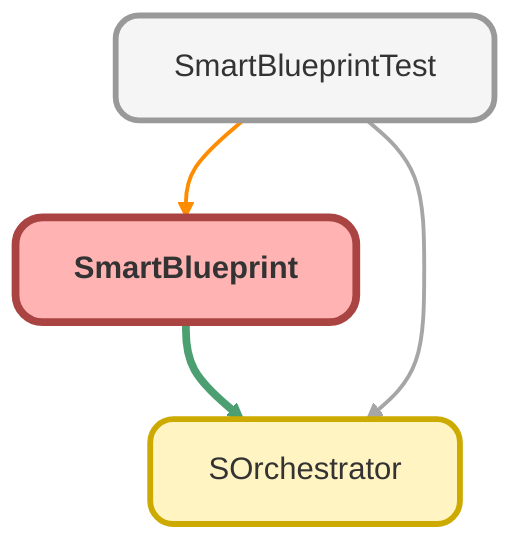

---
hide:
  - path
---

# SmartBlueprint Class

SmartBlueprint 
A wrapper for ApexBluePrint that automatically populates required fields AND resolves required parent relationships. 
This enables &quot;Zero-Config&quot; test data creation for any object.

## Class Diagram



<!-- Apex description -->

## Apex Code

```java
/**
 * SmartBlueprint
 * A wrapper for ApexBluePrint that automatically populates required fields AND resolves required parent relationships.
 * This enables "Zero-Config" test data creation for any object.
 */
public with sharing class SmartBlueprint {
    
    private SBlueprint primaryBp;
    private SBlueprint parentBp; // The immediate parent (if any)
    
    private SmartBlueprint(SBlueprint primaryBp, SBlueprint parentBp) {
        System.debug('SmartBlueprint Constructor: primary=' + primaryBp + ', parent=' + parentBp);
        this.primaryBp = primaryBp;
        this.parentBp = parentBp;
    }
    
    /**
     * Creates a pre-configured SmartBlueprint with required fields and parents populated.
     * @param type The SObject Type class (e.g., Opportunity.class)
     * @return SmartBlueprint instance
     */
    public static SmartBlueprint of(System.Type type) {
        // 1. Create the primary blueprint with fields populated
        SBlueprint primary = createBaseBlueprint(type);
        SBlueprint parent = null;
        
        // 2. Resolve required parents
        SObject instance = (SObject) type.newInstance();
        SObjectType sObjectType = instance.getSObjectType();
        Map<String, SObjectField> fields = sObjectType.getDescribe().fields.getMap();
        
        for (String fieldName : fields.keySet()) {
            SObjectField field = fields.get(fieldName);
            DescribeFieldResult describe = field.getDescribe();
            
            // Check if required reference
            if (describe.getType() == DisplayType.REFERENCE 
                && describe.isCreateable() 
                && !describe.isNillable() 
                && !describe.isDefaultedOnCreate()) {
                
                // Skip User/Owner lookups
                if (describe.getReferenceTo().size() > 0 && describe.getReferenceTo()[0] == User.SObjectType) {
                    continue;
                }
                
                // Found a required parent (e.g. AccountId)
                if (parent == null) {
                    SObjectType parentType = describe.getReferenceTo()[0];
                    parent = createBaseBlueprint(System.Type.forName(parentType.getDescribe().getName()));
                    parent = parent.alias(parentType.getDescribe().getName() + '_Auto');
                    
                    // Set the parentIdField on the child (primary) so it knows where to put the Parent ID
                    System.debug('SmartBlueprint: Found required parent field: ' + describe.getName() + ', Parent Type: ' + parentType.getDescribe().getName());
                    primary = primary.parentIdField(describe.getName());
                }
            }
        }
        
        return new SmartBlueprint(primary, parent);
    }
    
    private static SBlueprint createBaseBlueprint(System.Type type) {
        SBlueprint bp = SBlueprint.of(type);
        
        SObject instance = (SObject) type.newInstance();
        SObjectType sObjectType = instance.getSObjectType();
        Map<String, SObjectField> fields = sObjectType.getDescribe().fields.getMap();
        
        for (String fieldName : fields.keySet()) {
            SObjectField field = fields.get(fieldName);
            DescribeFieldResult describe = field.getDescribe();
            
            if (!describe.isCreateable() || describe.isNillable() || describe.isDefaultedOnCreate()) {
                continue;
            }
            
            Object dummyValue = generateDummyValue(describe);
            if (dummyValue != null) {
                bp = bp.set(describe.getName(), dummyValue);
            }
        }
        return bp;
    }
    
    private static Object generateDummyValue(DescribeFieldResult describe) {
        DisplayType type = describe.getType();
        String name = describe.getName();
        
        switch on type {
            when STRING, TEXTAREA, PHONE, EMAIL, URL, PICKLIST, COMBOBOX {
                if (type == DisplayType.EMAIL) return 'test@example.com';
                if (type == DisplayType.URL) return 'https://example.com';
                if (type == DisplayType.PHONE) return '090-0000-0000';
                Integer len = describe.getLength();
                String val = 'Test ' + name;
                if (val.length() > len) val = val.substring(0, len);
                return val;
            }
            when INTEGER, DOUBLE, CURRENCY, PERCENT { return 1; }
            when DATE { return Date.today(); }
            when DATETIME { return DateTime.now(); }
            when BOOLEAN { return false; }
            when TIME { return Time.newInstance(12, 0, 0, 0); }
            when else { return null; }
        }
    }
    
    // Fluent Delegates - Updates the internal state because SBlueprint is immutable
    
    public SmartBlueprint set(String field, Object val) {
        this.primaryBp = this.primaryBp.set(field, val);
        return this;
    }
    
    public SmartBlueprint alias(String alias) {
        this.primaryBp = this.primaryBp.alias(alias);
        return this;
    }
    
    /**
     * Adds the blueprint (and its parents) to the orchestrator.
     * Links the parent and child at this moment.
     * @return The updated SOrchestrator instance.
     */
    public SOrchestrator addTo(SOrchestrator orchestrator) {
        if (this.parentBp != null) {
            // Link: Parent -> Child
            // We use a fresh link every time to ensure the latest primaryBp is used
            SBlueprint root = this.parentBp.withChildren(this.primaryBp);
            return orchestrator.add(root);
        } else {
            return orchestrator.add(this.primaryBp);
        }
    }
}
```

## Fields
### `primaryBp`

#### Signature
```apex
private primaryBp
```

#### Type
SBlueprint

---

### `parentBp`

#### Signature
```apex
private parentBp
```

#### Type
SBlueprint

## Constructors
### `SmartBlueprint(primaryBp, parentBp)`

#### Signature
```apex
private SmartBlueprint(SBlueprint primaryBp, SBlueprint parentBp)
```

#### Parameters
| Name | Type | Description |
|------|------|-------------|
| primaryBp | SBlueprint |  |
| parentBp | SBlueprint |  |

## Methods
### `of(type)`

Creates a pre-configured SmartBlueprint with required fields and parents populated.

#### Signature
```apex
public static SmartBlueprint of(System.Type type)
```

#### Parameters
| Name | Type | Description |
|------|------|-------------|
| type | System.Type | The SObject Type class (e.g., Opportunity.class) |

#### Return Type
**[SmartBlueprint](SmartBlueprint.md)**

SmartBlueprint instance

---

### `createBaseBlueprint(type)`

#### Signature
```apex
private static SBlueprint createBaseBlueprint(System.Type type)
```

#### Parameters
| Name | Type | Description |
|------|------|-------------|
| type | System.Type |  |

#### Return Type
**SBlueprint**

---

### `generateDummyValue(describe)`

#### Signature
```apex
private static Object generateDummyValue(DescribeFieldResult describe)
```

#### Parameters
| Name | Type | Description |
|------|------|-------------|
| describe | DescribeFieldResult |  |

#### Return Type
**Object**

---

### `set(field, val)`

#### Signature
```apex
public SmartBlueprint set(String field, Object val)
```

#### Parameters
| Name | Type | Description |
|------|------|-------------|
| field | String |  |
| val | Object |  |

#### Return Type
**[SmartBlueprint](SmartBlueprint.md)**

---

### `alias(alias)`

#### Signature
```apex
public SmartBlueprint alias(String alias)
```

#### Parameters
| Name | Type | Description |
|------|------|-------------|
| alias | String |  |

#### Return Type
**[SmartBlueprint](SmartBlueprint.md)**

---

### `addTo(orchestrator)`

Adds the blueprint (and its parents) to the orchestrator. 
Links the parent and child at this moment.

#### Signature
```apex
public SOrchestrator addTo(SOrchestrator orchestrator)
```

#### Parameters
| Name | Type | Description |
|------|------|-------------|
| orchestrator | [SOrchestrator](SOrchestrator.md) |  |

#### Return Type
**[SOrchestrator](SOrchestrator.md)**

The updated SOrchestrator instance.