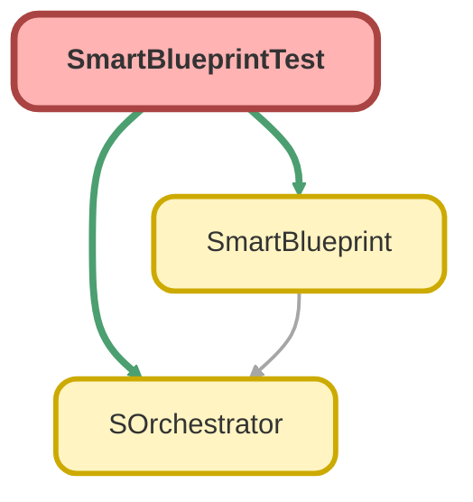

---
hide:
  - path
---

# SmartBlueprintTest Class

`ISTEST`

## Class Diagram



<!-- Apex description -->

## Apex Code

```java
@IsTest
private class SmartBlueprintTest {
    
    @IsTest
    static void testSmartBlueprintPopulatesRequiredFields() {
        // Account Name is required
        SmartBlueprint bp = SmartBlueprint.of(Account.class);
        
        SOrchestrator orchestrator = SOrchestrator.start();
        orchestrator = bp.alias('acc').addTo(orchestrator);
            
        orchestrator.create();
        
        Account acc = (Account) orchestrator.getByAlias('acc');
        
        Assert.isNotNull(acc.Name, 'Account Name should be populated automatically');
        Assert.isTrue(acc.Name.startsWith('Test Name'), 'Account Name should start with Test Name');
    }
    
    @IsTest
    static void testSmartBlueprintOverride() {
        // We can still override the auto-populated value
        SmartBlueprint bp = SmartBlueprint.of(Account.class)
            .set('Name', 'My Custom Name');
            
        SOrchestrator orchestrator = SOrchestrator.start();
        orchestrator = bp.alias('acc').addTo(orchestrator);
            
        orchestrator.create();
        
        Account acc = (Account) orchestrator.getByAlias('acc');
        
        Assert.areEqual('My Custom Name', acc.Name, 'Account Name should be overridden');
    }

    @IsTest
    static void testSmartBlueprintOpportunity() {
        // Opportunity requires Name, StageName, CloseDate (handled)
        // AccountId is nillable in this org, so it won't be populated automatically.
        SmartBlueprint bp = SmartBlueprint.of(Opportunity.class);
        
        SOrchestrator orchestrator = SOrchestrator.start();
        orchestrator = bp.alias('opp').addTo(orchestrator);
            
        orchestrator.create();
        
        Opportunity opp = (Opportunity) orchestrator.getByAlias('opp');
        Assert.isNotNull(opp.Id, 'Opportunity should be created');
    }

    @IsTest
    static void testSmartBlueprintCaseComment() {
        // CaseComment requires ParentId (Case)
        SmartBlueprint bp = SmartBlueprint.of(CaseComment.class);
        
        SOrchestrator orchestrator = SOrchestrator.start();
        orchestrator = bp.alias('comment').addTo(orchestrator);
            
        orchestrator.create();
        
        CaseComment comment = (CaseComment) orchestrator.getByAlias('comment');
        Assert.isNotNull(comment.Id, 'CaseComment should be created');
        Assert.isNotNull(comment.ParentId, 'CaseComment ParentId should be populated automatically');
        
        // Verify Parent Case was created
        Case parentCase = [SELECT Id FROM Case WHERE Id = :comment.ParentId];
        Assert.isNotNull(parentCase, 'Parent Case should exist');
    }
}
```

## Methods
### `testSmartBlueprintPopulatesRequiredFields()`

`ISTEST`

#### Signature
```apex
private static void testSmartBlueprintPopulatesRequiredFields()
```

#### Return Type
**void**

---

### `testSmartBlueprintOverride()`

`ISTEST`

#### Signature
```apex
private static void testSmartBlueprintOverride()
```

#### Return Type
**void**

---

### `testSmartBlueprintOpportunity()`

`ISTEST`

#### Signature
```apex
private static void testSmartBlueprintOpportunity()
```

#### Return Type
**void**

---

### `testSmartBlueprintCaseComment()`

`ISTEST`

#### Signature
```apex
private static void testSmartBlueprintCaseComment()
```

#### Return Type
**void**