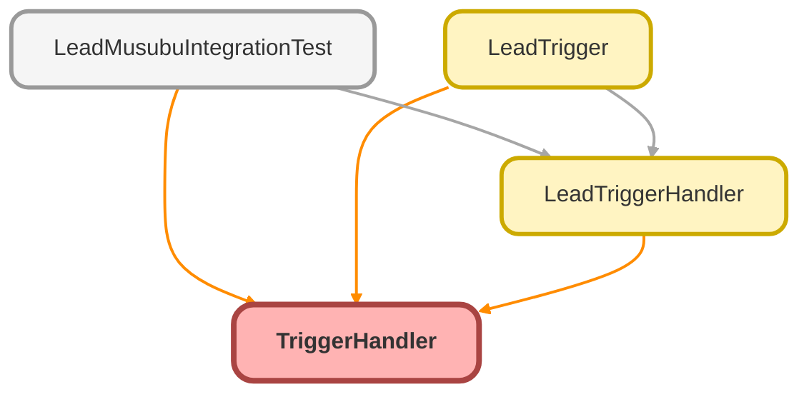

---
hide:
  - path
---

# TriggerHandler Class
`virtual`

トリガーハンドラー基底クラス

**See** https://github.com/kevinohara80/sfdc-trigger-framework

## Class Diagram



<!-- Apex description -->

## Apex Code

```java
/**
 * トリガーハンドラー基底クラス
 *
 * @description Kevin O'Hara のトリガーフレームワークをベースにした基底クラス。
 *              トリガーロジックを Handler クラスに分離し、テスタビリティを向上させる。
 * @see https://github.com/kevinohara80/sfdc-trigger-framework
 */
public virtual class TriggerHandler {

    // static map of handler name, times run() was invoked
    private static Map<String, LoopCount> loopCountMap;
    private static Set<String> bypassedHandlers;

    // the current context of the trigger, overridable in tests
    @TestVisible
    private TriggerContext context;

    // the current context of the trigger, overridable in tests
    @TestVisible
    private Boolean isTriggerExecuting;

    static {
        loopCountMap = new Map<String, LoopCount>();
        bypassedHandlers = new Set<String>();
    }

    public TriggerHandler() {
        this.setTriggerContext();
    }

    /**
     * メインエントリポイント - トリガーから呼び出す
     */
    public void run() {
        if (!validateRun()) {
            return;
        }

        addToLoopCount();

        switch on this.context {
            when BEFORE_INSERT {
                this.beforeInsert();
            }
            when BEFORE_UPDATE {
                this.beforeUpdate();
            }
            when BEFORE_DELETE {
                this.beforeDelete();
            }
            when AFTER_INSERT {
                this.afterInsert();
            }
            when AFTER_UPDATE {
                this.afterUpdate();
            }
            when AFTER_DELETE {
                this.afterDelete();
            }
            when AFTER_UNDELETE {
                this.afterUndelete();
            }
        }
    }

    public void setMaxLoopCount(Integer max) {
        String handlerName = getHandlerName();
        if (!TriggerHandler.loopCountMap.containsKey(handlerName)) {
            TriggerHandler.loopCountMap.put(handlerName, new LoopCount(max));
        } else {
            TriggerHandler.loopCountMap.get(handlerName).setMax(max);
        }
    }

    public void clearMaxLoopCount() {
        this.setMaxLoopCount(-1);
    }

    /**
     * 指定したハンドラーをバイパス（無効化）する
     *
     * @param handlerName バイパスするハンドラー名
     */
    public static void bypass(String handlerName) {
        TriggerHandler.bypassedHandlers.add(handlerName);
    }

    /**
     * 指定したハンドラーのバイパスを解除する
     *
     * @param handlerName バイパス解除するハンドラー名
     */
    public static void clearBypass(String handlerName) {
        TriggerHandler.bypassedHandlers.remove(handlerName);
    }

    /**
     * 指定したハンドラーがバイパスされているか確認
     *
     * @param handlerName 確認するハンドラー名
     * @return バイパスされている場合 true
     */
    public static Boolean isBypassed(String handlerName) {
        return TriggerHandler.bypassedHandlers.contains(handlerName);
    }

    /**
     * すべてのバイパスをクリアする
     */
    public static void clearAllBypasses() {
        TriggerHandler.bypassedHandlers.clear();
    }

    /***************************************
     * private instance methods
     ***************************************/

    @TestVisible
    private void setTriggerContext() {
        this.setTriggerContext(null, false);
    }

    @TestVisible
    private void setTriggerContext(String ctx, Boolean testMode) {
        if (!Trigger.isExecuting && !testMode) {
            this.isTriggerExecuting = false;
            return;
        } else {
            this.isTriggerExecuting = true;
        }

        if ((Trigger.isExecuting && Trigger.isBefore && Trigger.isInsert) ||
            (ctx != null && ctx == 'before insert')) {
            this.context = TriggerContext.BEFORE_INSERT;
        } else if ((Trigger.isExecuting && Trigger.isBefore && Trigger.isUpdate) ||
            (ctx != null && ctx == 'before update')) {
            this.context = TriggerContext.BEFORE_UPDATE;
        } else if ((Trigger.isExecuting && Trigger.isBefore && Trigger.isDelete) ||
            (ctx != null && ctx == 'before delete')) {
            this.context = TriggerContext.BEFORE_DELETE;
        } else if ((Trigger.isExecuting && Trigger.isAfter && Trigger.isInsert) ||
            (ctx != null && ctx == 'after insert')) {
            this.context = TriggerContext.AFTER_INSERT;
        } else if ((Trigger.isExecuting && Trigger.isAfter && Trigger.isUpdate) ||
            (ctx != null && ctx == 'after update')) {
            this.context = TriggerContext.AFTER_UPDATE;
        } else if ((Trigger.isExecuting && Trigger.isAfter && Trigger.isDelete) ||
            (ctx != null && ctx == 'after delete')) {
            this.context = TriggerContext.AFTER_DELETE;
        } else if ((Trigger.isExecuting && Trigger.isAfter && Trigger.isUndelete) ||
            (ctx != null && ctx == 'after undelete')) {
            this.context = TriggerContext.AFTER_UNDELETE;
        }
    }

    @TestVisible
    private Boolean validateRun() {
        if (!this.isTriggerExecuting || this.context == null) {
            throw new TriggerHandlerException('Trigger handler called outside of Trigger execution');
        }
        if (TriggerHandler.bypassedHandlers.contains(getHandlerName())) {
            return false;
        }
        return true;
    }

    @TestVisible
    private String getHandlerName() {
        return String.valueOf(this).substring(0, String.valueOf(this).indexOf(':'));
    }

    @TestVisible
    private void addToLoopCount() {
        String handlerName = getHandlerName();
        if (TriggerHandler.loopCountMap.containsKey(handlerName)) {
            Boolean exceeded = TriggerHandler.loopCountMap.get(handlerName).increment();
            if (exceeded) {
                Integer max = TriggerHandler.loopCountMap.get(handlerName).max;
                throw new TriggerHandlerException('Maximum loop count of ' + String.valueOf(max) + ' reached in ' + handlerName);
            }
        }
    }

    /***************************************
     * context methods - override these in subclasses
     ***************************************/

    @TestVisible
    protected virtual void beforeInsert() {}

    @TestVisible
    protected virtual void beforeUpdate() {}

    @TestVisible
    protected virtual void beforeDelete() {}

    @TestVisible
    protected virtual void afterInsert() {}

    @TestVisible
    protected virtual void afterUpdate() {}

    @TestVisible
    protected virtual void afterDelete() {}

    @TestVisible
    protected virtual void afterUndelete() {}

    /***************************************
     * inner classes
     ***************************************/

    @TestVisible
    private enum TriggerContext {
        BEFORE_INSERT, BEFORE_UPDATE, BEFORE_DELETE,
        AFTER_INSERT, AFTER_UPDATE, AFTER_DELETE,
        AFTER_UNDELETE
    }

    @TestVisible
    private class LoopCount {
        private Integer max;
        private Integer count;

        public LoopCount() {
            this.max = 5;
            this.count = 0;
        }

        public LoopCount(Integer max) {
            this.max = max;
            this.count = 0;
        }

        public Boolean increment() {
            this.count++;
            return this.exceeded();
        }

        public Boolean exceeded() {
            if (this.max < 0) {
                return false;
            }
            if (this.count > this.max) {
                return true;
            }
            return false;
        }

        public Integer getMax() {
            return this.max;
        }

        public Integer getCount() {
            return this.count;
        }

        public void setMax(Integer max) {
            this.max = max;
        }
    }

    public class TriggerHandlerException extends Exception {}
}
```

## Fields
### `loopCountMap`

#### Signature
```apex
private static loopCountMap
```

#### Type
Map<String,LoopCount>

---

### `bypassedHandlers`

#### Signature
```apex
private static bypassedHandlers
```

#### Type
Set<String>

---

### `context`

`TESTVISIBLE`

#### Signature
```apex
private context
```

#### Type
TriggerContext

---

### `isTriggerExecuting`

`TESTVISIBLE`

#### Signature
```apex
private isTriggerExecuting
```

#### Type
Boolean

## Constructors
### `TriggerHandler()`

#### Signature
```apex
public TriggerHandler()
```

## Methods
### `run()`

メインエントリポイント - トリガーから呼び出す

#### Signature
```apex
public void run()
```

#### Return Type
**void**

---

### `setMaxLoopCount(max)`

#### Signature
```apex
public void setMaxLoopCount(Integer max)
```

#### Parameters
| Name | Type | Description |
|------|------|-------------|
| max | Integer |  |

#### Return Type
**void**

---

### `clearMaxLoopCount()`

#### Signature
```apex
public void clearMaxLoopCount()
```

#### Return Type
**void**

---

### `bypass(handlerName)`

指定したハンドラーをバイパス（無効化）する

#### Signature
```apex
public static void bypass(String handlerName)
```

#### Parameters
| Name | Type | Description |
|------|------|-------------|
| handlerName | String | バイパスするハンドラー名 |

#### Return Type
**void**

---

### `clearBypass(handlerName)`

指定したハンドラーのバイパスを解除する

#### Signature
```apex
public static void clearBypass(String handlerName)
```

#### Parameters
| Name | Type | Description |
|------|------|-------------|
| handlerName | String | バイパス解除するハンドラー名 |

#### Return Type
**void**

---

### `isBypassed(handlerName)`

指定したハンドラーがバイパスされているか確認

#### Signature
```apex
public static Boolean isBypassed(String handlerName)
```

#### Parameters
| Name | Type | Description |
|------|------|-------------|
| handlerName | String | 確認するハンドラー名 |

#### Return Type
**Boolean**

バイパスされている場合 true

---

### `clearAllBypasses()`

すべてのバイパスをクリアする

#### Signature
```apex
public static void clearAllBypasses()
```

#### Return Type
**void**

---

### `setTriggerContext()`

`TESTVISIBLE`

private instance methods

#### Signature
```apex
private void setTriggerContext()
```

#### Return Type
**void**

---

### `setTriggerContext(ctx, testMode)`

`TESTVISIBLE`

#### Signature
```apex
private void setTriggerContext(String ctx, Boolean testMode)
```

#### Parameters
| Name | Type | Description |
|------|------|-------------|
| ctx | String |  |
| testMode | Boolean |  |

#### Return Type
**void**

---

### `validateRun()`

`TESTVISIBLE`

#### Signature
```apex
private Boolean validateRun()
```

#### Return Type
**Boolean**

---

### `getHandlerName()`

`TESTVISIBLE`

#### Signature
```apex
private String getHandlerName()
```

#### Return Type
**String**

---

### `addToLoopCount()`

`TESTVISIBLE`

#### Signature
```apex
private void addToLoopCount()
```

#### Return Type
**void**

## Classes
### LoopCount Class

`TESTVISIBLE`

#### Fields
##### `max`

###### Signature
```apex
private max
```

###### Type
Integer

---

##### `count`

###### Signature
```apex
private count
```

###### Type
Integer

#### Constructors
##### `LoopCount()`

###### Signature
```apex
public LoopCount()
```

---

##### `LoopCount(max)`

###### Signature
```apex
public LoopCount(Integer max)
```

###### Parameters
| Name | Type | Description |
|------|------|-------------|
| max | Integer |  |

#### Methods
##### `increment()`

###### Signature
```apex
public Boolean increment()
```

###### Return Type
**Boolean**

---

##### `exceeded()`

###### Signature
```apex
public Boolean exceeded()
```

###### Return Type
**Boolean**

---

##### `getMax()`

###### Signature
```apex
public Integer getMax()
```

###### Return Type
**Integer**

---

##### `getCount()`

###### Signature
```apex
public Integer getCount()
```

###### Return Type
**Integer**

---

##### `setMax(max)`

###### Signature
```apex
public void setMax(Integer max)
```

###### Parameters
| Name | Type | Description |
|------|------|-------------|
| max | Integer |  |

###### Return Type
**void**

### TriggerHandlerException Class

## Enums
### TriggerContext Enum

`TESTVISIBLE`

inner classes

#### Values
| Value | Description |
|-------|-------------|
| BEFORE_INSERT |  |
| BEFORE_UPDATE |  |
| BEFORE_DELETE |  |
| AFTER_INSERT |  |
| AFTER_UPDATE |  |
| AFTER_DELETE |  |
| AFTER_UNDELETE |  |