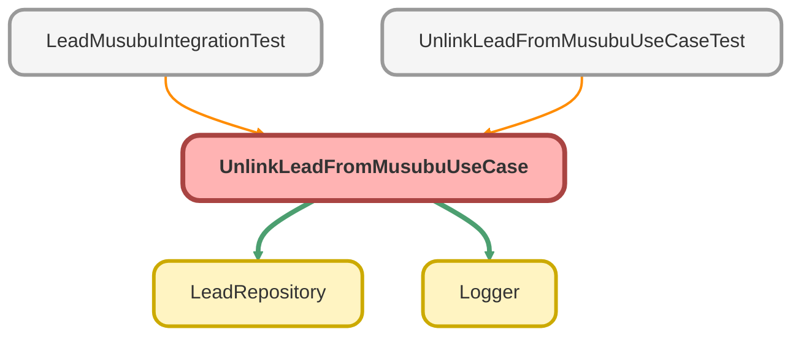

---
hide:
  - path
---

# UnlinkLeadFromMusubuUseCase Class

リードと結ぶ法人情報の紐付けを解除するユースケース

## Class Diagram



<!-- Apex description -->

## Apex Code

```java
/**
 * リードと結ぶ法人情報の紐付けを解除するユースケース
 *
 * @description リードレコードから MusubuCompany__c の関連を削除する。
 */
public with sharing class UnlinkLeadFromMusubuUseCase {

    private final LeadRepository leadRepo;

    /**
     * コンストラクタ
     */
    public UnlinkLeadFromMusubuUseCase() {
        this(new LeadRepository());
    }

    /**
     * テスト用コンストラクタ（DI）
     *
     * @param leadRepo Lead リポジトリ
     */
    @TestVisible
    private UnlinkLeadFromMusubuUseCase(LeadRepository leadRepo) {
        this.leadRepo = leadRepo;
    }

    /**
     * リードと結ぶ法人情報の紐付けを解除する
     *
     * @param request 紐付け解除リクエスト
     * @return 紐付け解除結果
     */
    public UnlinkResult invoke(UnlinkRequest request) {
        Logger.info('UnlinkLeadFromMusubuUseCase を開始します - leadId: ' + request.leadId + ', clearCorporateNumber: ' + request.clearCorporateNumber);

        try {
            // 1. リードを取得
            Lead lead = this.leadRepo.findLeadById(request.leadId);

            if (lead == null) {
                throw new UnlinkLeadException('リードが見つかりません');
            }

            // 2. 紐付いていない場合はスキップ
            if (lead.MusubuCompanyId__c == null) {
                Logger.info('リードは結ぶ法人情報に紐付いていません');
                return new UnlinkResult(false, '紐付けがありません');
            }

            Id previousMusubuCompanyId = lead.MusubuCompanyId__c;

            // 3. 紐付けを解除
            lead.MusubuCompanyId__c = null;
            if (request.clearCorporateNumber) {
                lead.CorporateNumber__c = null;
            }

            update Security.stripInaccessible(AccessType.UPDATABLE, new List<Lead>{ lead }).getRecords();

            Logger.info('リードと結ぶ法人情報の紐付けを解除しました - leadId: ' + lead.Id + ', previousMusubuCompanyId: ' + previousMusubuCompanyId);

            return new UnlinkResult(true, 'Success');

        } catch (QueryException e) {
            Logger.error('データ取得に失敗しました', e);
            throw new UnlinkLeadException('レコードが見つかりません', e);

        } catch (DmlException e) {
            Logger.error('更新に失敗しました', e);
            throw new UnlinkLeadException('リードの更新に失敗しました', e);

        } finally {
            Logger.saveLog();
        }
    }

    /**
     * 複数のリードの紐付けを一括解除する
     *
     * @param leadIds リード ID のセット
     * @param clearCorporateNumber 法人番号もクリアするか
     * @return 紐付け解除結果のリスト
     */
    public List<UnlinkResult> invokeForMultipleLeads(Set<Id> leadIds, Boolean clearCorporateNumber) {
        Logger.info('複数リードの紐付け解除を開始します - leadCount: ' + leadIds.size());

        List<UnlinkResult> results = new List<UnlinkResult>();

        try {
            // 1. 紐付いているリードを取得
            List<Lead> leads = this.leadRepo.findLinkedToMusubuCompany(leadIds);

            if (leads.isEmpty()) {
                Logger.info('紐付いているリードがありません');
                return results;
            }

            // 2. 紐付けを解除
            for (Lead lead : leads) {
                lead.MusubuCompanyId__c = null;
                if (clearCorporateNumber) {
                    lead.CorporateNumber__c = null;
                }
            }

            update Security.stripInaccessible(AccessType.UPDATABLE, leads).getRecords();

            // 3. 結果を生成
            for (Lead lead : leads) {
                results.add(new UnlinkResult(true, 'Success', lead.Id));
            }

            Logger.info('複数リードの紐付け解除が完了しました - unlinkedCount: ' + leads.size());

            return results;

        } catch (Exception e) {
            Logger.error('複数リードの紐付け解除に失敗しました', e);
            throw new UnlinkLeadException('紐付け解除に失敗しました', e);

        } finally {
            Logger.saveLog();
        }
    }

    /**
     * 紐付け解除リクエスト
     */
    public class UnlinkRequest {
        public Id leadId;
        public Boolean clearCorporateNumber = false;
    }

    /**
     * 紐付け解除結果
     */
    public class UnlinkResult {
        public Boolean success;
        public String message;
        public Id leadId;

        public UnlinkResult(Boolean success, String message) {
            this.success = success;
            this.message = message;
        }

        public UnlinkResult(Boolean success, String message, Id leadId) {
            this.success = success;
            this.message = message;
            this.leadId = leadId;
        }
    }

    /**
     * 紐付け解除エラー例外
     */
    public class UnlinkLeadException extends Exception {}
}
```

## Fields
### `leadRepo`

#### Signature
```apex
private final leadRepo
```

#### Type
[LeadRepository](LeadRepository.md)

## Constructors
### `UnlinkLeadFromMusubuUseCase()`

コンストラクタ

#### Signature
```apex
public UnlinkLeadFromMusubuUseCase()
```

---

### `UnlinkLeadFromMusubuUseCase(leadRepo)`

`TESTVISIBLE`

テスト用コンストラクタ（DI）

#### Signature
```apex
private UnlinkLeadFromMusubuUseCase(LeadRepository leadRepo)
```

#### Parameters
| Name | Type | Description |
|------|------|-------------|
| leadRepo | [LeadRepository](LeadRepository.md) | Lead リポジトリ |

## Methods
### `invoke(request)`

リードと結ぶ法人情報の紐付けを解除する

#### Signature
```apex
public UnlinkResult invoke(UnlinkRequest request)
```

#### Parameters
| Name | Type | Description |
|------|------|-------------|
| request | UnlinkRequest | 紐付け解除リクエスト |

#### Return Type
**UnlinkResult**

紐付け解除結果

---

### `invokeForMultipleLeads(leadIds, clearCorporateNumber)`

複数のリードの紐付けを一括解除する

#### Signature
```apex
public List<UnlinkResult> invokeForMultipleLeads(Set<Id> leadIds, Boolean clearCorporateNumber)
```

#### Parameters
| Name | Type | Description |
|------|------|-------------|
| leadIds | Set<Id> | リード ID のセット |
| clearCorporateNumber | Boolean | 法人番号もクリアするか |

#### Return Type
**List<UnlinkResult>**

紐付け解除結果のリスト

## Classes
### UnlinkRequest Class

紐付け解除リクエスト

#### Fields
##### `leadId`

###### Signature
```apex
public leadId
```

###### Type
Id

---

##### `clearCorporateNumber`

###### Signature
```apex
public clearCorporateNumber
```

###### Type
Boolean

### UnlinkResult Class

紐付け解除結果

#### Fields
##### `success`

###### Signature
```apex
public success
```

###### Type
Boolean

---

##### `message`

###### Signature
```apex
public message
```

###### Type
String

---

##### `leadId`

###### Signature
```apex
public leadId
```

###### Type
Id

#### Constructors
##### `UnlinkResult(success, message)`

###### Signature
```apex
public UnlinkResult(Boolean success, String message)
```

###### Parameters
| Name | Type | Description |
|------|------|-------------|
| success | Boolean |  |
| message | String |  |

---

##### `UnlinkResult(success, message, leadId)`

###### Signature
```apex
public UnlinkResult(Boolean success, String message, Id leadId)
```

###### Parameters
| Name | Type | Description |
|------|------|-------------|
| success | Boolean |  |
| message | String |  |
| leadId | Id |  |

### UnlinkLeadException Class

紐付け解除エラー例外