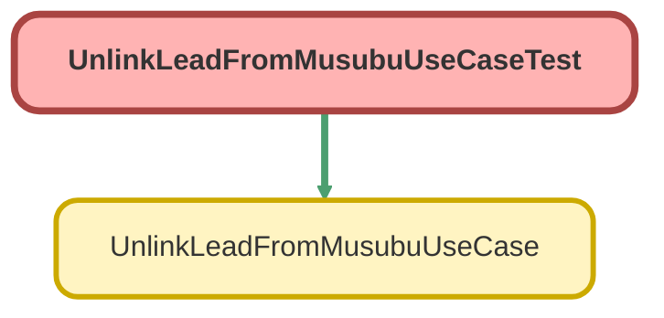

---
hide:
  - path
---

# UnlinkLeadFromMusubuUseCaseTest Class

`ISTEST`

UnlinkLeadFromMusubuUseCase のテストクラス

## Class Diagram



<!-- Apex description -->

## Apex Code

```java
/**
 * UnlinkLeadFromMusubuUseCase のテストクラス
 *
 * @description リードと結ぶ法人情報の紐付け解除機能をテストする。
 */
@IsTest
private class UnlinkLeadFromMusubuUseCaseTest {

    @TestSetup
    static void setup() {
        // 結ぶ法人情報を作成
        MusubuCompany__c testCompany = new MusubuCompany__c(
            Name = 'テスト株式会社',
            CorporateNumber__c = '1234567890123'
        );
        insert testCompany;

        // 紐付いたリードを作成
        Lead testLead = new Lead(
            LastName = 'テストリード',
            Company = 'テスト株式会社',
            CorporateNumber__c = '1234567890123',
            MusubuCompanyId__c = testCompany.Id
        );
        insert testLead;

        // 紐付いていないリードを作成
        Lead testLead2 = new Lead(
            LastName = 'テストリード2',
            Company = 'テスト株式会社2'
        );
        insert testLead2;
    }

    @IsTest
    static void testInvoke_Success() {
        // 準備
        Lead lead = [SELECT Id, MusubuCompanyId__c FROM Lead WHERE MusubuCompanyId__c != null LIMIT 1];

        UnlinkLeadFromMusubuUseCase.UnlinkRequest request = new UnlinkLeadFromMusubuUseCase.UnlinkRequest();
        request.leadId = lead.Id;
        request.clearCorporateNumber = false;

        UnlinkLeadFromMusubuUseCase useCase = new UnlinkLeadFromMusubuUseCase();

        // 実行
        Test.startTest();
        UnlinkLeadFromMusubuUseCase.UnlinkResult result = useCase.invoke(request);
        Test.stopTest();

        // 検証
        System.assertEquals(true, result.success, '紐付け解除が成功すること');
        System.assertEquals('Success', result.message, 'メッセージが正しいこと');

        Lead updatedLead = [SELECT Id, MusubuCompanyId__c, CorporateNumber__c FROM Lead WHERE Id = :lead.Id];
        System.assertEquals(null, updatedLead.MusubuCompanyId__c, '紐付けが解除されていること');
        System.assertNotEquals(null, updatedLead.CorporateNumber__c, '法人番号は保持されていること');
    }

    @IsTest
    static void testInvoke_WithClearCorporateNumber() {
        // 準備
        Lead lead = [SELECT Id FROM Lead WHERE MusubuCompanyId__c != null LIMIT 1];

        UnlinkLeadFromMusubuUseCase.UnlinkRequest request = new UnlinkLeadFromMusubuUseCase.UnlinkRequest();
        request.leadId = lead.Id;
        request.clearCorporateNumber = true;

        UnlinkLeadFromMusubuUseCase useCase = new UnlinkLeadFromMusubuUseCase();

        // 実行
        Test.startTest();
        UnlinkLeadFromMusubuUseCase.UnlinkResult result = useCase.invoke(request);
        Test.stopTest();

        // 検証
        System.assertEquals(true, result.success, '紐付け解除が成功すること');

        Lead updatedLead = [SELECT Id, MusubuCompanyId__c, CorporateNumber__c FROM Lead WHERE Id = :lead.Id];
        System.assertEquals(null, updatedLead.MusubuCompanyId__c, '紐付けが解除されていること');
        System.assertEquals(null, updatedLead.CorporateNumber__c, '法人番号もクリアされていること');
    }

    @IsTest
    static void testInvoke_NotLinked() {
        // 準備
        Lead lead = [SELECT Id FROM Lead WHERE MusubuCompanyId__c = null LIMIT 1];

        UnlinkLeadFromMusubuUseCase.UnlinkRequest request = new UnlinkLeadFromMusubuUseCase.UnlinkRequest();
        request.leadId = lead.Id;

        UnlinkLeadFromMusubuUseCase useCase = new UnlinkLeadFromMusubuUseCase();

        // 実行
        Test.startTest();
        UnlinkLeadFromMusubuUseCase.UnlinkResult result = useCase.invoke(request);
        Test.stopTest();

        // 検証
        System.assertEquals(false, result.success, '紐付いていない場合は失敗すること');
        System.assert(result.message.contains('紐付けがありません'), 'メッセージが正しいこと');
    }

    @IsTest
    static void testInvoke_LeadNotFound() {
        // 準備
        UnlinkLeadFromMusubuUseCase.UnlinkRequest request = new UnlinkLeadFromMusubuUseCase.UnlinkRequest();
        request.leadId = '00Q000000000000AAA'; // 存在しない ID

        UnlinkLeadFromMusubuUseCase useCase = new UnlinkLeadFromMusubuUseCase();

        // 実行
        Test.startTest();
        try {
            useCase.invoke(request);
            System.assert(false, '例外が発生すること');
        } catch (UnlinkLeadFromMusubuUseCase.UnlinkLeadException e) {
            // 期待通り
            System.assert(e.getMessage().contains('リードが見つかりません') || e.getMessage().contains('レコードが見つかりません'), 'メッセージが正しいこと');
        }
        Test.stopTest();
    }

    @IsTest
    static void testInvokeForMultipleLeads_Success() {
        // 準備: 追加のリードを作成
        MusubuCompany__c company = [SELECT Id FROM MusubuCompany__c LIMIT 1];
        List<Lead> additionalLeads = new List<Lead>();
        for (Integer i = 0; i < 3; i++) {
            additionalLeads.add(new Lead(
                LastName = 'バルクテスト' + i,
                Company = 'バルクテスト株式会社' + i,
                MusubuCompanyId__c = company.Id
            ));
        }
        insert additionalLeads;

        Set<Id> leadIds = new Set<Id>();
        for (Lead l : additionalLeads) {
            leadIds.add(l.Id);
        }

        UnlinkLeadFromMusubuUseCase useCase = new UnlinkLeadFromMusubuUseCase();

        // 実行
        Test.startTest();
        List<UnlinkLeadFromMusubuUseCase.UnlinkResult> results = useCase.invokeForMultipleLeads(leadIds, false);
        Test.stopTest();

        // 検証
        System.assertEquals(3, results.size(), '3件の結果が返ること');
        for (UnlinkLeadFromMusubuUseCase.UnlinkResult result : results) {
            System.assertEquals(true, result.success, '全て成功すること');
        }

        List<Lead> updatedLeads = [SELECT Id, MusubuCompanyId__c FROM Lead WHERE Id IN :leadIds];
        for (Lead lead : updatedLeads) {
            System.assertEquals(null, lead.MusubuCompanyId__c, '紐付けが解除されていること');
        }
    }

    @IsTest
    static void testInvokeForMultipleLeads_NoLinkedLeads() {
        // 準備
        Lead lead = [SELECT Id FROM Lead WHERE MusubuCompanyId__c = null LIMIT 1];
        Set<Id> leadIds = new Set<Id>{ lead.Id };

        UnlinkLeadFromMusubuUseCase useCase = new UnlinkLeadFromMusubuUseCase();

        // 実行
        Test.startTest();
        List<UnlinkLeadFromMusubuUseCase.UnlinkResult> results = useCase.invokeForMultipleLeads(leadIds, false);
        Test.stopTest();

        // 検証
        System.assertEquals(0, results.size(), '紐付いているリードがない場合は空のリストが返ること');
    }

    @IsTest
    static void testUnlinkRequest() {
        // UnlinkRequest クラスのテスト
        UnlinkLeadFromMusubuUseCase.UnlinkRequest request = new UnlinkLeadFromMusubuUseCase.UnlinkRequest();
        request.leadId = '00Q000000000000AAA';
        request.clearCorporateNumber = true;

        System.assertNotEquals(null, request.leadId);
        System.assertEquals(true, request.clearCorporateNumber);
    }

    @IsTest
    static void testUnlinkResult() {
        // UnlinkResult クラスのテスト
        UnlinkLeadFromMusubuUseCase.UnlinkResult result1 = new UnlinkLeadFromMusubuUseCase.UnlinkResult(true, 'Test');
        System.assertEquals(true, result1.success);
        System.assertEquals('Test', result1.message);

        UnlinkLeadFromMusubuUseCase.UnlinkResult result2 = new UnlinkLeadFromMusubuUseCase.UnlinkResult(true, 'Test', '00Q000000000000AAA');
        System.assertEquals('00Q000000000000AAA', result2.leadId);
    }
}
```

## Methods
### `setup()`

`TESTSETUP`

#### Signature
```apex
private static void setup()
```

#### Return Type
**void**

---

### `testInvoke_Success()`

`ISTEST`

#### Signature
```apex
private static void testInvoke_Success()
```

#### Return Type
**void**

---

### `testInvoke_WithClearCorporateNumber()`

`ISTEST`

#### Signature
```apex
private static void testInvoke_WithClearCorporateNumber()
```

#### Return Type
**void**

---

### `testInvoke_NotLinked()`

`ISTEST`

#### Signature
```apex
private static void testInvoke_NotLinked()
```

#### Return Type
**void**

---

### `testInvoke_LeadNotFound()`

`ISTEST`

#### Signature
```apex
private static void testInvoke_LeadNotFound()
```

#### Return Type
**void**

---

### `testInvokeForMultipleLeads_Success()`

`ISTEST`

#### Signature
```apex
private static void testInvokeForMultipleLeads_Success()
```

#### Return Type
**void**

---

### `testInvokeForMultipleLeads_NoLinkedLeads()`

`ISTEST`

#### Signature
```apex
private static void testInvokeForMultipleLeads_NoLinkedLeads()
```

#### Return Type
**void**

---

### `testUnlinkRequest()`

`ISTEST`

#### Signature
```apex
private static void testUnlinkRequest()
```

#### Return Type
**void**

---

### `testUnlinkResult()`

`ISTEST`

#### Signature
```apex
private static void testUnlinkResult()
```

#### Return Type
**void**