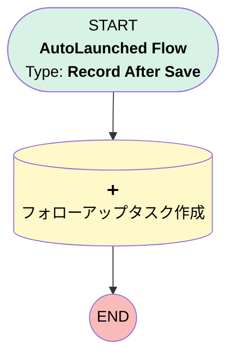

# 高額商談タスク自動作成

## Flow Diagram [(_View History_)](High_Value_Opportunity_Task_Creation-history.md)

<!-- Flow description -->

## General Information

|<!-- -->|<!-- -->|
|:---|:---|
|Object|Opportunity|
|Process Type| Auto Launched Flow|
|Trigger Type| Record After Save|
|Record Trigger Type| Create And Update|
|Label|高額商談タスク自動作成|
|Status|Active|
|Description|商談の金額が100万円以上の場合に、自動的にフォローアップタスクを作成します。|
| Builder Type (PM)|LightningFlowBuilder|
| Canvas Mode (PM)|AUTO_LAYOUT_CANVAS|
| Origin Builder Type (PM)|LightningFlowBuilder|
|Connector|[Create_Follow_Up_Task](#create_follow_up_task)|
|Next Node|[Create_Follow_Up_Task](#create_follow_up_task)|

#### Filters (logic: **and**)

|Filter Id|Field|Operator|Value|
|:-- |:-- |:--:|:--: |
|1|Amount| Greater Than Or Equal To|1000000|

## Formulas

|Name|Data Type|Expression|Description|
|:-- |:--:|:-- |:--  |
|SevenDaysFromNow|Date|TODAY() + 7|<!-- -->|

## Flow Nodes Details

### Create_Follow_Up_Task

|<!-- -->|<!-- -->|
|:---|:---|
|Type|Record Create|
|Object|Task|
|Label|フォローアップタスク作成|

#### Input Assignments

|Field|Value|
|:-- |:--: |
|ActivityDate|SevenDaysFromNow|
|OwnerId|$Record.OwnerId|
|Priority|High|
|Status|Not Started|
|Subject|高額案件のフォローアップ|
|WhatId|$Record.Id|

___

_Documentation generated from branch main by [sfdx-hardis](https://sfdx-hardis.cloudity.com), featuring [salesforce-flow-visualiser](https://github.com/toddhalfpenny/salesforce-flow-visualiser)_