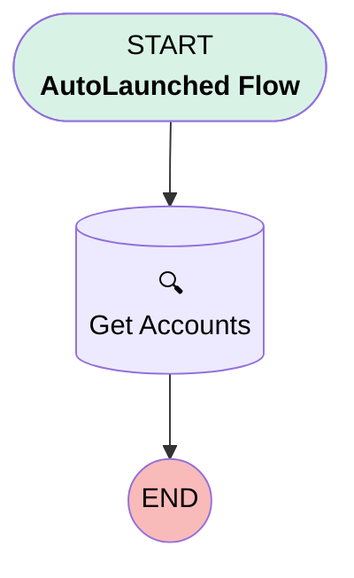

# Test Flow

## Flow Diagram [(_View History_)](TestFlow-history.md)

<!-- Flow description -->

## General Information

|<!-- -->|<!-- -->|
|:---|:---|
|Process Type| Auto Launched Flow|
|Label|Test Flow|
|Status|Active|
|Interview Label|Test Flow {!$Flow.CurrentDateTime}|
| Builder Type (PM)|LightningFlowBuilder|
|Connector|[Get_Accounts](#get_accounts)|
|Next Node|[Get_Accounts](#get_accounts)|

## Flow Nodes Details

### Get_Accounts

|<!-- -->|<!-- -->|
|:---|:---|
|Type|Record Lookup|
|Object|Account|
|Label|Get Accounts|
|Assign Null Values If No Records Found|⬜|
|Get First Record Only|⬜|
|Store Output Automatically|✅|

#### Filters (logic: **and**)

|Filter Id|Field|Operator|Value|
|:-- |:-- |:--:|:--: |
|1|Name| Equal To|Test|

___

_Documentation generated from branch main by [sfdx-hardis](https://sfdx-hardis.cloudity.com), featuring [salesforce-flow-visualiser](https://github.com/toddhalfpenny/salesforce-flow-visualiser)_