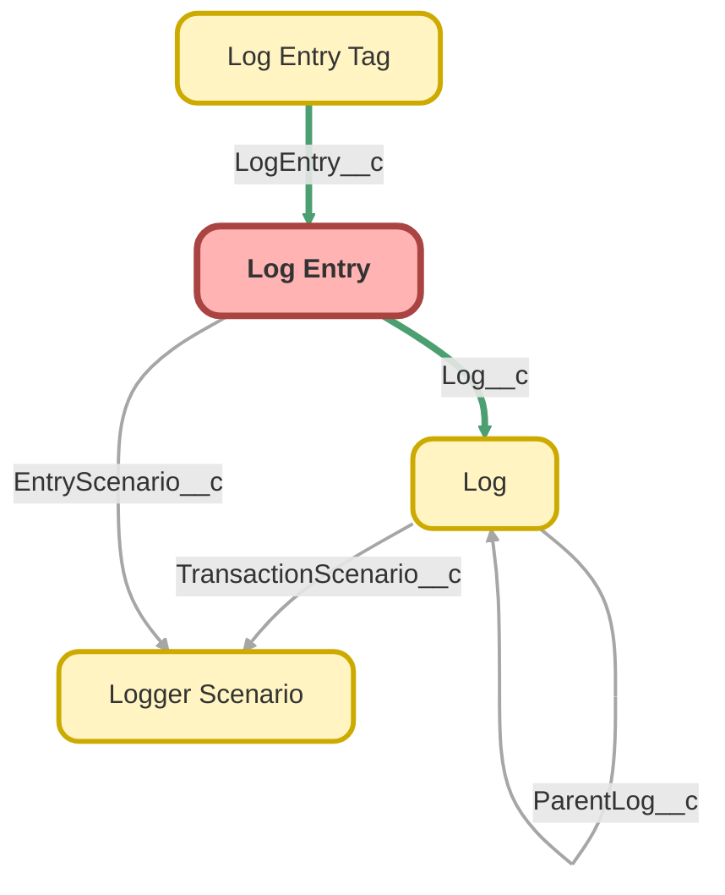

---
hide:
  - path
---

<!-- This file is auto-generated. if you do not want it to be overwritten, set TRUE in the line below -->
<!-- DO_NOT_OVERWRITE_DOC=FALSE -->

## Schema

<!-- Object description -->

## Fields

| Name      | Label | Type | Description |
| :-------- | :---- | :--: | :---------- | 
| ApexClassApiVersion__c | Apex Class API Version | Picklist | For more details, refer to https://developer.salesforce.com/docs/atlas.en-us.object_reference.meta/object_reference/sforce_api_objects_apexclass.htm |
| ApexClassCreatedDate__c | Apex Class Created Date | DateTime | undefined |
| ApexClassId__c | Apex Class ID | Text | For more details, refer to https://developer.salesforce.com/docs/atlas.en-us.object_reference.meta/object_reference/sforce_api_objects_apexclass.htm |
| ApexClassLastModifiedDate__c | Apex Class Last Modified Date | DateTime | undefined |
| ApexClassName__c | Apex Class | Text | undefined |
| ApexInnerClassName__c | Apex Inner Class | Text | undefined |
| ApexMethodName__c | Apex Method | Text | undefined |
| BrowserAddress__c | Browser Address | LongTextArea | undefined |
| BrowserFormFactor__c | Browser Form Factor | Picklist | undefined |
| BrowserLanguage__c | Browser Language | Text | undefined |
| BrowserScreenResolution__c | Browser Screen Resolution | Text | undefined |
| BrowserUrl__c | DEPRECATED: Browser URL | Url | undefined |
| BrowserUserAgent__c | Browser User Agent | Text | undefined |
| BrowserWindowResolution__c | Browser Window Resolution | Text | undefined |
| ComponentApiName__c | Component Name | Text | undefined |
| ComponentFunctionName__c | Component Function | Text | undefined |
| ComponentType__c | Component Type | Picklist | undefined |
| DatabaseResultCollectionSize__c | Database Result Collection Size | Number | The number of items contained in the collection of database results |
| DatabaseResultCollectionType__c | Database Result Collection Type | Picklist | undefined |
| DatabaseResultJson__c | Database Result JSON | LongTextArea | undefined |
| DatabaseResultType__c | Database Result Type | Picklist | undefined |
| EntrySaveReason__c | Entry Save Reason | Picklist | undefined |
| EntryScenario__c | Entry Scenario | Lookup | undefined |
| EntryScenarioLink__c | Entry Scenario | Text | undefined |
| EntryScenarioName__c | Entry Scenario Name | Text | undefined |
| EntryScenarioText__c | Entry Scenario | Text | undefined |
| EpochTimestamp__c | Epoch Timestamp | Number | Timestamp in milliseconds elapsed since 1 January 1970 of the log event |
| EventUuid__c | Event UUID | Text | The UUID of the LogEntryEvent__e platform event that created this LogEntry__c record.  For more details, refer to https://developer.salesforce.com/docs/atlas.en-us.platform_events.meta/platform_events/platform_events_event_uuid.htm |
| ExceptionLocation__c | Exception Location | Text | undefined |
| ExceptionMessage__c | Exception Message | LongTextArea | undefined |
| ExceptionSourceActionName__c | Exception Source Action Name | Text | undefined |
| ExceptionSourceApiName__c | Exception Source API Name | Text | undefined |
| ExceptionSourceApiVersion__c | Exception Source API Version | Picklist | undefined |
| ExceptionSourceCreatedById__c | Exception Source Created By ID | Text | undefined |
| ExceptionSourceCreatedByLink__c | Exception Source Created By | Text | undefined |
| ExceptionSourceCreatedByUsername__c | Exception Source Created By | Text | undefined |
| ExceptionSourceCreatedDate__c | Exception Source Created Date | DateTime | undefined |
| ExceptionSourceId__c | Exception Source ID | Text | undefined |
| ExceptionSourceLastModifiedById__c | Exception Source Last Modified By ID | Text | undefined |
| ExceptionSourceLastModifiedByLink__c | Exception Source Last Modified By | Text | undefined |
| ExceptionSourceLastModifiedByUsername__c | Exception Source Last Modified By | Text | undefined |
| ExceptionSourceLastModifiedDate__c | Exception Source Last Modified Date | DateTime | undefined |
| ExceptionSourceMetadataType__c | Exception Source Metadata Type | Picklist | undefined |
| ExceptionSourceSnippet__c | Exception Source Snippet | LongTextArea | undefined |
| ExceptionStackTrace__c | Exception Stack Trace | LongTextArea | undefined |
| ExceptionType__c | Exception Type | Picklist | undefined |
| FlowActiveVersionId__c | Flow Active Version ID | Text | The ID of the active flow version. |
| FlowDescription__c | Flow Description | LongTextArea | Flow definition information, specified by the org’s admin. |
| FlowDurableId__c | Flow Durable ID | Text | For more details, refer to https://developer.salesforce.com/docs/atlas.en-us.object_reference.meta/object_reference/sforce_api_objects_flowdefinitionview.htm |
| FlowLabel__c | Flow Label | Text | For more details, refer to https://developer.salesforce.com/docs/atlas.en-us.object_reference.meta/object_reference/sforce_api_objects_flowdefinitionview.htm |
| FlowLastModifiedByName__c | Flow Last Modified By | Text | For more details, refer to https://developer.salesforce.com/docs/atlas.en-us.object_reference.meta/object_reference/sforce_api_objects_flowdefinitionview.htm |
| FlowLastModifiedDate__c | Flow Last Modified Date | DateTime | For more details, refer to https://developer.salesforce.com/docs/atlas.en-us.object_reference.meta/object_reference/sforce_api_objects_flowdefinitionview.htm |
| FlowProcessType__c | Flow Process Type | Picklist | For more details, refer to https://developer.salesforce.com/docs/atlas.en-us.object_reference.meta/object_reference/sforce_api_objects_flowdefinitionview.htm |
| FlowRecordTriggerType__c | Flow Record Trigger Type | Picklist | For more details, refer to https://developer.salesforce.com/docs/atlas.en-us.object_reference.meta/object_reference/sforce_api_objects_flowdefinitionview.htm |
| FlowTriggerOrder__c | Flow Trigger Order | Number | For more details, refer to https://developer.salesforce.com/docs/atlas.en-us.object_reference.meta/object_reference/sforce_api_objects_flowdefinitionview.htm |
| FlowTriggerSObjectType__c | Flow Trigger SObject Type | Picklist | undefined |
| FlowTriggerType__c | Flow Trigger Type | Picklist | For more details, refer to https://developer.salesforce.com/docs/atlas.en-us.object_reference.meta/object_reference/sforce_api_objects_flowdefinitionview.htm |
| FlowVersionApiVersionRuntime__c | Flow API Version Runtime | Picklist | For more details, refer to https://developer.salesforce.com/docs/atlas.en-us.object_reference.meta/object_reference/sforce_api_objects_flowdefinitionview.htm |
| FlowVersionNumber__c | Flow Version Number | Number | For more details, refer to https://developer.salesforce.com/docs/atlas.en-us.object_reference.meta/object_reference/sforce_api_objects_flowdefinitionview.htm |
| FlowVersionRunInMode__c | Flow Run-In Mode | Picklist | For more details, refer to https://developer.salesforce.com/docs/atlas.en-us.object_reference.meta/object_reference/sforce_api_objects_flowdefinitionview.htm |
| HasDatabaseResult__c | Has Database Result | Checkbox | undefined |
| HasDatabaseResultJson__c | Has Database Result JSON | Checkbox | undefined |
| HasException__c | Has Exception | Checkbox | undefined |
| HasExceptionSourceSnippet__c | Has Exception Source Snippet | Checkbox | undefined |
| HasExceptionStackTrace__c | Has Exception Stack Trace | Checkbox | undefined |
| HasHttpRequestBody__c | Has HTTP Request Body | Checkbox | undefined |
| HasHttpRequestHeaderKeys__c | Has HTTP Request Header Keys | Checkbox | undefined |
| HasHttpRequestHeaders__c | Has HTTP Request Headers | Checkbox | undefined |
| HasHttpResponseBody__c | Has HTTP Response Body | Checkbox | undefined |
| HasHttpResponseHeaderKeys__c | Has HTTP Response Header Keys | Checkbox | undefined |
| HasHttpResponseHeaders__c | Has HTTP Response Headers | Checkbox | undefined |
| HasInlineTags__c | Has Inline Tags | Checkbox | undefined |
| HasOriginSourceSnippet__c | Has Origin Source Snippet | Checkbox | undefined |
| HasRecordId__c | Has Related Record ID | Checkbox | undefined |
| HasRecordJson__c | Has Related Record JSON | Checkbox | undefined |
| HasRestRequestBody__c | Has REST Request Body | Checkbox | undefined |
| HasRestRequestHeaderKeys__c | Has REST Request Header Keys | Checkbox | undefined |
| HasRestRequestHeaders__c | Has REST Request Headers | Checkbox | undefined |
| HasRestResponseBody__c | Has REST Response Body | Checkbox | undefined |
| HasRestResponseHeaderKeys__c | Has REST Response Header Keys | Checkbox | undefined |
| HasRestResponseHeaders__c | Has REST Response Headers | Checkbox | undefined |
| HasStackTrace__c | Has Stack Trace | Checkbox | undefined |
| HttpRequestBody__c | HTTP Request Body | LongTextArea | undefined |
| HttpRequestBodyMasked__c | HTTP Request Body Masked | Checkbox | undefined |
| HttpRequestBodyTruncated__c | HTTP Request Body Truncated | Checkbox | undefined |
| HttpRequestCompressed__c | HTTP Request Compressed | Checkbox | undefined |
| HttpRequestEndpoint__c | DEPRECATED: HTTP Request Endpoint | Text | undefined |
| HttpRequestEndpointAddress__c | HTTP Request Endpoint Address | LongTextArea | undefined |
| HttpRequestHeaderKeys__c | HTTP Request Header Keys | LongTextArea | undefined |
| HttpRequestHeaders__c | HTTP Request Headers | LongTextArea | undefined |
| HttpRequestMethod__c | HTTP Request Method | Picklist | undefined |
| HttpResponseBody__c | HTTP Response Body | LongTextArea | undefined |
| HttpResponseBodyMasked__c | HTTP Response Body Masked | Checkbox | undefined |
| HttpResponseBodyTruncated__c | HTTP Response Body Truncated | Checkbox | undefined |
| HttpResponseHeaderKeys__c | HTTP Response Header Keys | LongTextArea | undefined |
| HttpResponseHeaders__c | HTTP Response Headers | LongTextArea | undefined |
| HttpResponseStatus__c | HTTP Response Status | Text | undefined |
| HttpResponseStatusCode__c | HTTP Response Status Code | Number | undefined |
| ImpersonatedByUsernameLink__c | Impersonated By Username | Text | undefined |
| LimitsAggregateQueries__c | Aggregate Queries | Text | undefined |
| LimitsAggregateQueriesMax__c | Aggregate Queries Max | Number | undefined |
| LimitsAggregateQueriesUsed__c | Aggregate Queries Used | Number | undefined |
| LimitsApexCursorFetchCalls__c | Apex Cursor Fetch Calls | Text | undefined |
| LimitsApexCursorFetchCallsMax__c | Apex Cursor Fetch Calls Max | Number | undefined |
| LimitsApexCursorFetchCallsUsed__c | Apex Cursor Fetch Calls Used | Number | undefined |
| LimitsApexCursorRows__c | Apex Cursor Rows | Text | undefined |
| LimitsApexCursorRowsMax__c | Apex Cursor Rows Max | Number | undefined |
| LimitsApexCursorRowsUsed__c | Apex Cursor Rows Used | Number | undefined |
| LimitsAsyncCalls__c | Async Calls | Text | undefined |
| LimitsAsyncCallsMax__c | Async Calls Max | Number | undefined |
| LimitsAsyncCallsUsed__c | Async Calls Used | Number | undefined |
| LimitsCallouts__c | Callouts | Text | undefined |
| LimitsCalloutsMax__c | Callouts Max | Number | undefined |
| LimitsCalloutsUsed__c | Callouts Used | Number | undefined |
| LimitsCpuTime__c | CPU Time | Text | undefined |
| LimitsCpuTimeMax__c | CPU Time Max | Number | undefined |
| LimitsCpuTimeUsed__c | CPU Time Used | Number | undefined |
| LimitsDmlRows__c | DML Rows | Text | undefined |
| LimitsDmlRowsMax__c | DML Rows Max | Number | undefined |
| LimitsDmlRowsUsed__c | DML Rows Used | Number | undefined |
| LimitsDmlStatements__c | DML Statements | Text | undefined |
| LimitsDmlStatementsMax__c | DML Statements Max | Number | undefined |
| LimitsDmlStatementsUsed__c | DML Statements Used | Number | undefined |
| LimitsEmailInvocations__c | Email Invocations | Text | undefined |
| LimitsEmailInvocationsMax__c | Email Invocations Max | Number | undefined |
| LimitsEmailInvocationsUsed__c | Email Invocations Used | Number | undefined |
| LimitsFutureCalls__c | Future Calls | Text | undefined |
| LimitsFutureCallsMax__c | Future Calls Max | Number | undefined |
| LimitsFutureCallsUsed__c | Future Calls Used | Number | undefined |
| LimitsHeapSize__c | Heap Size | Text | undefined |
| LimitsHeapSizeMax__c | Heap Size Max | Number | undefined |
| LimitsHeapSizeUsed__c | Heap Size Used | Number | undefined |
| LimitsMobilePushApexCalls__c | Mobile Push Apex Calls | Text | undefined |
| LimitsMobilePushApexCallsMax__c | Mobile Push Apex Calls Max | Number | undefined |
| LimitsMobilePushApexCallsUsed__c | Mobile Push Apex Calls Used | Number | undefined |
| LimitsPublishImmediateDmlStatements__c | Publish Immediate DML Statements | Text | undefined |
| LimitsPublishImmediateDmlStatementsMax__c | Publish Immediate Statements DML Max | Number | undefined |
| LimitsPublishImmediateDmlStatementsUsed__c | Publish Immediate Statements DML Used | Number | undefined |
| LimitsQueueableJobs__c | Queueable Jobs | Text | undefined |
| LimitsQueueableJobsMax__c | Queueable Jobs Max | Number | undefined |
| LimitsQueueableJobsUsed__c | Queueable Jobs Used | Number | undefined |
| LimitsSoqlQueries__c | SOQL Queries | Text | undefined |
| LimitsSoqlQueriesMax__c | SOQL Queries Max | Number | undefined |
| LimitsSoqlQueriesUsed__c | SOQL Queries Used | Number | undefined |
| LimitsSoqlQueryLocatorRows__c | SOQL Query Locator Rows | Text | undefined |
| LimitsSoqlQueryLocatorRowsMax__c | SOQL Query Locator Rows Max | Number | undefined |
| LimitsSoqlQueryLocatorRowsUsed__c | SOQL Query Locator Rows Used | Number | undefined |
| LimitsSoqlQueryRows__c | SOQL Query Rows | Text | undefined |
| LimitsSoqlQueryRowsMax__c | SOQL Query Rows Max | Number | undefined |
| LimitsSoqlQueryRowsUsed__c | SOQL Query Rows Used | Number | undefined |
| LimitsSoslSearches__c | SOSL Searches | Text | undefined |
| LimitsSoslSearchesMax__c | SOSL Searches Max | Number | undefined |
| LimitsSoslSearchesUsed__c | SOSL Searches Used | Number | undefined |
| Log__c | Log | MasterDetail | undefined |
| LoggedByUsernameLink__c | Username | Text | undefined |
| LoggedByUsernameText__c | Username | Text | undefined |
| LoggingLevel__c | Logging Level | Picklist | undefined |
| LoggingLevelOrdinal__c | Logging Level Ordinal | Number | undefined |
| LoggingLevelWithImage__c | DEPRECATED: Level | Text | undefined |
| LogTransactionId__c | Log Transaction ID | Text | undefined |
| Message__c | Message | LongTextArea | undefined |
| MessageMasked__c | Message Masked | Checkbox | undefined |
| MessageTruncated__c | Message Truncated | Checkbox | undefined |
| Origin__c | Origin | Text | undefined |
| OriginLocation__c | Origin Location | Text | undefined |
| OriginSourceActionName__c | Origin Source Action Name | Text | undefined |
| OriginSourceApiName__c | Origin Source API Name | Text | undefined |
| OriginSourceApiVersion__c | Origin Source API Version | Picklist | undefined |
| OriginSourceCreatedById__c | Origin Source Created By ID | Text | undefined |
| OriginSourceCreatedByLink__c | Origin Source Created By | Text | undefined |
| OriginSourceCreatedByUsername__c | Origin Source Created By | Text | undefined |
| OriginSourceCreatedDate__c | Origin Source Created Date | DateTime | undefined |
| OriginSourceId__c | Origin Source ID | Text | undefined |
| OriginSourceLastModifiedById__c | Origin Source Last Modified By ID | Text | undefined |
| OriginSourceLastModifiedByLink__c | Origin Source Last Modified By | Text | undefined |
| OriginSourceLastModifiedByUsername__c | Origin Source Last Modified By | Text | undefined |
| OriginSourceLastModifiedDate__c | Origin Source Last Modified Date | DateTime | undefined |
| OriginSourceMetadataType__c | Origin Source Metadata Type | Picklist | undefined |
| OriginSourceSnippet__c | Origin Source Snippet | LongTextArea | undefined |
| OriginType__c | Origin Type | Picklist | undefined |
| ParentLogLink__c | Parent Log | Text | undefined |
| ProfileLink__c | Profile | Text | undefined |
| RecordCollectionSize__c | Related Record Collection Size | Number | The number of items contained in the collection of records |
| RecordCollectionType__c | Related Record Collection Type | Picklist | undefined |
| RecordDetailedLink__c | Related Record | Text | undefined |
| RecordId__c | Related Record ID | Text | undefined |
| RecordJson__c | Related Record JSON | LongTextArea | JSON of the related SObject record |
| RecordJsonMasked__c | Record JSON Masked | Checkbox | undefined |
| RecordJsonTruncated__c | Record JSON Truncated | Checkbox | undefined |
| RecordLink__c | Related Record | Text | undefined |
| RecordName__c | Related Record Name | Text | undefined |
| RecordSObjectClassification__c | Related Record Object Classification | Picklist | undefined |
| RecordSObjectType__c | Related Record Object | Picklist | undefined |
| RecordSObjectTypeNamespace__c | Related Record Object Namespace | Text | undefined |
| RestRequestBody__c | REST Request Body | LongTextArea | undefined |
| RestRequestBodyMasked__c | REST Request Body Masked | Checkbox | undefined |
| RestRequestBodyTruncated__c | REST Request Body Truncated | Checkbox | undefined |
| RestRequestHeaderKeys__c | REST Request Header Keys | LongTextArea | undefined |
| RestRequestHeaders__c | REST Request Headers | LongTextArea | undefined |
| RestRequestMethod__c | REST Request Method | Picklist | undefined |
| RestRequestParameters__c | REST Request Parameters | LongTextArea | undefined |
| RestRequestRemoteAddress__c | REST Request Remote Address | Text | undefined |
| RestRequestResourcePath__c | REST Request Resource Path | Text | undefined |
| RestRequestUri__c | REST Request URI | Text | undefined |
| RestResponseBody__c | REST Response Body | LongTextArea | undefined |
| RestResponseBodyMasked__c | REST Response Body Masked | Checkbox | undefined |
| RestResponseBodyTruncated__c | REST Response Body Truncated | Checkbox | undefined |
| RestResponseHeaderKeys__c | REST Response Header Keys | LongTextArea | undefined |
| RestResponseHeaders__c | REST Response Headers | LongTextArea | undefined |
| RestResponseStatusCode__c | REST Response Status Code | Number | undefined |
| StackTrace__c | Stack Trace | LongTextArea | undefined |
| Tags__c | Tags | LongTextArea | undefined |
| Timestamp__c | Timestamp | DateTime | undefined |
| TransactionEntryNumber__c | Entry # | Number | The sequential number of this log entry within the transaction |
| Trigger__c | Trigger Operation | Text | undefined |
| TriggerIsExecuting__c | Trigger Is Executing | Checkbox | undefined |
| TriggerOperationType__c | Trigger Operation Type | Picklist | undefined |
| TriggerSObjectType__c | Trigger Object | Picklist | undefined |
| UniqueId__c | Unique ID | Text | Composite key that will hold the value of the TransactionId + TransactionEntryNumber |

## Related Apex Classes

| Apex Class | Type |
| :----      | :--: | 
| [FlowCollectionLogEntry_Tests](../apex/FlowCollectionLogEntry_Tests.md) | Test |
| [FlowLogEntry_Tests](../apex/FlowLogEntry_Tests.md) | Test |
| [FlowLogger_Tests](../apex/FlowLogger_Tests.md) | Test |
| [FlowRecordLogEntry_Tests](../apex/FlowRecordLogEntry_Tests.md) | Test |
| [LogBatchPurgeController](../apex/LogBatchPurgeController.md) | Lightning Controller |
| [LogBatchPurgeController_Tests](../apex/LogBatchPurgeController_Tests.md) | Test |
| [LogBatchPurgeScheduler_Tests](../apex/LogBatchPurgeScheduler_Tests.md) | Test |
| [LogBatchPurger](../apex/LogBatchPurger.md) | Batch |
| [LogBatchPurger_Tests](../apex/LogBatchPurger_Tests.md) | Test |
| [LogEntryEventBuilder](../apex/LogEntryEventBuilder.md) | Class |
| [LogEntryEventBuilder_Tests](../apex/LogEntryEventBuilder_Tests.md) | Test |
| [LogEntryEventHandler](../apex/LogEntryEventHandler.md) | Class |
| [LogEntryEventHandler_Tests](../apex/LogEntryEventHandler_Tests.md) | Test |
| [LogEntryFieldSetPicklist](../apex/LogEntryFieldSetPicklist.md) | Class |
| [LogEntryFieldSetPicklist_Tests](../apex/LogEntryFieldSetPicklist_Tests.md) | Test |
| [LogEntryHandler](../apex/LogEntryHandler.md) | Class |
| [LogEntryHandler_Tests](../apex/LogEntryHandler_Tests.md) | Test |
| [LogEntryMetadataViewerController](../apex/LogEntryMetadataViewerController.md) | Lightning Controller |
| [LogEntryMetadataViewerController_Tests](../apex/LogEntryMetadataViewerController_Tests.md) | Test |
| [LogEntryTagHandler](../apex/LogEntryTagHandler.md) | Class |
| [LogEntryTagHandler_Tests](../apex/LogEntryTagHandler_Tests.md) | Test |
| [LogHandler_Tests](../apex/LogHandler_Tests.md) | Test |
| [LogManagementDataSelector](../apex/LogManagementDataSelector.md) | Class |
| [LogManagementDataSelector_Tests](../apex/LogManagementDataSelector_Tests.md) | Test |
| [LogViewerController](../apex/LogViewerController.md) | Lightning Controller |
| [LogViewerController_Tests](../apex/LogViewerController_Tests.md) | Test |
| [LoggerEmailSender_Tests](../apex/LoggerEmailSender_Tests.md) | Test |
| [LoggerFieldMapper](../apex/LoggerFieldMapper.md) | Class |
| [LoggerFieldMapper_Tests](../apex/LoggerFieldMapper_Tests.md) | Test |
| [LoggerParameter](../apex/LoggerParameter.md) | Class |
| [LoggerTestConfigurator](../apex/LoggerTestConfigurator.md) | Test |
| [Logger_Tests](../apex/Logger_Tests.md) | Test |
| [RelatedLogEntriesController](../apex/RelatedLogEntriesController.md) | Lightning Controller |
| [RelatedLogEntriesController_Tests](../apex/RelatedLogEntriesController_Tests.md) | Test |
| [LogEntry](../apex/LogEntry.md) | Class |

## Related Lightning Pages

| Lightning Page | Type |
| :----      | :--: | 
| [LogEntryRecordPage](../pages/LogEntryRecordPage.md) |  Record Page |
| [LogEntryTagRecordPage](../pages/LogEntryTagRecordPage.md) |  Record Page |
| [LoggerTagRecordPage](../pages/LoggerTagRecordPage.md) |  Record Page |

## Related Profiles

| Profile | User License |
| :----      | :--: | 
| [Admin](../profiles/Admin.md) |  Salesforce |
| [Analytics Cloud Integration User](../profiles/Analytics%20Cloud%20Integration%20User.md) |  Analytics  Cloud  Integration  User |
| [Analytics Cloud Security User](../profiles/Analytics%20Cloud%20Security%20User.md) |  Analytics  Cloud  Integration  User |
| [Anypoint Integration](../profiles/Anypoint%20Integration.md) |  Identity |
| [Authenticated Website](../profiles/Authenticated%20Website.md) |  Authenticated  Website |
| [B2B Reordering Portal Buyer Profile](../profiles/B2B%20Reordering%20Portal%20Buyer%20Profile.md) |  External  Apps  Login |
| [Chatter External User](../profiles/Chatter%20External%20User.md) |  Chatter  External |
| [Chatter Free User](../profiles/Chatter%20Free%20User.md) |  Chatter  Free |
| [Chatter Moderator User](../profiles/Chatter%20Moderator%20User.md) |  Chatter  Free |
| [ContractManager](../profiles/ContractManager.md) |  Salesforce |
| [Cross Org Data Proxy User](../profiles/Cross%20Org%20Data%20Proxy%20User.md) |  X Org  Proxy  User |
| [Custom%3A Marketing Profile](../profiles/Custom%253A%20Marketing%20Profile.md) |  Salesforce |
| [Custom%3A Sales Profile](../profiles/Custom%253A%20Sales%20Profile.md) |  Salesforce |
| [Custom%3A Support Profile](../profiles/Custom%253A%20Support%20Profile.md) |  Salesforce |
| [Customer Community Login User](../profiles/Customer%20Community%20Login%20User.md) |  Customer  Community  Login |
| [Customer Community Plus Login User](../profiles/Customer%20Community%20Plus%20Login%20User.md) |  Customer  Community  Plus  Login |
| [Customer Community Plus User](../profiles/Customer%20Community%20Plus%20User.md) |  Customer  Community  Plus |
| [Customer Community User](../profiles/Customer%20Community%20User.md) |  Customer  Community |
| [Customer Portal Manager Custom](../profiles/Customer%20Portal%20Manager%20Custom.md) |  Customer  Portal  Manager  Custom |
| [Customer Portal Manager Standard](../profiles/Customer%20Portal%20Manager%20Standard.md) |  Customer  Portal  Manager  Standard |
| [Einstein Agent User](../profiles/Einstein%20Agent%20User.md) |  Einstein  Agent |
| [External Apps Login User](../profiles/External%20Apps%20Login%20User.md) |  External  Apps  Login |
| [External Identity User](../profiles/External%20Identity%20User.md) |  External  Identity |
| [Force%2Ecom - App Subscription User](../profiles/Force%252Ecom%20-%20App%20Subscription%20User.md) |  Force.com -  App  Subscription |
| [Force%2Ecom - Free User](../profiles/Force%252Ecom%20-%20Free%20User.md) |  Force.com -  Free |
| [Gold Partner User](../profiles/Gold%20Partner%20User.md) |  Gold  Partner |
| [High Volume Customer Portal User](../profiles/High%20Volume%20Customer%20Portal%20User.md) |  High  Volume  Customer  Portal |
| [HighVolumePortal](../profiles/HighVolumePortal.md) |  High  Volume  Customer  Portal |
| [Identity User](../profiles/Identity%20User.md) |  Identity |
| [MarketingProfile](../profiles/MarketingProfile.md) |  Salesforce |
| [Minimum Access - API Only Integrations](../profiles/Minimum%20Access%20-%20API%20Only%20Integrations.md) |  Salesforce  Integration |
| [Minimum Access - Salesforce](../profiles/Minimum%20Access%20-%20Salesforce.md) |  Salesforce |
| [Partner App Subscription User](../profiles/Partner%20App%20Subscription%20User.md) |  Partner  App  Subscription |
| [Partner Community Login User](../profiles/Partner%20Community%20Login%20User.md) |  Partner  Community  Login |
| [Partner Community User](../profiles/Partner%20Community%20User.md) |  Partner  Community |
| [PlatformPortal](../profiles/PlatformPortal.md) |  Authenticated  Website |
| [Read Only](../profiles/Read%20Only.md) |  Salesforce |
| [Salesforce API Only System Integrations](../profiles/Salesforce%20API%20Only%20System%20Integrations.md) |  Salesforce  Integration |
| [Silver Partner User](../profiles/Silver%20Partner%20User.md) |  Silver  Partner |
| [SolutionManager](../profiles/SolutionManager.md) |  Salesforce |
| [Standard](../profiles/Standard.md) |  Salesforce |
| [StandardAul](../profiles/StandardAul.md) |  Salesforce  Platform |
| [Work%2Ecom Only User](../profiles/Work%252Ecom%20Only%20User.md) |  Work.com  Only |

## Related Permission Sets

| Permission Set | User License |
| :----      | :--: | 
| [LoggerAdmin](../permissionsets/LoggerAdmin.md) | None |
| [LoggerEndUser](../permissionsets/LoggerEndUser.md) | None |
| [LoggerLogViewer](../permissionsets/LoggerLogViewer.md) | None |

_Documentation generated with [sfdx-hardis](https://sfdx-hardis.cloudity.com), by [Cloudity](https://www.cloudity.com/) & [friends](https://github.com/hardisgroupcom/sfdx-hardis/graphs/contributors)_
