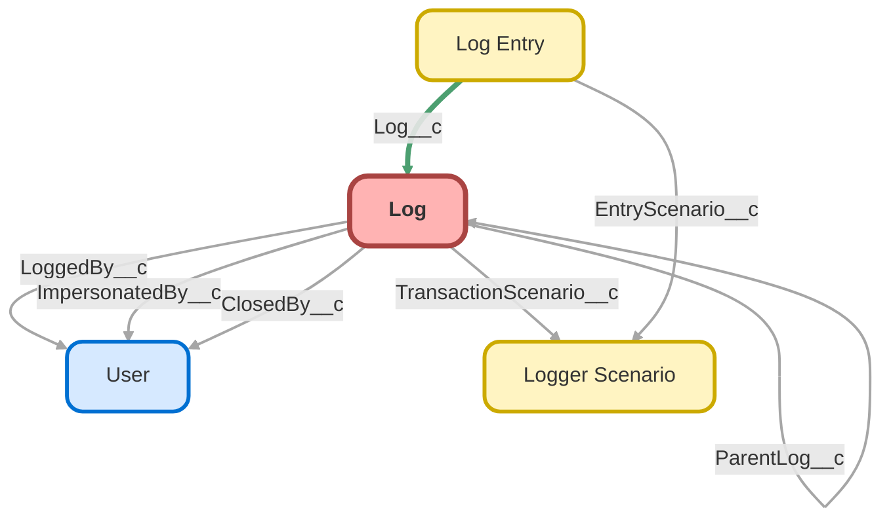

---
hide:
  - path
---

<!-- This file is auto-generated. if you do not want it to be overwritten, set TRUE in the line below -->
<!-- DO_NOT_OVERWRITE_DOC=FALSE -->

## Schema

<!-- Object description -->

## Fields

| Name      | Label | Type | Description |
| :-------- | :---- | :--: | :---------- | 
| ApiReleaseNumber__c | DEPRECATED: API Release Number | Text | The release number for the org's instance - determined by making a callout to status.salesforce.com |
| ApiReleaseVersion__c | DEPRECATED: API Release Version | Text | The release version for the org's instance - determined by making a callout to status.salesforce.com |
| ApiVersion__c | DEPRECATED: API Version | Picklist | The Salesforce release (API version) of the environment |
| AsyncContextChildJobId__c | Async Context Child Job ID | Text | undefined |
| AsyncContextParentJobId__c | Async Context Parent Job ID | Text | undefined |
| AsyncContextTriggerId__c | Async Context Trigger ID | Text | undefined |
| AsyncContextType__c | Async Context Type | Picklist | undefined |
| ClosedBy__c | Closed By | Lookup | undefined |
| ClosedDate__c | Closed Date | DateTime | undefined |
| Comments__c | Comments | LongTextArea | undefined |
| EndTime__c | End Time | Summary | undefined |
| HasComments__c | Has Comments | Checkbox | undefined |
| HasLoggedByFederationIdentifier__c | Has User Federation Identifier | Checkbox | undefined |
| HasOrganizationLimits__c | Has Organization Limits | Checkbox | undefined |
| ImpersonatedBy__c | Impersonated By | Lookup | undefined |
| ImpersonatedByUsernameLink__c | Impersonated By Username | Text | undefined |
| IsClosed__c | Is Closed | Checkbox | undefined |
| IsResolved__c | Is Resolved | Checkbox | undefined |
| Issue__c | Issue | Picklist | undefined |
| Locale__c | Locale | Text | undefined |
| LogEntriesSummary__c | Summary | Text | undefined |
| LoggedBy__c | Logged By | Lookup | undefined |
| LoggedByFederationIdentifier__c | User Federation Identifier | LongTextArea | undefined |
| LoggedByUsername__c | Username | Text | undefined |
| LoggedByUsernameLink__c | Username | Text | undefined |
| LoggedByUsernameText__c | Username | Text | undefined |
| LoggerVersionNumber__c | Logger Version Number | Text | undefined |
| LoginApplication__c | Login Application | Text | undefined |
| LoginBrowser__c | Login Browser | Text | undefined |
| LoginDomain__c | DEPRECATED: Login Domain | Url | undefined |
| LoginHistoryId__c | Login History ID | Text | undefined |
| LoginPlatform__c | Login Platform | Text | undefined |
| LoginType__c | Login Type | Picklist | undefined |
| LogoutUrl__c | Logout URL | Url | undefined |
| LogPurgeAction__c | Log Purge Action | Picklist | undefined |
| LogRetentionDate__c | Log Retention Date | Date | The date that this log can be automatically deleted by the batch job LogBatchPurger.  It defaults to 2 weeks after creation (configurable in Logger Settings), but the date can be set manually or via automation if certain logs need to be kept longer/indefinitely. |
| MaxLogEntryLoggingLevelOrdinal__c | Max Log Entry Logging Level Ordinal | Summary | The highest logging level ordinal of any related log entries |
| NetworkId__c | Site Network ID | Text | The Network ID of the Community user's site. Set with Network.getNetworkId() |
| NetworkLoginUrl__c | Site Login URL | Url | undefined |
| NetworkLogoutUrl__c | Site Logout URL | Url | undefined |
| NetworkName__c | Site Name | Text | The name of the user's Community site (based on NetworkId). |
| NetworkSelfRegistrationUrl__c | Site Self Registration URL | Url | undefined |
| NetworkUrlPathPrefix__c | Site URL Path Prefix | Text | The UrlPathPrefix is a unique string at the end of the URL for this community. For example, in the community URL CommunitiesSubdomainName.force.com/customers, customers is the UrlPathPrefix. |
| OrganizationApiVersion__c | Organization API Version | Picklist | The Salesforce release (API version) of the environment |
| OrganizationDomainUrl__c | Organization Domain URL | Url | The value returned from System.URL.getOrgDomainUrl() |
| OrganizationEnvironmentType__c | Environment Type | Picklist | undefined |
| OrganizationId__c | Organization ID | Text | undefined |
| OrganizationInstanceName__c | Instance Name | Text | undefined |
| OrganizationInstanceReleaseCycle__c | DEPRECATED: Instance Release Cycle | Picklist | undefined |
| OrganizationLimits__c | Organization Limits | LongTextArea | undefined |
| OrganizationLocation__c | Organization Location | Picklist | undefined |
| OrganizationName__c | Organization Name | Text | undefined |
| OrganizationNamespacePrefix__c | Organization Namespace Prefix | Text | undefined |
| OrganizationReleaseNumber__c | Organization Release Number | Text | The release number for the org's instance - determined by making a callout to status.salesforce.com |
| OrganizationReleaseVersion__c | Organization Release Version | Text | The release version for the org's instance - determined by making a callout to status.salesforce.com |
| OrganizationType__c | Organization Type | Picklist | undefined |
| ParentLog__c | Parent Log | Lookup | The log from the original transaction that initiated a child log - for example, batch jobs have start, execute and finish methods. All 3 are considered separate transactions. By using the parent log, logs from all 3 transactions can be linked together. |
| ParentLogLink__c | Parent Log | Text | undefined |
| ParentLogTransactionId__c | Parent Log Transaction ID | Text | undefined |
| ParentSessionId__c | Parent Session ID | Text | undefined |
| Priority__c | Priority | Picklist | undefined |
| ProfileId__c | Profile ID | Text | undefined |
| ProfileLink__c | Profile | Text | undefined |
| ProfileName__c | Profile Name | Text | undefined |
| RequestId__c | Request ID | Text | undefined |
| Scenario__c | DEPRECATED: Scenario | Text | undefined |
| SessionId__c | Session ID | Text | undefined |
| SessionSecurityLevel__c | Session Security Level | Picklist | undefined |
| SessionType__c | Session Type | Picklist | undefined |
| SourceIp__c | Source IP | Text | undefined |
| StartTime__c | Start Time | Summary | undefined |
| Status__c | Status | Picklist | undefined |
| SystemMode__c | System Mode | Picklist | undefined |
| SystemModeSummary__c | System Mode | Text | undefined |
| ThemeDisplayed__c | Theme Displayed | Picklist | undefined |
| TimeZoneId__c | Time Zone ID | Text | undefined |
| TimeZoneName__c | Time Zone Name | Text | undefined |
| TotalDEBUGLogEntries__c | Total DEBUG Entries | Summary | The total number of log entries with logging level == 'DEBUG' |
| TotalERRORLogEntries__c | Total ERROR Entries | Summary | The total number of log entries with logging level == 'ERROR' |
| TotalFINELogEntries__c | Total FINE Entries | Summary | The total number of log entries with logging level == 'FINE' |
| TotalFINERLogEntries__c | Total FINER Entries | Summary | The total number of log entries with logging level == 'FINER' |
| TotalFINESTLogEntries__c | Total FINEST Entries | Summary | The total number of log entries with logging level == 'FINEST' |
| TotalINFOLogEntries__c | Total INFO Entries | Summary | The total number of log entries with logging level == 'INFO' |
| TotalLimitsCpuTimeUsed__c | Total CPU | Summary | undefined |
| TotalLogEntries__c | Total Entries | Number | undefined |
| TotalWARNLogEntries__c | Total WARN Entries | Summary | The total number of log entries with logging level == 'WARN' |
| TransactionId__c | Transaction ID | Text | undefined |
| TransactionScenario__c | Transaction Scenario | Lookup | undefined |
| TransactionScenarioLink__c | Transaction Scenario | Text | undefined |
| TransactionScenarioName__c | Transaction Scenario Name | Text | undefined |
| TransactionScenarioText__c | Transaction Scenario | Text | undefined |
| UserLicenseDefinitionKey__c | User License Definition Key | Picklist | https://developer.salesforce.com/docs/atlas.en-us.object_reference.meta/object_reference/sforce_api_objects_userlicense.htm |
| UserLicenseId__c | User License ID | Text | undefined |
| UserLicenseName__c | User License Name | Picklist | undefined |
| UserLoggingLevel__c | User Logging Level | Picklist | undefined |
| UserLoggingLevelOrdinal__c | User Logging Level Ordinal | Number | undefined |
| UserRoleId__c | User Role ID | Text | undefined |
| UserRoleLink__c | User Role | Text | undefined |
| UserRoleName__c | User Role Name | Text | undefined |
| UserType__c | User Type | Picklist | undefined |
| WasLoggedByCurrentUser__c | Logged By Current User | Checkbox | undefined |

## Related Apex Classes

| Apex Class | Type |
| :----      | :--: | 
| [LogBatchPurgeController](../apex/LogBatchPurgeController.md) | Lightning Controller |
| [LogBatchPurgeController_Tests](../apex/LogBatchPurgeController_Tests.md) | Test |
| [LogBatchPurgeScheduler_Tests](../apex/LogBatchPurgeScheduler_Tests.md) | Test |
| [LogBatchPurger](../apex/LogBatchPurger.md) | Batch |
| [LogBatchPurger_Tests](../apex/LogBatchPurger_Tests.md) | Test |
| [LogEntryEventBuilder](../apex/LogEntryEventBuilder.md) | Class |
| [LogEntryEventBuilder_Tests](../apex/LogEntryEventBuilder_Tests.md) | Test |
| [LogEntryEventHandler](../apex/LogEntryEventHandler.md) | Class |
| [LogEntryEventHandler_Tests](../apex/LogEntryEventHandler_Tests.md) | Test |
| [LogEntryHandler_Tests](../apex/LogEntryHandler_Tests.md) | Test |
| [LogEntryTagHandler](../apex/LogEntryTagHandler.md) | Class |
| [LogEntryTagHandler_Tests](../apex/LogEntryTagHandler_Tests.md) | Test |
| [LogHandler](../apex/LogHandler.md) | Class |
| [LogHandler_Tests](../apex/LogHandler_Tests.md) | Test |
| [LogManagementDataSelector](../apex/LogManagementDataSelector.md) | Class |
| [LogManagementDataSelector_Tests](../apex/LogManagementDataSelector_Tests.md) | Test |
| [LogMassDeleteExtension](../apex/LogMassDeleteExtension.md) | Visualforce Controller |
| [LogMassDeleteExtension_Tests](../apex/LogMassDeleteExtension_Tests.md) | Test |
| [LogViewerController](../apex/LogViewerController.md) | Lightning Controller |
| [LogViewerController_Tests](../apex/LogViewerController_Tests.md) | Test |
| [Logger](../apex/Logger.md) | Invocable |
| [LoggerDataStore_Tests](../apex/LoggerDataStore_Tests.md) | Test |
| [LoggerFieldMapper](../apex/LoggerFieldMapper.md) | Class |
| [LoggerFieldMapper_Tests](../apex/LoggerFieldMapper_Tests.md) | Test |
| [LoggerParameter](../apex/LoggerParameter.md) | Class |
| [LoggerPlugin_Tests](../apex/LoggerPlugin_Tests.md) | Test |
| [LoggerTagHandler](../apex/LoggerTagHandler.md) | Class |
| [LoggerTestConfigurator](../apex/LoggerTestConfigurator.md) | Test |
| [Logger_Tests](../apex/Logger_Tests.md) | Test |
| [RelatedLogEntriesController](../apex/RelatedLogEntriesController.md) | Lightning Controller |
| [RelatedLogEntriesController_Tests](../apex/RelatedLogEntriesController_Tests.md) | Test |
| [Log](../apex/Log.md) | Class |

## Related Lightning Pages

| Lightning Page | Type |
| :----      | :--: | 
| [LogEntryRecordPage](../pages/LogEntryRecordPage.md) |  Record Page |
| [LogRecordPage](../pages/LogRecordPage.md) |  Record Page |
| [LoggerScenarioRecordPage](../pages/LoggerScenarioRecordPage.md) |  Record Page |
| [LoggerTagRecordPage](../pages/LoggerTagRecordPage.md) |  Record Page |

## Related Profiles

| Profile | User License |
| :----      | :--: | 
| [Admin](../profiles/Admin.md) |  Salesforce |
| [Analytics Cloud Integration User](../profiles/Analytics%20Cloud%20Integration%20User.md) |  Analytics  Cloud  Integration  User |
| [Analytics Cloud Security User](../profiles/Analytics%20Cloud%20Security%20User.md) |  Analytics  Cloud  Integration  User |
| [Anypoint Integration](../profiles/Anypoint%20Integration.md) |  Identity |
| [Authenticated Website](../profiles/Authenticated%20Website.md) |  Authenticated  Website |
| [B2B Reordering Portal Buyer Profile](../profiles/B2B%20Reordering%20Portal%20Buyer%20Profile.md) |  External  Apps  Login |
| [Chatter External User](../profiles/Chatter%20External%20User.md) |  Chatter  External |
| [Chatter Free User](../profiles/Chatter%20Free%20User.md) |  Chatter  Free |
| [Chatter Moderator User](../profiles/Chatter%20Moderator%20User.md) |  Chatter  Free |
| [ContractManager](../profiles/ContractManager.md) |  Salesforce |
| [Cross Org Data Proxy User](../profiles/Cross%20Org%20Data%20Proxy%20User.md) |  X Org  Proxy  User |
| [Custom%3A Marketing Profile](../profiles/Custom%253A%20Marketing%20Profile.md) |  Salesforce |
| [Custom%3A Sales Profile](../profiles/Custom%253A%20Sales%20Profile.md) |  Salesforce |
| [Custom%3A Support Profile](../profiles/Custom%253A%20Support%20Profile.md) |  Salesforce |
| [Customer Community Login User](../profiles/Customer%20Community%20Login%20User.md) |  Customer  Community  Login |
| [Customer Community Plus Login User](../profiles/Customer%20Community%20Plus%20Login%20User.md) |  Customer  Community  Plus  Login |
| [Customer Community Plus User](../profiles/Customer%20Community%20Plus%20User.md) |  Customer  Community  Plus |
| [Customer Community User](../profiles/Customer%20Community%20User.md) |  Customer  Community |
| [Customer Portal Manager Custom](../profiles/Customer%20Portal%20Manager%20Custom.md) |  Customer  Portal  Manager  Custom |
| [Customer Portal Manager Standard](../profiles/Customer%20Portal%20Manager%20Standard.md) |  Customer  Portal  Manager  Standard |
| [Einstein Agent User](../profiles/Einstein%20Agent%20User.md) |  Einstein  Agent |
| [External Apps Login User](../profiles/External%20Apps%20Login%20User.md) |  External  Apps  Login |
| [External Identity User](../profiles/External%20Identity%20User.md) |  External  Identity |
| [Force%2Ecom - App Subscription User](../profiles/Force%252Ecom%20-%20App%20Subscription%20User.md) |  Force.com -  App  Subscription |
| [Force%2Ecom - Free User](../profiles/Force%252Ecom%20-%20Free%20User.md) |  Force.com -  Free |
| [Gold Partner User](../profiles/Gold%20Partner%20User.md) |  Gold  Partner |
| [High Volume Customer Portal User](../profiles/High%20Volume%20Customer%20Portal%20User.md) |  High  Volume  Customer  Portal |
| [HighVolumePortal](../profiles/HighVolumePortal.md) |  High  Volume  Customer  Portal |
| [Identity User](../profiles/Identity%20User.md) |  Identity |
| [MarketingProfile](../profiles/MarketingProfile.md) |  Salesforce |
| [Minimum Access - API Only Integrations](../profiles/Minimum%20Access%20-%20API%20Only%20Integrations.md) |  Salesforce  Integration |
| [Minimum Access - Salesforce](../profiles/Minimum%20Access%20-%20Salesforce.md) |  Salesforce |
| [Partner App Subscription User](../profiles/Partner%20App%20Subscription%20User.md) |  Partner  App  Subscription |
| [Partner Community Login User](../profiles/Partner%20Community%20Login%20User.md) |  Partner  Community  Login |
| [Partner Community User](../profiles/Partner%20Community%20User.md) |  Partner  Community |
| [PlatformPortal](../profiles/PlatformPortal.md) |  Authenticated  Website |
| [Read Only](../profiles/Read%20Only.md) |  Salesforce |
| [Salesforce API Only System Integrations](../profiles/Salesforce%20API%20Only%20System%20Integrations.md) |  Salesforce  Integration |
| [Silver Partner User](../profiles/Silver%20Partner%20User.md) |  Silver  Partner |
| [SolutionManager](../profiles/SolutionManager.md) |  Salesforce |
| [Standard](../profiles/Standard.md) |  Salesforce |
| [StandardAul](../profiles/StandardAul.md) |  Salesforce  Platform |
| [Work%2Ecom Only User](../profiles/Work%252Ecom%20Only%20User.md) |  Work.com  Only |

## Related Permission Sets

| Permission Set | User License |
| :----      | :--: | 
| [LoggerAdmin](../permissionsets/LoggerAdmin.md) | None |
| [LoggerEndUser](../permissionsets/LoggerEndUser.md) | None |
| [LoggerLogViewer](../permissionsets/LoggerLogViewer.md) | None |

_Documentation generated with [sfdx-hardis](https://sfdx-hardis.cloudity.com), by [Cloudity](https://www.cloudity.com/) & [friends](https://github.com/hardisgroupcom/sfdx-hardis/graphs/contributors)_
