---
hide:
  - path
---

<!-- This file is auto-generated. if you do not want it to be overwritten, set TRUE in the line below -->
<!-- DO_NOT_OVERWRITE_DOC=FALSE -->

## Schema

```mermaid
graph TD
LoggerSettings__c["Logger Settings"]:::mainObject
click LoggerSettings__c "/objects/LoggerSettings__c/"


classDef object fill:#D6E9FF,stroke:#0070D2,stroke-width:3px,rx:12px,ry:12px,shadow:drop,color:#333;
classDef customObject fill:#FFF4C2,stroke:#CCAA00,stroke-width:3px,rx:12px,ry:12px,shadow:drop,color:#333;
classDef customObjectManaged fill:#FFD8B2,stroke:#CC5500,stroke-width:3px,rx:12px,ry:12px,shadow:drop,color:#333;
classDef mainObject fill:#FFB3B3,stroke:#A94442,stroke-width:4px,rx:14px,ry:14px,shadow:drop,color:#333,font-weight:bold;

```

<!-- Object description -->

## Fields

| Name      | Label | Type | Description |
| :-------- | :---- | :--: | :---------- | 
| DefaultLogOwner__c | Log Owner | Text | undefined |
| DefaultLogPurgeAction__c | Log Purge Action | Text | undefined |
| DefaultLogShareAccessLevel__c | Log Access Level | Text | Uses Apex managed sharing to grants users read or edit access to their log records (on insert only). When no access level is specified, no Apex sharing logic is executed. This only gives record-level access - users will still need to be granted access to the Log__c object using permission sets or profiles. |
| DefaultNumberOfDaysToRetainLogs__c | Days to Retain Logs | Number | This value is used to set the field Log__c.LogRetentionDate__c,  which is then used by LogBatchPurger to delete old logs. To keep  logs indefinitely, set this field to blank (null). |
| DefaultPlatformEventStorageLocation__c | Platform Event Storage Location | Text | Defaults to CUSTOM_OBJECTS. This controls the default location where LogEntryEvent__e records are stored - when null, LogEntryEvent__e records will not be stored. |
| DefaultPlatformEventStorageLoggingLevel__c | Platform Event Storage Logging Level | Text | undefined |
| DefaultSaveMethod__c | Save Method | Text | Defaults to EVENT_BUS. This controls the default save method used by Logger when calling saveLog(). In most situations, EVENT_BUS should be used. |
| DefaultScenario__c | Scenario | Text | Sets a default scenario for the transaction |
| EndTime__c | End Time | DateTime | undefined |
| IsAnonymousModeEnabled__c | Enable Anonymous Mode | Checkbox | undefined |
| IsApexSystemDebugLoggingEnabled__c | Enable Apex System.debug() | Checkbox | undefined |
| IsDataMaskingEnabled__c | Enable Data Masking | Checkbox | undefined |
| IsEnabled__c | Enabled | Checkbox | undefined |
| IsJavaScriptConsoleLoggingEnabled__c | Enable JavaScript console.log() | Checkbox | undefined |
| IsJavaScriptLightningLoggerEnabled__c | Enable JavaScript lightning-logger | Checkbox | undefined |
| IsRecordFieldStrippingEnabled__c | Strip Inaccessible Record Fields | Checkbox | undefined |
| IsSavingEnabled__c | Enable Saving | Checkbox | Controls if saving is enabled - when disabled, any calls to saveLog() are ignored. |
| LoggingLevel__c | Logging Level | Text | undefined |
| StartTime__c | Start Time | DateTime | undefined |

## Related Apex Classes

| Apex Class | Type |
| :----      | :--: | 
| [ComponentLogger](../apex/ComponentLogger.md) | Lightning Controller |
| [ComponentLogger_Tests](../apex/ComponentLogger_Tests.md) | Test |
| [LogBatchPurger_Tests](../apex/LogBatchPurger_Tests.md) | Test |
| [LogEntryEventBuilder](../apex/LogEntryEventBuilder.md) | Class |
| [LogEntryEventBuilder_Tests](../apex/LogEntryEventBuilder_Tests.md) | Test |
| [LogEntryEventHandler](../apex/LogEntryEventHandler.md) | Class |
| [LogEntryEventHandler_Tests](../apex/LogEntryEventHandler_Tests.md) | Test |
| [LogHandler](../apex/LogHandler.md) | Class |
| [LogHandler_Tests](../apex/LogHandler_Tests.md) | Test |
| [Logger](../apex/Logger.md) | Invocable |
| [LoggerConfigurationSelector](../apex/LoggerConfigurationSelector.md) | Test |
| [LoggerSettingsController](../apex/LoggerSettingsController.md) | Lightning Controller |
| [LoggerSettingsController_Tests](../apex/LoggerSettingsController_Tests.md) | Test |
| [Logger_Tests](../apex/Logger_Tests.md) | Test |

## Related Profiles

| Profile | User License |
| :----      | :--: | 
| [Admin](../profiles/Admin.md) |  Salesforce |

## Related Permission Sets

| Permission Set | User License |
| :----      | :--: | 
| [LoggerAdmin](../permissionsets/LoggerAdmin.md) | None |

_Documentation generated with [sfdx-hardis](https://sfdx-hardis.cloudity.com), by [Cloudity](https://www.cloudity.com/) & [friends](https://github.com/hardisgroupcom/sfdx-hardis/graphs/contributors)_
