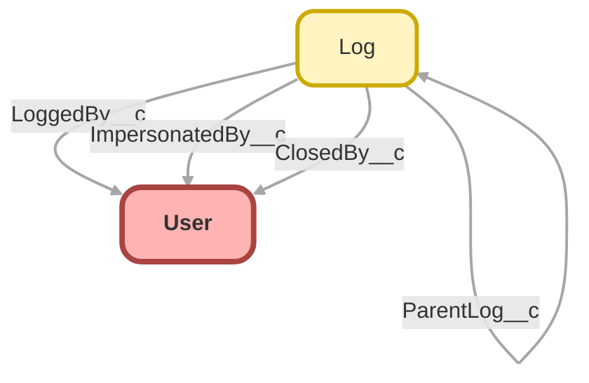

---
hide:
  - path
---

<!-- This file is auto-generated. if you do not want it to be overwritten, set TRUE in the line below -->
<!-- DO_NOT_OVERWRITE_DOC=FALSE -->

## Schema

<!-- Object description -->

## Related Apex Classes

| Apex Class | Type |
| :----      | :--: | 
| [CallableLogger](../apex/CallableLogger.md) | Class |
| [CallableLogger_Tests](../apex/CallableLogger_Tests.md) | Test |
| [ComponentLogger](../apex/ComponentLogger.md) | Lightning Controller |
| [ComponentLogger_Tests](../apex/ComponentLogger_Tests.md) | Test |
| [EntryTest](../apex/EntryTest.md) | Test |
| [FlowCollectionLogEntry_Tests](../apex/FlowCollectionLogEntry_Tests.md) | Test |
| [FlowLogEntry_Tests](../apex/FlowLogEntry_Tests.md) | Test |
| [FlowLogger_Tests](../apex/FlowLogger_Tests.md) | Test |
| [FlowRecordLogEntry_Tests](../apex/FlowRecordLogEntry_Tests.md) | Test |
| [LogBatchPurgeController](../apex/LogBatchPurgeController.md) | Lightning Controller |
| [LogBatchPurgeController_Tests](../apex/LogBatchPurgeController_Tests.md) | Test |
| [LogBatchPurger](../apex/LogBatchPurger.md) | Batch |
| [LogBatchPurger_Tests](../apex/LogBatchPurger_Tests.md) | Test |
| [LogEntryEventBuilder](../apex/LogEntryEventBuilder.md) | Class |
| [LogEntryEventBuilder_Tests](../apex/LogEntryEventBuilder_Tests.md) | Test |
| [LogEntryEventHandler](../apex/LogEntryEventHandler.md) | Class |
| [LogEntryEventHandler_Tests](../apex/LogEntryEventHandler_Tests.md) | Test |
| [LogEntryEventStreamController](../apex/LogEntryEventStreamController.md) | Lightning Controller |
| [LogEntryEventStreamController_Tests](../apex/LogEntryEventStreamController_Tests.md) | Test |
| [LogEntryHandler](../apex/LogEntryHandler.md) | Class |
| [LogEntryHandler_Tests](../apex/LogEntryHandler_Tests.md) | Test |
| [LogHandler](../apex/LogHandler.md) | Class |
| [LogHandler_Tests](../apex/LogHandler_Tests.md) | Test |
| [LogManagementDataSelector](../apex/LogManagementDataSelector.md) | Class |
| [LogManagementDataSelector_Tests](../apex/LogManagementDataSelector_Tests.md) | Test |
| [LogMassDeleteExtension](../apex/LogMassDeleteExtension.md) | Visualforce Controller |
| [LogMassDeleteExtension_Tests](../apex/LogMassDeleteExtension_Tests.md) | Test |
| [LogMessage_Tests](../apex/LogMessage_Tests.md) | Test |
| [Logger](../apex/Logger.md) | Invocable |
| [LoggerCache_Tests](../apex/LoggerCache_Tests.md) | Test |
| [LoggerConfigurationSelector](../apex/LoggerConfigurationSelector.md) | Test |
| [LoggerDataStore_Tests](../apex/LoggerDataStore_Tests.md) | Test |
| [LoggerEmailSender](../apex/LoggerEmailSender.md) | Class |
| [LoggerEmailSender_Tests](../apex/LoggerEmailSender_Tests.md) | Test |
| [LoggerEngineDataSelector](../apex/LoggerEngineDataSelector.md) | Class |
| [LoggerEngineDataSelector_Tests](../apex/LoggerEngineDataSelector_Tests.md) | Test |
| [LoggerHomeHeaderController](../apex/LoggerHomeHeaderController.md) | Lightning Controller |
| [LoggerHomeHeaderController_Tests](../apex/LoggerHomeHeaderController_Tests.md) | Test |
| [LoggerMockDataCreator](../apex/LoggerMockDataCreator.md) | Test |
| [LoggerParameter](../apex/LoggerParameter.md) | Class |
| [LoggerParameter_Tests](../apex/LoggerParameter_Tests.md) | Test |
| [LoggerSObjectHandler_Tests](../apex/LoggerSObjectHandler_Tests.md) | Test |
| [LoggerSObjectMetadata_Tests](../apex/LoggerSObjectMetadata_Tests.md) | Test |
| [LoggerSObjectProxy](../apex/LoggerSObjectProxy.md) | Class |
| [LoggerSObjectProxy_Tests](../apex/LoggerSObjectProxy_Tests.md) | Test |
| [LoggerSettingsController](../apex/LoggerSettingsController.md) | Lightning Controller |
| [LoggerSettingsController_Tests](../apex/LoggerSettingsController_Tests.md) | Test |
| [LoggerTestConfigurator](../apex/LoggerTestConfigurator.md) | Test |
| [LoggerTriggerableContext_Tests](../apex/LoggerTriggerableContext_Tests.md) | Test |
| [Logger_Tests](../apex/Logger_Tests.md) | Test |
| [MockEntryTest](../apex/MockEntryTest.md) | Test |
| [QueryBuilderTest](../apex/QueryBuilderTest.md) | Test |
| [RelatedLogEntriesController](../apex/RelatedLogEntriesController.md) | Lightning Controller |
| [RelatedLogEntriesController_Tests](../apex/RelatedLogEntriesController_Tests.md) | Test |
| [SOrchestratorTest](../apex/SOrchestratorTest.md) | Test |
| [ScribeTest](../apex/ScribeTest.md) | Test |
| [SmartBlueprint](../apex/SmartBlueprint.md) | Class |

## Related Lightning Pages

| Lightning Page | Type |
| :----      | :--: | 
| [LogEntryRecordPage](../pages/LogEntryRecordPage.md) |  Record Page |
| [LogEntryTagRecordPage](../pages/LogEntryTagRecordPage.md) |  Record Page |
| [LogRecordPage](../pages/LogRecordPage.md) |  Record Page |
| [LoggerScenarioRecordPage](../pages/LoggerScenarioRecordPage.md) |  Record Page |

## Related Profiles

| Profile | User License |
| :----      | :--: | 
| [Admin](../profiles/Admin.md) |  Salesforce |
| [Analytics Cloud Integration User](../profiles/Analytics%20Cloud%20Integration%20User.md) |  Analytics  Cloud  Integration  User |
| [Analytics Cloud Security User](../profiles/Analytics%20Cloud%20Security%20User.md) |  Analytics  Cloud  Integration  User |
| [Anypoint Integration](../profiles/Anypoint%20Integration.md) |  Identity |
| [Authenticated Website](../profiles/Authenticated%20Website.md) |  Authenticated  Website |
| [B2B Reordering Portal Buyer Profile](../profiles/B2B%20Reordering%20Portal%20Buyer%20Profile.md) |  External  Apps  Login |
| [Chatter External User](../profiles/Chatter%20External%20User.md) |  Chatter  External |
| [Chatter Free User](../profiles/Chatter%20Free%20User.md) |  Chatter  Free |
| [Chatter Moderator User](../profiles/Chatter%20Moderator%20User.md) |  Chatter  Free |
| [ContractManager](../profiles/ContractManager.md) |  Salesforce |
| [Cross Org Data Proxy User](../profiles/Cross%20Org%20Data%20Proxy%20User.md) |  X Org  Proxy  User |
| [Custom%3A Marketing Profile](../profiles/Custom%253A%20Marketing%20Profile.md) |  Salesforce |
| [Custom%3A Sales Profile](../profiles/Custom%253A%20Sales%20Profile.md) |  Salesforce |
| [Custom%3A Support Profile](../profiles/Custom%253A%20Support%20Profile.md) |  Salesforce |
| [Customer Community Login User](../profiles/Customer%20Community%20Login%20User.md) |  Customer  Community  Login |
| [Customer Community Plus Login User](../profiles/Customer%20Community%20Plus%20Login%20User.md) |  Customer  Community  Plus  Login |
| [Customer Community Plus User](../profiles/Customer%20Community%20Plus%20User.md) |  Customer  Community  Plus |
| [Customer Community User](../profiles/Customer%20Community%20User.md) |  Customer  Community |
| [Customer Portal Manager Custom](../profiles/Customer%20Portal%20Manager%20Custom.md) |  Customer  Portal  Manager  Custom |
| [Customer Portal Manager Standard](../profiles/Customer%20Portal%20Manager%20Standard.md) |  Customer  Portal  Manager  Standard |
| [Einstein Agent User](../profiles/Einstein%20Agent%20User.md) |  Einstein  Agent |
| [External Apps Login User](../profiles/External%20Apps%20Login%20User.md) |  External  Apps  Login |
| [External Identity User](../profiles/External%20Identity%20User.md) |  External  Identity |
| [Force%2Ecom - App Subscription User](../profiles/Force%252Ecom%20-%20App%20Subscription%20User.md) |  Force.com -  App  Subscription |
| [Force%2Ecom - Free User](../profiles/Force%252Ecom%20-%20Free%20User.md) |  Force.com -  Free |
| [Gold Partner User](../profiles/Gold%20Partner%20User.md) |  Gold  Partner |
| [High Volume Customer Portal User](../profiles/High%20Volume%20Customer%20Portal%20User.md) |  High  Volume  Customer  Portal |
| [HighVolumePortal](../profiles/HighVolumePortal.md) |  High  Volume  Customer  Portal |
| [Identity User](../profiles/Identity%20User.md) |  Identity |
| [MarketingProfile](../profiles/MarketingProfile.md) |  Salesforce |
| [Minimum Access - API Only Integrations](../profiles/Minimum%20Access%20-%20API%20Only%20Integrations.md) |  Salesforce  Integration |
| [Minimum Access - Salesforce](../profiles/Minimum%20Access%20-%20Salesforce.md) |  Salesforce |
| [Partner App Subscription User](../profiles/Partner%20App%20Subscription%20User.md) |  Partner  App  Subscription |
| [Partner Community Login User](../profiles/Partner%20Community%20Login%20User.md) |  Partner  Community  Login |
| [Partner Community User](../profiles/Partner%20Community%20User.md) |  Partner  Community |
| [PlatformPortal](../profiles/PlatformPortal.md) |  Authenticated  Website |
| [Read Only](../profiles/Read%20Only.md) |  Salesforce |
| [Salesforce API Only System Integrations](../profiles/Salesforce%20API%20Only%20System%20Integrations.md) |  Salesforce  Integration |
| [Silver Partner User](../profiles/Silver%20Partner%20User.md) |  Silver  Partner |
| [SolutionManager](../profiles/SolutionManager.md) |  Salesforce |
| [Standard](../profiles/Standard.md) |  Salesforce |
| [StandardAul](../profiles/StandardAul.md) |  Salesforce  Platform |
| [Work%2Ecom Only User](../profiles/Work%252Ecom%20Only%20User.md) |  Work.com  Only |

## Related Permission Sets

| Permission Set | User License |
| :----      | :--: | 
| [Experience_Profile_Manager](../permissionsets/Experience_Profile_Manager.md) | None |
| [LoggerEndUser](../permissionsets/LoggerEndUser.md) | None |
| [sfdcInternalInt__sfdc_scrt2](../permissionsets/sfdcInternalInt__sfdc_scrt2.md) | None |

_Documentation generated with [sfdx-hardis](https://sfdx-hardis.cloudity.com), by [Cloudity](https://www.cloudity.com/) & [friends](https://github.com/hardisgroupcom/sfdx-hardis/graphs/contributors)_
